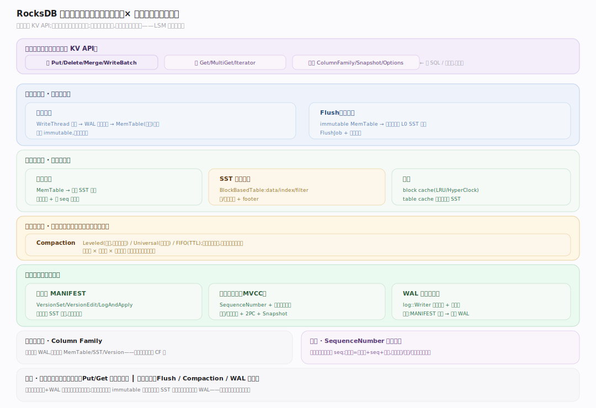
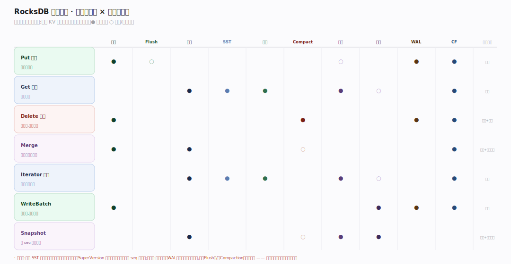

# RocksDB 原理 · 全景主线框架

> **定位**：本篇是全库地图与总纲。用"双维模型"把所有主线归位（能力域 × 执行时机），给出总架构图、`接触面 × 能力域` 依赖矩阵，并声明 RocksDB 区别于分布式数据库的三条贯穿性事实。**读全库从这里开始，遇到"某能力属于哪条主线"回这里查依赖矩阵。** 源码基准 **RocksDB 11.x**（正文行号锚点基于可克隆的 `v11.1.2` tag 逐一核实；官方目前尚无 `11.7.0` tag，代码路径在 11.x 内稳定）。

RocksDB 是**嵌入式、持久化的 LSM-tree 键值存储库**：不是独立进程或服务器，而是链接进宿主进程的 C++ 库——宿主直调 `Put/Get/Delete/Iterator`，RocksDB 在本地磁盘以 LSM-tree 组织数据。这决定其全部主线取法：没有 SQL/网络/分布式协调，只有写入路径、读取路径、SST 存储、Flush、Compaction、版本、缓存、事务、WAL 恢复、列族这些"单机存储引擎"能力域。

---

## 一、核心事实：RocksDB 不是什么（三条贯穿声明）

理解 RocksDB 前先立三条"它不做什么"——它们贯穿每条主线，是与分布式数据库/SQL 引擎的根本分野。

| 声明 | 含义 | 取舍 |
|---|---|---|
| 嵌入式库，非独立服务 | 无 server 进程/网络/SQL，以库链接进宿主（MyRocks、TiKV、CockroachDB…）；并发、事务边界、复制都由宿主负责 | 只管"单机把 KV 存好读好" |
| LSM-tree，非原地更新 | 写永不原地改盘：先 WAL + MemTable，满则 flush 成不可变 L0 SST，Compaction 后台逐层归并；删=写墓碑、改=写新版本，旧数据惰性回收 | 写放大换写吞吐 |
| 多版本靠 SequenceNumber，非锁 | 每写获全局递增 seq，内部键=用户键+seq+类型；读在某 seq 快照下天然看一致视图（MVCC） | 读写不互斥、快照零成本 |

> 记忆锚点：**RocksDB = "一棵磁盘上的 LSM-tree" + "一套 KV API"**。写只往内存和 WAL 追加，读跨内存与多层 SST 归并，后台 Compaction 默默整理——三者的张力就是 LSM 的全部工程。

---

## 二、双维模型：能力域 × 执行时机

图示主线按"归属能力域 × 执行时机（前台调用期 / 后台守护线程）"两维定位，全部主题一览如下。

| 能力域 | 时机 | 主题 |
|---|---|---|
| 接触面 | 用户调用 | KV API：Put/Get/Delete/Merge/Iterator/WriteBatch/列族/Options/Snapshot |
| 写侧 | 前台 + 后台 | 写入路径（WriteThread→WAL→MemTable）· Flush（immutable→L0 SST） |
| 读侧 | 前台 | 读取路径（逐层 + 布隆短路）· SST 存储格式 · 缓存（block/table cache） |
| 整理 | 后台 | Compaction（Leveled/Universal/FIFO，读/写/空间放大权衡） |
| 状态与一致性 | 贯穿 | 版本与 MANIFEST · 事务与快照（MVCC/2PC/悲观乐观） · WAL 与崩溃恢复 |
| 组织 | 贯穿 | Column Family（共享 WAL、独立 MemTable/SST/Version） |
| 横切基础 | 贯穿 | SequenceNumber + 内部键（多版本的根基），横切读写与整理 |

---

## 三、总架构图

一次调用在库内的宿主进程调 `Put` → WriteThread 分组 → 写 WAL（顺序追加，崩溃可恢复）+ 插入内存 MemTable（跳表）→ MemTable 满转 immutable → 后台 Flush 成 L0 SST → 后台 Compaction 逐层归并成有序的 L1…LN；调 `Get` → 查活跃 MemTable → immutable MemTable → 逐层 SST（布隆过滤器短路 + block cache）→ 按 SequenceNumber 取正确版本。WAL、MemTable、SST 三态构成 LSM 的读写全景。

---

## 四、接触面 × 能力域 依赖矩阵

矩阵是三角一致性的仲裁表：每条能力域声称的依赖，必须能在此矩阵与被依赖主线正文同时对上。

---

## 五、能力域依赖关系

---

## 六、源码坐标速查（v11.1.2 核实）

各能力域的主入口符号与 file:line，逐一在克隆源码里 grep 核实，作下钻锚点：

| 能力域 | 主入口 | 源码坐标 |
|---|---|---|
| 写入路径 | `DBImpl::WriteImpl` | `db/db_impl/db_impl_write.cc:370` |
| 写入分组 | `WriteThread::JoinBatchGroup` | `db/write_thread.cc:401` |
| MemTable 插入 | `MemTable::Add` | `db/memtable.cc:950` |
| 读取路径 | `DBImpl::GetImpl` | `db/db_impl/db_impl.cc:2483` |
| 逐层定位 | `Version::Get` | `db/version_set.cc:2710` |
| SuperVersion | `struct SuperVersion` | `db/column_family.h:206` |
| Flush | `FlushJob::Run` | `db/flush_job.cc:217` |
| Compaction | `CompactionJob::Run` | `db/compaction/compaction_job.cc:1089` |
| 选层打分 | `VersionStorageInfo::ComputeCompactionScore` | `db/version_set.cc:3766` |
| WAL 写 | `log::Writer::AddRecord` | `db/log_writer.cc:89` |
| 崩溃恢复 | `DBImpl::RecoverLogFiles` | `db/db_impl/db_impl_open.cc:1128` |
| 版本落库 | `VersionSet::LogAndApply` | `db/version_set.cc:6469` |
| SST 构建 | `BlockBasedTableBuilder::Add` | `table/block_based/block_based_table_builder.cc:1520` |
| Block cache | `LRUCacheShard::Insert` | `cache/lru_cache.cc:548` |
| 内部键编码 | `PackSequenceAndType` | `db/dbformat.h:181` |
| 快照 | `DBImpl::GetSnapshot` | `db/db_impl/db_impl.cc:4277` |
| Column Family | `class ColumnFamilyData` | `db/column_family.h:298` |

---

## 一句话总纲

**RocksDB 是一个嵌入宿主进程的持久化 LSM-tree 键值库：写入经 WriteThread 分组后先追加 WAL 再写内存 MemTable（跳表），满了 Flush 成不可变 L0 SST，Compaction 在后台逐层归并成有序的 L1…LN；读取跨活跃/不可变 MemTable 与多层 SST 归并、用布隆过滤器与 block cache 短路、按 SequenceNumber 取一致版本（MVCC）；版本与 MANIFEST 记录活跃 SST 集合、WAL 保崩溃恢复、Column Family 共享 WAL 而各自成树——用"永不原地更新 + 后台整理"的写放大代价，换来了极高的写吞吐与顺序 IO。**
