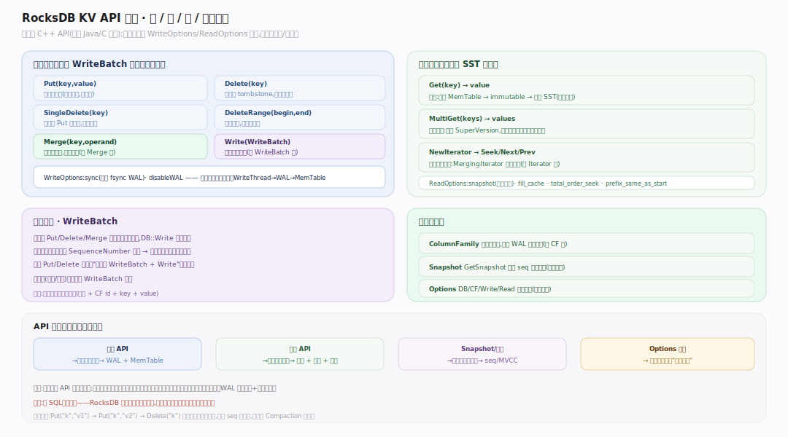
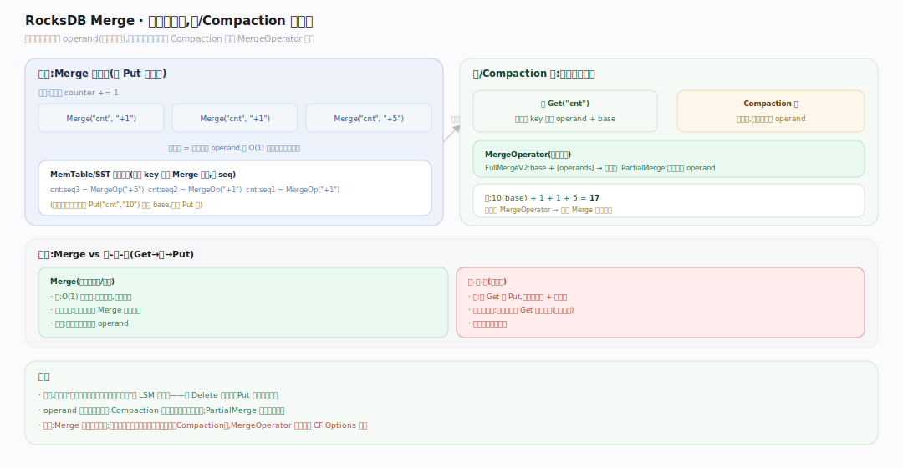
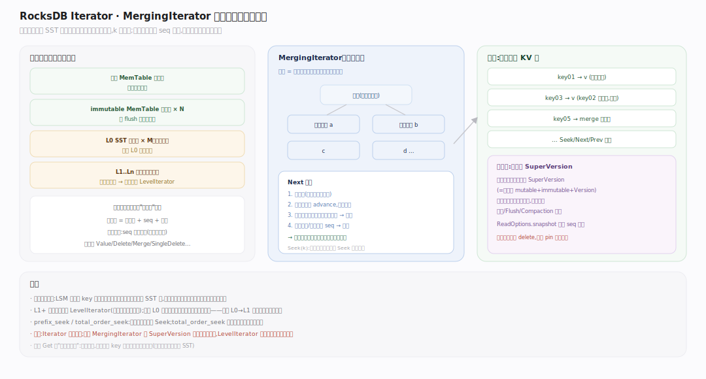
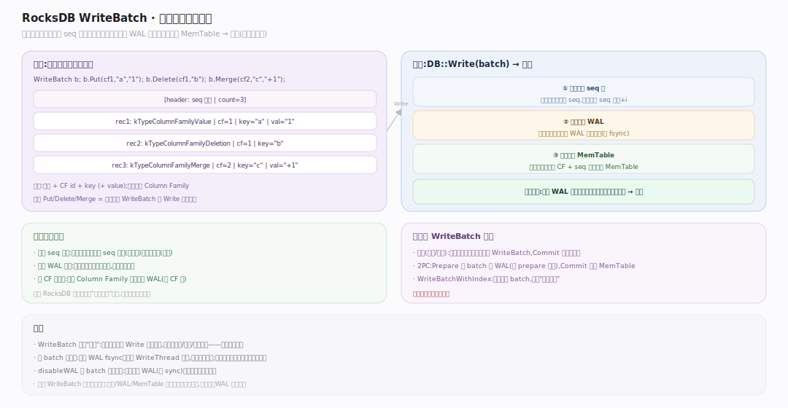

# RocksDB 原理 · 接触面 · KV 操作 API

> **定位**：本篇是 RocksDB 的**唯一接触面主线**——宿主进程通过 C++ KV API 与库交互（无 SQL、无网络）。属"用户可见"层，向下依赖【写入路径】落写、【读取路径】取值、【事务与快照】保一致、【Column Family】分命名空间。它统领全库：其余支撑主线都是某个 API 调用背后的展开。源码基准 **RocksDB 11.x**（正文行号锚点基于可克隆的 `v11.1.2` tag 逐一核实；`11.7.0` 目前尚无对应 tag）。

RocksDB 是嵌入式库，接触面就是一组 C++ 方法（另有 Java/C 绑定）。核心是四类：**写**（Put/Delete/Merge/Write）、**读**（Get/MultiGet/Iterator）、**批与原子**（WriteBatch）、**组织与视图**（Column Family / Snapshot / Options）。每个调用都由 `WriteOptions`/`ReadOptions` 调节行为。

---

## 一、API 全景：四类操作

图示 RocksDB 的 KV API 分四类：**写**（Put/Delete/SingleDelete/DeleteRange/Merge，全部本质是往 WriteBatch 追加一条记录再走写路径）、**读**（Get 点查、MultiGet 批量共享 SuperVersion、NewIterator 有序扫描）、**批与原子**（WriteBatch 把多写攒成一个原子单元，`DB::Write` 一次提交、同 seq 组要么全可见要么全不可见）、**组织与视图**（ColumnFamily 独立键空间、Snapshot 一致读、Options 四层配置）。四类操作对照与源码见下表。（符号见文末源码坐标表）

| 类别 | 操作 | 要点 |
|---|---|---|
| 写 | `Put` / `Delete` / `SingleDelete` / `DeleteRange` / `Merge` | 均追加进 WriteBatch；SingleDelete 承诺键只写过一次、更省；DeleteRange 范围删 |
| 读 | `Get` / `MultiGet` / `NewIterator` | MultiGet 共享 SuperVersion、可并行读文件；Iterator 有序范围扫描 |
| 批与原子 | `WriteBatch` + `DB::Write` | 多写攒成原子单元，同 seq 组全可见或全不可见 |
| 组织与视图 | `ColumnFamily` / `Snapshot` / `Options` | 独立键空间 / 钉 seq 一致读 / DB·CF·Read·Write 四层配置 |

---

## 二、Merge：读时合并的写优化

图示 `Merge(key, operand)` 是 RocksDB 特色：写入时**只追加一个"操作数"**（不读旧值、不改磁盘），真正合并推迟到读取或 Compaction 时由用户注册的 `MergeOperator` 执行。典型场景：计数器 `+1`、列表追加。写路径因此和 Put 一样纯追加（O(1)、无读放大）；代价是读时要把该键的一串 Merge 操作数按序归并成最终值（归并逻辑被 Compaction 与读路径共用）。这是"把读的活儿推给读、让写极致快"的又一 LSM 式取舍。（符号见文末源码坐标表）

---

## 三、Iterator：跨内存与多层 SST 的有序扫描

图示 `NewIterator` 返回一个逻辑上"整个 DB 有序视图"的迭代器，`Seek/Next/Prev` 遍历。返回的是包了一层的 **DBIter**，底层是 **MergingIterator**：把活跃 MemTable、各 immutable、每个 SST 各自的有序迭代器塞进一个**最小堆**做 k 路归并，输出全局有序序列。DBIter 在其上处理同一用户键的多版本（按 SequenceNumber 降序）——只吐可见快照下的最新版本、跳墓碑、按 seq 过滤。迭代器隐式持有一个 SuperVersion，保证遍历期间看到一致视图。（符号见文末源码坐标表）

---

## 深化 · WriteBatch 与原子性

图示 **WriteBatch** 内部是一段紧凑的二进制记录序列（每条：类型 + CF id + key + value）。`DB::Write(batch)` 把整批交给写路径：批内所有写共享**一个 SequenceNumber 基准**、一次性追加进同一条 WAL 记录、经 `MemTableInserter` 一次性插入 MemTable——因此原子（崩溃恢复时要么整批重放、要么整批丢弃）。`Put/Delete/Merge` 单条调用其实是"建一个单元素 WriteBatch 再 Write"的语法糖；事务层也构建在 WriteBatch 之上。（符号见文末源码坐标表）

---

## 拓展 · Options 四层配置

| 层级 | 类 | 作用范围 | 关键项举例 |
|---|---|---|---|
| DB 级 | `DBOptions` | 整个 DB 实例 | `create_if_missing`、`max_background_jobs`、WAL 目录、`max_open_files` |
| CF 级 | `ColumnFamilyOptions` | 单个 Column Family | `write_buffer_size`(MemTable 大小)、`compaction_style`、`compression`、`table_factory` |
| 写操作级 | `WriteOptions` | 单次写 | `sync`(是否 fsync WAL)、`disableWAL` |
| 读操作级 | `ReadOptions` | 单次读/迭代 | `snapshot`、`fill_cache`、`total_order_seek`、`prefix_same_as_start` |

`Options` = `DBOptions` + `ColumnFamilyOptions` 的合体（打开单 CF 的 DB 时用）。调优几乎都落在这四层（见各支撑主线的"调优要点"）。

## 深化 · 源码坐标（v11.1.2 核实）

| 环节 | 符号 | 位置 |
|---|---|---|
| 写编码入口 | `WriteBatchInternal::Put` | `db/write_batch.cc:852` |
| Delete 编码 | `WriteBatchInternal::Delete` | `db/write_batch.cc:1258` |
| DeleteRange 编码 | `WriteBatchInternal::DeleteRange` | `db/write_batch.cc:1512` |
| 范围删类型 | `kTypeRangeDeletion=0xF` | `db/dbformat.h:57` |
| Merge 写 | `WriteBatch::Merge` | `db/write_batch.cc:1680` |
| 合并算子 | `class MergeOperator` / `FullMergeV2` | `include/rocksdb/merge_operator.h:53` |
| 合并驱动 | `MergeHelper::MergeUntil` | `db/merge_helper.cc:256` |
| 批量读 | `DBImpl::MultiGet` | `db/db_impl/db_impl.cc:2964` |
| 建迭代器 | `DBImpl::NewIteratorImpl` | `db/db_impl/db_impl.cc:4073` |
| 去重/跳墓碑 | `class DBIter` | `db/db_iter.h:57` |
| 多路归并 | `MergingIterator` | `table/merging_iterator.cc:53` |
| 批对象 | `class WriteBatch` | `include/rocksdb/write_batch.h:64` |
| 一次提交 | `DBImpl::WriteImpl` | `db/db_impl/db_impl_write.cc:370` |
| 逐条插入 | `MemTableInserter` | `db/write_batch.cc:1977` |

## 常见误区与工程要点

- **误区：RocksDB 是数据库服务。** 不是。它是嵌入宿主进程的库，无 server/网络/SQL；并发控制与分布式由宿主负责。
- **误区：Delete 立即释放空间。** 不。Delete 只写墓碑，空间靠后续 Compaction 回收；`DeleteRange` 也是逻辑范围墓碑。
- **误区：Merge 写时就算好了。** 不。Merge 只追加操作数，合并推迟到读/Compaction，需注册 `MergeOperator`，否则读报错。
- **误区：SingleDelete 等价 Delete。** 仅当键"只被 Put 过一次"时才可用 SingleDelete；对被覆盖过的键用它行为未定义。
- **归属提醒**：本篇只讲 API 语义与形态；写怎么落盘在【写入路径】、读怎么归并在【读取路径】、批的原子性底层在【WAL 与恢复】+【版本】。

## 一句话总纲

**RocksDB 的接触面是一组嵌入式 C++ KV API：写（Put/Delete/SingleDelete/DeleteRange/Merge）本质都是往 WriteBatch 追加一条记录再走写入路径，读（Get/MultiGet/Iterator）跨活跃/不可变 MemTable 与多层 SST 做 MVCC 归并，WriteBatch 让多写共享一个 SequenceNumber 而原子提交，Merge 把合并推迟到读/Compaction 以换极致写吞吐，Column Family/Snapshot/四层 Options 提供命名空间、一致视图与全部调优旋钮——无 SQL、无网络，一切并发与分布式交给宿主。**
