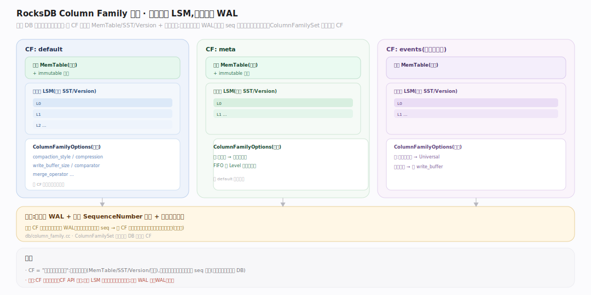
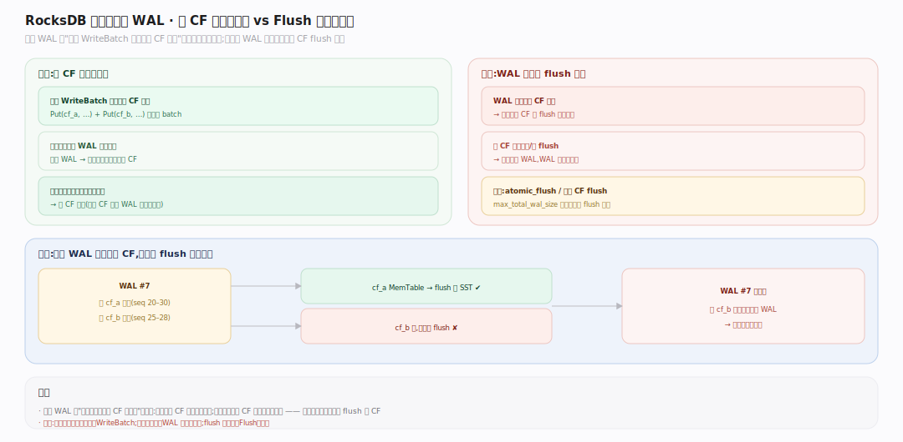
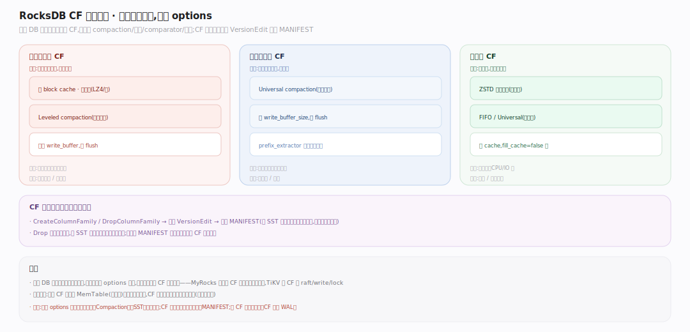

# RocksDB 原理 · 支撑主线 · Column Family

> **定位**：属"组织能力域"。管把一个 DB 划成多个独立键空间：各 CF 有自己的 MemTable/SST/Version（可独立配置 compaction/压缩），但**共享同一份 WAL** 以保证跨 CF 写的原子性。被【接触面】的 CF API 依赖，与【写入路径】【版本】【WAL】深度联动。源码基准 **RocksDB 11.x**（`db/column_family.cc`；正文行号锚点基于可克隆的 `v11.1.2` tag 逐一核实）。

一个 RocksDB 实例默认有一个 `default` CF。Column Family 让你在同一个 DB（同一份 WAL、同一恢复单元）里划出多个逻辑独立的键空间——像"一个库里的多张表"，各自调优，但共享事务边界。

---

## 一、Column Family 全景：独立成树，共享 WAL

图示每个 CF 拥有**独立**的：活跃/immutable MemTable、SST 与 Version（各自一棵 LSM 树），以及 `ColumnFamilyOptions`（可各设 compaction_style、compression、write_buffer_size、comparator、merge_operator）。但所有 CF **共享**：同一份 WAL、同一个 SequenceNumber 空间、同一恢复流程。`ColumnFamilySet` 管理一个 DB 的所有 CF，换 SuperVersion 时逐 CF 安装。（符号见文末源码坐标表）

---

## 二、为什么共享 WAL：跨 CF 原子写

图示一个 WriteBatch 可同时写多个 CF（每条记录带 CF id），`DB::Write` 把整批写进**同一条 WAL 记录**、共享一个 seq 基准——因此**跨 CF 写也是原子的**（要么全可见要么全不可见）。这是共享 WAL 的核心价值：多个键空间的更新能在一个事务里原子完成（如 MyRocks 用不同 CF 存主键与二级索引，一次 DML 原子更新两者）。代价：一个 WAL 要等所有相关 CF 的 MemTable 都 flush 才可删（取各 CF 最小 log number）。（符号见文末源码坐标表）

## 三、每 CF 独立调优

图示不同数据有不同访问模式，CF 让你分别优化：热点小数据 CF 用大 block cache、快压缩；冷归档 CF 用 ZSTD 重压缩、FIFO/Universal compaction；不同 key 分布用不同 comparator 或 prefix_extractor。MyRocks/TiKV 等大量用 CF 把不同用途数据隔离调优。CF 的创建/删除也经 `VersionEdit`（含 add/drop 标记）走 `LogAndApply` 记进 MANIFEST，故元数据一致、恢复时重建同一组 CF。（符号见文末源码坐标表）

## 拓展 · Column Family 要点

| 概念 | 说明 |
|---|---|
| `default` CF | 每个 DB 至少有的默认列族 |
| 独立部分 | MemTable、SST、Version、ColumnFamilyOptions（各自一棵 LSM） |
| 共享部分 | WAL、SequenceNumber、恢复流程、后台线程池 |
| `ColumnFamilyData` | 单 CF 的运行时状态（含其 SuperVersion） |
| `ColumnFamilySet` | 一个 DB 的所有 CF 集合 |
| `atomic_flush` | 多 CF 原子一起 flush（跨 CF 一致点） |

## 深化 · 源码坐标（v11.1.2 核实）

| 环节 | 符号 | 位置 |
|---|---|---|
| CF 数据结构 | `class ColumnFamilyData` | `db/column_family.h:298` |
| CF 集合 | `class ColumnFamilySet` | `db/column_family.h:734` |
| 安装 SuperVersion | `ColumnFamilyData::InstallSuperVersion` | `db/column_family.cc:1414` |
| 多 CF 写编码 | `WriteBatchInternal::Put`（带 CF id） | `db/write_batch.cc:852` |
| 算可删 WAL | `DBImpl::FindObsoleteFiles` | `db/db_impl/db_impl_files.cc:124` |
| CF 元数据/差量 | `class VersionEdit`（add/drop 标记） | `db/version_edit.h:693` |
| 建 CF | `DBImpl::CreateColumnFamilyImpl` | `db/db_impl/db_impl.cc:3757` |
| 建 CF（集合层） | `ColumnFamilySet::CreateColumnFamily` | `db/column_family.cc:1848` |

## 常见误区与工程要点

- **误区：CF 是独立的 DB。** 不。CF 共享 WAL/seq/恢复单元，同属一个 DB；只是键空间与 LSM 树独立。
- **误区：CF 间可跨库事务。** 跨 CF 写在**同一 DB** 内是原子的（共享 WAL）；跨不同 DB 实例则不行。
- **误区：多 CF 不影响 WAL 回收。** 相反——一个 WAL 被多个 CF 共享，要等**所有**相关 CF 的 MemTable 都 flush 才可删；某个 CF 迟迟不 flush 会拖住 WAL。
- **误区：CF 越多越好。** 每个 CF 有独立 MemTable（占内存）、独立后台任务；过多 CF 增加内存与调度开销。
- **归属提醒**：CF 的独立 MemTable/SST 在【写入路径】【SST】；共享 WAL 在【WAL】；CF 创建删除的元数据在【版本】MANIFEST；跨 CF 原子写的 batch 在【接触面】WriteBatch。

## 一句话总纲

**Column Family 把一个 DB 划成多个独立键空间:各 CF 有自己的 MemTable/SST/Version 与 ColumnFamilyOptions(可分别设 compaction/压缩/comparator,各成一棵 LSM 树),但共享同一份 WAL、同一 SequenceNumber 与恢复流程——共享 WAL 让跨 CF 写在同一 DB 内原子(一条 WAL 记录、一个 seq 基准),代价是 WAL 要等所有相关 CF flush 才可删;像"一个库里的多张可独立调优的表",事务边界仍是整个 DB。**
