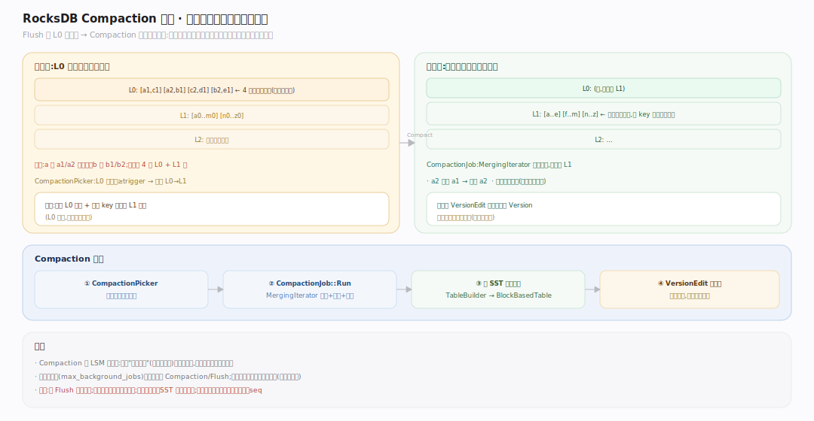
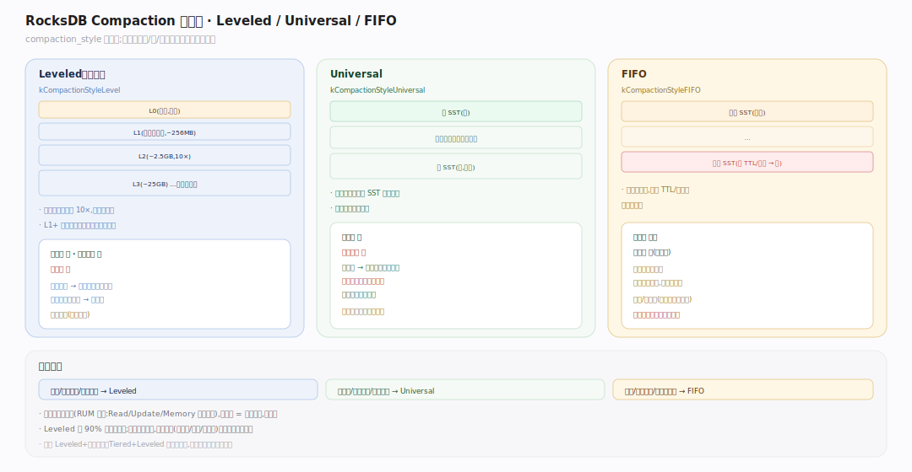
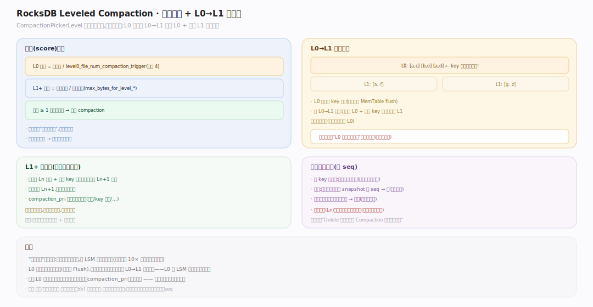
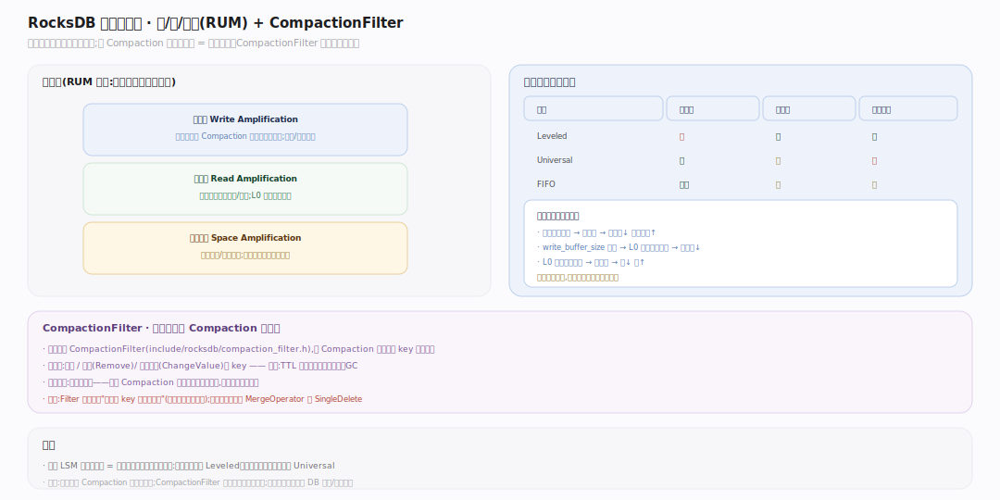

# RocksDB 原理 · 支撑主线 · Compaction

> **定位**：属"整理能力域"、后台守护线程。管 LSM 的核心整理动作：把多层重叠/冗余的 SST 归并成更少、更有序、更紧凑的文件，回收旧版本与墓碑。被【写入路径】的 Flush 产物（L0）触发，依赖【版本】记录文件变更、【SST 存储格式】读写文件。它决定 LSM 的**写/读/空间三放大**权衡。源码基准 **RocksDB 11.x**（`db/compaction/`；正文行号锚点基于可克隆的 `v11.1.2` tag 逐一核实）。

Compaction 是 LSM"永不原地更新"的还债机制：写入只管往上层堆 SST，Compaction 在后台把它们逐层归并下沉——合并同 key 的多版本、丢弃被覆盖的旧值与墓碑、把层内整理成非重叠有序。**三种放大的权衡全在这里调**：合得勤 → 读放大小、空间放大小，但写放大大；合得懒 → 写放大小，但读/空间放大大。

---

## 一、Compaction 全景：为何要合并

图示 Flush 不断往 L0 堆不可变 SST，L0 文件间 key 可重叠、越堆读越慢。Compaction 后台把文件**逐层归并下沉**：`CompactionPicker` 按每层"分数"（数据量/目标容量）挑要合并的层与文件，`CompactionJob` 用 `MergingIterator` 归并输入、输出到下一层的新 SST，同时**丢弃**被更新版本覆盖的旧值、以及不再被任何快照需要的墓碑（结合最老快照 seq 判定）。产出经 `VersionEdit` 原子换进新 Version，旧文件延后删除。（符号见文末源码坐标表）

---

## 二、三种 Compaction 风格

图示 `compaction_style`（CF Options）选三种之一，各自的机制与放大权衡如下表。（符号见文末源码坐标表）

| 风格 | 机制 | 放大权衡 | 适用 |
|---|---|---|---|
| Leveled（默认） | 经典分层，每层容量约上层 10×、层内非重叠有序；L0→L1 全参与，L1+ 选一文件与下层重叠合并 | 低读、低空间、**高写** | 通用首选 |
| Universal | 按时间序把相邻 SST 整段合并，尽量少合、层数少 | **低写**、高空间（合并临时翻倍） | 写密集、空间宽裕 |
| FIFO | 只按 TTL / 总大小删最老文件，几乎不合并 | **极低写** | 时序/缓存类，只留近期数据 |

---

## 三、Leveled Compaction 与 L0→L1 特殊处理

图示 Leveled 下 `LevelCompactionPicker` 给每层算**分数**：L0 按文件数（`level0_file_num_compaction_trigger`），L1+ 按"当前字节 / 目标字节"；分数 ≥1 且最高的层触发。**L0→L1 特殊**：L0 文件间 key 重叠，一次要取所有 L0 文件 + 与之 key 范围重叠的全部 L1 文件一起归并（不能只挑一个）。L1+ 则按优先策略选一个文件、带上下层重叠文件合并写到下层。合并按 SequenceNumber 保留可见版本、丢弃被覆盖旧值与低于最老快照的墓碑。（符号见文末源码坐标表）

## 深化 · 三放大权衡与 CompactionFilter

图示三种放大互相制约（RUM 猜想），选风格与参数即选权衡点；CompactionFilter 是归并时的用户钩子，让清理逻辑搭 Compaction 顺风车、零额外扫描。

| 放大 | 含义 | 何时变大 | 各风格 |
|---|---|---|---|
| 写放大 | 一份数据被反复 Compaction 重写的倍数 | 层越多、合得越勤 | Leveled 高、Universal/FIFO 低 |
| 读放大 | 一次读要查的文件/层数 | L0 文件多、层多 | Leveled 低（层内有序） |
| 空间放大 | 磁盘占用 / 有效数据 | 旧版本/墓碑未回收 | Leveled 低、Universal 高（合并前临时翻倍） |
| CompactionFilter | 归并钩子：丢弃/修改某 key（TTL 过期、就地转换） | — | `include/rocksdb/compaction_filter.h` |

## 拓展 · Compaction 关键开关

| 开关（CF Options） | 作用 |
|---|---|
| `compaction_style` | Level / Universal / FIFO |
| `level0_file_num_compaction_trigger` | L0 文件数达此触发 L0→L1 compaction（默认 4） |
| `max_bytes_for_level_base` / `max_bytes_for_level_multiplier` | L1 目标大小与每层倍数（默认 256MB / 10×） |
| `target_file_size_base` | 单个 SST 目标大小 |
| `max_background_jobs` | 后台 flush+compaction 并发线程数 |
| `compaction_pri` | L1+ 挑文件的优先策略（按 key 范围/旧度/…） |

## 深化 · 源码坐标（v11.1.2 核实）

| 环节 | 符号 | 位置 |
|---|---|---|
| 算每层分数 | `VersionStorageInfo::ComputeCompactionScore` | `db/version_set.cc:3766` |
| 归并执行 | `CompactionJob::Run` | `db/compaction/compaction_job.cc:1089` |
| 原子换版 | `VersionSet::LogAndApply` | `db/version_set.cc:6469` |
| 风格枚举 | `enum CompactionStyle` | `include/rocksdb/advanced_options.h:26` |
| Leveled 选文件 | `LevelCompactionPicker::PickCompaction` | `db/compaction/compaction_picker_level.cc:986` |
| Universal 选文件 | `UniversalCompactionPicker::PickCompaction` | `db/compaction/compaction_picker_universal.cc:603` |
| FIFO 选文件 | `FIFOCompactionPicker::PickCompaction` | `db/compaction/compaction_picker_fifo.cc:730` |
| 归并去重钩子 | `CompactionFilter` | `include/rocksdb/compaction_filter.h` |

## 常见误区与工程要点

- **误区：Compaction 是坏事，越少越好。** 不。没有 Compaction，L0 无限堆积、读放大爆炸、旧版本永不回收。它是 LSM 健康的必需品，要调的是"合多勤"。
- **误区：Delete 立即回收空间。** 不。墓碑要等 Compaction 归并到最底层、且低于最老快照时才真正丢弃并回收空间。
- **误区：三种放大能同时最小。** 不可能——它们互相制约（RUM 猜想）。选风格与参数就是选权衡点。
- **误区：Universal 总比 Leveled 快。** 只在写密集时写放大低；它空间放大高（合并临时翻倍），读放大也可能更大。
- **归属提醒**：Compaction 由 Flush 产物触发（【写入路径】）、变更经【版本】原子提交、文件读写走【SST 存储格式】；墓碑/旧版本的可见性判断依赖【事务与快照】的 seq。

## 一句话总纲

**Compaction 是 LSM 永不原地更新的后台还债机制：CompactionPicker 按每层分数挑文件、CompactionJob 用 MergingIterator 归并并丢弃被覆盖旧值与过期墓碑、输出到下层新 SST 并经 VersionEdit 原子换版本；三种风格（Leveled 低读/空间放大、Universal 低写放大、FIFO 只删最老）对应写/读/空间三放大的不同权衡点，L0→L1 因 L0 重叠需全参与，CompactionFilter 让用户清理逻辑搭顺风车——合得勤读省空间省但写累，合得懒反之。**
