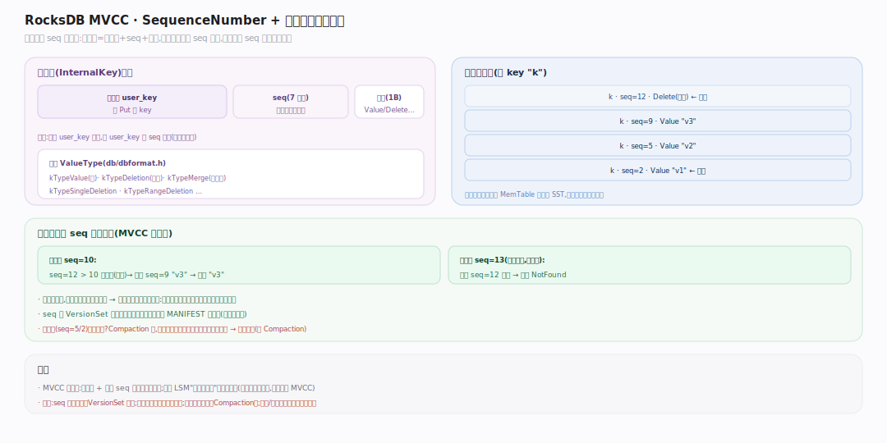
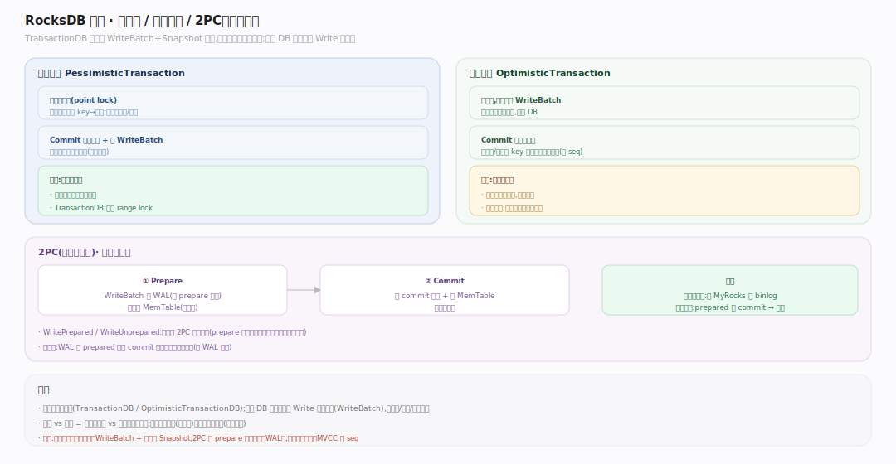

# RocksDB 原理 · 支撑主线 · 事务与快照（MVCC）

> **定位**：属"状态与一致性能力域"。管多版本并发控制的基础（SequenceNumber + 内部键）、一致性快照（Snapshot）、以及可选的事务层（悲观/乐观 + 2PC）。被【读取路径】用于取一致版本、被【接触面】的 Snapshot/事务 API 依赖。是 RocksDB 提供隔离与原子性的核心。源码基准 **RocksDB 11.x**（`db/dbformat.h`, `utilities/transactions/`；正文行号锚点基于可克隆的 `v11.1.2` tag 逐一核实）。

RocksDB 的多版本不是靠锁，而是靠**每次写获得的全局递增 SequenceNumber**：内部键 = 用户键 + seq + 类型。读在某个 seq 快照下天然看到该时刻的一致视图。在此之上，事务层（可选）提供加锁/冲突检测/2PC。

---

## 一、MVCC 基础：SequenceNumber 与内部键

图示 MVCC 的核心：每条写从 `VersionSet` 拿一个全局递增的 **SequenceNumber**，存储的**内部键** = `用户键 + seq(7字节) + 类型(1字节)`（尾部固定 8 字节），同一用户键的多版本按 seq 降序相邻排列。读给定一个 seq 上界（快照），归并时只取"seq ≤ 快照且最大"的那个版本——这就是 MVCC：读看到写发生时刻的一致视图，读写不互斥。类型区分值 / 墓碑 / 合并操作数。（符号见文末源码坐标表）

---

## 二、Snapshot：钉住一个 SequenceNumber

图示 `GetSnapshot` 返回一个 **Snapshot**，本质是钉住当前 SequenceNumber（挂进 `SnapshotList` 双向链）。之后带 `ReadOptions::snapshot` 的读都以该 seq 为上界——无论期间多少新写，都看不到 seq 更大的版本，得一致视图。Snapshot 另一作用：**保护旧版本不被 Compaction 提前回收**——Compaction 丢墓碑/旧值时要检查最老存活 Snapshot 的 seq，之后的版本都得留。用完必须 `ReleaseSnapshot`，否则拖住旧版本回收、涨空间。（符号见文末源码坐标表）

## 三、事务：悲观、乐观与 2PC

图示可选事务层 `TransactionDB` 构建在 WriteBatch + Snapshot 之上，三种并发控制机制对照如下。（符号见文末源码坐标表）

## 深化 · 三种事务机制

| 机制 | 冲突处理 | 适用 |
|---|---|---|
| 悲观事务 `PessimisticTransaction` | 写前加行锁（point lock），冲突则等待/超时；锁表维护 key→事务 | 高冲突 |
| 乐观事务 `OptimisticTransactionDB` | 不加锁，写缓存进 WriteBatch；Commit 时比较 seq 检测冲突，失败整体重试 | 低冲突 |
| 2PC（Prepare/Commit） | Prepare 把 batch 写 WAL（带标记）延后落 MemTable，Commit 再落；WritePrepared/WriteUnprepared 是变体 | 跨系统协调（如 MyRocks + binlog） |

## 拓展 · 事务相关要点

| 概念 | 说明 |
|---|---|
| SequenceNumber | 全局递增写序号，MVCC 的时钟（VersionSet 维护） |
| 内部键 | 用户键 + seq + 类型；多版本与归并的基础 |
| Snapshot | 钉住一个 seq；一致读 + 保护旧版本不被回收 |
| PessimisticTransaction | 加锁 + 冲突等待；TransactionDB |
| OptimisticTransaction | 无锁 + Commit 时冲突检测重试 |
| 2PC | Prepare（写 WAL）/ Commit（落 MemTable）；跨系统协调 |
| WriteBatchWithIndex | 带索引的 batch，支持事务内"读己之写" |

## 深化 · 源码坐标（v11.1.2 核实）

| 环节 | 符号 | 位置 |
|---|---|---|
| seq 类型 | `using SequenceNumber = uint64_t` | `include/rocksdb/types.h:22` |
| 内部键长度 | `kNumInternalBytes = 8` | `db/dbformat.h:134` |
| 打包 seq+type | `PackSequenceAndType` | `db/dbformat.h:181` |
| 值类型枚举 | `enum ValueType` | `db/dbformat.h:41` |
| 取快照 | `DBImpl::GetSnapshot` | `db/db_impl/db_impl.cc:4277` |
| 快照对象 | `class SnapshotImpl` | `db/snapshot_impl.h:23` |
| 悲观加锁 | `PessimisticTransaction::TryLock` | `utilities/transactions/pessimistic_transaction.cc:1138` |
| 乐观检测冲突 | `OptimisticTransaction::CheckTransactionForConflicts` | `utilities/transactions/optimistic_transaction.cc:192` |
| 2PC 准备 | `PessimisticTransaction::Prepare` | `utilities/transactions/pessimistic_transaction.cc:590` |

## 常见误区与工程要点

- **误区：MVCC 靠锁。** 不。多版本靠 SequenceNumber + 内部键；读写不互斥。锁只在（可选的）悲观事务层才有。
- **误区：Snapshot 是数据拷贝。** 不。它只是钉一个 seq 数字；代价极小，但会阻止旧版本被 Compaction 回收——久留不放会涨空间。
- **误区：RocksDB 默认有事务。** 默认只有单次 Write 的原子性（WriteBatch）；隔离/加锁/冲突检测需显式用 TransactionDB。
- **误区：乐观事务无开销。** 它省了锁但 Commit 要冲突检测、失败要重试；高冲突场景比悲观还慢。
- **归属提醒**：seq 在【版本】的 VersionSet 维护；一致读的应用在【读取路径】；事务底层的 batch 在【接触面】WriteBatch；2PC 的 WAL 标记在【WAL 与恢复】。

## 一句话总纲

**RocksDB 的多版本靠 SequenceNumber 而非锁:每写取一个全局递增 seq、内部键=用户键+seq+类型、同键多版本按 seq 降序,读在某 seq 快照下只取可见的最新版本(MVCC);Snapshot 钉住一个 seq 做一致读并保护旧版本不被 Compaction 提前回收;可选事务层在 WriteBatch+Snapshot 上提供悲观锁/乐观冲突检测/2PC——隔离与原子性是分层叠加的,底座永远是那个递增的 seq。**
