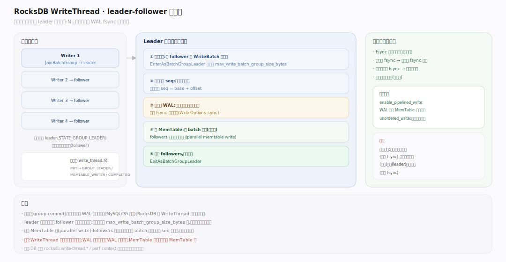
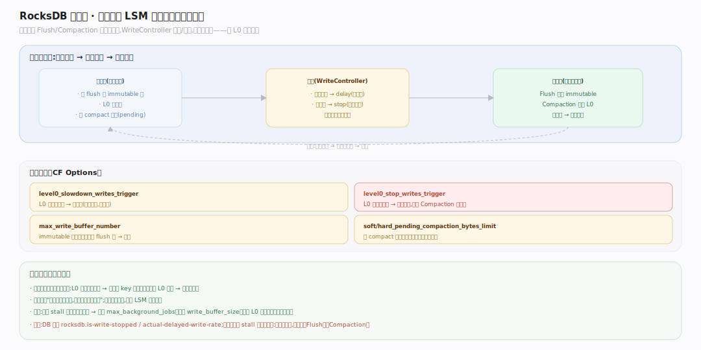

# RocksDB 原理 · 支撑主线 · 写入路径

> **定位**：属"写侧能力域"、前台调用期。管一次写从 API 到落定内存的全过程：WriteThread 分组 → WAL 追加 → MemTable 插入 → 满转 immutable。被【接触面】的所有写类 API 依赖，向下交给【Flush】落盘、依赖【WAL 与恢复】保久、依赖【版本】换 SuperVersion。源码基准 **RocksDB 11.x**（正文行号锚点基于可克隆的 `v11.1.2` tag 逐一核实；`11.7.0` 目前尚无对应 tag）。

RocksDB 写入的第一原则是**永不原地更新**：不去磁盘上找旧值改，而是往内存 MemTable 和 WAL 顺序追加。这换来极高写吞吐（全顺序 IO），代价是同一 key 留下多版本、靠后台 Compaction 回收。写路径的工程重点是**如何让高并发写高效地共享 WAL 与 MemTable**。

---

## 一、写入全景：从 API 到内存

图示一次 `Put`/`Write(batch)` 的主线：写线程加入写组 → 选出一个 leader 把同时到达的多个 writer 合并成"写组" → leader 分配连续 SequenceNumber、把整组一次性追加进 WAL（可 fsync）→ 逐条插入活跃 MemTable → MemTable 写满 `write_buffer_size` 则转 immutable、建新活跃表并通知后台 Flush。默认走"单队列组提交"，另有 pipelined / WAL-only / unordered 三条旁路。（符号见文末源码坐标表）

---

## 二、WriteThread：leader-follower 组提交

高并发下每个写线程各自 fsync WAL 会极慢。图示 **WriteThread** 把同时到达的写攒成一组：先到者被置为 leader，后到者成 follower 挂在无锁链表上、三段式等待（自旋+短睡+条件变量）被唤醒；leader 沿链累加 follower 的 WriteBatch 成写组（受 `max_write_batch_group_size_bytes` 限），代表整组做一次分配 seq、一次写 WAL、（可选并发）写 MemTable，完成后唤醒 followers。这样 **N 个并发写只付一次 WAL fsync 的固定开销**。`enable_pipelined_write` 把 WAL 段与 MemTable 段拆成两流水级、`unordered_write` 进一步放宽可见性顺序换吞吐。（符号见文末源码坐标表）

---

## 三、MemTable：内存中的有序写缓冲

图示活跃 MemTable 是内存里的**有序**写缓冲，默认实现 **InlineSkipList**（跳表）：按内部键（用户键 + seq + 类型）排序，插入 O(log n)。并发插入无锁——每层指针用 CAS 接入新节点，允许写组内多线程同插一张跳表（`allow_concurrent_memtable_write` 默认开）。每插一条更新内存计量，越过 `write_buffer_size`（默认 64MB）则活跃表**转只读 immutable**、建新活跃表继续接写，immutable 进队列等后台落盘；`max_write_buffer_number` 允许多个 immutable 缓冲突发写。（符号见文末源码坐标表）

---

## 深化 · 写停顿与写限速（write stall）

图示写入速度持续超过 Flush/Compaction 的消化速度时，MemTable 堆积、L0 暴涨，读性能崩溃。**WriteController** 施加背压：按令牌桶算出本次写需 sleep 的微秒数。触发规则——未 flush 的 immutable 逼近 `max_write_buffer_number`、或 L0 超 `level0_slowdown_writes_trigger`、或待 compaction 字节超 `soft_pending_compaction_bytes_limit` 时**减速**；L0 超 `level0_stop_writes_trigger` 或达 `hard_pending_compaction_bytes_limit` 时**完全停写**直到后台追上。这是保护 LSM 形状的负反馈闸门：观测量=积压深度，动作=限速/停写。（符号见文末源码坐标表）

## 拓展 · 写路径关键开关

| 开关（所属 Options） | 作用 |
|---|---|
| `write_buffer_size`（CF） | 单个 MemTable 大小，满则转 immutable（默认 64MB） |
| `max_write_buffer_number`（CF） | 最多几个 MemTable（1 活跃 + N-1 immutable 缓冲） |
| `WriteOptions::sync` | 每次写是否 fsync WAL（true 更持久、更慢） |
| `WriteOptions::disableWAL` | 跳过 WAL（快但崩溃丢数据，适合可重建数据） |
| `enable_pipelined_write`（DB） | WAL 写与 MemTable 写流水线化，提并发写吞吐 |
| `level0_slowdown/stop_writes_trigger`（CF） | 写停顿触发阈值 |

## 深化 · 源码坐标（v11.1.2 核实）

| 环节 | 符号 | 位置 |
|---|---|---|
| 写主入口 | `DBImpl::WriteImpl` | `db/db_impl/db_impl_write.cc:370` |
| 加入写组 | `WriteThread::JoinBatchGroup` | `db/write_thread.cc:401` |
| leader 攒批 | `WriteThread::EnterAsBatchGroupLeader` | `db/write_thread.cc:440` |
| leader 状态位 | `STATE_GROUP_LEADER` | `db/write_thread.h:53` |
| 追加 WAL | `DBImpl::WriteToWAL` | `db/db_impl/db_impl_write.cc:1653` |
| 写日志记录 | `log::Writer::AddRecord` | `db/log_writer.cc:89` |
| 逐条插入 | `MemTableInserter`（`WriteBatch::Handler`） | `db/write_batch.cc:1977` |
| 插入跳表 | `MemTable::Add` | `db/memtable.cc:950` |
| 满转 immutable | `DBImpl::SwitchMemtable` | `db/db_impl/db_impl_write.cc:2490` |
| 流水线写 | `DBImpl::PipelinedWriteImpl` | `db/db_impl/db_impl_write.cc:971` |
| 并发插跳表 | `InlineSkipList::InsertConcurrently` | `memtable/inlineskiplist.h:913` |
| 判是否满 | `MemTable::ShouldFlushNow` | `db/memtable.cc:197` |
| 背压令牌 | `WriteController::GetDelay` | `db/write_controller.cc:51` |

## 常见误区与工程要点

- **误区：写要先读旧值。** 不。写是纯追加，不读磁盘；覆盖 = 写更高 seq 的新版本，旧版本靠 Compaction 回收。
- **误区：每个写各自 fsync。** 不。WriteThread 组提交让一组写共享一次 fsync，这是高并发写吞吐的关键。
- **误区：MemTable 无序。** 它是**有序**跳表（按内部键），这样 flush 成 SST 时天然有序、读时可二分。
- **误区：disableWAL 更安全。** 相反——省了 WAL 就没了崩溃恢复，进程崩了未 flush 的写全丢。
- **归属提醒**：immutable → L0 SST 的落盘在【Flush】；WAL 记录格式与恢复在【WAL 与恢复】；seq 的多版本语义在【事务与快照】。

## 一句话总纲

**RocksDB 写入永不原地更新：DBImpl::WriteImpl 经 WriteThread 把并发写攒成 leader-follower 写组，一次分配连续 SequenceNumber、一次追加 WAL（组提交摊薄 fsync）、再插入有序的跳表 MemTable；MemTable 写满 write_buffer_size 转 immutable 并交后台 Flush，WriteController 在积压时限速/停写以保护 LSM 形状——用顺序 IO 与组提交换来极高写吞吐，多版本代价交给 Compaction 偿还。**
