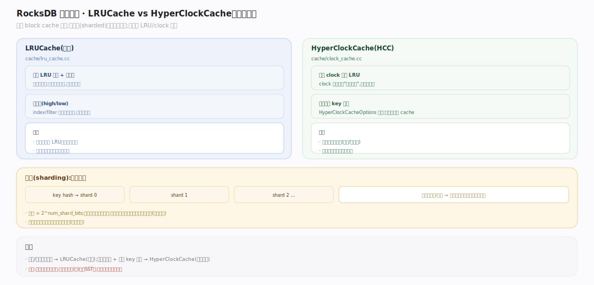
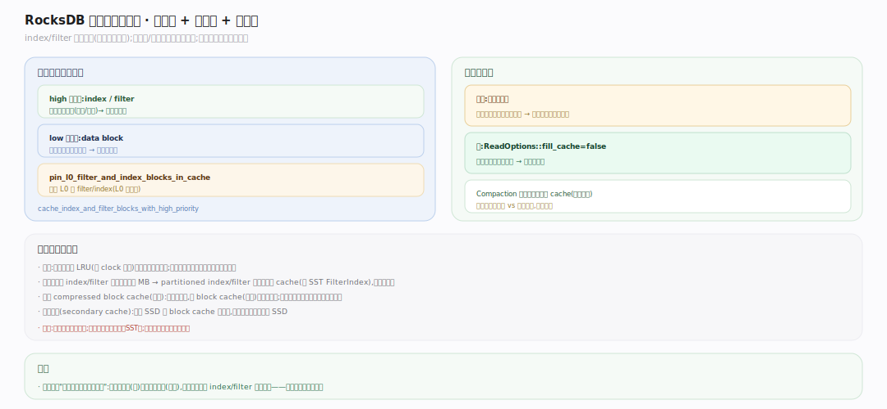

# RocksDB 原理 · 支撑主线 · 缓存

> **定位**：属"读侧能力域"。管把热数据留在内存以避免重复磁盘 IO：block cache（缓存 SST 的 data/index/filter block）与 table cache（缓存打开的 SST reader）。被【读取路径】命中查询，缓存的是【SST 存储格式】的块。是读性能的关键放大器。源码基准 **RocksDB 11.x**（`cache/`, `db/table_cache.cc`；正文行号锚点基于可克隆的 `v11.1.2` tag 逐一核实）。

LSM 读要跨多层 SST，若每次都读磁盘会很慢。RocksDB 用两层缓存：**block cache** 缓存解压后的 SST 块（data/index/filter），**table cache** 缓存已打开的 SST 文件句柄（含元信息）。加上操作系统的 page cache，构成读路径的多级缓存。

---

## 一、缓存全景：block cache + table cache

图示读一个 block 的路径：先查 **block cache**（键=文件号+块偏移）→ 命中直接用（免磁盘、免解压）；未命中则经 **table cache**（缓存打开的 SST reader、免重复解析 footer）读磁盘、解压、回填 block cache。block cache 缓存三类块：**data**（真实 KV）、**index**（定位）、**filter**（布隆）；`cache_index_and_filter_blocks` 决定 index/filter 是进 cache（可淘汰）还是常驻。table cache 本身是容量受 `max_open_files` 约束的 LRU。（符号见文末源码坐标表）

---

## 二、LRUCache 与 HyperClockCache

图示两种 block cache 实现。**LRUCache**（默认）——分片的 LRU，每片一把锁，命中把项从链上摘下升为"被引用"，插入超容量则从链尾淘汰。**HyperClockCache**——无锁的 clock 近似 LRU（原子 clock 指针 + 引用计数近似"最近使用"，Lookup/Release 常是单次原子操作），高并发吞吐更好但要求可估 key 大小。两者都**分片**：cache 切 N 片，key 哈希到某片，各片独立锁/淘汰，降低多核锁竞争。（符号见文末源码坐标表）

## 深化 · 缓存的内容与淘汰策略

图示 block cache 里不只 data block：index/filter 也占位（超大文件的它们很大）。RocksDB 支持**缓存优先级**（high/low）：index/filter 设高优先级更不易被淘汰（读它们的收益大）。LRU 实现上项在冷/热两条链间移动，超容量从冷链尾部淘汰、被引用的项暂离淘汰链、释放后回插。跨 CF 的 MemTable 总内存另由 `WriteBufferManager` 统管（可与 block cache 共用容量池）；`pin_l0_filter_and_index_blocks_in_cache` 钉住最常查的 L0 filter/index，大扫描设 `fill_cache=false` 防污染。（符号见文末源码坐标表）

## 拓展 · 缓存关键开关

| 开关 | 作用 |
|---|---|
| `block_cache`（table） | 设置 block cache 实例与容量（多 CF/DB 可共享一个） |
| `cache_index_and_filter_blocks` | index/filter 进 block cache（省内存）还是常驻 |
| `pin_l0_filter_and_index_blocks_in_cache` | 钉住 L0 的 filter/index（最常查） |
| `cache_index_and_filter_blocks_with_high_priority` | index/filter 高优先级，不易淘汰 |
| `ReadOptions::fill_cache` | 本次读是否填缓存（大扫描时关，防污染） |
| HyperClockCache vs LRUCache | 高并发选前者，通用选后者 |

## 深化 · 源码坐标（v11.1.2 核实）

| 环节 | 符号 | 位置 |
|---|---|---|
| 找/开 SST reader | `TableCache::FindTable` | `db/table_cache.cc:176` |
| 首次打开读 footer | `TableCache::GetTableReader` | `db/table_cache.cc:91` |
| LRU 查询 | `LRUCacheShard::Lookup` | `cache/lru_cache.cc:430` |
| LRU 插入 | `LRUCacheShard::Insert` | `cache/lru_cache.cc:548` |
| HyperClockCache | `class HyperClockCache` | `cache/clock_cache.h:28` |
| LRU 淘汰 | `LRUCacheShard::EvictFromLRU` | `cache/lru_cache.cc:323` |
| MemTable 内存统管 | `WriteBufferManager` | `include/rocksdb/write_buffer_manager.h:37` |

## 常见误区与工程要点

- **误区：block cache 缓存整个文件。** 不。缓存的是**块**（block 粒度），且是**解压后**的块；命中免磁盘 IO + 免解压。
- **误区：只缓存 data block。** index/filter block 也在（除非设为常驻）；超大文件它们很占空间，故有 partitioned 变体 + 优先级。
- **误区：block cache = OS page cache。** 是两层：block cache 存解压后的块（应用层）、OS page cache 存文件原始字节（含压缩）。可 `use_direct_reads` 绕过 OS cache。
- **误区：大扫描该缓存。** 大范围扫描设 `fill_cache=false`，否则把一次性数据灌进缓存、挤出真正的热点。
- **归属提醒**：缓存的内容是【SST 存储格式】的块；命中查询在【读取路径】；table cache 缓存的 reader 对应 SST 文件（其元信息在【版本】的 FileMetaData）。

## 一句话总纲

**缓存是 LSM 读性能的放大器：block cache（LRUCache 默认或高并发的 HyperClockCache,均分片降锁竞争）缓存解压后的 data/index/filter 块、table cache 缓存打开的 SST reader,读一个块先查 block cache 命中则免磁盘免解压、未命中经 table cache 读盘解压回填；支持缓存优先级、钉住 L0 的 filter/index、大扫描不填缓存防污染——用内存换掉 LSM 跨多层 SST 的重复 IO。**
