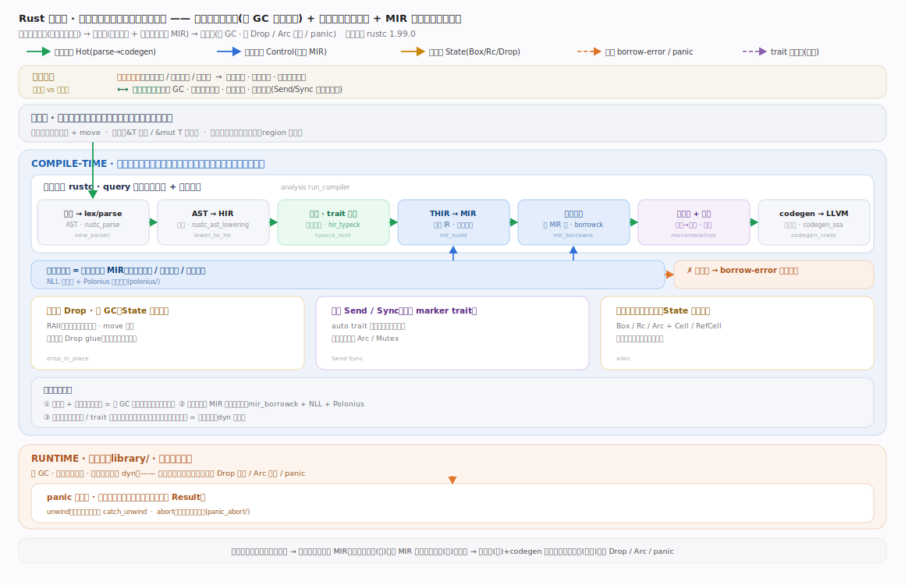
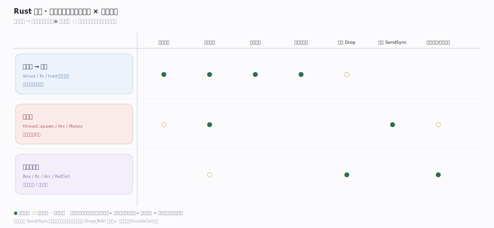
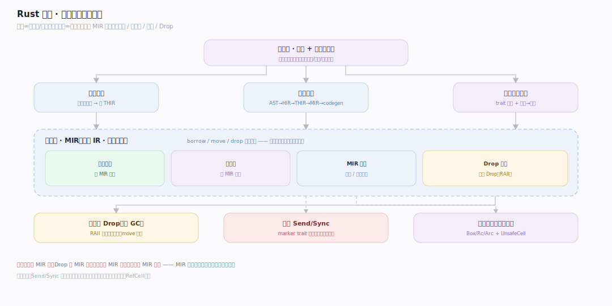

# Rust 原理 · 全景主线框架

> **定位**：全景总纲——先读这一篇。Rust = **编译期保证内存安全的系统语言**(rustc 编译器 + 标准库,靠所有权/借用在编译期杜绝内存错误与数据竞争,无 GC、零成本抽象)。下辖 1 接触面 + 8 支撑能力域。源码基准 **Rust 1.99.0**(`~/workdir/rust`,git 38a05769;compiler/ + library/)。

> **结构提示(写文档必看)**:① 管线含 **THIR**:AST→HIR→**THIR**→MIR→codegen;② 借用检查在 **MIR**(rustc_borrowck,NLL + Polonius 已在树);③ 旧 rustc_query_system 已并入 rustc_query_impl + rustc_middle/dep_graph;④ 单态化 = 泛型→具体;⑤ Send/Sync 是 auto trait,无 GC 靠 RAII/Drop;⑥ 智能指针 Box/Rc/Arc + UnsafeCell;⑦ panic 展开 vs abort 两运行时。

---

## 一、双维模型:能力域 × 执行时机

两轴切分全部主线:**能力域**——接触面(语法 + 所有权)面向开发者,支撑侧 8 域(管线/借用检查/特质单态化/类型推断/内存 Drop/并发/智能指针/panic)在编译器与运行时内部;**执行时机**——所有安全检查在编译期(lex→推断→借用检查→单态化→codegen),运行期(std)只剩极少机制(Drop 析构、Arc 计数、panic 展开),无 GC。

---

## 二、总架构图

编译期 rustc 逐级降级:源码→lex→AST→HIR→类型推断/THIR→**MIR**(借用检查 + 单态化 + 优化都在此)→codegen(LLVM)→机器码,全程 query + 增量驱动;运行期 library/ 只余 Drop/Send-Sync/智能指针/panic。**MIR 是安全检查与优化的公共舞台**——安全全在编译期证明,运行时几乎零额外机制。各阶段源码入口见下方深化表。

---

## 三、接触面 × 能力域 依赖矩阵

写代码(编译)依赖管线全流程 + 借用检查(安全)+ 类型推断 + 特质单态化(泛型);用并发依赖 Send/Sync,用智能指针依赖内存 Drop(RAII 回收)+ 内部可变(UnsafeCell)。安全检查全部落在编译期。

---

## 四、能力域依赖关系图

实线 = 数据流/编译阶段,虚线 = 约束。贯穿层是 **MIR**:横切借用检查(在 MIR 跑)、Drop(在 MIR 精化)、优化(在 MIR 做)、单态化(产 MIR 实例)——四者共用一个中层 IR。

---

## 深化 · 各阶段源码入口(编译期从上到下 · 运行期在 library/)

| 阶段 | crate/入口 | 源码锚点 |
|---|---|---|
| 词法 | rustc_parse lexer | `compiler/rustc_parse/src/lexer/mod.rs:65` |
| AST→HIR | rustc_ast_lowering `lower_to_hir` | `compiler/rustc_ast_lowering/src/lib.rs:655` |
| 类型检查/推断 | rustc_hir_typeck `typeck_with_inspect` | `compiler/rustc_hir_typeck/src/lib.rs:111` |
| 检查驱动 | rustc_hir_analysis `check_crate` | `compiler/rustc_hir_analysis/src/lib.rs:150` |
| THIR→MIR | rustc_mir_build `build_mir_inner_impl` | `compiler/rustc_mir_build/src/builder/mod.rs:67` |
| 借用检查(灵魂) | rustc_borrowck `mir_borrowck` | `compiler/rustc_borrowck/src/lib.rs:115` |
| 单态化/分区 | rustc_monomorphize `collect_and_partition` | `compiler/rustc_monomorphize/src/partitioning.rs:1144` |
| MIR 优化 | rustc_mir_transform | `compiler/rustc_mir_transform/src/lib.rs:537` |
| codegen 后端 | rustc_codegen_ssa `CodegenBackend` | `compiler/rustc_codegen_ssa/src/traits/backend.rs:36` |
| 增量/查询 | rustc_middle dep_graph `try_mark_green` | `compiler/rustc_middle/src/dep_graph/graph.rs:885` |
| 运行期·析构 | core `Drop` | `library/core/src/ops/drop.rs:209` |
| 运行期·并发 | core `Send`/`Sync` | `library/core/src/marker.rs:92` |
| 运行期·panic | std `panic_handler` | `library/std/src/panicking.rs:612` |

## 拓展 · 主线分层归位(接触面 + 8 支撑域)

| 层 | 主线 | 一句话职责 |
|---|---|---|
| 接触面 | **语法与所有权规则** | 开发者写的代码 + 所有权/借用/生命周期规则 |
| 编译 | **编译管线** | AST→HIR→THIR→MIR→LLVM + query/增量 |
| 灵魂 | **借用检查器** | MIR 上验所有权/借用/生命周期(NLL/Polonius) |
| 泛型 | **特质与单态化** | trait 求解 + 泛型→具体(zero-cost) |
| 类型 | **类型推断** | 合一(unification)推类型 |
| 内存 | **内存与 Drop** | 无 GC:RAII/Drop 析构、move 语义 |
| 并发 | **Send/Sync** | marker trait 编译期保无数据竞争 |
| 抽象 | **智能指针与内部可变** | Box/Rc/Arc + UnsafeCell/Cell/RefCell |

## 补充 · 三条贯穿声明(Rust 区别于 C/GC 语言)

| # | 声明 | 要点 |
|---|---|---|
| 1 | **所有权 + 编译期检查 = 无 GC 内存安全** | 每值唯一 owner,move 转移,借用有规矩,生命周期防悬垂——借用检查器编译期证明,运行时无 GC/无引用计数(除非显式 Rc/Arc) |
| 2 | **借用检查在 MIR 上(灵魂)** | 非运行时检查,而是 MIR 上 rustc_borrowck 用区域推断(NLL,Polonius 更精确)证明;过不了不编译 |
| 3 | **零成本抽象** | 泛型/trait 靠单态化编成具体代码,静态分发无虚表(除非 dyn);迭代器链 = 手写循环。"不用的不花钱,用的没法手写更快" |

## 一句话总纲

**Rust 是编译期保证内存安全的系统语言——所有权(每值一主 + move)+ 借用规则 + 生命周期,由借用检查器在 MIR 上(NLL/Polonius 区域推断)编译期证明无悬垂无数据竞争,无 GC 零运行时开销;编译管线 AST→HIR→THIR→MIR→LLVM,泛型靠单态化实现零成本抽象,Send/Sync marker trait 编译期保并发安全,无 GC 靠 RAII/Drop 析构 + 智能指针(Box/Rc/Arc)+ UnsafeCell 内部可变;安全检查全在编译期,运行时几乎零额外机制。**
