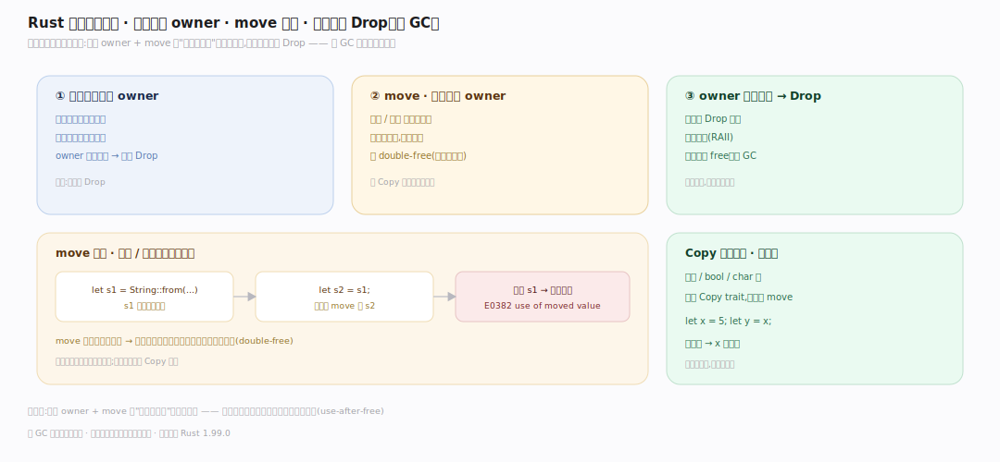
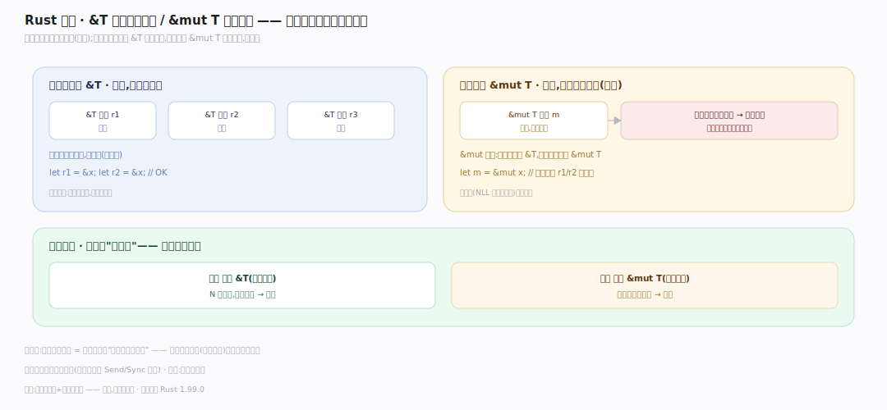
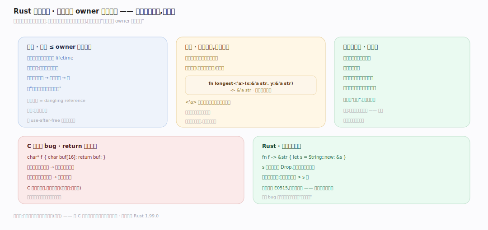

# Rust 原理 · 接触面主线 · 语法与所有权规则

> **定位**：属"接触面主线"(开发者可见)。Rust 的接触面是**语言语法 + 所有权规则**:开发者写的 struct/fn/trait + 必须遵守的所有权/借用/生命周期规则。规则由【借用检查器】编译期强制。是开发者与语言的契约。源码基准 **Rust 1.99.0**(`library/core/`、语言规则)。

Rust 开发者面对的接触面不只是语法(那和其它语言类似),更是一套**必须遵守的所有权规则**——每个值有唯一 owner、借用有规矩、生命周期不能悬垂。写代码时脑子里要有这套规则(编译器会强制)。理解所有权三规则 + move/borrow 语义,就懂了 Rust 编程的核心心智模型。

---

## 一、所有权三规则

Rust 所有权的三条基本规则(编译期强制):

1. **每个值有唯一 owner**:一个变量拥有一个值;owner 出作用域,值被 Drop(析构)。
2. **一次只能一个 owner(move)**:赋值/传参转移所有权(**move**),原变量失效——防两处都以为拥有导致 double-free。Copy 类型(整数/bool 等,`Copy` trait,`library/core/src/marker.rs:454`)例外:位拷贝,原变量仍有效。
3. **owner 出作用域值 Drop**:自动调 `Drop`(`library/core/src/ops/drop.rs:209`)、回收资源(RAII)——无需手动 free、无 GC。

**为什么**:唯一 owner + move 让"谁负责释放"编译期明确——不会重复释放、不会忘释放、不会用已释放的。这是无 GC 内存安全的地基。规则的编译期强制在借用检查器 `mir_borrowck`(`rustc_borrowck/src/lib.rs:115`)。

---

## 二、借用:& 和 &mut

不想转移所有权就**借用**(引用):

- **不可变借用 `&T`**:只读,可同时存在多个(多个读者 OK)。
- **可变借用 `&mut T`**:可改,同一时刻**唯一**(独占),且不能与任何其它借用(可变或不可变)并存。
- **核心约束**:某时刻要么多个 `&T`(共享只读),要么一个 `&mut T`(独占可写)——不能混。这是编译期的"读写锁"——防数据竞争(一边读一边写)。

例:`let r1=&x; let r2=&x;`(两个不可变借用 OK)但 `let m=&mut x;` 期间不许有 r1/r2。借用完(NLL 按最后使用)才能再可变借用。

**为什么**:可变借用唯一 = 编译期保证"改的时候没人读"——数据竞争在单线程和多线程都被这条规则挡住(配合 Send/Sync 扩到多线程,`Send` `library/core/src/marker.rs:92`、`Sync` `:657`)。借用"活多久"由区域推断 `RegionInferenceContext::solve`(`rustc_borrowck/src/region_infer/mod.rs:483`)在 MIR 上求解(NLL,按最后一次使用而非词法作用域)。

---

## 三、生命周期:防悬垂

**生命周期(lifetime)**:借用不能活得比被借的值久(防悬垂引用):

- 编译器给每个引用推断生命周期;借用检查验"引用不超 owner 生命周期"。
- 多数情况**省略**(生命周期省略规则自动推,`rustc_hir_analysis` 里由 `BoundVarContext`(`rustc_hir_analysis/src/collect/resolve_bound_vars.rs:66`)解析绑定/省略);复杂关系(如函数返回引用)需显式标注 `<'a>`——`fn longest<'a>(x:&'a str, y:&'a str)->&'a str`。
- 生命周期是**编译期概念**,运行时不存在(零开销)——只是给借用检查器的约束标签。

**为什么**:防止"引用指向已释放的内存"(悬垂)——C 里 `return &local;`(返回局部变量地址)是经典 bug,Rust 编译期就拒绝(局部变量生命周期短于返回的引用)。

---

## 拓展 · 接触面关键概念一览

| 概念 | 说明 | 源码锚点 |
|---|---|---|
| 所有权 owner | 每值唯一 owner,出作用域 Drop | `rustc_borrowck/src/lib.rs:115`(mir_borrowck 强制) |
| move | 赋值/传参转移所有权,原变量失效 | `rustc_borrowck/src/lib.rs:115` |
| Copy trait | 位拷贝类型(整数等)不 move | `library/core/src/marker.rs:454` |
| `&T` / `&mut T` | 不可变借用(多)/ 可变借用(唯一) | `rustc_borrowck/src/region_infer/mod.rs:483` |
| 生命周期 `<'a>` | 借用不超 owner 生命周期(编译期) | `rustc_hir_analysis/src/collect/resolve_bound_vars.rs:66` |
| Drop trait | 出作用域自动析构(RAII) | `library/core/src/ops/drop.rs:209` |
| Send/Sync | 借用扩到多线程的 marker | `library/core/src/marker.rs:92` |

## 调优要点（编程要点）

- **优先借用而非 move**:能 `&T`/`&mut T` 就不 clone/move,减拷贝;需所有权才 move。
- **clone 是逃生舱**:借用检查太麻烦时 `.clone` 复制拿所有权——有拷贝开销,权衡用。
- **生命周期标注**:多数省略;编译器要求标注时(返回引用/结构体存引用)才写 `<'a>`。
- **共享可变**:单线程 `Rc<RefCell<T>>`(`Rc` `library/alloc/src/rc.rs:320`、`RefCell` `library/core/src/cell.rs:849`)、多线程 `Arc<Mutex<T>>`(`Arc` `library/alloc/src/sync.rs:269`、`Mutex` `library/std/src/sync/poison/mutex.rs:227`,加锁 `lock` `:490`)——绕过"可变唯一"的编译期检查,转运行时。

## 常见误区与工程要点

- **误区:赋值是拷贝(像其它语言)。** 非 Copy 类型赋值是 **move**(转移所有权,原变量失效);要拷贝显式 clone。
- **误区:能同时可变+不可变借用。** 不。某时刻要么多个 &T 要么一个 &mut T,不能混——编译期读写锁。
- **误区:生命周期有运行时开销。** 纯编译期约束标签,运行时不存在,零开销。
- **误区:所有权太死写不了链表/图。** 需要时用 Rc/Arc(共享所有权)、RefCell(内部可变)、unsafe(自负责)——有逃生舱,但默认安全。
- **归属提醒**:规则的编译期强制在【借用检查器】;move/Drop 语义在【内存与 Drop】;多线程借用扩展靠【并发 Send/Sync】;共享可变的运行时借用在【智能指针与内部可变】。

## 一句话总纲

**Rust 接触面是语法 + 所有权规则(开发者必守的心智模型):三条所有权规则(每值唯一 owner、赋值/传参 move 转移所有权原变量失效防 double-free、owner 出作用域自动 Drop 无 GC)+ 借用规则(&T 不可变可多个 / &mut T 可变唯一且与其它借用互斥 = 编译期读写锁防数据竞争)+ 生命周期(借用不超 owner 生命周期防悬垂,编译期概念零开销,多数省略);这套规则由借用检查器编译期强制,过不了不编译——需共享可变时用 Rc/RefCell/Arc/Mutex 逃生。**
