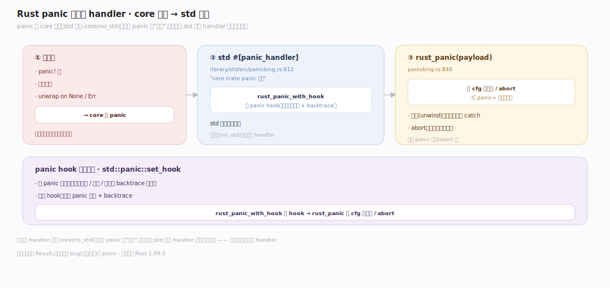
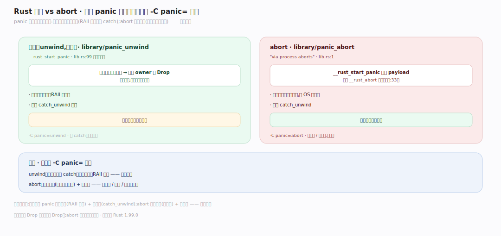
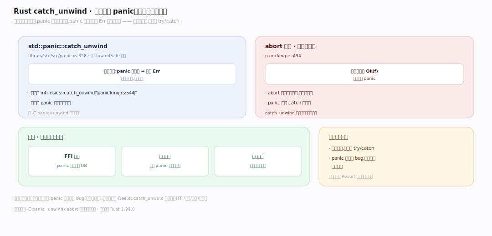

# Rust 原理 · 支撑主线 · panic 与展开

> **定位**：属"错误能力域"。管不可恢复错误的处理:panic 触发、栈展开(unwind)vs 直接终止(abort)两运行时、catch_unwind。是 Rust 崩溃路径的机制。依赖【内存与 Drop】(展开时调 Drop)。源码基准 **Rust 1.99.0**(`library/std/src/panicking.rs`、`library/panic_unwind/`、`library/panic_abort/`)。

Rust 错误分两类:可恢复(`Result`,正常返回)和不可恢复(**panic**,程序逻辑错如数组越界)。panic 时两种运行时行为:**展开(unwind)**——逐层析构栈上的值(调 Drop)后终止,可被 catch_unwind 捕获;**abort**——直接终止进程(不析构)。理解 panic 展开 vs abort + Drop 联动,就懂了 Rust 的崩溃路径。

---

## 一、panic 触发与 handler

panic 从 core 抛出、std 处理:`panic!` 宏/数组越界/`unwrap` on None → core 的 panic → std 的 `#[panic_handler]`(`begin_panic` 是无格式串路径)。`panic_with_hook` 先跑 panic hook(默认打印消息 + backtrace,可 `set_hook` 自定义)→ `rust_panic` 按 cfg 分展开/abort;double-panic 由 `panic_count` 记录、强制 abort。**为什么分层**:core(no_std)只定义 panic 的"发生"不定策略,std 提供 handler 实现具体行为——嵌入式可自定义 handler。锚点见深化表。

---

## 二、展开 vs abort:两运行时

panic 后两种运行时(编译期 `-C panic=` 选):**展开(unwind,默认)** `panic_unwind` 启动栈展开、**逐层析构栈上的值**(调各 owner 的 Drop 回收资源)直到线程边界终止——开销大(展开表)但资源正确释放、可 catch;**abort** `panic_abort`(via process aborts)忽略 payload 直接 `__rust_abort` 终止、**不析构**——快、小(无展开表)但资源靠 OS 回收。**为什么两种**:展开保 RAII 一致 + 可恢复,abort 省体积 + 更快崩(嵌入式)——按场景选。

---

## 三、catch_unwind:边界捕获

**catch_unwind**(带 `UnwindSafe` 约束)在展开模式下把可能 panic 的代码包起来,panic 被捕获返回 `Err` 不向上传播;内部 `do_call` 执行闭包、`do_catch` 接住 payload,abort 模式下退化为直接调用(不能捕获)。**用途**:FFI 边界(panic 跨语言是 UB)、线程边界(线程 panic 不崩主进程)、插件隔离。**不是异常处理**:panic 表示程序 bug,正常错误用 `Result`;catch_unwind 只在边界防扩散,非控制流工具。

---

## 拓展 · panic 关键结构一览

| 结构 | 定义 | 职责 |
|---|---|---|
| panic_handler | `library/std/src/panicking.rs:612` | core panic 入口(std 实现) |
| begin_panic | `library/std/src/panicking.rs:710` | panic! 无格式串路径 |
| panic_with_hook | `library/std/src/panicking.rs:777` | 跑 panic hook 后转 rust_panic |
| set_hook | `library/std/src/panicking.rs:142` | 自定义 panic 输出 hook |
| rust_panic | `library/std/src/panicking.rs:886` | 触发展开/abort |
| catch_unwind(std::panic) | `library/std/src/panic.rs:358` | 边界捕获 panic(UnwindSafe) |
| catch_unwind 实现 | `library/std/src/panicking.rs:495` | do_call/do_catch 接 payload |
| panic_unwind | `library/panic_unwind/src/lib.rs:99` | 展开运行时(逐层析构) |
| panic_abort crate | `library/panic_abort/src/lib.rs:1` | abort 运行时 crate(via aborts) |
| panic_abort 终止 | `library/panic_abort/src/lib.rs:33` | __rust_abort 直接终止 |

## 调优要点（理解要点）

- **-C panic=abort**:减二进制体积 + 快崩(嵌入式/容器);牺牲 catch_unwind 和资源析构。
- **panic hook**:`set_hook` 自定义 panic 输出(日志/上报/backtrace)。
- **catch_unwind 用在边界**:FFI 导出函数、线程池 worker——防 panic 跨边界(FFI panic 是 UB)。
- **Result vs panic**:预期错误(文件不存在/解析失败)用 Result;不该发生的 bug(越界/断言)用 panic。

## 常见误区与工程要点

- **误区:panic 是异常,用 catch_unwind 当 try/catch。** panic 表逻辑 bug,常规错误用 Result;catch_unwind 只在边界防扩散,非控制流。
- **误区:panic 总能 catch。** 仅展开模式(-C panic=unwind);abort 模式 catch_unwind 退化不捕获。
- **误区:panic 不析构资源。** 展开模式逐层调 Drop 释放资源(RAII 一致);只有 abort 模式不析构(靠 OS)。
- **误区:Drop 里 panic 没事。** 展开中再 panic = double-panic → abort;Drop 里避免 panic。
- **归属提醒**:展开时调的 Drop 在【内存与 Drop】;panic 触发点(unwrap/越界)是运行时;Result(可恢复错误)是另一条路不在本篇;abort 直接终止不走【内存与 Drop】析构。

## 一句话总纲

**Rust 不可恢复错误用 panic(数组越界/unwrap None,区别可恢复的 Result):core 抛 panic→std 的 #[panic_handler]→rust_panic 按 cfg 分两运行时——展开(unwind,默认,panic_unwind 逐层析构栈上值调 Drop 后终止,可 catch_unwind 捕获,开销大资源正确释放)vs abort(panic_abort,直接 __rust_abort 终止不析构,快小无展开表);catch_unwind 仅展开模式在边界(FFI/线程/插件)捕获防扩散(非常规 try/catch,panic 是 bug 应修);Drop 里再 panic = double-panic→abort。**
