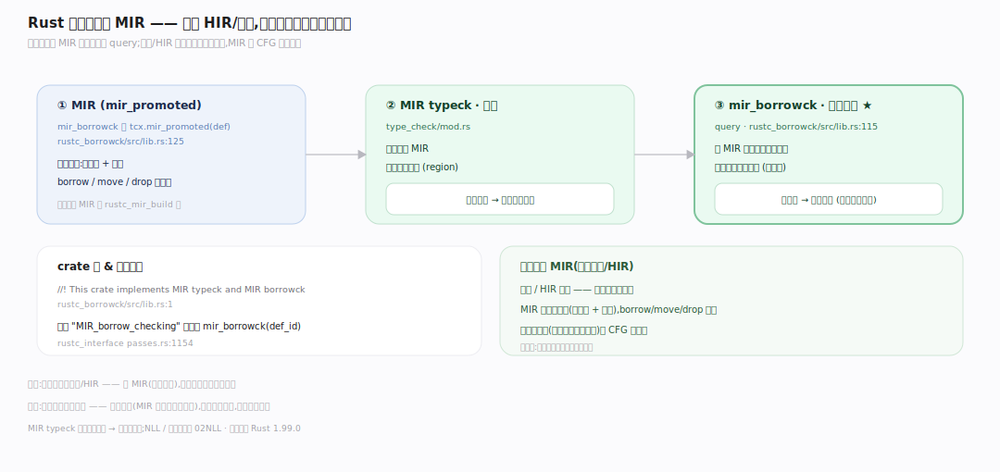
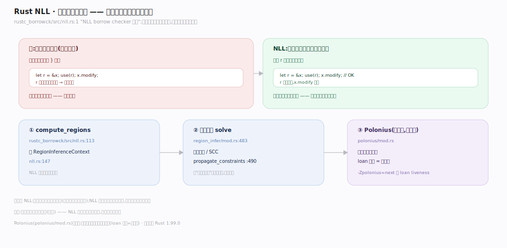
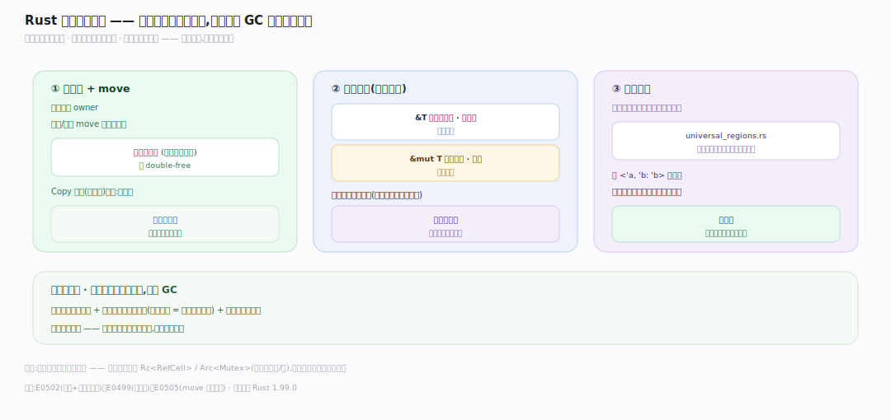

# Rust 原理 · 支撑主线 · 借用检查器

> **定位**：属"安全能力域"——Rust 的灵魂。管所有权/借用/生命周期的**编译期**验证:在 MIR 上跑、NLL 非词法生命周期、区域推断、Polonius。过不了不编译。依赖【编译管线】的 MIR。源码基准 **Rust 1.99.0**(`compiler/rustc_borrowck/`)。

Rust 内存安全无 GC 的根基:**借用检查器**——编译期证明"无悬垂引用、无数据竞争、无 use-after-free"。它不是运行时检查,而是在 **MIR**(中层 IR)上,用区域推断(region inference)验证所有权规则:每值一 owner、可变借用唯一、借用不超 owner 生命周期。过不了直接编译错。理解 MIR 借用检查 + NLL + 区域推断,就懂了 Rust 安全从何而来。

---

## 一、借用检查在 MIR 上

**借用检查在 MIR,不在 HIR/源码**:query `mir_borrowck` 拉 `mir_promoted` 在控制流图上验证。MIR typeck 先类型检查 MIR、产出区域约束喂给借用检查;`BorrowSet` 收集 MIR 里所有借用点,`Borrows` 数据流分析算"哪些借用在某点仍活着",据此判冲突。**为什么在 MIR**:源码/HIR 是树难做流敏感分析,MIR 是 CFG(borrow/move/drop 全显式)——数据流分析在 CFG 上自然。锚点见深化表。

---

## 二、NLL:非词法生命周期

**NLL(non-lexical lifetimes)**:生命周期按**实际最后一次使用**算,不按词法作用域 `}`。旧版借用活到作用域结束(过保守,`let r=&x; use(r); x.modify;` 会误报);NLL 下 r 最后用后即释放,x.modify 合法。区域推断(`RegionInferenceContext`)基于约束/SCC 把"借用活多久"求解成区域并验不冲突;**Polonius**(下一代)把借用检查建模成图可达性(loan 传播),更精确。**为什么 NLL**:词法误报太多(明明安全却不编译),NLL 少误报、更符直觉。

---

## 三、所有权规则:move / borrow / lifetime

借用检查验三条核心规则:**所有权 + move**(每值唯一 owner,赋值/传参 move 转移、原变量失效防 double-free;Copy 类型位拷贝例外)、**借用规则**(`&T` 不可变可多 vs `&mut T` 可变唯一,二者互斥 = 编译期读写锁防数据竞争)、**生命周期**(借用不超被借值生命周期防悬垂,`universal_regions` 提取 `<'a>` 参数、区域推断验约束)。**为什么这三条**:分别防重复释放、数据竞争、悬垂——合起来编译期杜绝内存错误,无需 GC。

---

## 拓展 · 借用检查关键结构一览

| 结构 | 定义 | 职责 |
|---|---|---|
| crate 定位 | `rustc_borrowck/src/lib.rs:1` | 实现 MIR typeck + MIR borrowck |
| mir_borrowck | `rustc_borrowck/src/lib.rs:115` | 借用检查 query(MIR 上) |
| 管线调用点 | `rustc_interface/src/passes.rs:1144` | MIR_borrow_checking 阶段 |
| NLL 入口 | `rustc_borrowck/src/nll.rs:1` | compute_regions 非词法生命周期 |
| BorrowSet | `rustc_borrowck/src/borrow_set.rs:21` | 收集 MIR 里所有借用点 |
| Borrows 数据流 | `rustc_borrowck/src/dataflow.rs:174` | 借用活跃性分析判冲突 |
| RegionInferenceContext | `region_infer/mod.rs:80` | 区域推断上下文结构 |
| RegionInferenceContext.solve | `region_infer/mod.rs:483` | 求解约束(SCC) |
| propagate_constraints | `region_infer/mod.rs:546` | 传播区域约束 |
| MIR typeck | `type_check/mod.rs:1` | 类型检查 MIR 产区域约束 |
| universal_regions | `universal_regions.rs:1` | 提取函数生命周期参数 |
| Polonius | `rustc_borrowck/src/polonius/mod.rs:38` | 下一代(图可达性 loan) |

## 调优要点（关键开关/理解要点）

- **-Zpolonius=next**:更精确的借用检查(实验),解某些 NLL 仍误报的场景。
- **生命周期标注**:多数可省略(生命周期省略规则);复杂借用关系需显式 `<'a>` 标注帮编译器。
- **借用报错读懂**:E0502(可变+不可变借用冲突)、E0499(多可变借用)、E0505(move 走还借用)——按规则改。
- **绕过**:确需共享可变用 RefCell(运行时借用检查)/Cell/unsafe(自负责);编译期检查是默认。

## 常见误区与工程要点

- **误区:借用检查是运行时。** 全编译期——在 MIR 上区域推断证明,过不了不编译;运行时零开销。
- **误区:生命周期按作用域算(词法)。** NLL 按实际最后使用算——借用用完即释放,比词法宽松、少误报。
- **误区:借用检查在源码/HIR。** 在 MIR(控制流图)——便于流敏感数据流分析。
- **误区:所有权限制太死没法写。** 需共享可变用 Rc<RefCell>/Arc<Mutex>(运行时借用/锁);编译期检查是默认安全网,有逃生舱。
- **归属提醒**:被检查的 MIR 由【编译管线】rustc_mir_build 产;所有权对应【内存与 Drop】的 move/析构;并发的 Send/Sync 是另一层【并发】保证;RefCell 运行时借用在【智能指针与内部可变】。

## 一句话总纲

**借用检查器是 Rust 的灵魂:在 MIR(中层 IR 控制流图)上由 rustc_borrowck 的 mir_borrowck 编译期证明内存安全——NLL(非词法生命周期,借用只活到最后一次使用,比词法宽松少误报)+ 区域推断(RegionInferenceContext.solve 基于约束/SCC 求解,Polonius 更精确用图可达性)验证三条所有权规则(每值一 owner+move 防 double-free、&T 可多/&mut T 唯一且互斥防数据竞争、借用不超生命周期防悬垂);过不了不编译——把内存错误挡在编译期、运行时零开销无 GC。**
