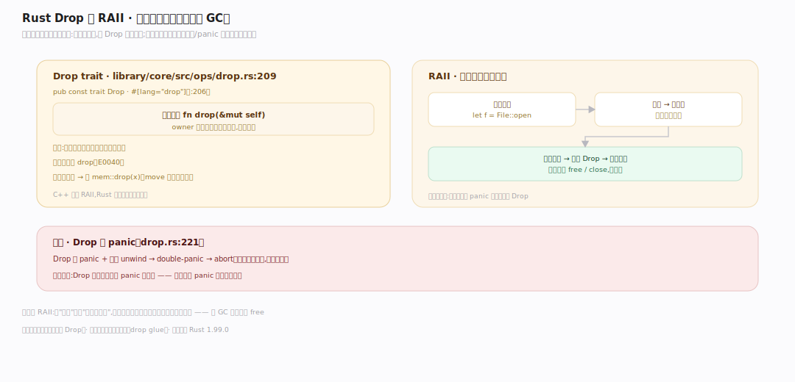
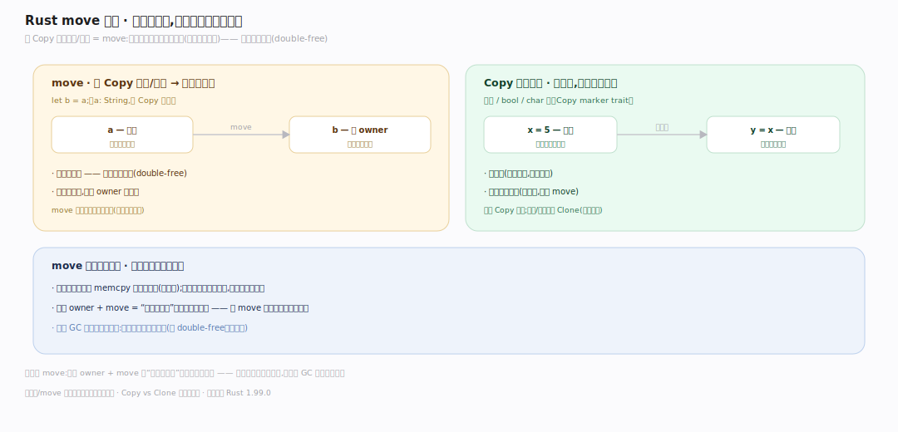
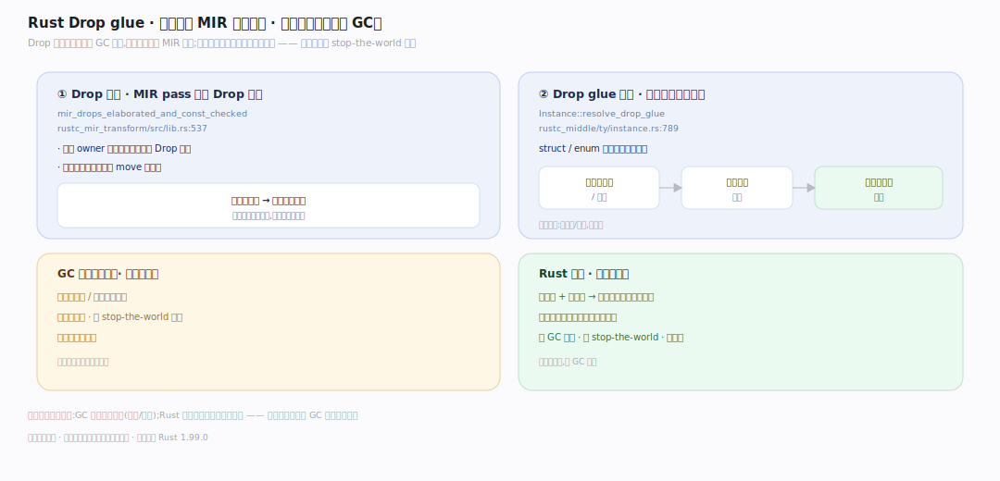
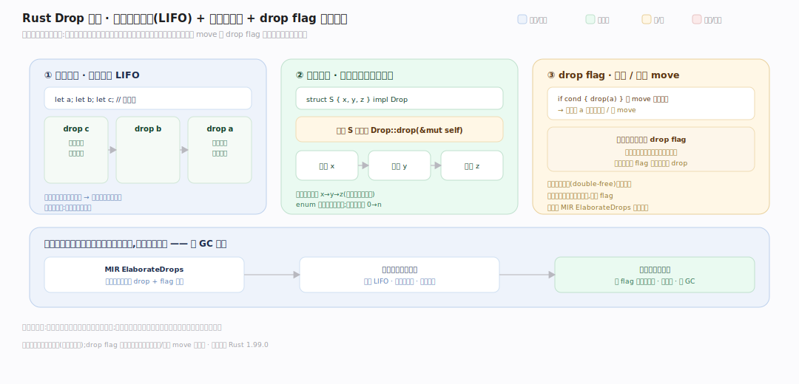

# Rust 原理 · 支撑主线 · 内存与 Drop

> **定位**：属"内存能力域"。管无 GC 的内存回收:RAII/Drop 析构、move 语义、Drop glue codegen。owner 出作用域自动 Drop,无需手动 free、无运行时 GC。依赖【借用检查器】保所有权、【编译管线】codegen Drop。源码基准 **Rust 1.99.0**(`library/core/src/ops/drop.rs`、`rustc_mir_transform/`)。

Rust 无 GC 也不手动 free——靠 **RAII(资源获取即初始化)+ Drop**:值绑定到 owner,owner 出作用域自动调 `Drop::drop` 析构、回收资源。所有权规则(编译期)保证每值恰好析构一次(无 double-free、无泄漏、无 use-after-free)。Drop 调用由编译器在 MIR 插入(drop glue),运行时零额外机制。理解 RAII/Drop + move,就懂了 Rust 无 GC 内存管理。

---

## 一、Drop trait 与 RAII

**Drop trait**(`#[lang="drop"]`)唯一方法 `fn drop(&mut self)`——owner 出作用域时**隐式**调用回收资源(关文件、释放堆内存);不能显式调 `drop`(E0040),提前析构用 `mem::drop(x)`。**RAII**:资源(内存/文件/锁)绑定到值的生命周期,值在资源在、值 Drop 资源释放,无需手动 free/close;注意 Drop 中 panic + 正在 unwind → double-panic → abort。**为什么 RAII**:把"释放"绑到"作用域结束",编译器保证一定调(正常/panic 都调)、所有权保证只调一次——比 C++ RAII 更安全。

---

## 二、move 语义:所有权转移

**move 是 Rust 内存模型核心**:非 Copy 类型赋值/传参 = move(所有权转移,原变量失效、编译期禁再用,防 double-free);`Copy` 类型(整数/bool/char)例外走位拷贝、原变量仍有效。move 是**编译期概念**——运行时可能只是 memcpy 或被优化掉,语义上是所有权转移。**为什么 move**:唯一 owner + move 让"谁负责析构"编译期明确单一,值 move 走后原处不再析构它——这让无 GC 的自动析构安全,每值恰好一个析构点。

---

## 三、Drop glue:编译器插入析构

Drop 调用不是运行时 GC 扫描,而是**编译器在 MIR 插入**:Drop 精化 pass `ElaborateDrops` 在每个 owner 作用域结束处插 Drop 调用(条件析构/部分 move 用 drop flag 记录);`resolve_drop_glue` 为复合类型合成递归析构(先字段后自身),底层走 `drop_in_place`,`needs_drop` 编译期判类型是否需析构(不需则跳过、零开销)。dropck 由 `check_drop_impl` 校验 Drop impl 合法性、`dropck_outlives` 保证析构时被借数据仍活着(防析构中悬垂)。**为什么编译期插入**:GC 要运行时追踪存活(有开销/停顿),Rust 编译期就知每值在哪析构(所有权 + 作用域)——确定性析构、零 GC 开销。

---

## 四、Drop 顺序:变量 LIFO + 字段声明序 + drop flag

析构顺序由语言规范固定(不可自定义):局部变量按**逆声明序**(LIFO——后声明的常借先声明的,逆序保被借的仍活)、临时值逆创建序;复合类型**先调自身 `Drop::drop`、再按声明序析构字段**(struct/tuple x→y→z、enum 活跃变体、数组下标 0→n,递归下钻)。当条件/部分 move 使某值在出口处「是否还需析构」编译期定不了时,`ElaborateDrops` 在栈上放 **drop flag** 运行时记录、按 flag 决定调不调——防 double-free 与漏析构。全部编译期插入、运行时只执行。

---

## 拓展 · 内存与 Drop 关键结构一览

| 结构 | 定义 | 职责 |
|---|---|---|
| Drop trait | `library/core/src/ops/drop.rs:209` | drop(&mut self) 析构 |
| double-panic abort | `library/core/src/ops/drop.rs:221` | Drop 中 panic + unwind → abort |
| mem::drop | `library/core/src/mem/mod.rs:1039` | 提前析构(move 进去) |
| drop_in_place | `library/core/src/ptr/mod.rs:811` | 原地析构单值 |
| needs_drop | `library/core/src/mem/mod.rs:700` | 编译期判是否需析构 |
| ElaborateDrops | `rustc_mir_transform/src/elaborate_drops.rs:48` | MIR Drop 精化 pass |
| Drop 精化 pass | `rustc_mir_transform/src/lib.rs:537` | MIR 插入 Drop 调用 |
| resolve_drop_glue | `rustc_middle/ty/instance.rs:789` | 合成递归析构代码 |
| check_drop_impl | `rustc_hir_analysis/src/check/always_applicable.rs:38` | dropck 校验 Drop impl |
| dropck_outlives | `rustc_traits/src/dropck_outlives.rs:21` | 保析构时被借数据仍活 |
| Copy trait | `library/core/src/marker.rs:454` | 位拷贝类型(不 move) |

## 调优要点（理解要点）

- **RAII 封装资源**:自定义类型 impl Drop 管资源(连接/句柄),出作用域自动释放——比手动 close 安全。
- **提前释放**:`drop(x)` 显式提前析构(释放锁/资源),不用等作用域结束。
- **避免 Drop 中 panic**:double-panic 会 abort;Drop 里做可能 panic 的操作要小心。
- **Copy vs Clone**:小值 impl Copy(隐式拷贝廉价);大值/含资源用 Clone(显式 .clone,明确成本)。

## 常见误区与工程要点

- **误区:Rust 有 GC。** 无。靠 RAII/Drop——编译期在作用域结束插析构调用,确定性回收,无运行时 GC 扫描/停顿。
- **误区:move 是运行时拷贝。** move 是编译期所有权转移;运行时可能 memcpy 或优化掉——语义是转移不是拷贝。
- **误区:能显式调 .drop。** 不能(E0040);用 mem::drop(x) 提前析构。
- **误区:Drop 顺序随意/可自定义。** 语言规范固定:局部变量逆声明序、复合类型自身先且字段声明序、递归下钻(见 §四),不可改。
- **归属提醒**:所有权/move 的编译期强制在【借用检查器】;Drop 插入是【编译管线】MIR pass;智能指针(Box/Rc/Arc)的 Drop 行为在【智能指针】;Drop 中 panic 关联【panic 展开】。

## 一句话总纲

**Rust 无 GC 靠 RAII + Drop:值绑定 owner,owner 出作用域编译器自动调 Drop::drop(#[lang=drop])析构回收资源(RAII,不能显式调用 drop、用 mem::drop 提前);move 语义(非 Copy 类型赋值/传参转移所有权、原变量失效防 double-free,Copy 类型位拷贝例外)保证每值恰好一个析构点;Drop 调用由编译器 MIR pass(mir_drops_elaborated)在作用域结束处插入、resolve_drop_glue 合成递归析构——全编译期确定,运行时直接执行、无 GC 扫描无停顿,确定性析构零开销。**
