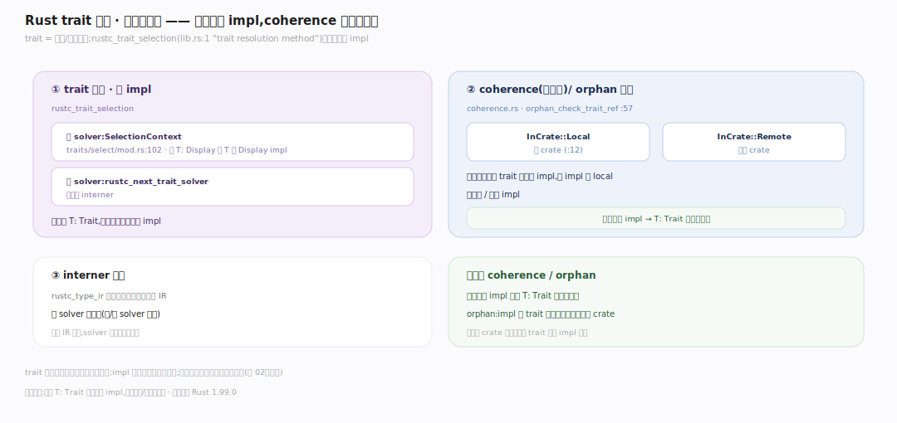
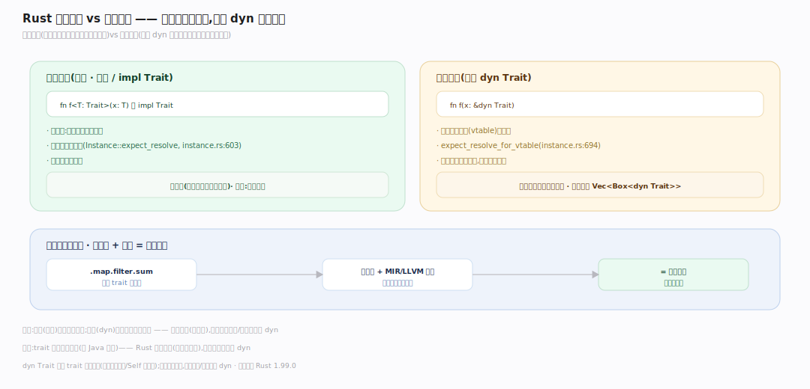
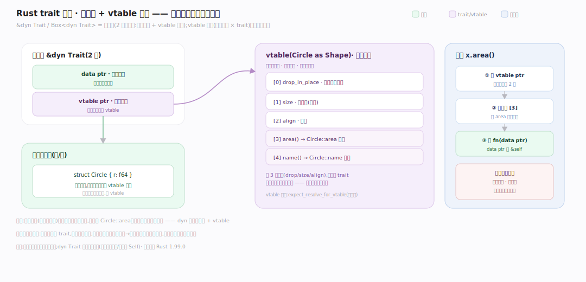

# Rust 原理 · 支撑主线 · 特质与单态化

> **定位**：属"泛型能力域"。管 trait 求解 + 泛型→具体代码的单态化,是零成本抽象的实现。trait 是接口/多态,单态化把泛型编译成每个具体类型的专版。依赖【编译管线】的类型系统。源码基准 **Rust 1.99.0**(`compiler/rustc_trait_selection/`、`rustc_monomorphize/`)。

Rust 的泛型/trait **零成本**——秘密在**单态化**:泛型函数 `fn f<T>(x:T)` 不是运行时泛型,而是编译期为每个用到的具体 T 生成一份专版代码。trait 提供接口抽象(多态);trait 求解在编译期定 impl;单态化把泛型和 trait 静态分发全展开成具体代码,运行时无虚表、无装箱。理解 trait 求解 + 单态化,就懂了"零成本抽象"。

---

## 一、trait 系统:接口与求解

**trait = 接口/共享行为,编译期求解 impl**:老 solver `SelectionContext::select` 对一个 obligation 挑匹配的 impl 候选(给 `T: Display` 找 T 的 Display impl),义务收集用 `ObligationCtxt`/`FulfillmentContext`。**coherence/orphan 规则**保证同一类型同一 trait 只一个 impl 且 impl 要 local——全局唯一 impl 使 `T: Trait` 解析无歧义,防两 crate 各写冲突 impl。`rustc_type_ir` 提供编译器无关类型 IR 让 solver 泛型化。锚点见深化表。

---

## 二、单态化:泛型→具体

**单态化(monomorphization)是零成本核心**:非泛型 fn 出一份 LLVM 代码,泛型 fn 为每个用到的具体类型参数生成专版(`Instance::expect_resolve` 解析实例;注释"单态化即时发生,从不创建单态化 MIR")。collector 从根(main/导出)出发按 Lazy(默认按需)/Eager 策略收集所有需实例化项,再 `collect_and_partition`/`partition` 分到 codegen units 并行编译。**为什么零成本**:`Vec<i32>`/`Vec<String>` 各生专版、像手写一样紧凑,无运行时类型参数/装箱;代价是代码膨胀 + 编译慢。

---

## 三、静态分发 vs 动态分发

trait 调用两种分发:**静态分发**(默认,泛型/impl Trait)单态化后编译期知具体类型、直调、可内联,零开销;**动态分发**(显式 `dyn Trait`)运行时经虚表查方法(一次间接调用开销,但代码不膨胀,一份代码处理所有类型)。取舍:热路径用泛型(快但膨胀),异构集合(`Vec<Box<dyn Trait>>`)用 dyn(省代码有虚表)。**迭代器零成本**:`.map.filter.sum` 是泛型 trait 方法,单态化 + 内联后 = 手写循环,无中间分配。

---

## 四、trait 对象:胖指针 + vtable 布局

动态分发落地细节:`&dyn Trait`/`Box<dyn Trait>` 是**胖指针**(两机器字——数据指针 + vtable 指针),本体不含类型标签。**vtable** 是每(具体类型 × trait)一份的编译期静态表,布局固定——前三槽 `drop_in_place`/`size`/`align`,其后按方法声明序排指针;`x.area()` = 取 vtable → 查固定槽位偏移 → 以数据指针作 `&self` 调该函数(一次间接跳转、不可内联)。对比静态分发编译期直调可内联——这就是 dyn 的开销来源与"代码不膨胀"的原因。

---

## 拓展 · 特质单态化关键结构一览

| 结构 | 定义 | 职责 |
|---|---|---|
| rustc_trait_selection | `rustc_trait_selection/src/lib.rs:1` | trait 求解 |
| SelectionContext | `rustc_trait_selection/src/traits/select/mod.rs:102` | 老 solver 选择 impl |
| SelectionContext::select | `rustc_trait_selection/src/traits/select/mod.rs:289` | 选匹配 impl 候选 |
| ObligationCtxt | `rustc_trait_selection/src/traits/engine.rs:50` | 义务收集/求解 |
| FulfillmentContext | `rustc_trait_selection/src/traits/fulfill.rs:60` | 义务履行上下文 |
| coherence InCrate | `rustc_next_trait_solver/src/coherence.rs:14` | 一致性判定 |
| coherence orphan | `rustc_next_trait_solver/src/coherence.rs:221` | 一致性/orphan 规则 |
| Mono collector | `rustc_monomorphize/src/collector.rs:1` | 收集单态项 |
| 收集策略 | `collector.rs:244` | Eager/Lazy 策略 |
| crate 单态项入口 | `rustc_monomorphize/src/collector.rs:1821` | collect_crate_mono_items |
| collect_and_partition | `rustc_monomorphize/src/partitioning.rs:1144` | 单态项分区到 CGU |
| partition | `rustc_monomorphize/src/partitioning.rs:143` | 分配单态项到 CGU |
| Instance::expect_resolve | `rustc_middle/src/ty/instance.rs:603` | 解析具体实例 |
| vtable resolve | `rustc_middle/src/ty/instance.rs:694` | dyn 动态分发虚表 |

## 调优要点（理解要点）

- **静态 vs dyn**:热路径/性能敏感用泛型(静态,可内联);异构集合/减代码膨胀用 `dyn`。
- **代码膨胀**:泛型实例化多(如 `Vec<T>` 用了很多 T)增二进制体积 + 编译时间;必要时用 dyn 收敛。
- **trait 对象限制**:`dyn Trait` 要求 trait "对象安全"(方法不含泛型/Self 返回等)。
- **单态化 + 内联**:泛型 + `#[inline]` 让跨 crate 也能内联,零成本抽象跨模块生效。

## 常见误区与工程要点

- **误区:泛型有运行时开销。** 静态分发的泛型单态化成具体代码,零运行时开销(无类型参数、无装箱);只有 dyn 才有虚表开销。
- **误区:trait 都是动态分发(像 Java 接口)。** Rust 默认静态(泛型单态化);动态分发要显式 `dyn`。
- **误区:单态化免费。** 零运行时成本,但编译期成本(代码膨胀 + 编译慢)——泛型用太多会胖二进制。
- **误区:迭代器链慢(多次遍历)。** 单态化 + 内联后编译成单次手写循环,无中间分配——零成本。
- **归属提醒**:单态化产的 MIR 实例在【编译管线】codegen;trait 求解用类型信息来自【类型推断】;Send/Sync 也是 trait(auto trait)在【并发】;impl 的方法体经借用检查(【借用检查器】)。

## 一句话总纲

**Rust 的 trait + 单态化实现零成本抽象:trait 是接口/多态,编译期由 rustc_trait_selection 求解 impl(coherence/orphan 规则保全局唯一 impl 无歧义);单态化(rustc_monomorphize collector)把泛型 fn 为每个具体类型参数生成专版代码(Vec<i32>/Vec<String> 各一份,像手写一样紧凑,无运行时类型参数/装箱);默认静态分发(泛型单态化可内联零开销),显式 dyn Trait 才走虚表动态分发(省代码但一次间接调用);迭代器链单态化+内联后=手写循环——你用的没法手写更快,代价是代码膨胀+编译慢。**
