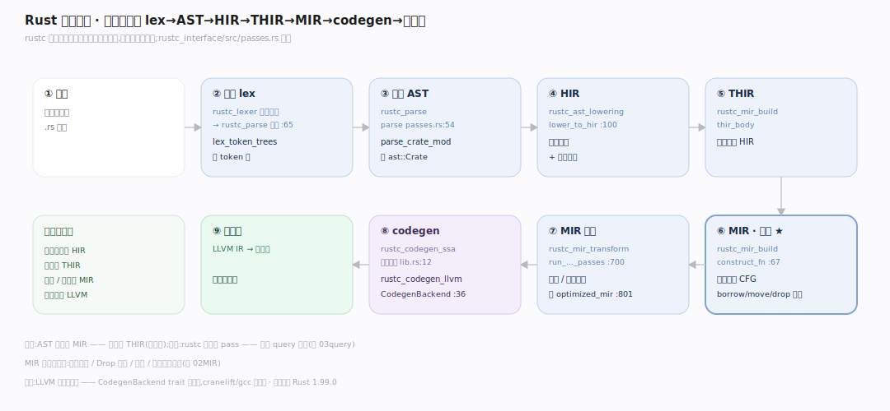
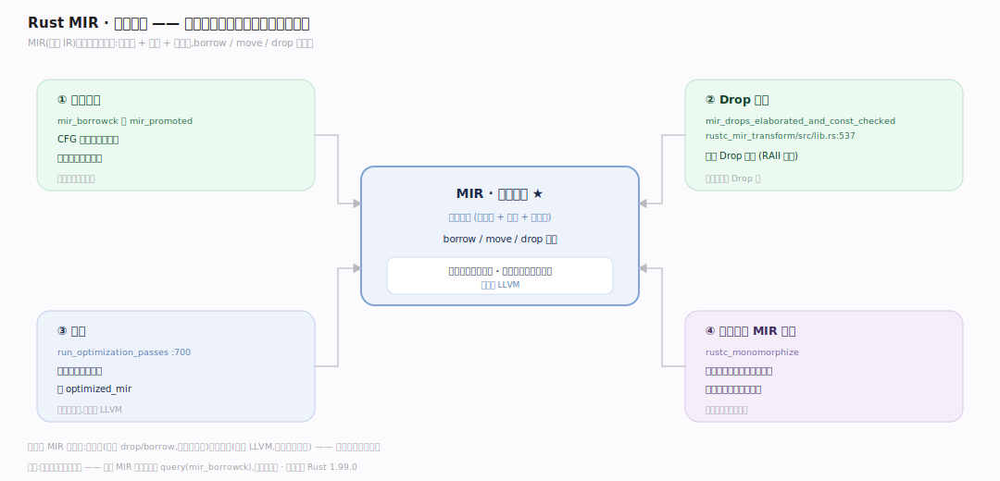
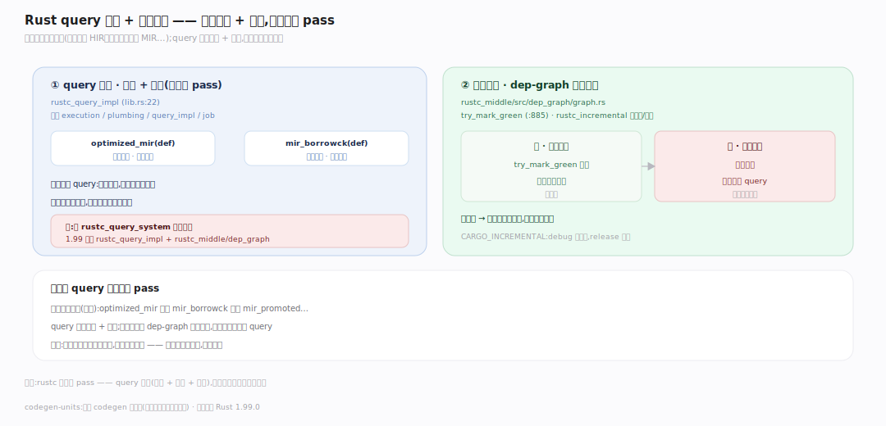

# Rust 原理 · 支撑主线 · 编译管线

> **定位**：属"编译能力域"。管源码到机器码的多阶段降级:lex→parse(AST)→HIR→THIR→MIR→codegen(LLVM),外加 query 系统 + 增量编译。是一切编译期分析的骨架。借用检查/单态化/优化都挂在管线特定阶段。源码基准 **Rust 1.99.0**(`compiler/rustc_*`)。

rustc 把源码逐级降成越来越低层的中间表示,每级做特定分析:AST(贴近语法)→ HIR(去糖、名字解析)→ THIR(带类型)→ **MIR**(控制流图,借用检查/优化在此)→ LLVM IR → 机器码。全程由 **query 系统**驱动(按需计算 + 缓存)+ 增量编译(只重算变化部分)。理解各阶段职责 + MIR 的中心地位,就懂了 rustc 骨架。

---

## 一、多阶段降级:AST→HIR→THIR→MIR→LLVM

`rustc_interface` 的 passes 编排逐级降低抽象:lex(rustc_lexer 分词)→ parse 成 AST → HIR(去糖 + 名字解析)→ THIR(带类型)→ **MIR**(控制流图)→ 优化 → codegen(LLVM)→ 机器码。**每级贴合一类分析**——名字解析在 HIR、类型在 THIR、借用/优化在 MIR、机器码在 LLVM,各司其职。各阶段入口见深化表。

---

## 二、MIR:安全检查与优化的中心

**MIR**(mid-level IR)是管线中心舞台——控制流图(基本块 + 语句 + 终结符),borrow/move/drop 全显式。借用检查、Drop 精化(插 RAII 析构)、优化(内联/常量传播)、单态化产实例四件事都挂在 MIR 上。**它足够低**(显式 drop/borrow 能做安全检查)**又足够高**(独立于 LLVM 能做语言级优化),故成公共基础。

---

## 三、query 系统 + 增量编译

rustc 不是线性 pass 而是 **query 驱动**(按需计算 + 结果缓存):`optimized_mir`/`mir_borrowck` 等都是 query。编译本质是有向依赖图(类型依赖 HIR、借用检查依赖 MIR),增量编译靠 dep-graph 红绿标记(`try_mark_green`:输入没变 = 绿复用,变了 = 红重算)只重算受影响 query——改一行只重编相关部分。注:旧 rustc_query_system 已并入 rustc_query_impl + rustc_middle/dep_graph。

---

## 深化 · 编译管线各阶段源码入口

| 阶段/结构 | 入口 | 源码锚点 |
|---|---|---|
| 管线编排 | passes.rs | `rustc_interface/src/passes.rs:54` |
| lex 分词 | rustc_parse lexer | `lexer/mod.rs:65` |
| AST→HIR | rustc_ast_lowering | `rustc_ast_lowering/src/lib.rs:1` |
| HIR→THIR→MIR | rustc_mir_build `construct_fn` | `builder/mod.rs:67` |
| MIR 优化 | run_optimization_passes | `lib.rs:700` |
| optimized_mir query | rustc_mir_transform | `rustc_mir_transform/src/lib.rs:801` |
| Drop 精化 | mir_drops_elaborated | `rustc_mir_transform/src/lib.rs:537` |
| codegen 后端无关层 | rustc_codegen_ssa | `lib.rs:12` |
| codegen 后端边界 | CodegenBackend trait | `rustc_codegen_ssa/src/traits/backend.rs:36` |
| query 实现 | rustc_query_impl | `lib.rs:22` |
| 增量红绿标记 | dep_graph try_mark_green | `rustc_middle/src/dep_graph/graph.rs:885` |

## 调优要点（关键开关/理解要点）

- **增量编译**:`CARGO_INCREMENTAL`(默认 debug 开)——改动只重编受影响部分,加快迭代;release 常关(求峰值优化)。
- **codegen-units**:并行 codegen 单元数;多则并行快、优化略降。
- **MIR 优化级别**:随 opt-level;debug 少优化编快、release 多优化跑快。
- **后端可换**:LLVM 是默认后端;cranelift(快编译)、gcc 后端也存在(CodegenBackend trait)。

## 常见误区与工程要点

- **误区:AST 直接到 MIR。** 有 THIR 中间:AST→HIR→**THIR**(带类型)→MIR;THIR 是类型化的 HIR。
- **误区:rustc 是线性 pass。** query 驱动(按需 + 缓存 + 增量);编译是依赖图,不是流水线。
- **误区:借用检查独立于管线。** 它是 MIR 阶段的一个 query(mir_borrowck),嵌在管线里。
- **误区:LLVM 是唯一后端。** LLVM 是默认;CodegenBackend trait 是边界,cranelift/gcc 后端可插拔。
- **归属提醒**:MIR 上的借用检查在【借用检查器】;单态化产 MIR 实例在【特质与单态化】;类型推断在 THIR 前的【类型推断】;Drop 精化关联【内存与 Drop】。

## 一句话总纲

**rustc 编译管线多阶段降级:lex(rustc_lexer)→parse 成 AST(rustc_parse)→HIR(rustc_ast_lowering 去糖/名字解析)→THIR(带类型)→MIR(rustc_mir_build,控制流图)→优化(rustc_mir_transform)→codegen(rustc_codegen_ssa 后端无关 + rustc_codegen_llvm,CodegenBackend trait 是边界)→机器码;MIR 是中心舞台(借用检查/Drop 精化/优化/单态化都在此,足够低能做安全检查又足够高能做语言级优化);全程 query 系统驱动(rustc_query_impl 按需计算+缓存)+ 增量编译(dep-graph 红绿标记只重算变化部分)。**
