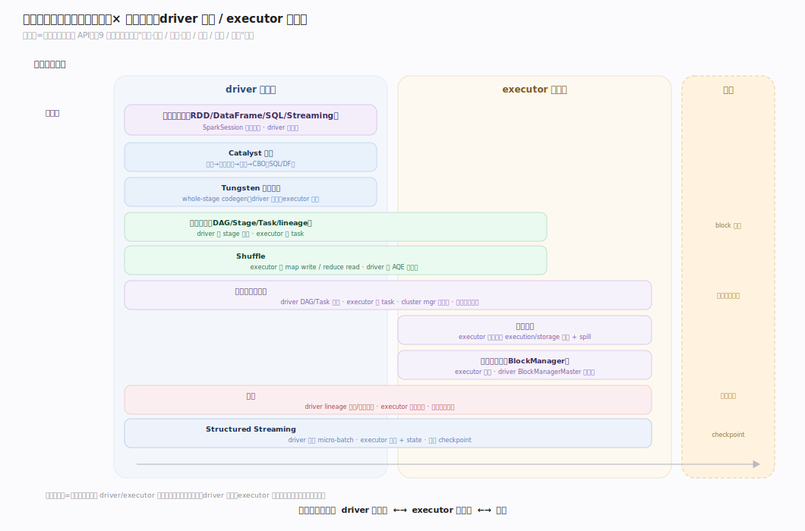
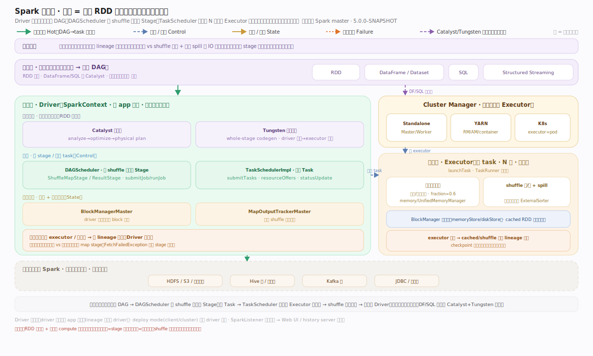
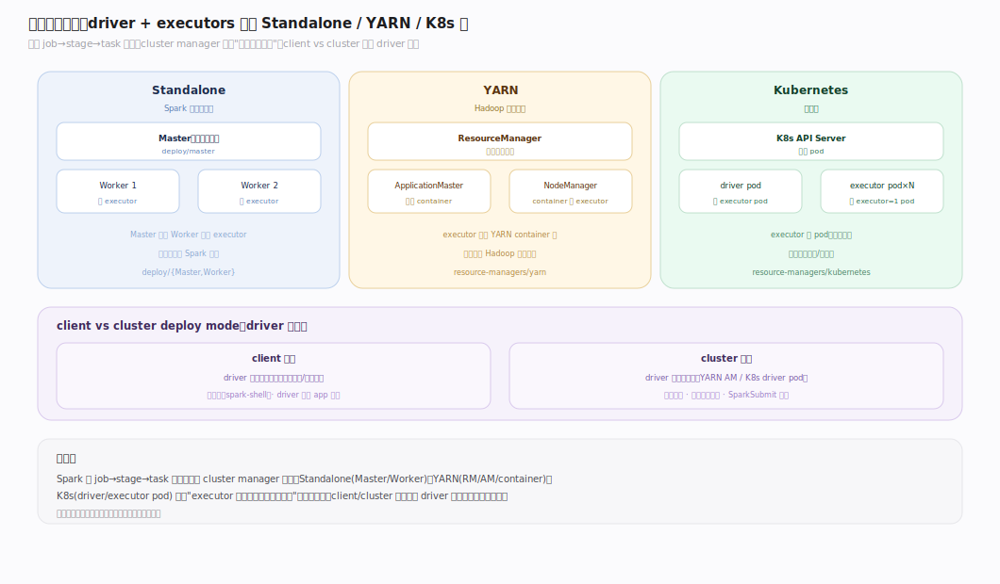
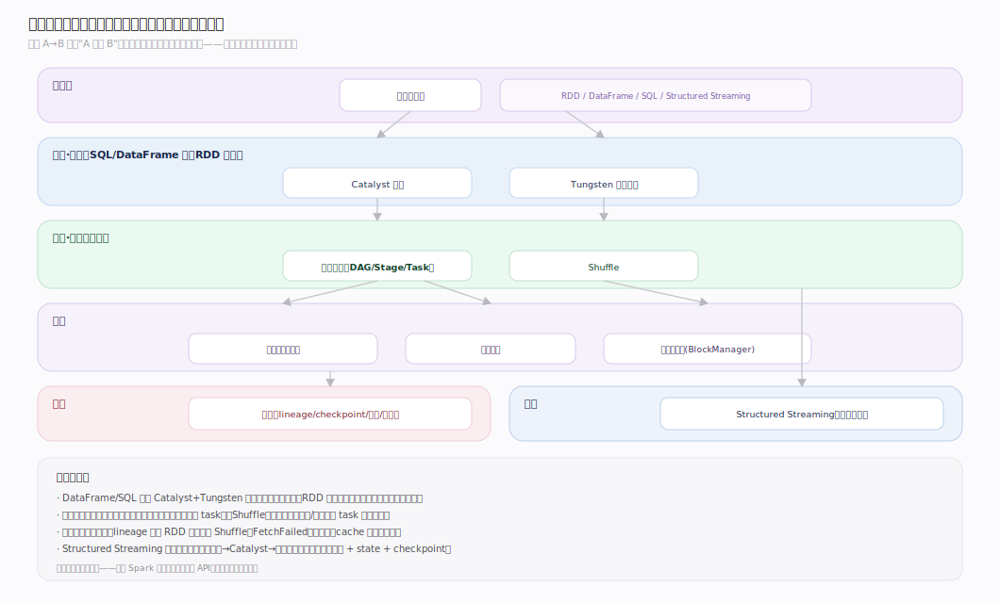
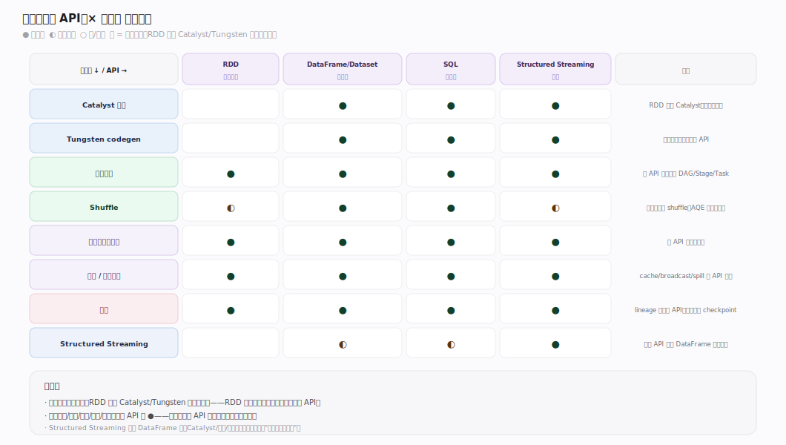
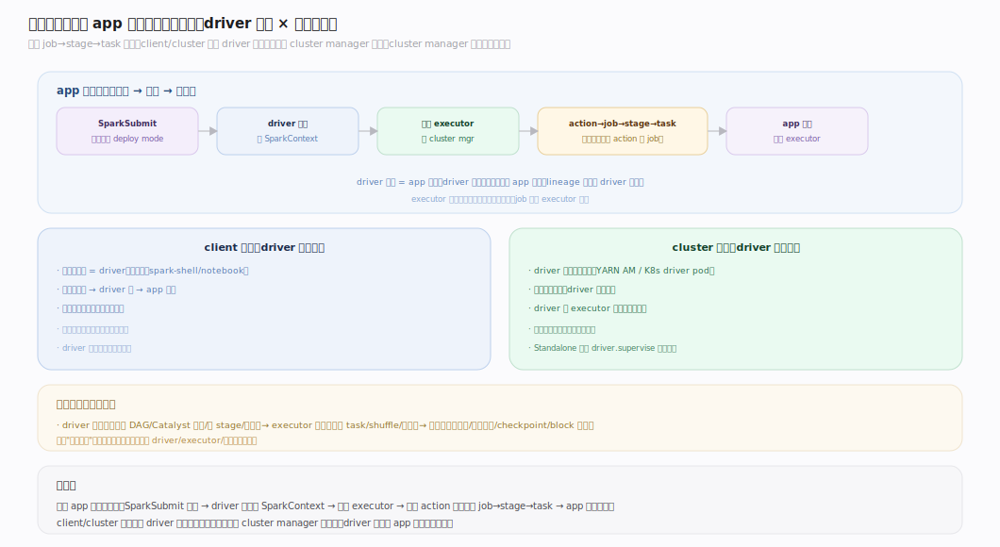

# Spark 原理 · 全景主线框架

> 统领全部原理文档：Spark 属 **原型 C · 通用分布式计算引擎**——接触面是**多编程 API**（RDD/DataFrame/SQL/Streaming）而非 SQL 语句族，自管**执行**但不管持久存储，容错靠 **lineage 重算/checkpoint** 而非事务。核实基准：`~/workdir/spark`（master，post-4.0 开发版）。

## 一、双维模型：能力域 × 执行时机

- **能力域（管什么）**：接触面（编程接口层）面向用户；支撑侧面向引擎内部——计算规划（Catalyst/Tungsten）、执行（DAG/Shuffle）、资源（调度/内存/存储缓存）、保障（容错）、流式（Structured Streaming）。
- **执行时机（何时做）**：**driver 侧规划**（构建 DAG、Catalyst 优化、stage 切分、任务分派）与 **executor 侧执行**（跑 task、shuffle 读写、缓存块），外加后台（block 清理、动态资源伸缩、推测执行）。

---

## 二、总架构图（driver–executor）

---

## 二·补　物理部署视图（Standalone / YARN / K8s）

---

## 三、能力域依赖关系（按依赖深度分层）

---

## 四、接触面 × 能力域 依赖矩阵

---

## 五、运行形态（cluster manager 维度的取值）

---

## 深化 · 支撑能力域分层归位（按依赖深度）

| 层 | 主线 | 一句话职责 |
|---|---|---|
| 接触面 | **编程接口层** | RDD/DataFrame/SQL/Streaming 多 API 汇入统一执行（SparkSession） |
| 计算·规划 | **Catalyst 优化** | 逻辑计划→优化→物理计划→CBO（SQL/DataFrame 走，RDD 不走） |
| 计算·规划 | **Tungsten 代码生成** | whole-stage codegen + 堆外内存 + 缓存感知，把算子编译成一个函数 |
| 计算·执行 | **执行模型** | DAG→Stage→Task、RDD lineage、窄/宽依赖（灵魂主线） |
| 计算·执行 | **Shuffle** | 宽依赖的数据重分布：write/read、sort/hash、AQE |
| 资源 | **调度与集群管理** | DAGScheduler/TaskScheduler、locality、Standalone/YARN/K8s、动态资源分配 |
| 资源 | **内存管理** | 统一内存（execution vs storage 借用）、spill、堆外 |
| 资源 | **存储与缓存** | BlockManager、cache/persist 级别、broadcast |
| 保障 | **容错** | lineage 重算、checkpoint、task 重试、推测执行、FetchFailed 处理 |
| 流式 | **Structured Streaming** | micro-batch/continuous、state 管理、exactly-once |

---

## 拓展 · 与 SQL 存算引擎（Doris/ClickHouse）的心智对照

三条"反直觉"认知：Spark 以"不可变 RDD 的 DAG + lineage 容错"为中心，而非"表 + 存储"。

| 维度 | SQL 存算引擎（Doris/ClickHouse） | Spark | 影响 |
|---|---|---|---|
| 接触面 | SQL 语句族（DDL/DML/DQL/DCL） | **多 API**：RDD / DataFrame-Dataset / SQL / Streaming，统一入口 SparkSession | 不是"一种语言"，是多套 API 汇入同一执行引擎 |
| 存储 | 自管内表（Tablet/part 落盘） | **不管持久存储**——读写外部源（HDFS/S3/Hive/JDBC…），自己只管"算" | Spark 是计算框架，存储是别人的 |
| 执行单位 | 一条 SQL → 算子树 → Pipeline | 一个 **job → stage → task**，由 **DAG** 按 shuffle 边界切分 | 核心是 DAG 调度，非单条查询 |
| 容错 | 事务/副本 | **lineage 重算**（丢分区按血缘重算）+ checkpoint + task 重试 | 无事务；容错是"可重算性" |
| 优化 | RBO/CBO 产物直接执行 | **Catalyst**（逻辑→物理→CBO）+ **Tungsten** codegen + 运行期 **AQE** | 优化跨 SQL/DataFrame 统一（RDD 不过 Catalyst） |
| "更新" | INSERT/Mutation 改数据 | RDD **不可变**，转换产生新 RDD（lineage 就是转换链） | 不可变 + 血缘 = 容错的根 |

---

## 拓展 · 三条贯穿声明（不单列主线，但覆盖全局）

| 贯穿维度 | 落点 | 说明 |
|---|---|---|
| 通信/传输（性能） | shuffle 交换 · broadcast · block 远程拉取 · driver–executor RPC | 均走网络与序列化，瓶颈常落于此（尤其 shuffle） |
| 可观测性（诊断） | SparkListener 事件总线 → Web UI · 指标系统 · event log | job/stage/task/DAG 可视化 + history server |
| 运行形态（前提） | 同一 job→stage→task 模型跑在 Standalone/YARN/K8s | 主线不变、资源协商方式变；client/cluster 决定 driver 位置 |

---

## 常见误区与工程要点

- **把 Spark 当数据库**：它不管持久存储、无表无事务；它是"读外部数据 → 用 DAG 算 → 写回外部"的计算框架。
- **RDD 与 DataFrame/SQL 混为一谈**：DataFrame/SQL 过 Catalyst+Tungsten 优化，RDD 是更底层的手动 API 不过优化器——性能与心智模型不同。
- **忽视 shuffle**：窄依赖在一个 stage 内流水线执行，宽依赖（shuffle）才切 stage 并落盘重分布——shuffle 是性能与稳定性的头号变量。
- **误解容错**：Spark 容错不是副本/事务，是 lineage 可重算 + checkpoint 截断血缘；长血缘/宽依赖重算代价高，该 checkpoint。

---

## 一句话总纲

**Spark 是"不可变 RDD 的 DAG + lineage 容错"引擎：多套 API（RDD/DataFrame/SQL/Streaming）汇入 SparkSession，DataFrame/SQL 经 Catalyst 优化 + Tungsten codegen 后与 RDD 一样落到执行模型——按窄/宽依赖把 DAG 切成 stage、每 stage 按分区拆 task，driver 调度到 executor 执行，宽依赖处 shuffle 重分布；容错靠血缘重算而非事务，跑在 Standalone/YARN/K8s 上模型不变。**
