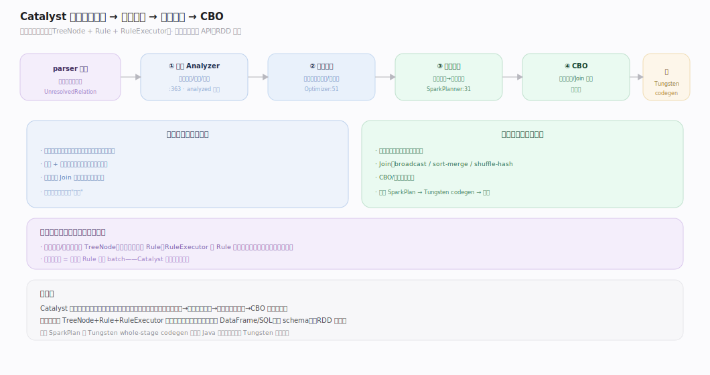
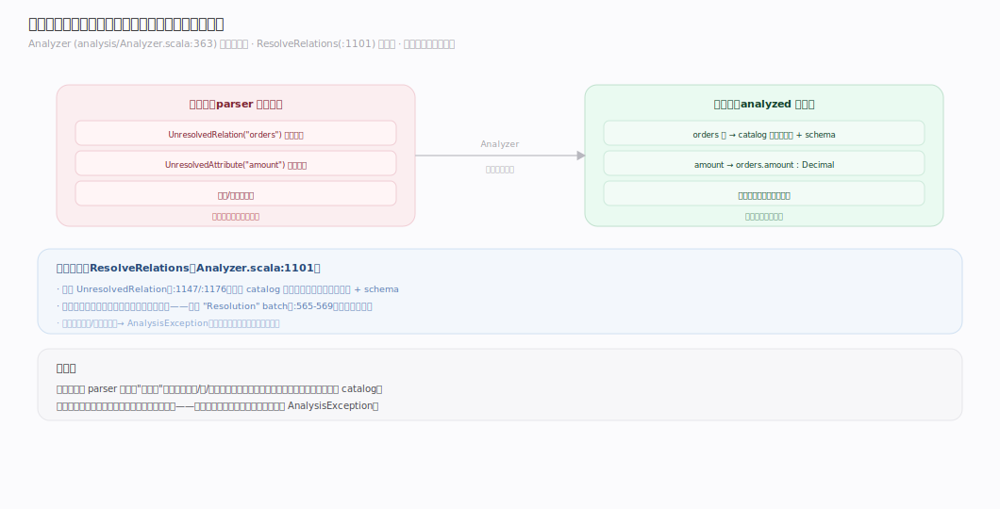
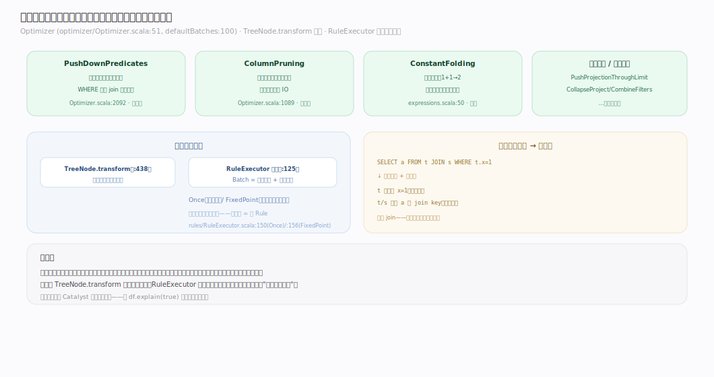
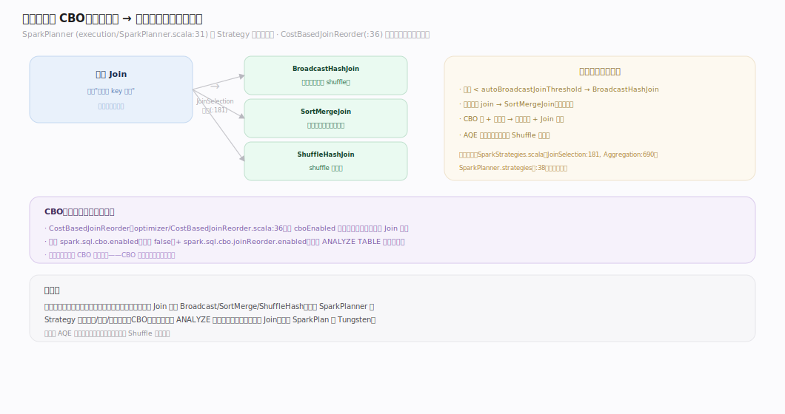
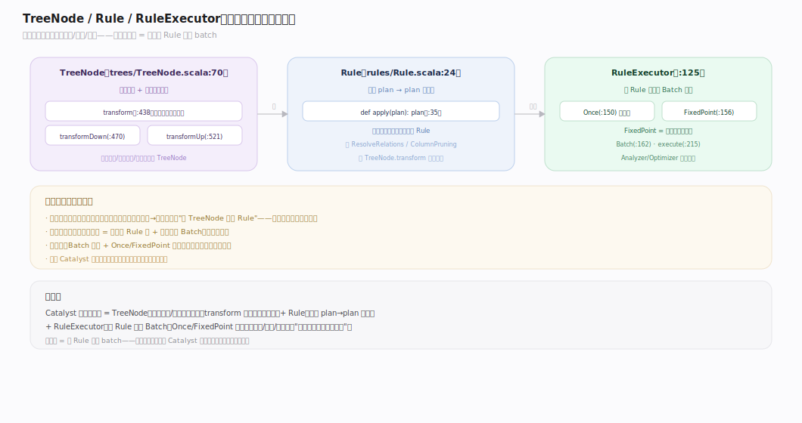

# Spark 原理 · 支撑主线 · Catalyst 优化

> **定位**：Catalyst 是计算·规划能力域，把 DataFrame/SQL 从逻辑计划优化成物理计划；骨架 = `分析 → 逻辑优化 → 物理规划 → CBO`。上承 **编程接口层**（结构化 API），下接 **Tungsten codegen** 与 **执行模型**；RDD 不过 Catalyst。核实基准：`~/workdir/spark/sql/catalyst`（master，post-4.0）。

## 一、Catalyst 四阶段全景

Catalyst 把结构化查询从"用户逻辑"优化成"高效物理执行"，四阶段：**分析**（解析名称/类型）→ **逻辑优化**（规则改写）→ **物理规划**（逻辑算子转物理算子）→ **CBO**（代价选择）。全程建立在一个统一的树变换框架上：所有计划与表达式都是 `TreeNode`，所有优化都是 `Rule[TreeNode]`，由 `RuleExecutor` 分批到不动点执行。**这是 Spark 结构化 API 快的规划期来源**——RDD 因无 schema 不过这套。

---

## 二、逻辑计划：分析与解析

parser 产出的初始计划含**未解析**的引用（`UnresolvedRelation`、未绑定属性）。`Analyzer`（`analysis/Analyzer.scala:363`）分批跑规则解析：`ResolveRelations`（`:1101`）把 `UnresolvedRelation` 绑定到 catalog 里的真实表，其余规则解析列引用、函数、类型。解析后才是一棵语义完整、可优化的逻辑计划——就像编译器的语义分析阶段。

---

## 三、逻辑优化：规则驱动

`Optimizer`（`optimizer/Optimizer.scala:51`，`defaultBatches:100`）在逻辑计划上跑几十条**等价改写规则**，减少要算的数据与算子：

| 规则 | 作用 | 源码 |
|---|---|---|
| `PushDownPredicates` | 谓词下推（过滤尽早做） | `Optimizer.scala:2092` |
| `ColumnPruning` | 列裁剪（只读用到的列） | `Optimizer.scala:1089` |
| `ConstantFolding` | 常量折叠（1+1→2） | `optimizer/expressions.scala:50` |
| `PushProjectionThroughLimitAndOffset` | 投影穿透 limit | 同名文件:27 |

规则用 `TreeNode.transform`（`trees/TreeNode.scala:438`）做模式匹配式改写；`RuleExecutor`（`rules/RuleExecutor.scala:125`）把规则组织成 `Batch`，每批跑 `Once` 或 `FixedPoint`（跑到计划不再变）。**规则可插拔、可组合**——这是 Catalyst 可扩展性的核心。

---

## 四、物理规划与 CBO

逻辑计划描述"做什么"，物理规划决定"怎么做"。`SparkPlanner`（`execution/SparkPlanner.scala:31`）用一组 **Strategy**（`SparkStrategies.scala:75`，如 `JoinSelection:181`、`Aggregation:690`）把每个逻辑算子转成物理算子——一个逻辑 Join 可能有多种物理实现（broadcast/sort-merge/shuffle-hash）。

**CBO（代价优化）**：`CostBasedJoinReorder`（`optimizer/CostBasedJoinReorder.scala:36`）在 `cboEnabled`（默认关，`spark.sql.cbo.enabled`）时用统计信息重排 Join 顺序。物理策略（如 Join 类型选择）也部分依赖统计。物理规划产物是 `SparkPlan` 树，再交 Tungsten codegen。

---

## 深化 · TreeNode / Rule / Strategy 统一框架

Catalyst 优雅在于**一套树变换框架贯穿始终**：
- **TreeNode**（`trees/TreeNode.scala:70`）：所有逻辑/物理计划、所有表达式的基类；`transform`/`transformDown`（`:470`）/`transformUp`（`:521`）做模式匹配式递归改写。
- **Rule**（`rules/Rule.scala:24`）：一个 `LogicalPlan → LogicalPlan` 的变换；分析、优化都是 Rule。
- **RuleExecutor**（`rules/RuleExecutor.scala:125`）：把 Rule 组织成 Batch，`Once`/`FixedPoint`（`:150,:156`）控制迭代。
- **Strategy/QueryPlanner**（`planning/QueryPlanner.scala:55`）：逻辑→物理的模式匹配。

**加一条优化规则 = 写一个 Rule 加进 batch**——Catalyst 的可扩展性由此而来。

---

## 拓展 · 优化规则清单（示意）

| 类别 | 规则 | 作用 |
|---|---|---|
| 谓词 | PushDownPredicates / CombineFilters | 下推、合并过滤 |
| 投影 | ColumnPruning / CollapseProject | 列裁剪、合并投影 |
| 常量 | ConstantFolding / BooleanSimplification | 常量折叠、布尔化简 |
| Join | ReorderJoin / CostBasedJoinReorder | Join 重排（CBO） |
| 算子 | CombineLimits / EliminateOuterJoin | 算子合并/消除 |
| AQE | 运行期重优化 | 见 Shuffle 主线 |

---

## 调优要点（关键开关）

- `spark.sql.cbo.enabled`：CBO（默认关）——大表多 Join 时开，配 `ANALYZE TABLE` 收集统计。
- `spark.sql.cbo.joinReorder.enabled`：Join 重排（依赖 CBO）。
- `spark.sql.autoBroadcastJoinThreshold`：小表 broadcast join 阈值（物理策略选择）。
- `spark.sql.optimizer.excludedRules`：排除某些优化规则（调试/规避 bug）。
- **收集统计**：`ANALYZE TABLE … COMPUTE STATISTICS` 让 CBO 有数据可依。

---

## 常见误区与工程要点

- **以为 Catalyst 对 RDD 生效**：RDD 无 schema，完全不过 Catalyst；只有 DataFrame/Dataset/SQL 走这套。
- **不收集统计还开 CBO**：CBO 依赖统计信息，没 `ANALYZE TABLE` 收集则 CBO 无据可依、形同虚设。
- **用 explain 不看物理计划**：`df.explain(true)` 能看四阶段计划；优化没生效（如谓词没下推）从这里查。
- **excludedRules 滥用**：排除规则是应急手段，长期会丢优化；优先查为何规则没生效。

---

## 一句话总纲

**Catalyst 是 Spark 结构化查询的优化器：建立在"所有计划/表达式都是 TreeNode、所有优化都是 Rule、由 RuleExecutor 分批到不动点执行"的统一树变换框架上，四阶段（分析解析→逻辑优化改写→物理规划选算子→CBO 代价重排）把 DataFrame/SQL 从用户逻辑优化成高效 SparkPlan 再交 Tungsten——RDD 因无 schema 不过这套，这正是结构化 API 比 RDD 快的规划期根源。**
