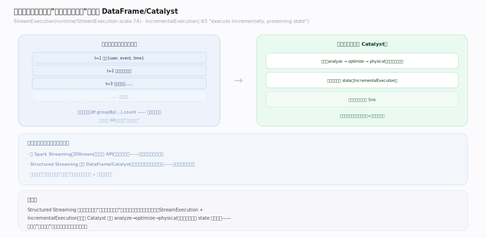
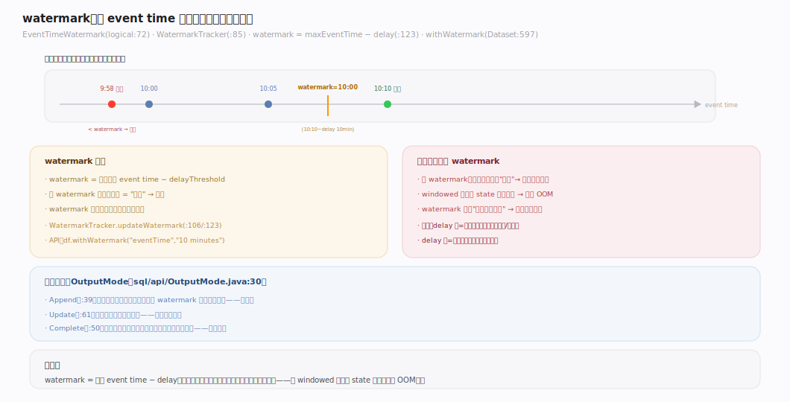

# Spark 原理 · 支撑主线 · Structured Streaming

> **定位**：Structured Streaming 是流式能力域，把无界流建模为"不断增长的表"，复用 DataFrame/Catalyst；骨架 = `micro-batch(默认)/continuous → 增量执行 → state 管理 → checkpoint+WAL 保 exactly-once`。上承 **编程接口层**（DataFrame 流式扩展）、**Catalyst**，下依 **容错**（checkpoint）。核实基准：`~/workdir/spark/sql/core/.../execution/streaming/`（master，post-4.0，已重构为 runtime/checkpointing/continuous/state 等子目录）。

## 一、流即无界表：与批统一

图示核心抽象：**流 = 不断追加行的无界表**，写的查询与批一模一样，引擎负责增量执行。骨架 `StreamExecution`（`runtime/StreamExecution.scala:74`）＋ `IncrementalExecution`（`:65`）**每批复用 Catalyst 的 analyze→optimize→physical，带上一批 state** ——这就是"流批一体"：写批的代码、跑流的语义。

---

## 二、micro-batch 执行模型

图示默认的 **micro-batch** 驱动循环：`MicroBatchExecution.runActivatedStream`（`runtime/MicroBatchExecution.scala:625`）经 `triggerExecutor.execute`（`:634`）每次触发一批、`runBatch`（`:1055`）执行；trigger（`getTrigger:147`）决定节奏——默认尽快连跑、固定间隔、或 `Trigger.Once`。**关键不变量**：延迟百毫秒~秒级，是"小批足够小≈实时"的折衷，非真正逐条。

---

## 三、state 管理与有状态算子

图示**有状态算子**（聚合、去重、stream-stream join、`[flat]MapGroupsWithState`）跨批把中间态存入 `StateStore`（`streaming/state/StateStore.scala:285`），按 `shuffle.partitions`（默认 200）分区、每分区一个 store。两种后端：默认 `HDFSBackedStateStoreProvider`（`:72`，内存＋HDFS 快照），大状态换 `RocksDBStateStoreProvider`（`:41`，落本地盘减 GC）。**关键负担**：状态须随 checkpoint 持久化才能故障恢复（见下节）。

---

## 四、exactly-once：checkpoint + WAL + 幂等 sink

图示 **exactly-once 三件套**：① 可重放 source ＋ offset WAL——`OffsetSeqLog`（`streaming/checkpointing/OffsetSeqLog.scala:54`）批前预写这批的 offset 范围；② 有状态算子的 state 随批 checkpoint；③ 幂等/事务 sink ＋ `CommitLog`（`:51`）批成功后记提交。checkpoint 目录 `offsets/ commits/ state/ metadata/`（`StreamingCheckpointConstants.scala:21-24`）。**恢复不变量**：已 commit 批跳过、未 commit 从上次 offset 重放，配幂等 sink 即"恰好一次"——与批的纯 lineage 重算是两套机制（见 [[容错]]）。

---

## 深化 · watermark 与迟到数据

图示 **watermark** 解决"窗口状态留多久"：`watermark = 已见最大 event time − delayThreshold`（`WatermarkTracker.scala:123`，逻辑节点 `EventTimeWatermark.scala:72`，API `df.withWatermark`，`Dataset.scala:597`）。比 watermark 旧的数据判为"太迟"丢弃、其之前的窗口状态可清理——**有界状态的关键**（否则 windowed 聚合 state 永久膨胀 OOM）。输出模式 `OutputMode`（`sql/api/.../OutputMode.java:30`）：Append（只输出不再变的行）/ Update / Complete，依算子而定。

---

## 拓展 · 流式边界

| 类别 | 项 | 说明 |
|---|---|---|
| 执行引擎 | micro-batch（默认）/ continuous | 后者实验性、低延迟 |
| 有状态算子 | 聚合/去重/join/mapGroupsWithState | 需 StateStore |
| 状态后端 | HDFSBacked（默认）/ RocksDB | 大状态用 RocksDB |
| 一致性 | exactly-once | offset WAL + state ckpt + 幂等 sink |
| 时间语义 | event time + watermark | 处理乱序/迟到，界定状态清理 |
| 输出模式 | Append / Update / Complete | 依算子而定 |
| trigger | ProcessingTime / Once / Continuous | 批触发节奏 |

---

## 调优要点（关键开关）

- `spark.sql.shuffle.partitions`：流式 state 也按它分区（默认 200）——**流式启动后改它会破坏 state 恢复**，须谨慎、最好一开始定好。
- `spark.sql.streaming.stateStore.providerClass`：状态后端（默认 HDFSBacked）——大状态换 RocksDB。
- `withWatermark`：设水位线容忍迟到多久——权衡"接受迟到数据" vs "状态大小/延迟"。
- Trigger：`ProcessingTime("N seconds")` 定批间隔；`Once`/`AvailableNow` 跑一次；不设=尽快。
- checkpointLocation：必设且**稳定持久**（HDFS/对象存储）——换目录 = 丢状态。

---

## 常见误区与工程要点

- **不设 checkpointLocation 或用临时目录**：故障无法恢复、无法 exactly-once；必须设稳定持久目录。
- **有状态查询不设 watermark**：windowed 聚合/去重的 state 无限增长 → 最终 OOM；设 watermark 界定状态清理。
- **流式运行中改 shuffle.partitions**：state 按分区存，改分区数破坏恢复；一开始定好。
- **以为 continuous 是默认**：默认是 micro-batch（百毫秒~秒级）；continuous 实验性、限制多，多数场景 micro-batch 足够。
- **把批的 checkpoint 概念套到流**：批 checkpoint 是截断 lineage（可选）；流 checkpoint 是 exactly-once 的必需基础设施，两回事。

---

## 源码锚点（master, post-4.0)

| 结构 / 方法 | 位置 | 职责 |
|---|---|---|
| StreamExecution | `execution/streaming/runtime/StreamExecution.scala:74` | 流查询执行基类 |
| MicroBatchExecution | `execution/streaming/runtime/MicroBatchExecution.scala:60` | 微批引擎 |
| runActivatedStream | `execution/streaming/runtime/MicroBatchExecution.scala:625` | 微批主循环 |
| constructNextBatch | `execution/streaming/runtime/MicroBatchExecution.scala:933` | 定下一批 offset 范围 |
| runBatch | `execution/streaming/runtime/MicroBatchExecution.scala:1055` | 跑一个微批 |
| offsetLog | `execution/streaming/runtime/StreamExecution.scala:174` | WAL:先写待处理 offset |
| commitLog | `execution/streaming/runtime/StreamExecution.scala:176` | 已完成批的提交日志 |
| HDFSMetadataLog | `execution/streaming/checkpointing/HDFSMetadataLog.scala:51` | offset/commit 落 checkpoint |
| StateStore | `execution/streaming/state/StateStore.scala:285` | 有状态算子的版本化状态 |

---

## 一句话总纲

**Structured Streaming 把无界流建模为"不断增长的表"、复用 DataFrame/Catalyst：默认 micro-batch 把流切成小批增量执行（百毫秒~秒级），有状态算子的中间态存 StateStore（HDFSBacked 默认 / RocksDB 大状态）；exactly-once 靠 offset WAL（OffsetSeqLog）+ state checkpoint + 幂等 sink（CommitLog）三件套；watermark 用 event time 界定迟到数据丢弃与状态清理，让 windowed 聚合的 state 有界。它是"流批一体"的落地——写批的代码，跑流的语义。**
