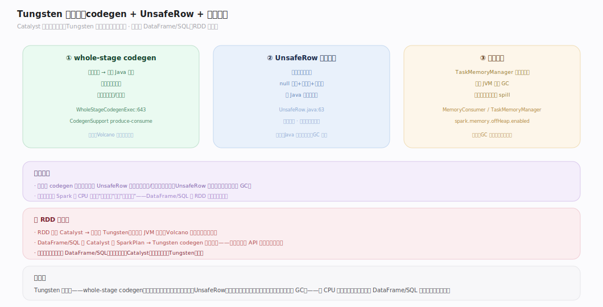
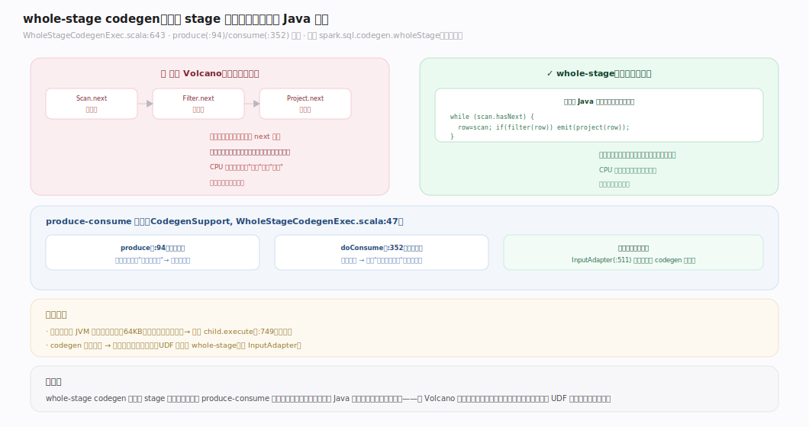
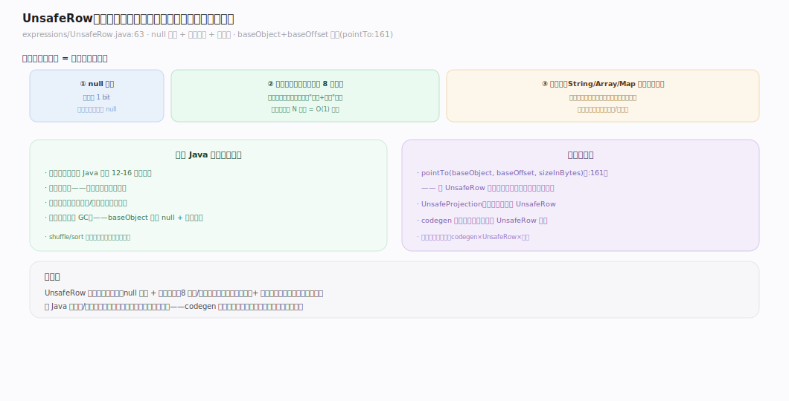
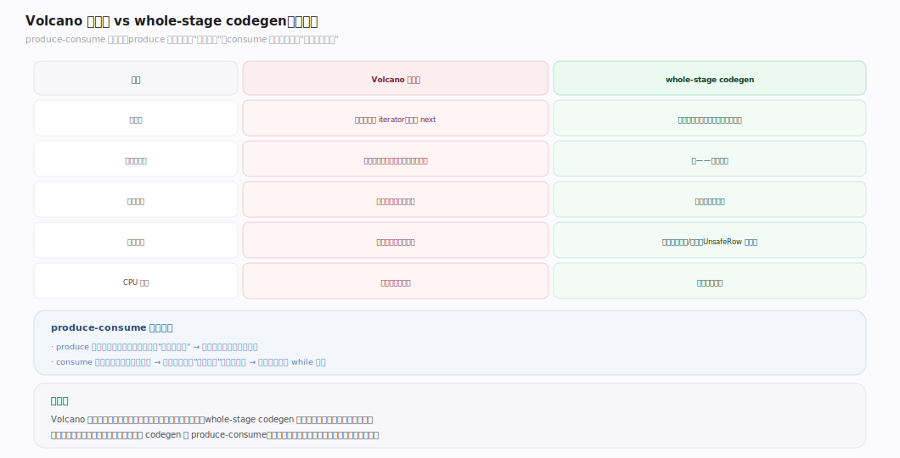

# Spark 原理 · 支撑主线 · Tungsten 代码生成

> **定位**：Tungsten 是计算·规划能力域，把物理算子编译成 JVM 字节码消除虚函数开销；骨架 = `whole-stage codegen + 二进制行（UnsafeRow）+ 堆外内存`。上承 **Catalyst** 物理计划，下接 **执行模型**、与 **内存管理** 协作。核实基准：`~/workdir/spark/sql/core/.../execution`（master，post-4.0）。

## 一、Tungsten 三支柱

Catalyst 产出物理计划后，Tungsten 让它跑得更快，三支柱：**whole-stage codegen**（把一串算子编译成一个 Java 函数，消除虚函数调用）、**UnsafeRow**（紧凑二进制行格式，堆外可存、免对象开销）、**堆外内存**（`TaskMemoryManager` 直接管字节、绕开 JVM GC）。三者共同把 Spark 的 CPU 效率推近手写代码——这是 DataFrame/SQL 比 RDD 快的执行期来源（RDD 不经 Tungsten）。

---

## 二、whole-stage codegen：一个 stage 编译成一个函数

传统 **Volcano 模型**：每个算子是一个迭代器，逐行 `next` 调用，虚函数开销大、CPU 分支预测差。**whole-stage codegen**（`WholeStageCodegenExec.scala:643`）把一个 stage 内的连续算子融合成**一个生成的 Java 函数**，通过 `CodegenSupport`（`:47`）的 **produce-consume 模型**：`produce`（`:94`）自顶向下驱动、`doConsume`（`:352`）自底向上生成处理每行的内联代码。没有虚函数、没有迭代器边界，数据在寄存器/栈上流转。codegen 失败则回落 `child.execute`（`:749`）；codegen 边界插 `InputAdapter`（`:511`）。开关 `spark.sql.codegen.wholeStage`（默认开）。

---

## 三、UnsafeRow：紧凑二进制行格式

`UnsafeRow`（`expressions/UnsafeRow.java:63`）是 Spark 的堆外二进制行：布局 = **null 位图 + 固定长度值区（每字段 8 字节）+ 变长区**（`:55-58`）。它通过 `baseObject + baseOffset` 寻址（`pointTo`，`:161`），可存堆内数组或堆外内存。好处：免 Java 对象头开销、缓存友好、可直接在字节上比较/哈希（免反序列化）。`UnsafeProjection` 把普通行转成 UnsafeRow。这与 codegen 配合——生成的代码直接操作 UnsafeRow 字节。

---

## 深化 · Volcano 模型 vs whole-stage 的对比

| 维度 | Volcano 迭代器 | whole-stage codegen |
|---|---|---|
| 算子间 | 每算子一个 iterator，逐行 next | 融合成一个函数，行在函数内流转 |
| 虚函数 | 每行每算子一次虚调用 | 无——内联展开 |
| 分支预测 | 差（虚调用难预测） | 好（直线代码） |
| 中间数据 | 行对象在算子间传递 | 数据在寄存器/栈上 |
| CPU 效率 | 受解释开销限制 | 接近手写代码 |

produce-consume 是理解 codegen 的钥匙：`produce` 自上而下问"你要数据吗"，`consume` 自下而上生成"拿到一行怎么处理"，最终拼成一个紧凑循环。

---

## 拓展 · codegen 边界与回退

| 情形 | 处理 |
|---|---|
| 算子支持 codegen | 融进 whole-stage 函数 |
| 算子不支持（如某些 UDF） | `InputAdapter` 隔断，退回迭代器 |
| 生成代码超 JVM 方法大小限制（64KB） | 回落 `child.execute`（:749） |
| codegen 编译失败 | 同上回落，保正确性 |

---

## 调优要点（关键开关）

- `spark.sql.codegen.wholeStage`：whole-stage codegen（默认开）——除非调试，勿关。
- `spark.sql.codegen.maxFields`：单个 codegen 支持的最大字段数（超了退回）。
- `spark.memory.offHeap.enabled` / `spark.memory.offHeap.size`：启用堆外内存（默认关；开了 UnsafeRow/execution 用堆外，减 GC）。
- `spark.sql.codegen.hugeMethodLimit`：生成方法字节码大小上限（超 64KB 类退回）。

---

## 常见误区与工程要点

- **以为 Tungsten 对 RDD 生效**：RDD 不过 Catalyst，也就不经 Tungsten codegen；只有 DataFrame/SQL 享受。
- **codegen 一定更快**：绝大多数场景是；但生成代码超方法大小限制会回落迭代器——超宽表（几百列）可能触发，看 explain 里有无 `WholeStageCodegen` 节点。
- **不开堆外内存**：堆外内存减 GC 压力，大 shuffle/聚合场景值得开；默认关是为兼容。
- **UDF 打断 codegen**：Scala/Python UDF 常无法 codegen，会插 InputAdapter 打断 whole-stage——热路径避免不必要 UDF。

---

## 源码锚点（master, post-4.0)

| 结构 / 方法 | 位置 | 职责 |
|---|---|---|
| WholeStageCodegenExec | `execution/WholeStageCodegenExec.scala:643` | 融合一 stage 算子为一个函数 |
| CodegenSupport | `execution/WholeStageCodegenExec.scala:47` | 支持 codegen 的算子 trait |
| produce | `execution/WholeStageCodegenExec.scala:94` | 自顶向下驱动生成 |
| doConsume | `execution/WholeStageCodegenExec.scala:352` | 自底向上生成处理每行 |
| InputAdapter | `execution/WholeStageCodegenExec.scala:511` | codegen 边界隔断 |
| doExecute（回落） | `execution/WholeStageCodegenExec.scala:526` | 编译/生成失败退迭代器 |
| child.execute() | `execution/WholeStageCodegenExec.scala:749` | 超 64KB 回落 |
| UnsafeRow | `expressions/UnsafeRow.java:63` | 堆外二进制行 |
| UnsafeRow.pointTo | `expressions/UnsafeRow.java:161` | baseObject+offset 寻址 |
| CodegenContext | `expressions/codegen/CodeGenerator.scala:137` | codegen 上下文 |
| BufferedRowIterator | `execution/BufferedRowIterator.java:33` | 生成类的父类 |
| SparkPlan.execute / doExecute | `execution/SparkPlan.scala:197` / `:343` | 物理算子执行入口 |

---

## 一句话总纲

**Tungsten 是 Spark 的执行期加速器：whole-stage codegen 把一个 stage 的连续算子（经 produce-consume 模型）融合成一个无虚函数调用的 Java 函数，UnsafeRow 用紧凑二进制行免对象开销、堆外内存绕开 GC——三者把 CPU 效率推近手写代码；只服务过 Catalyst 的 DataFrame/SQL（RDD 不经 Tungsten），codegen 失败或超方法大小限制则安全回落迭代器。**
