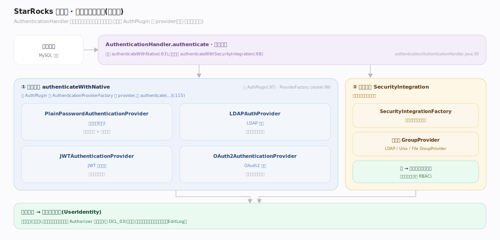
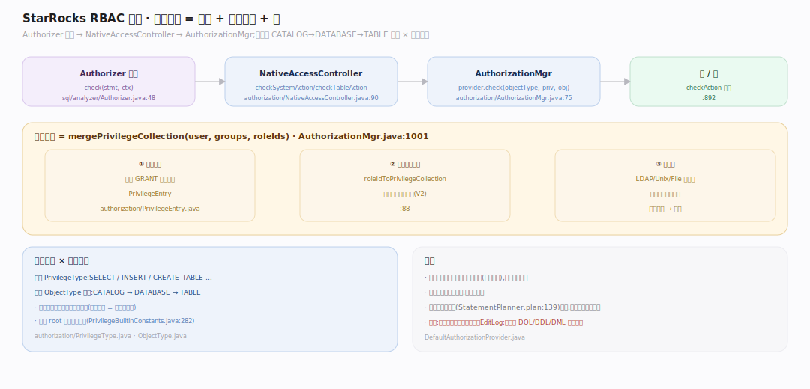
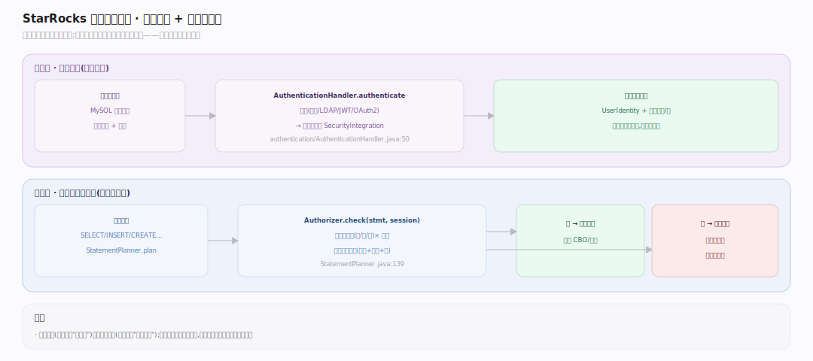

# StarRocks 原理 · 接口主线 · DCL 数据控制

> **定位**：属"接触面主线"(用户可见),横切所有主线。管认证(你是谁)与授权(你能做什么)——可插拔认证 + RBAC 权限模型。鉴权在【DQL】/【DDL】/【DML】规划阶段被调用;权限元数据落【元数据】。是多租户安全的守门人。源码基准 **StarRocks 3.x**(`fe/.../authentication/`、`fe/.../authorization/`、`fe/.../sql/analyzer/Authorizer.java`)。

安全分两层:**认证**(Authentication,验明身份——密码/LDAP/JWT/OAuth2)与**授权**(Authorization,检查权限——RBAC)。二者都可插拔,且授权在语句规划阶段统一经 `Authorizer` 门面拦截,不过关就不生成执行计划。

---

## 一、认证：可插拔身份验证

`AuthenticationHandler.authenticate`(`fe/.../authentication/AuthenticationHandler.java:50`)先试**原生认证** `authenticateWithNative`(`:63`)再试**安全集成** `authenticateWithSecurityIntegration`(`:68`)。原生按 `AuthPlugin`(`:97`)经 `AuthenticationProviderFactory.create`(`:98`)选 provider 再 `authenticate(...)`(`:115`)。

支持的认证 provider(`fe/.../authentication/`):
- `PlainPasswordAuthenticationProvider`(密码)
- `LDAPAuthProvider`(LDAP)
- `JWTAuthenticationProvider`(JWT)
- `OAuth2AuthenticationProvider`(OAuth2)

外部集成 `SecurityIntegration` + `SecurityIntegrationFactory` 可插拔接入企业身份源;组信息由 `LDAPGroupProvider`/`UnixGroupProvider`/`FileGroupProvider` 提供。

---

## 二、授权：RBAC 权限模型

授权门面 **Authorizer**(`fe/.../sql/analyzer/Authorizer.java:48`):`check(stmt, ctx)`(`:59`)跑权限检查 AST 访问器,`checkSystemAction`/`checkTableAction` 路由到对应 catalog 的 `AccessController`。它在规划阶段(`StatementPlanner.java:139`)与 `StmtExecutor`(`:823`)被调。

原生控制器 **NativeAccessController**(`fe/.../authorization/NativeAccessController.java`):`checkTableAction`(`:90`)调 `manager.provider.check(objectType, privilegeType, object, collection)`(`:298`)。RBAC 存储 **AuthorizationMgr**(`fe/.../authorization/AuthorizationMgr.java:75`)持 `AuthorizationProvider` + `Map<Long, RolePrivilegeCollectionV2>`(角色→权限集,`:88`)。检查 `checkAction`(`:892`)在 `mergePrivilegeCollection(user, groups, roleIds)`(`:1001`)合并出的权限集上判定——**用户的有效权限 = 直授 + 所有激活角色 + 组**。

权限模型(`authorization/PrivilegeType.java`):`INSERT`/`SELECT`/`CREATE_TABLE`… × 对象类型(`ObjectType.java`:CATALOG/DATABASE/TABLE/…),条目 `PrivilegeEntry`,内置 root 角色(`PrivilegeBuiltinConstants.java:282`)。

---

## 三、认证 + 授权的完整链路

一次带安全的请求:**连接建立** → AuthenticationHandler 验身份(原生密码 / LDAP / JWT / OAuth2)→ 建立会话身份 → **每条语句规划时** Authorizer.check 按语句涉及的对象(库/表/列)与动作(SELECT/INSERT/…)查有效权限集 → 过则生成计划、否则抛权限错误。认证一次(连接期),授权每条语句(规划期)——粒度不同、职责分离。

---

## 拓展 · DCL 关键结构一览

| 结构 | 定义 | 职责 |
|---|---|---|
| AuthenticationHandler | `authentication/AuthenticationHandler.java:50` | 认证入口(原生+集成) |
| AuthenticationProviderFactory | `authentication/` | 按 AuthPlugin 选 provider |
| Authorizer | `sql/analyzer/Authorizer.java:48` | 授权门面 |
| NativeAccessController | `authorization/NativeAccessController.java:90` | 原生权限检查 |
| AuthorizationMgr | `authorization/AuthorizationMgr.java:75` | RBAC 存储(角色→权限) |
| PrivilegeType | `authorization/PrivilegeType.java` | 权限类型枚举 |
| SecurityIntegration | `authentication/` | 可插拔外部身份集成 |

## 调优要点（关键开关）

- **认证插件**:按需配 LDAP/JWT/OAuth2 接企业身份源;`SecurityIntegration` 可组合多源。
- **角色设计**:用角色聚合权限、给用户授角色(而非直授),便于批量管理;可设默认激活角色。
- **对象层级授权**:CATALOG→DATABASE→TABLE 层级授权,上层授权可覆盖下层批量对象。
- **root 角色**:内置最高权限(`PrivilegeBuiltinConstants.java:282`),生产环境谨慎使用、最小授权。

## 常见误区与工程要点

- **误区:认证和授权一回事。** 认证验"你是谁"(连接期一次),授权查"你能干啥"(每语句规划期),两层分离。
- **误区:权限在执行时检查。** 授权在规划阶段 `StatementPlanner.plan` 就做(`:139`),不过关不生成计划——省得白执行。
- **误区:用户权限就是直授的那些。** 有效权限是"直授 + 激活角色 + 组"的合并(`mergePrivilegeCollection`),别只看直授。
- **误区:只能用密码认证。** 可插拔:LDAP/JWT/OAuth2 + 企业 SecurityIntegration 都支持。
- **归属提醒**:权限元数据的持久化在【元数据】EditLog;鉴权被【DQL】/【DDL】/【DML】规划调用;它本身横切所有接触面主线。

## 一句话总纲

**StarRocks 安全分两层可插拔机制:认证(AuthenticationHandler 在连接期验身份,原生密码 + LDAP/JWT/OAuth2 + 企业 SecurityIntegration)与授权(Authorizer 门面在每条语句规划阶段拦截,经 NativeAccessController + AuthorizationMgr 的 RBAC 判定);RBAC 的有效权限 = 直授 + 激活角色 + 组的合并(mergePrivilegeCollection),按 CATALOG→DATABASE→TABLE 层级 × 权限类型(SELECT/INSERT/…)检查——认证一次、授权每语句,职责分离且不过关就不生成执行计划。**
