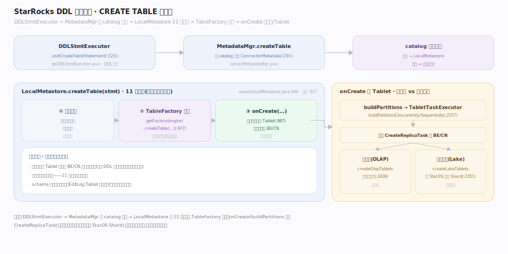
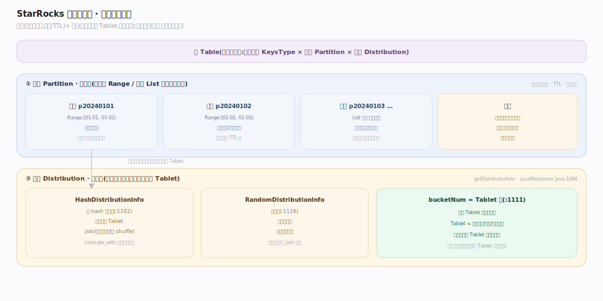
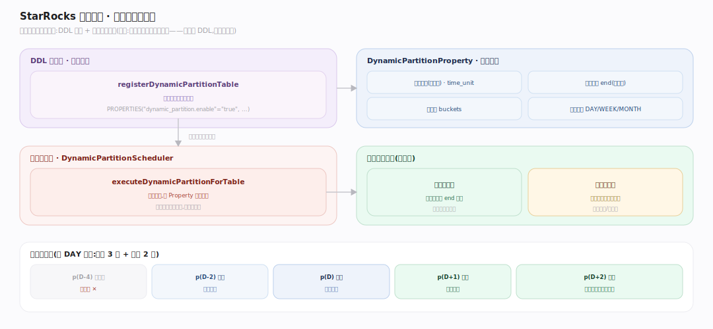

# StarRocks 原理 · 接口主线 · DDL 数据定义

> **定位**：属"接触面主线"(用户可见)。管建库、建表、改 schema 等数据定义——分区(Partition)、分桶(Distribution)、动态分区、本地表 vs 云原生表的建表分叉。DDL 的执行结果落进【元数据】(EditLog),Tablet 创建下发到 BE/CN(【集群管理】),schema 变更触发【后台任务】。源码基准 **StarRocks 3.x**(`fe/.../qe/DDLStmtExecutor.java`、`fe/.../server/LocalMetastore.java`)。

DDL 是"定义数据长什么样"的语句族。StarRocks 的建表要同时定三件事:**数据模型**(KeysType,见存储引擎篇)、**分区**(按范围/列表切大块)、**分桶**(按 hash/random 切 Tablet)。内部表建表最终落到 `LocalMetastore`,按引擎类型(本地 OLAP / 云原生 Lake)分派工厂创建。

---

## 一、DDL 执行链路

一条 `CREATE TABLE` 的旅程:`DDLStmtExecutor.visitCreateTableStatement`(`fe/fe-core/src/main/java/com/starrocks/qe/DDLStmtExecutor.java:325`)→ `metadataMgr.createTable(context, stmt)`(`:327`)。`MetadataMgr.createTable`(`fe/.../server/MetadataMgr.java:291`)按 catalog 解析 `ConnectorMetadata`:内部 catalog → **LocalMetastore**;外部 catalog → 对应连接器。

核心建表 `LocalMetastore.createTable(stmt)`(`fe/.../server/LocalMetastore.java:946`)是一份 11 步契约(`:927`):配额校验 → `TableFactoryProvider.getFactory(engine).createTable(...)`(`:977`)→ `onCreate(...)`(`:987`)。工厂 `OlapTableFactory` 依模型/引擎产出表对象,`onCreate` 真正建分区与 Tablet。

---

## 二、分区与分桶：两级数据切分

StarRocks 数据切分是两级:

- **分区(Partition)**:粗粒度,按范围(Range,常按日期)或列表(List)把表切成大块——用于分区裁剪、TTL、冷热分层。
- **分桶(Distribution)**:细粒度,把分区内数据按分桶键切成 **Tablet**。`getDistributionInfo`(`LocalMetastore.java:1088`)分两种:`HashDistributionInfo`(`:1102`,按 hash 均匀分,Join/聚合可利用)、`RandomDistributionInfo`(`:1116`,随机分,写更均匀)。bucketNum 决定 Tablet 数与并行度(`:1111`)。

Tablet 创建:`onCreate`(`:2221`)→ `buildPartitions`(`:2113`)→ `TabletTaskExecutor.buildPartitionsConcurrently/Sequentially`(`:2157`)下发 `CreateReplicaTask`。本地表 `createOlapTablets`(`:2436`)绑定本地盘;云原生表 `createLakeTablets`(`:2351`)向 StarOS 申请 Shard。

---

## 三、动态分区：分区的自动滚动

时序表不想手动加分区:开启动态分区后,**DynamicPartitionScheduler**(`fe/.../clone/DynamicPartitionScheduler.java:101`)后台按 `DynamicPartitionProperty`(保留天数、预建天数、分桶数、时间单位)自动加未来分区、删过期分区。建表时 `registerDynamicPartitionTable`(`:130`)登记,周期 `executeDynamicPartitionForTable`(`:356`)执行。属 DDL 定义(建表声明),但滚动动作在【后台任务】。

---

## 拓展 · DDL 关键结构一览

| 结构 | 定义 | 职责 |
|---|---|---|
| DDLStmtExecutor | `qe/DDLStmtExecutor.java:325` | DDL 语句分派 |
| MetadataMgr | `server/MetadataMgr.java:291` | 按 catalog 路由建表 |
| LocalMetastore | `server/LocalMetastore.java:946` | 内部表建表核心(11 步契约) |
| OlapTableFactory | `server/OlapTableFactory.java` | 按模型/引擎造表对象 |
| HashDistributionInfo | `LocalMetastore.java:1102` | hash 分桶 |
| CreateReplicaTask | `LocalMetastore.java:2436` | 下发 BE 建 Tablet 副本 |
| DynamicPartitionScheduler | `clone/DynamicPartitionScheduler.java:101` | 动态分区滚动 |

## 调优要点（关键开关）

- **分区键选择**:选高频过滤列(常为日期),让分区裁剪生效;分区过多增元数据压力,过少限并行。
- **分桶数**:经验值让单 Tablet 数据量在合理区间;过多小 Tablet 拖累元数据与调度。
- **`colocate_with`**:同 colocate 组的表分桶对齐,Join 免 shuffle(由 ColocateTableBalancer 维持)。
- **动态分区**:`dynamic_partition.enable/time_unit/end/buckets` 控自动滚动;冷分区可配存储介质迁移。

## 常见误区与工程要点

- **误区:分区就是分桶。** 分区是粗粒度大块(裁剪/TTL 单位),分桶是分区内的 Tablet 切分(并行/分布单位),两级正交。
- **误区:分桶越多越快。** 过多小 Tablet 元数据与调度开销陡增、且单 Tablet 数据太小反而浪费;要匹配数据量。
- **误区:DDL 是同步立即生效的原子操作。** 建表要下发 Tablet 到多个 BE/CN,是分布式动作;失败会回滚已建部分(11 步契约含清理)。
- **误区:动态分区是运行时特性。** 定义在 DDL(建表声明),但实际增删由后台守护完成。
- **归属提醒**:schema 落点在【元数据】EditLog;Tablet 副本创建/调度在【集群管理】;数据模型语义在【存储引擎】;动态分区滚动在【后台任务】。

## 一句话总纲

**StarRocks 的 DDL 建表同时定三件事——数据模型(KeysType)、分区(Range/List 粗粒度大块,用于裁剪/TTL)、分桶(Hash/Random 把分区切成 Tablet,决定并行度);执行链路 DDLStmtExecutor→MetadataMgr 按 catalog 路由→LocalMetastore 的 11 步契约用 TableFactory 造表、buildPartitions 下发 CreateReplicaTask(本地表绑本地盘、云原生表申请 StarOS Shard);动态分区在 DDL 声明、由后台 DynamicPartitionScheduler 自动滚动。**
