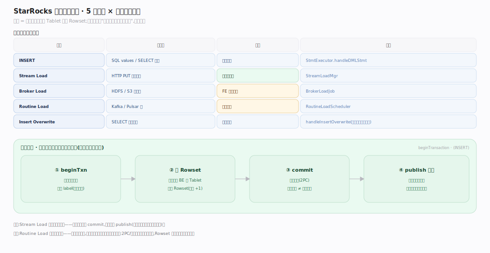
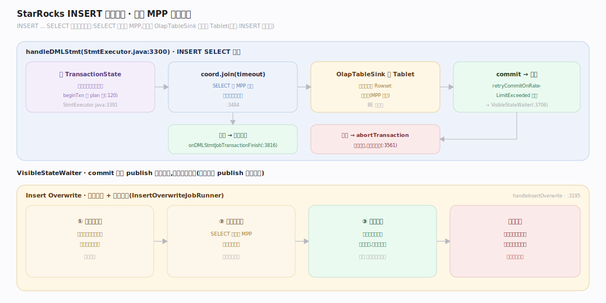
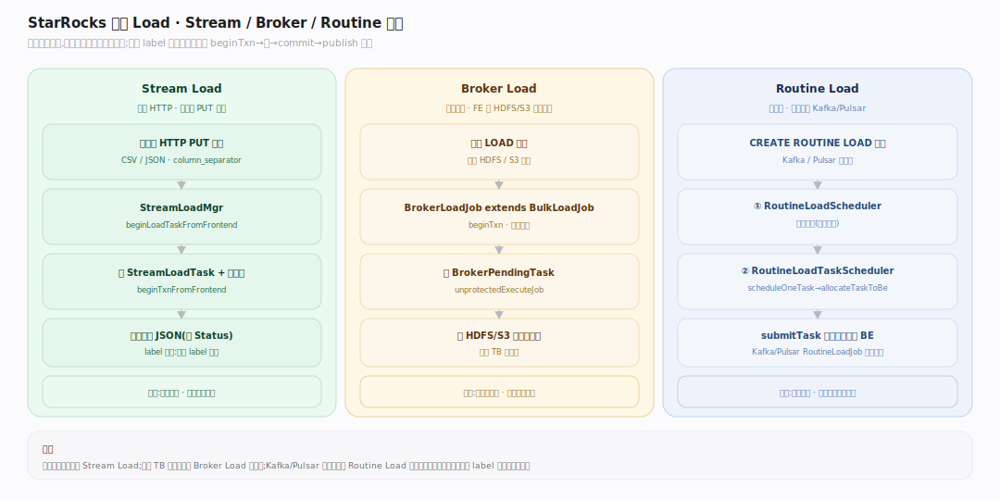

# StarRocks 原理 · 接口主线 · DML 数据操纵

> **定位**：属"接触面主线"(用户可见)。管数据写入——INSERT、Stream Load、Broker Load、Routine Load、Insert Overwrite。每次写入是一个【事务一致性】里的导入事务;数据落进【存储引擎】的 Rowset;版本经 publish 可见。源码基准 **StarRocks 3.x**(`fe/.../qe/StmtExecutor.java`、`fe/.../load/`)。

写入是"把外部数据变成 Tablet 里的 Rowset"。StarRocks 提供多种导入方式适配不同数据源与吞吐,但它们共享同一套骨架:**开启导入事务 → 写入 BE 生成 Rowset → commit → publish 版本可见**(见事务一致性篇)。不同的是数据从哪来、由谁驱动。

---

## 一、写入方式全景

| 方式 | 数据源 | 驱动 | 入口 |
|---|---|---|---|
| **INSERT** | SQL values / SELECT 结果 | 前台查询 | `StmtExecutor.handleDMLStmt`(`StmtExecutor.java:3300`) |
| **Stream Load** | HTTP PUT 一批数据 | 客户端同步 | `StreamLoadMgr`(`load/streamload/StreamLoadMgr.java:69`) |
| **Broker Load** | HDFS/S3 大文件 | FE 拉取异步 | `BrokerLoadJob`(`load/loadv2/BrokerLoadJob.java:108`) |
| **Routine Load** | Kafka/Pulsar 流 | 常驻消费 | `RoutineLoadScheduler`(`load/routineload/RoutineLoadScheduler.java:51`) |
| **Insert Overwrite** | SELECT 结果覆盖 | 前台查询 | `StmtExecutor.handleInsertOverwrite`(`:3195`) |

共性:都先 `beginTransaction`(INSERT 在 `StatementPlanner.plan` 里就开了,`StatementPlanner.java:120`),写完 `commit`,由 publish 守护推到可见。

---

## 二、INSERT 执行路径

`INSERT ... SELECT` 复用查询执行框架:`handleDMLStmt`(`StmtExecutor.java:3300`)拿到规划阶段已开的 `TransactionState`(`:3391`),跑协调器 `coord.join(timeout)`(`:3484`)——SELECT 侧照常 MPP 执行,结果经 OlapTableSink 写进目标表的 Tablet。全部实例完成后 `retryCommitOnRateLimitExceeded` 提交返回 `VisibleStateWaiter`(`:3706`),失败则 `abortTransaction`(`:3561`);收尾回调 `onDMLStmtJobTransactionFinish`(`:3816`)。

**Insert Overwrite** 用临时分区 + 原子替换:先写临时分区,成功后整体换入,失败不影响原数据(`InsertOverwriteJobRunner`)。

---

## 三、Stream / Broker / Routine Load

- **Stream Load**(同步 HTTP):客户端 PUT 一批数据,`StreamLoadMgr.beginLoadTaskFromFrontend`(`StreamLoadMgr.java:172`)建 `StreamLoadTask`、`beginTxnFromFrontend`(`:189`)开事务,同步返回 JSON 看 Status;label 保证幂等(重复 label 拒绝)。
- **Broker Load**(异步拉取):`BrokerLoadJob extends BulkLoadJob`(`BrokerLoadJob.java:108`),`beginTxn`(`:142`)后 `unprotectedExecuteJob` 派 `BrokerPendingTask`(`:176`)从 HDFS/S3 拉大文件,适合 TB 级批量。
- **Routine Load**(常驻流):两个守护——`RoutineLoadScheduler`(`RoutineLoadScheduler.java:51`)调度作业,`RoutineLoadTaskScheduler`(`:77`)`scheduleOneTask → allocateTaskToBe → submitTask`(`:262`)把 Kafka/Pulsar 分区任务分给 BE 持续消费(`KafkaRoutineLoadJob`/`PulsarRoutineLoadJob`)。

---

## 拓展 · DML 关键结构一览

| 结构 | 定义 | 职责 |
|---|---|---|
| StmtExecutor.handleDMLStmt | `qe/StmtExecutor.java:3300` | INSERT/DML 执行 |
| StreamLoadMgr | `load/streamload/StreamLoadMgr.java:69` | Stream Load 管理 |
| BrokerLoadJob | `load/loadv2/BrokerLoadJob.java:108` | Broker Load 作业 |
| RoutineLoadScheduler | `load/routineload/RoutineLoadScheduler.java:51` | Routine Load 调度 |
| RoutineLoadTaskScheduler | `load/routineload/RoutineLoadTaskScheduler.java:77` | 分区任务派发 BE |
| InsertOverwriteJobRunner | `load/InsertOverwriteJobRunner.java` | 覆盖写(临时分区替换) |

## 调优要点（关键开关）

- **label 幂等**:所有导入都用 label 去重;重试复用 label 防重复写。
- **Stream Load 批大小**:单次数据量与 `column_separator`/`format`(CSV/JSON)影响吞吐;JSON 用 `jsonpaths`。
- **Routine Load 并发**:`desired_concurrent_number` × Kafka 分区数决定消费并行;`max_batch_interval/rows` 控每批。
- **导入事务限流**:`retryCommitOnRateLimitExceeded` 在 publish 压力大时退避重试,避免打爆。

## 常见误区与工程要点

- **误区:INSERT 是逐行写。** `INSERT SELECT` 走 MPP 批量执行 + OlapTableSink 批量落 Rowset,不是逐行。
- **误区:Stream Load 返回成功即可见。** 返回成功意味着 commit,可见还需 publish(不开同步发布时有短暂延迟)。
- **误区:Routine Load 是一次性导入。** 它是常驻消费,持续把 Kafka/Pulsar 增量拉进来,由两级调度守护。
- **误区:Insert Overwrite 会先删后写有窗口。** 它用临时分区 + 原子替换,失败不影响原数据、成功瞬时切换。
- **归属提醒**:导入事务的 2PC/版本在【事务一致性】;数据落成 Rowset/Segment 在【存储引擎】;主键模型写入维护索引也在存储引擎;导入方式选择是本主线。

## 一句话总纲

**StarRocks 的 DML 是"把外部数据变成 Rowset"的多种导入方式(INSERT / Stream Load 同步 HTTP / Broker Load 异步拉大文件 / Routine Load 常驻消费 Kafka-Pulsar / Insert Overwrite 临时分区原子替换),但都共享同一骨架——开导入事务→写 BE 生成 Rowset→commit→publish 版本可见;INSERT SELECT 复用 MPP 查询框架经 OlapTableSink 落盘,label 保证幂等去重,可见性由 publish 守护而非 commit 决定。**
