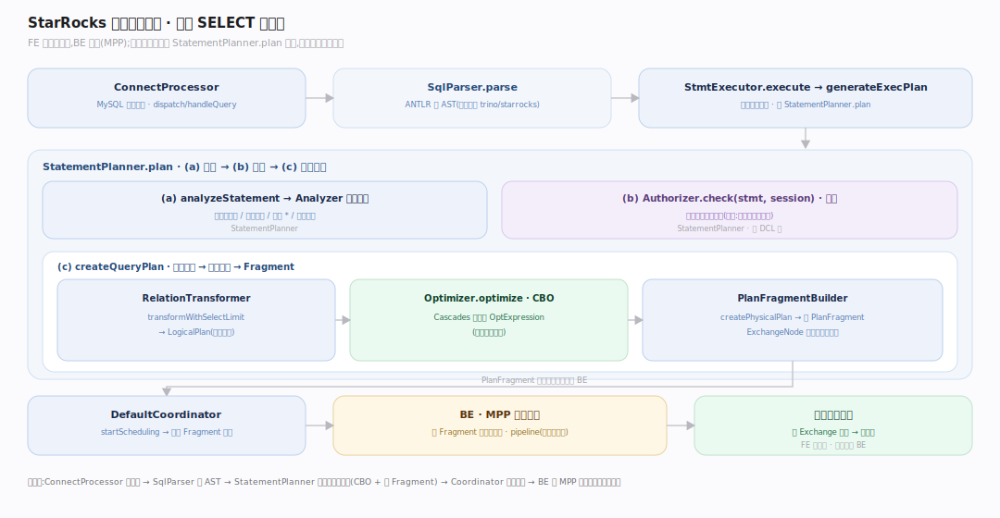
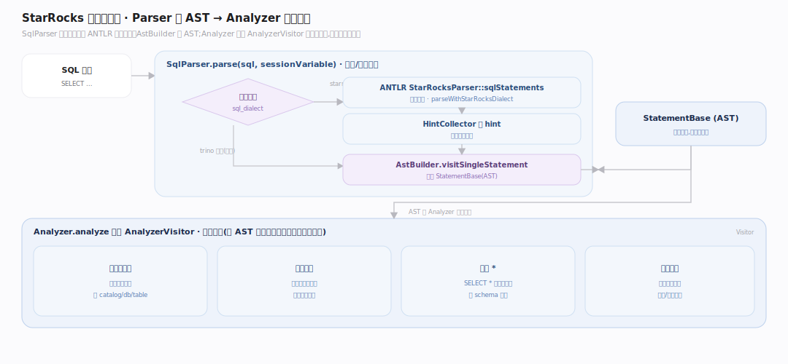
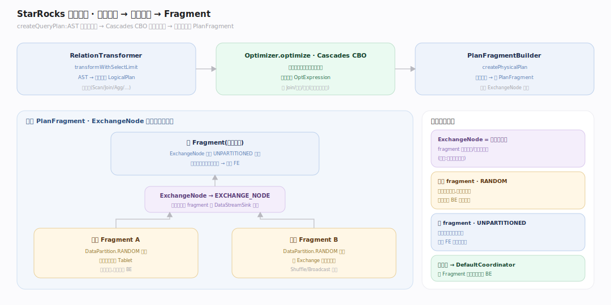
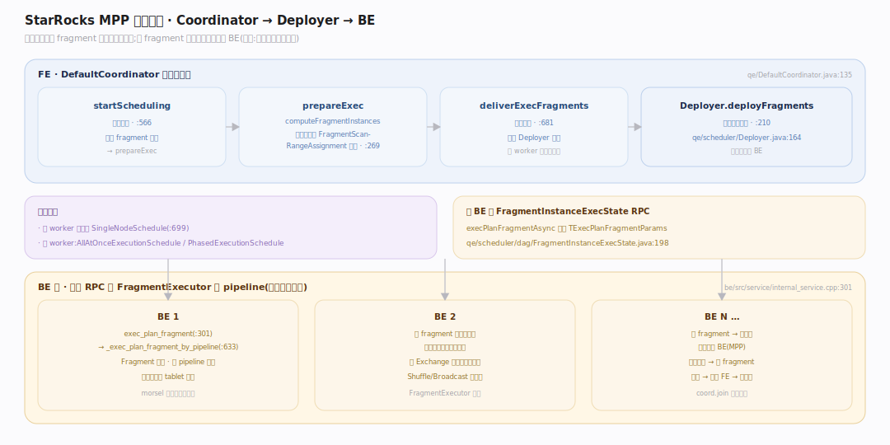

# StarRocks 原理 · 接口主线 · DQL 数据查询

> **定位**：属"接触面主线"(用户可见)。管一条 SELECT 从文本到结果——解析、分析、规划、优化、分布式执行。它调用【优化技术】做 CBO、把物理计划交【执行引擎】跑、读【存储引擎】的数据、经【DCL】鉴权。是引擎最核心的用户接触面。源码基准 **StarRocks 3.x**(`fe/.../sql/`、`fe/.../qe/`)。

一条 SELECT 的一生:**Parser 建 AST → Analyzer 语义分析 → 鉴权 → Transformer 转逻辑计划 → Optimizer 出物理计划 → PlanFragmentBuilder 切 fragment → Coordinator 分发到 BE → MPP 并行执行 → 汇聚返回**。FE 负责规划与协调,BE 负责执行(见执行引擎篇)。

---

## 一、查询执行全景

从连接到结果:`ConnectProcessor` 路由 MySQL 命令 → `handleQuery` 建 `StmtExecutor` → `execute` 的 `generateExecPlan` 调 `StatementPlanner.plan`。FE 侧一条链把文本推进到可执行计划,坐标见深化表。

`StatementPlanner.plan` 三步:(a) `analyzeStatement` 语义分析、(b) `Authorizer.check` 鉴权(不过关不生成计划)、(c) `createQueryPlan` 出物理计划。

---

## 二、解析与分析：Parser → Analyzer

`SqlParser.parse` 按方言分支(trino / starrocks)。StarRocks 路径用 ANTLR `StarRocksParser` 建语法树、`HintCollector` 收 hint、`AstBuilder` 构建 `StatementBase`(AST)。

`Analyzer.analyze` 委托 `AnalyzerVisitor` 做语义分析:解析库表列、类型检查、展开 `*`、绑定函数——把 AST 变成语义完整、可规划的形态。

---

## 三、逻辑计划 → 物理计划 → Fragment

`createQueryPlan` 三步:`RelationTransformer` 把 AST 转逻辑计划 `LogicalPlan`;`Optimizer.optimize`(Cascades CBO,见优化技术篇)产出物理 `OptExpression`;`PlanFragmentBuilder.createPhysicalPlan` 切成 **PlanFragment**——扫描 fragment 用 `DataPartition.RANDOM` 播种,根 fragment 在 `ExchangeNode` 下用 `UNPARTITIONED` 汇聚。`ExchangeNode` 是分布式化的骨架,数据经 `DataStreamSink` 在 fragment 间移动。

---

## 四、MPP 分布式执行：Coordinator 分发

物理计划切成 fragment 后由**协调器**分发:`DefaultCoordinator.startScheduling → prepareExec`(经 `CoordinatorPreprocessor` 算实例、`FragmentScanRangeAssignment` 分派扫描范围)`→ deliverExecFragments`,再由 `Deployer.deployFragments` 异步部署,每 BE 经 `FragmentInstanceExecState` 的 `execPlanFragmentAsync` RPC 下发 `TExecPlanFragmentParams`。

单 worker 有快路径 `SingleNodeSchedule`;多 worker 走 `AllAtOnceExecutionSchedule` / `PhasedExecutionSchedule`。BE 侧 `PInternalServiceImplBase::exec_plan_fragment → _exec_plan_fragment_by_pipeline` 建 `FragmentExecutor`(见执行引擎篇)。

---

## 拓展 · DQL 关键结构一览

| 结构 | 定义 | 职责 |
|---|---|---|
| ConnectProcessor | `qe/ConnectProcessor.java:965` | MySQL 协议命令路由 |
| StmtExecutor | `qe/StmtExecutor.java:922` | 语句执行总控 |
| SqlParser | `sql/parser/SqlParser.java:80` | ANTLR 解析建 AST |
| Analyzer | `sql/analyzer/Analyzer.java:199` | 语义分析 |
| StatementPlanner | `sql/StatementPlanner.java:114` | 分析→鉴权→规划编排 |
| PlanFragmentBuilder | `sql/plan/PlanFragmentBuilder.java:279` | 物理计划→Fragment |
| DefaultCoordinator | `qe/DefaultCoordinator.java:135` | Fragment 分发与协调 |
| Deployer | `qe/scheduler/Deployer.java:164` | 实例异步部署 BE |
| ExchangeNode | `planner/ExchangeNode.java:75` | fragment 间重分布/汇聚骨架 |
| FragmentInstanceExecState | `qe/scheduler/dag/FragmentInstanceExecState.java:198` | 每实例 RPC 下发状态 |
| exec_plan_fragment | `be/src/service/internal_service.cpp:301` | BE 侧 RPC 入口→建 FragmentExecutor |

## 调优要点（关键开关）

- **`pipeline_dop`**:查询并行度(见执行引擎);影响 fragment 实例数。
- **`query_timeout`**:查询超时,`coord.join(timeout)` 等待上限。
- **`enable_profile`**:开 profile 看各 fragment/算子耗时,定位瓶颈。
- **方言** `sql_dialect`:支持 trino 方言解析(`SqlParser` 分支),便于迁移。

## 常见误区与工程要点

- **误区:FE 执行查询。** FE 只规划 + 协调;真正的扫描/Join/聚合在 BE 的 pipeline 里跑。
- **误区:鉴权在执行时才做。** 鉴权在规划阶段 `StatementPlanner.plan` 就 `Authorizer.check`(`:139`),不过关不生成计划。
- **误区:一个查询一个进程。** 一个查询切成多个 fragment、每 fragment 多个实例并行分布在 BE 上(MPP)。
- **误区:ExchangeNode 是可选优化。** 它是分布式化的骨架——数据在 fragment 间的重分布/汇聚都靠它。
- **归属提醒**:CBO 优化在【优化技术】;fragment 在 BE 的执行在【执行引擎】;扫描的数据格式在【存储引擎】;鉴权判定在【DCL】。

## 一句话总纲

**一条 SELECT 在 StarRocks 的一生:ConnectProcessor 收命令→SqlParser(ANTLR)建 AST→Analyzer 语义分析→StatementPlanner 里先 Authorizer 鉴权再规划→RelationTransformer 转逻辑计划→Cascades CBO 出物理计划→PlanFragmentBuilder 切成 PlanFragment(ExchangeNode 做分布式重分布)→DefaultCoordinator 把 fragment 实例经 Deployer 异步 RPC 分发到各 BE→BE 的 pipeline 并行执行、经 Exchange 汇聚返回;FE 只规划与协调,计算全在 BE(MPP)。**
