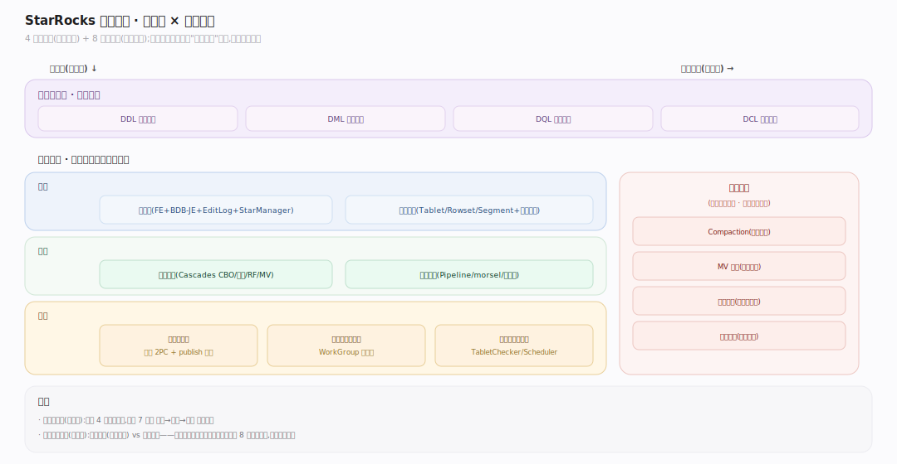
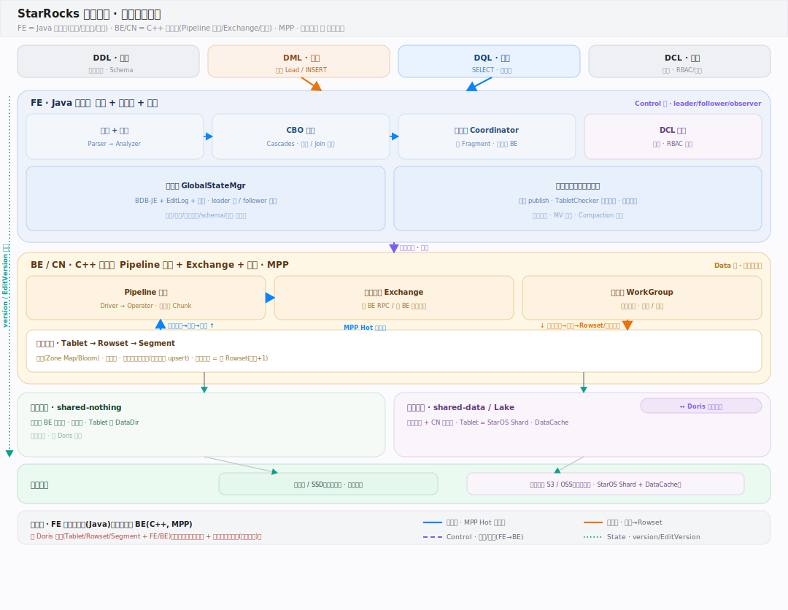
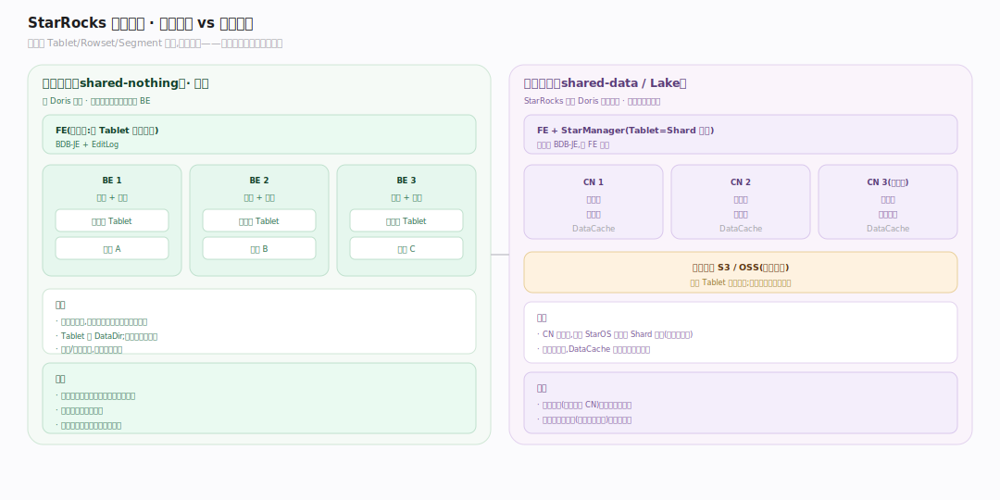
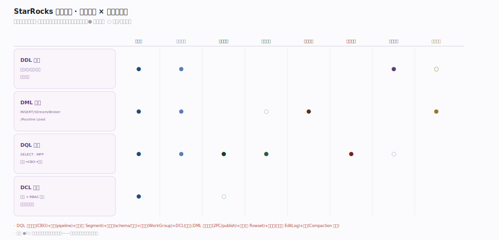
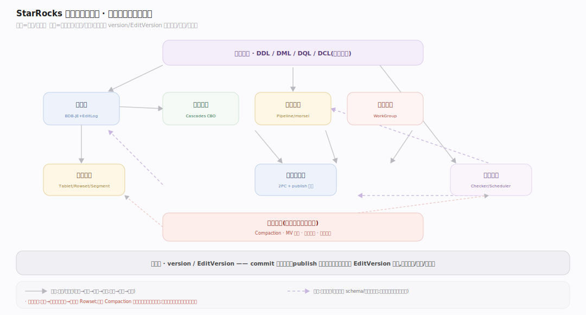

# StarRocks 核心原理 · 全景主线框架

> 统领全部原理文档：StarRocks 的 **4 条接口主线（DDL/DML/DQL/DCL）+ 8 条支撑主线**，既无遗漏也无越界。源码基准 **StarRocks 3.x**（`~/workdir/StarRocks`，git `b2f06e51a37`）。StarRocks 从 Apache Doris fork，属**原型 A：SQL 存算引擎**——但走出两条自己的路：**存算分离（云原生表 / Lake）**与**持久化主键索引**。

## 一、双维模型：能力域 × 执行时机

- **能力域（管什么）**：接口主线（DDL/DML/DQL/DCL）面向用户；支撑侧 7 条能力域面向引擎内部——元数据、存储引擎、优化技术、执行引擎、事务一致性、资源与负载管理、集群管理与自愈。
- **执行时机（何时做）**：前台同步（请求路径）与后台异步（守护线程）。**后台任务**是第 8 条支撑主线，横切承接各能力域的异步部分（Compaction/MV 刷新/动态分区/克隆修复）——是正交的"执行时机"维度，而非又一个能力域。

---

## 二、总架构图

StarRocks 是 **FE（Java，规划+元数据+协调）+ BE/CN（C++，执行+存储）** 的 MPP 架构。总架构图刻意分层：接触面（SQL）→ FE（解析/分析/CBO/协调）→ BE（pipeline 执行）→ 存储（本地 Tablet **或** 对象存储 + StarOS）。存算分离形态下 BE 退化为无状态 **CN**，数据在对象存储、放置交 StarManager。

---

## 二·补　存算分离 vs 存算一体（StarRocks 的分叉）

同一套 Tablet/Rowset/Segment 抽象，两种落地：**存算一体（shared-nothing）** 数据在 BE 本地盘、三副本冗余、Tablet 绑 DataDir；**存算分离（shared-data）** 数据在对象存储、CN 无状态、Tablet=StarOS Shard、靠 DataCache 拉回读延迟。这是理解 StarRocks 3.x 一切主线分叉的总纲。

---

## 三、8 条支撑主线的分层归位

| 层 | 支撑主线 | 一句话职责 |
|---|---|---|
| 底座 | **元数据** | 全局状态持久化与全集群一致（FE + BDB-JE + EditLog；云原生额外 StarManager） |
| 底座 | **存储引擎** | 数据组织/落盘/读取（Tablet→Rowset→Segment；主键索引；本地 + 云原生两形态） |
| 计算 | **优化技术** | 规划期减少"要做的事"（Cascades CBO/统计/Join 重排/RF/MV 改写） |
| 计算 | **执行引擎** | 执行期并行跑（Pipeline/morsel 驱动/向量化 Chunk） |
| 保障 | **事务一致性** | 导入原子可见、读取快照一致（导入事务 2PC + publish 版本） |
| 保障 | **资源与负载管理** | 多租户隔离（WorkGroup 资源组/内存/并发） |
| 保障 | **集群管理与自愈** | 副本健康、数据均匀、高可用（TabletChecker/Scheduler/心跳/上报） |
| 异步 | **后台任务** | 各能力域异步部分的统一载体（Compaction/MV 刷新/动态分区/克隆） |

---

## 四、接触面 × 能力域 依赖矩阵

每个接口主线（DDL/DML/DQL/DCL）实际触达哪些支撑能力域——这是三角一致性的仲裁表。示例：一条 SELECT（DQL）依赖优化技术（CBO）、执行引擎（pipeline）、存储引擎（扫描 Segment）、元数据（schema/统计）、DCL（鉴权）；一次导入（DML）依赖事务一致性（2PC/publish）、存储引擎（写 Rowset）、元数据（版本落 EditLog）、后台任务（Compaction 收尾）。

---

## 五、能力域依赖关系图

实线=调用/数据流，虚线=状态约束。贯穿层：**版本（version / EditVersion）** 横切事务/存储/元数据——commit 预留版本、publish 推进可见、主键模型用 EditVersion 跟踪。

---

## 六、三条贯穿声明（StarRocks 区别于纯查询引擎/Doris 的立身之本）

1. **自管存储 + SQL 接口（原型 A）**：StarRocks 有自己的列式存储（Tablet/Rowset/Segment），不是无状态查询引擎——这决定了它有存储引擎/事务/Compaction 等 Doris 系主线，而非 Trino 式的连接器框架。

2. **存算分离是可选形态而非默认**：云原生表把数据交对象存储、Tablet 交 StarOS、计算用无状态 CN——这是 StarRocks 相对 Doris 最大的架构分叉，让存储与计算独立弹性扩容。理解任一主线都要问"本地表还是云原生表？"。

3. **主键模型用持久化索引把去重挪到写期**：明细/聚合/更新模型读时归并去重，而主键模型用持久化主键索引（内存 L0 + 落盘 L1 的类 LSM）+ 删除向量实现实时 upsert、读时免归并——这是它做实时更新场景的底气。

---

## 七、与参照系引擎的关键差异

| 对比维度 | StarRocks | Doris（同源） | Trino（原型 B） |
|---|---|---|---|
| 存储 | 自管 + **可存算分离** | 自管（存算一体为主） | 无自有存储 |
| 主键 | 持久化主键索引（写期去重） | MoW Delete Bitmap | 无 |
| 优化器 | Cascades CBO | Nereids（Cascades CBO） | 迭代规则 + CBO |
| 执行 | Pipeline + morsel 向量化 | Pipeline + 向量化 | MPP + operator |
| 元数据 | FE+BDB-JE + StarManager（云原生） | FE+BDB-JE | 无持久元数据 |

**一句话定位**：StarRocks 是"Doris 的孪生 + 存算分离 + 持久化主键索引"——同宗的 SQL 存算引擎，在实时更新与云原生弹性两个方向走得更远。
