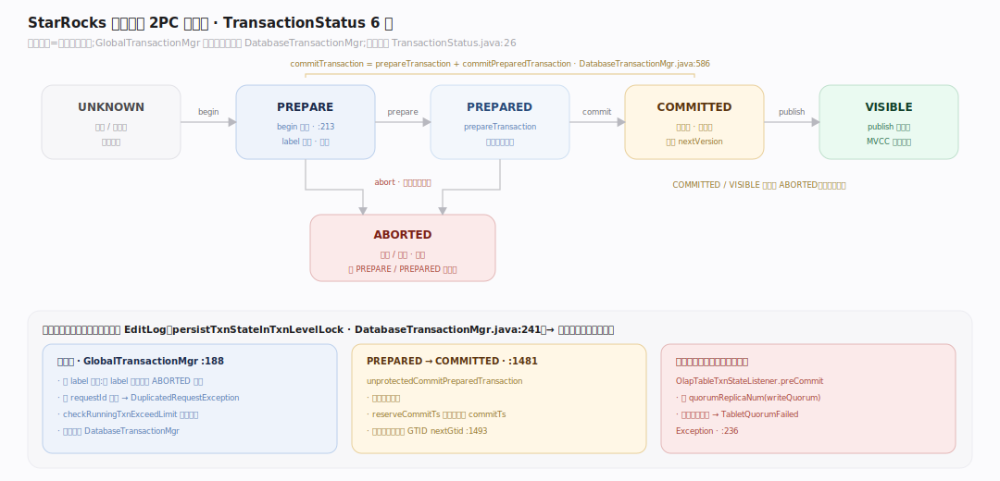
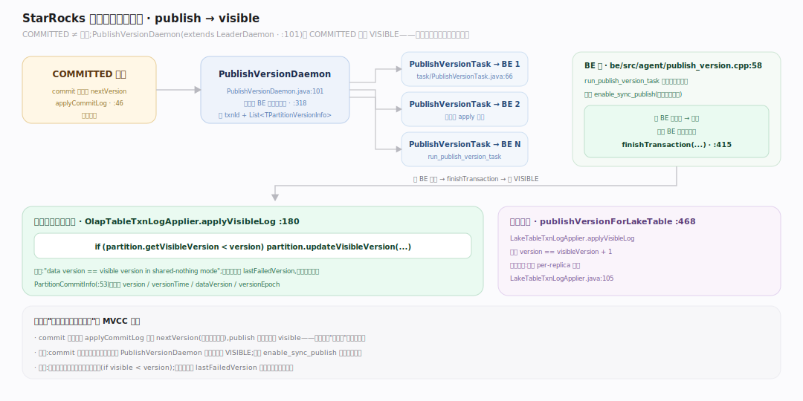
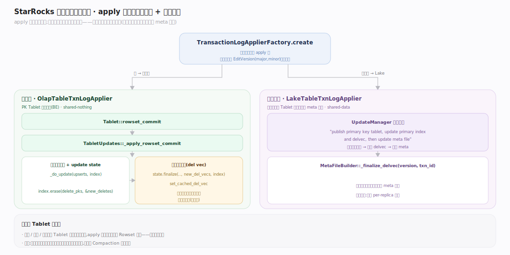

# StarRocks 原理 · 支撑主线 · 事务一致性

> **定位**：属"保障能力域"。管写入的原子可见与读取的快照一致——导入事务的 2PC 状态机、版本发布(publish)、以及主键模型写入时的删除向量维护。被【DML】发起、依赖【元数据】持久化事务状态与版本、驱动【后台任务】的 publish 守护。源码基准 **StarRocks 3.x**(`fe/.../transaction/`、`be/src/storage/tablet_updates.cpp`)。

StarRocks 没有跨表 SQL 事务;它的"事务"是**导入事务**——一次导入(Stream Load / Broker Load / INSERT)作为一个原子单元,要么整批可见要么整批不可见。可见性靠**版本(version)**推进实现 MVCC:每次成功导入让分区版本 +1,读取按可见版本取快照。本地表(shared-nothing)与云原生表(shared-data)两条 apply 路径分开。

---

## 一、导入事务的 2PC 状态机

事务由 **GlobalTransactionMgr** 统管、按库分派给 `DatabaseTransactionMgr`。状态枚举 6 个:`UNKNOWN / PREPARE / PREPARED / COMMITTED / VISIBLE / ABORTED`。一次 `commitTransaction` 内部就是两阶段:先 `prepareTransaction` 再 `commitPreparedTransaction`。

- **begin**:按 label 去重(一个 label 至多一个非 ABORTED 事务;同 requestId 重试返回 `DuplicatedRequestException`),`checkRunningTxnExceedLimit` 限流,持久化 PREPARE。
- **PREPARED→COMMITTED**:`unprotectedCommitPreparedTransaction` 校验状态、`reserveCommitTs` 取严格单调 commitTs、分配全局事务号 GTID。
- **提交时法定副本校验**(本地表):`OlapTableTxnStateListener.preCommit` 算 `quorumReplicaNum`,成功副本不足抛 `TabletQuorumFailedException`。

每次状态变更都在事务级锁内经 `persistTxnStateInTxnLevelLock` 落 EditLog,故障重启可回放到一致点。

---

## 二、版本发布与可见性（publish → visible）

COMMITTED 不等于可见。**PublishVersionDaemon**(`extends LeaderDaemon`)把 COMMITTED 事务推到 VISIBLE:为每个 BE 建一个 `PublishVersionTask`,携带 `transactionId` + `List<TPartitionVersionInfo>`;所有 BE 任务报完成后调 `finishTransaction`。

可见版本只进不退:`OlapTableTxnLogApplier.applyVisibleLog` 仅当 `visibleVersion < version` 才推进(shared-nothing 下 data version == visible version)。commit 阶段先 `applyCommitLog` 预留 `nextVersion`,publish 阶段才让它 visible——**预留在前、可见在后**是 MVCC 关键;`PartitionCommitInfo` 持久化 `version/dataVersion/versionEpoch`。BE 侧 `run_publish_version_task` 按分区应用版本。

云原生表走 `publishVersionForLakeTable` + `LakeTableTxnLogApplier`(断言 `version==visibleVersion+1`,单一真源无需 per-replica 跟踪)。

---

## 三、主键模型的事务路径：删除向量随版本落地

apply 时按表形态路由:`TransactionLogApplierFactory.create` 云原生返回 `LakeTableTxnLogApplier`、否则 `OlapTableTxnLogApplier`。

本地表主键写入(BE):PK Tablet 经 `Tablet::rowset_commit → TabletUpdates::_apply_rowset_commit`:载入 update state + 主键索引,`_do_update(upserts, index)` 与 `index.erase(delete_pks, &new_deletes)`,经 `state.finalize` 产出**删除向量**并 `set_cached_del_vec`。非主键(明细/聚合/更新)Tablet 不维护主键索引,只是加入已提交的 Rowset。主键版本用 **EditVersion**(major, minor)单独跟踪。

云原生表:删除向量按 Tablet 版本化写进 meta 文件(`MetaFileBuilder::_finalize_delvec`),由 `UpdateManager` 统一处理("publish primary key tablet, update primary index and delvec, then update meta file")。

---

## 深化 · 源码坐标（BE 写入 / apply 路由）

| 结构 | 定义 | 职责 |
|---|---|---|
| DatabaseTransactionMgr | `transaction/DatabaseTransactionMgr.java:586` | commitTransaction=prepare+commitPrepared |
| TransactionLogApplierFactory | `transaction/TransactionLogApplierFactory.java:22` | 按表形态选 applier |
| run_publish_version_task | `be/src/agent/publish_version.cpp:58` | BE 侧按分区应用版本 |
| Tablet::rowset_commit | `be/src/storage/txn_manager.cpp:386` | PK Tablet 提交入口 |
| _apply_rowset_commit | `be/src/storage/tablet_updates.cpp:1305` | 主键 upsert/erase 产删除向量 |
| EditVersion 跟踪 | `be/src/storage/tablet_updates.cpp:140` | 主键版本 (major,minor) |
| MetaFileBuilder::_finalize_delvec | `be/src/storage/lake/meta_file.h:145` | 云原生删除向量随版本落 meta |
| UpdateManager | `be/src/storage/lake/update_manager.h:90` | 云原生主键 publish 统一处理 |

## 拓展 · 事务关键结构一览

| 结构 | 定义 | 职责 |
|---|---|---|
| GlobalTransactionMgr | `transaction/GlobalTransactionMgr.java:188` | 事务总入口,按库分派 |
| TransactionStatus | `transaction/TransactionStatus.java:26` | 6 态:PREPARE/PREPARED/COMMITTED/VISIBLE/ABORTED/UNKNOWN |
| PublishVersionDaemon | `transaction/PublishVersionDaemon.java:101` | COMMITTED → VISIBLE 的发布守护 |
| PublishVersionTask | `task/PublishVersionTask.java:66` | 每 BE 一个发布任务 |
| OlapTableTxnLogApplier | `transaction/OlapTableTxnLogApplier.java:180` | 本地表 commit/visible 日志应用 |
| LakeTableTxnLogApplier | `transaction/LakeTableTxnLogApplier.java:105` | 云原生表日志应用 |

## 调优要点（关键开关）

- **写入法定数** `writeQuorum`:MAJORITY(默认)/ALL/ONE,决定提交需多少副本成功——权衡可用性与一致性。
- **事务并发限制** `checkRunningTxnExceedLimit`:每库运行中事务数上限,导入洪峰时会拒绝(`DatabaseTransactionMgr.java`)。
- **同步发布** `enable_sync_publish`:开启后 commit 同步等 publish 完成再返回,写后立即可读,代价是写延迟增加(主键模型常用)。
- **label 幂等**:同 label 重复导入被拒,是导入去重的基础;重试务必复用 label + requestId。

## 常见误区与工程要点

- **误区:commit 成功就能读到。** 不。COMMITTED 只预留了版本号,要等 PublishVersionDaemon 把版本推到 VISIBLE 才可见;不开 `enable_sync_publish` 时有短暂延迟。
- **误区:StarRocks 有跨表 ACID 事务。** 没有。事务粒度是"一次导入",跨表原子性不保证。
- **误区:主键删除立刻从磁盘消失。** 只在删除向量位图打标,旧行由 Compaction 惰性回收。
- **误区:版本会回退。** 可见版本严格只增(`if (visible < version)`);失败副本用 `lastFailedVersion` 记录、后续克隆修复。
- **归属提醒**:事务状态/版本的持久化落点在【元数据】EditLog;删除向量的物理结构在【存储引擎】;publish 是【后台任务】守护;导入入口在【DML】。

## 一句话总纲

**StarRocks 的"事务"是导入事务:一次导入作为原子单元走 2PC(PREPARE→PREPARED→COMMITTED→VISIBLE),commit 阶段预留分区版本号、publish 守护(PublishVersionDaemon)把版本推到所有 BE 后才 VISIBLE——可见版本严格只增,这就是它 MVCC 的本质;主键模型在 apply 时额外维护持久化主键索引并把被覆盖行记进删除向量(本地表缓存、云原生表落 meta 文件),把去重从读期挪到写期;所有状态变更都落 EditLog,故障可回放。**
