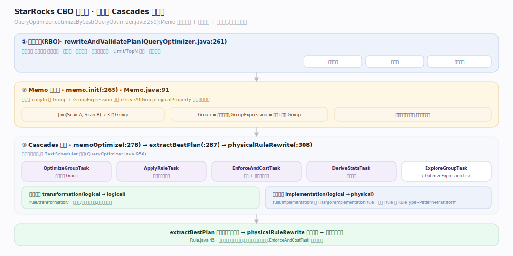
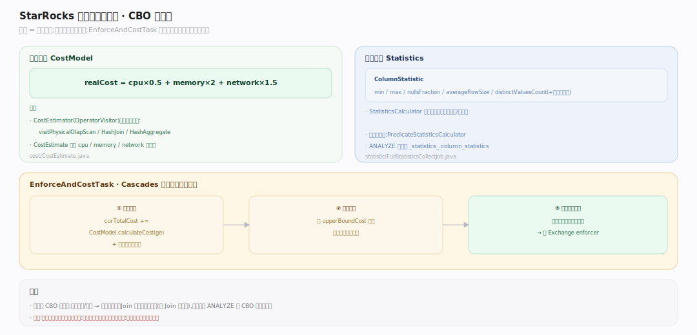
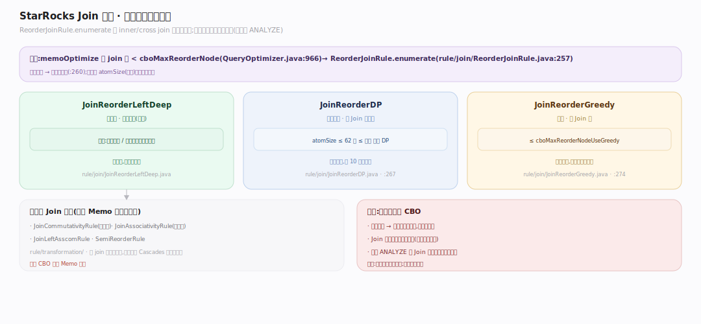
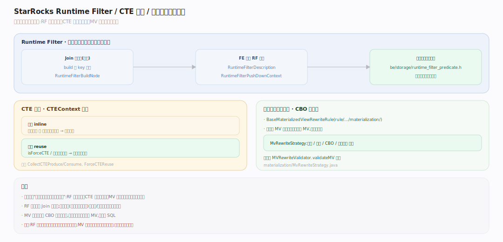

# StarRocks 原理 · 支撑主线 · 优化技术

> **定位**：属"计算能力域"。管规划期减少"要做的事"——Cascades 风格 CBO、代价模型与统计、Join 重排、Runtime Filter、CTE 复用、物化视图透明改写。它消费【元数据】的 schema/统计,产出物理计划给【执行引擎】跑。是 StarRocks 查询性能的大脑。源码基准 **StarRocks 3.x**(`fe/.../sql/optimizer/`)。

优化器决定"同一条 SQL 用哪种物理形态跑最省"。StarRocks 用**真正的 Cascades CBO**:Memo 记忆化搜索 + 规则驱动 + 代价择优,不是简单的规则堆叠。这是它相对早期只有 RBO 引擎的核心竞争力,与 Doris Nereids 同为 Cascades 阵营。

---

## 一、CBO 优化器：Cascades 三阶段

`Optimizer` 是接口(`fe/.../sql/optimizer/Optimizer.java:19`),主实现 **QueryOptimizer**。`optimizeByCost`(`QueryOptimizer.java:250`)三阶段:
1. **逻辑改写(RBO)**:`rewriteAndValidatePlan`(`:261`)——谓词下推、列裁剪、常量折叠等定点改写。
2. **Memo 初始化**:`memo.init`(`:265`)把计划树 copyIn 成 Group + GroupExpression(`Memo.java:91`),`Join(Scan A, Scan B)` → 3 个 Group;`deriveAllGroupLogicalProperty` 推导逻辑属性。
3. **Cascades 搜索**:`memoOptimize`(`:278`)→ `extractBestPlan`(`:287`)→ `physicalRuleRewrite`(`:308`)。

搜索由**任务队列**驱动:`OptimizeGroupTask/ExploreGroupTask/OptimizeExpressionTask/ApplyRuleTask/EnforceAndCostTask/DeriveStatsTask` 经 `TaskScheduler` 调度(`QueryOptimizer.java:956`)。规则分**转换**(logical→logical,`rule/transformation/`)与**实现**(logical→physical,`rule/implementation/` 如 `HashJoinImplementationRule`),基类 `Rule` 持 `RuleType`+`Pattern`+`transform`(`Rule.java:45`)。

---

## 二、代价模型与统计

代价是择优的标尺。**CostModel**(`fe/.../sql/optimizer/cost/CostModel.java:129`)加权求和:`realCost = cpu*0.5 + memory*2 + network*1.5`;每算子代价由 `CostEstimator`(`OperatorVisitor`)分别估(`visitPhysicalOlapScan`/`visitPhysicalHashJoin`/`visitPhysicalHashAggregate`,`:171,469,265`)。

统计来源 **ColumnStatistic**(`statistics/ColumnStatistic.java:24`):`min/max/nullsFraction/averageRowSize/distinctValuesCount`(+可选直方图)。**StatisticsCalculator**(`statistics/StatisticsCalculator.java:197`)自底向上推每个算子的行数/列统计,谓词选择率由 `PredicateStatisticsCalculator`。收集(ANALYZE)由 `FullStatisticsCollectJob`/`SampleStatisticsCollectJob` 生成 SQL 算 `COUNT/NDV(hll)/null/min/max`,存进 `_statistics_.column_statistics` 等表(`StatsConstants.java:67`)。

**EnforceAndCostTask**(`task/EnforceAndCostTask.java:147`)是 Cascades 给物理表达式定价的地方:`curTotalCost += CostModel.calculateCost(ge)` + 子最优代价,对上界剪枝(`:189`),并强制子节点的输出属性(必要时插 Exchange,`:205`)。

---

## 三、Join 重排

Join 顺序对性能影响巨大。`memoOptimize` 里(`QueryOptimizer.java:966`):inner/cross join 数 `< cboMaxReorderNode` 时,超阈值走穷举 `ReorderJoinRule`,否则把交换律/结合律/left-asscom 规则加进 memo 让搜索自然探索。

`ReorderJoinRule.enumerate`(`rule/join/ReorderJoinRule.java:257`)三算法分级:
- 总是 **JoinReorderLeftDeep**(左深树,兜底);
- `atomSize ≤ 62 && ≤ cboMaxReorderNodeUseDP && 开 DP` → **JoinReorderDP**(动态规划,~10 表内最优);
- `≤ cboMaxReorderNodeUseGreedy` → **JoinReorderGreedy**(贪心,大 Join 图)。

统计未知时退化为仅左深(`:260`)——**没统计就没 CBO**,这是 ANALYZE 重要的原因。

---

## 四、Runtime Filter / CTE 复用 / 物化视图改写

- **Runtime Filter**:FE 规划 `RuntimeFilterDescription` + `RuntimeFilterPushDownContext`(`planner/RuntimeFilterDescription.java`),把 Join 构建侧的谓词(如 build 侧 key 集合)下推到探测侧扫描,BE 侧 `be/src/storage/runtime_filter_predicate.h` 在扫描层就过滤——大幅减少参与 Join 的行。
- **CTE 复用**:`CTEContext`(`sql/optimizer/CTEContext.java:38`)决定 CTE 内联还是复用:复用关闭或消费者只用一次则内联;`isForceCTE`/比例阈值触发复用(算一次多处用)。规则 `CollectCTEProduce/Consume`、`InlineOneCTEConsume`、`ForceCTEReuse`。
- **物化视图透明改写**:`BaseMaterializedViewRewriteRule`(`rule/transformation/materialization/`)+ `MvRewriteStrategy`(单表/多表/CBO/视图改写开关)把命中 MV 的查询自动重写到 MV,用户无感知加速;改写后 `MVRewriteValidator.validateMV` 校验(`QueryOptimizer.java:330`)。

---

## 拓展 · 优化技术关键结构一览

| 结构 | 定义 | 职责 |
|---|---|---|
| QueryOptimizer | `sql/optimizer/QueryOptimizer.java:250` | Cascades CBO 主流程 |
| Memo | `sql/optimizer/Memo.java:49` | 记忆化搜索空间 |
| GroupExpression | `sql/optimizer/GroupExpression.java:50` | 算子 + 输入 Group + 最优代价表 |
| CostModel | `sql/optimizer/cost/CostModel.java:129` | 加权代价(cpu/mem/net) |
| StatisticsCalculator | `statistics/StatisticsCalculator.java:197` | 自底向上推统计 |
| ReorderJoinRule | `rule/join/ReorderJoinRule.java:257` | 三算法 Join 重排 |
| EnforceAndCostTask | `task/EnforceAndCostTask.java:147` | 定价+剪枝+强制属性 |
| MvRewriteStrategy | `rule/.../materialization/MvRewriteStrategy.java` | MV 透明改写开关 |

## 调优要点（关键开关）

- **统计新鲜度**:定期 ANALYZE;统计缺失/过期会让 CBO 退化(Join 只能左深)、估错代价。
- **`cbo_max_reorder_node_use_dp/greedy`**:控 Join 重排用 DP 还是贪心的表数阈值。
- **`enable_runtime_filter`**:高选择性 Join 强烈建议开;低选择性时 RF 收益小反增开销。
- **物化视图改写**:`enable_materialized_view_rewrite`;多表 MV 改写需 MV 与查询可推导等价。

## 常见误区与工程要点

- **误区:StarRocks CBO 只是规则堆叠。** 它是真正的 Cascades:Memo 记忆化 + 转换/实现规则 + 代价择优 + 属性强制,不是 RBO。
- **误区:不 ANALYZE 也能 CBO。** 统计未知时 Join 重排退化为左深、代价估不准——ANALYZE 是 CBO 生效的前提。
- **误区:Runtime Filter 总是好。** 高选择性 Join 收益大;低选择性(过滤不掉多少行)时构建/传播开销可能得不偿失。
- **误区:MV 改写要用户改 SQL。** 透明改写在 CBO 里自动完成,用户查基表即可命中 MV。
- **归属提醒**:物理计划交给【执行引擎】跑;统计存储落点在【元数据】;MV 的刷新维护在【后台任务】;RF 在扫描层的应用属【存储引擎】读路径。

## 一句话总纲

**StarRocks 优化器是真正的 Cascades CBO(与 Doris Nereids 同阵营):先 RBO 逻辑改写,再 Memo 记忆化搜索(Group/GroupExpression 去重)+ 转换/实现规则 + EnforceAndCostTask 按加权代价(cpu*0.5+mem*2+net*1.5)定价剪枝并强制输出属性;Join 重排按表数在左深/DP/贪心三算法间分级(统计未知则退化为左深,故 ANALYZE 是 CBO 前提),辅以 Runtime Filter(构建侧谓词下推到探测侧扫描层)、CTE 复用、物化视图透明改写——目标都是规划期把"要做的事"减到最少。**
