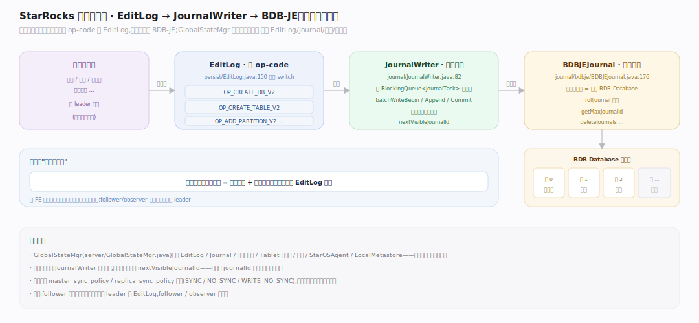
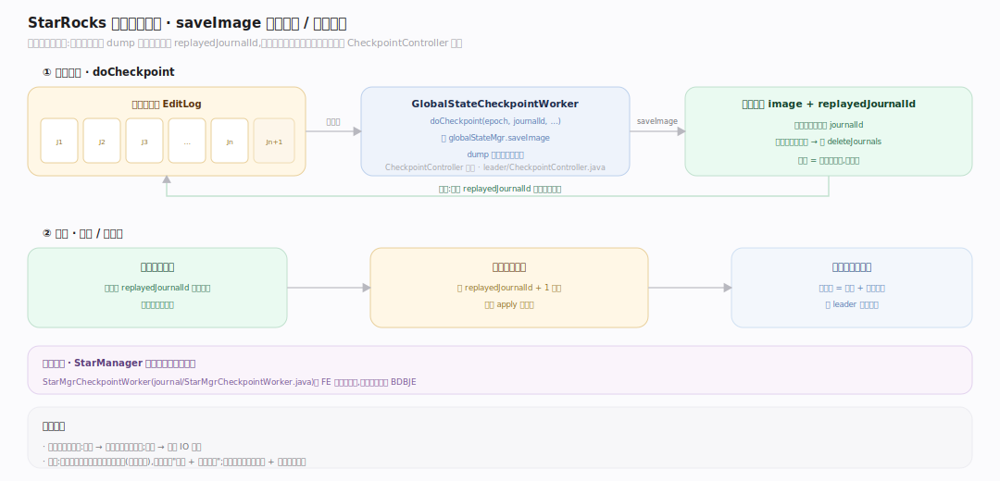
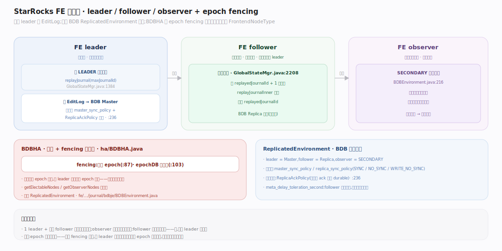
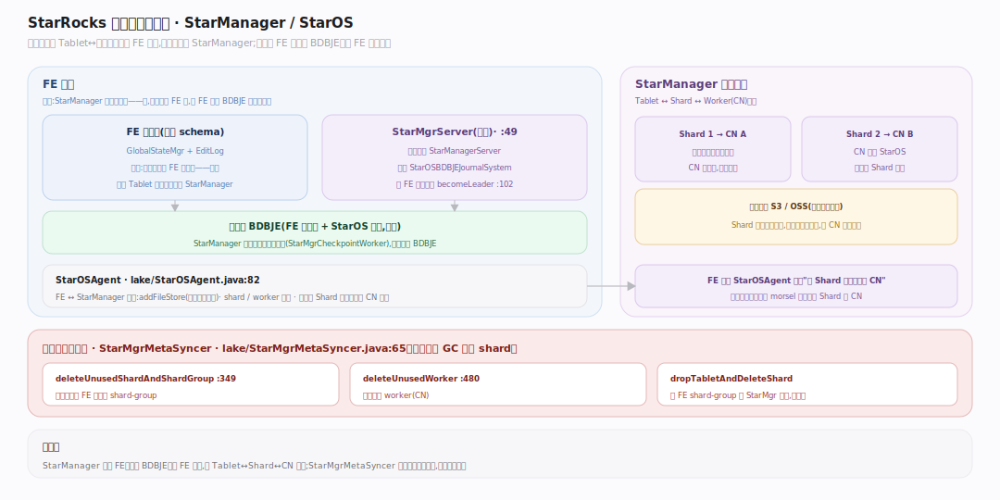

# StarRocks 原理 · 支撑主线 · 元数据

> **定位**：属"底座能力域"。管全局状态的持久化与全集群一致——本地表元数据走 FE 的 BDB-JE + EditLog + 镜像;云原生表的 Tablet 放置元数据额外交给内嵌的 StarManager。是 DDL/DCL/事务状态/副本位置的最终落点。被所有主线依赖,故障恢复从它回放。源码基准 **StarRocks 3.x**(`fe/.../journal/`、`fe/.../server/GlobalStateMgr.java`、`fe/.../staros/`)。

StarRocks 的元数据中枢是 **GlobalStateMgr**:它持有 EditLog、Journal、事务管理器、Tablet 调度器、心跳管理器、StarOSAgent、LocalMetastore……几乎所有全局状态的根。持久化沿用 Doris 的路子——**BDB-JE 存日志(EditLog)+ 定期镜像(image/checkpoint)**,follower/observer 靠回放日志追平 leader。存算分离额外引入 StarManager 管 Tablet↔Shard 映射。

---

## 一、EditLog + BDB-JE：日志即真相

每个元数据变更(建库/建表/加分区/事务状态…)先写成一条带 op-code 的 **EditLog**(巨型 switch:`OP_CREATE_DB_V2`、`OP_CREATE_TABLE_V2`、`OP_ADD_PARTITION_V2`…)。写入是异步批量:**JournalWriter** 从 `BlockingQueue<JournalTask>` 取任务,`batchWriteBegin/Append/Commit` 批量写进 BDB,提交成功后才推进 `nextVisibleJournalId`。底层 **BDBJEJournal** 把每个日志段存成一个 BDB Database(`rollJournal` 换段),提供 `getMaxJournalId`、`deleteJournals` 等。

**为什么日志即真相**:任何时刻的元数据全集 = 初始镜像 + 从镜像点到现在的所有 EditLog 回放。这让 FE 重启、切主、扩缩容都能收敛到同一状态。

---

## 二、镜像与检查点（防日志无限增长）

日志不能无限涨。**GlobalStateCheckpointWorker.doCheckpoint** 调 `globalStateMgr.saveImage` 把当前内存态整体 dump 成镜像文件,并记录 `replayedJournalId`——之后镜像点前的日志即可删除,由 **CheckpointController** 驱动。恢复时:先加载最新镜像,再从 `replayedJournalId+1` 回放剩余日志。

存算分离下 StarManager 的元数据**单独做检查点**(`StarMgrCheckpointWorker`,`fe/.../journal/StarMgrCheckpointWorker.java`),与 FE 主镜像分离但同源同一套 BDBJE。

---

## 三、FE 高可用：leader / follower / observer

FE 角色枚举 `FrontendNodeType`。只有 **leader** 能写 EditLog:`GlobalStateMgr.feType` 转为 LEADER 前先做一次追平 `replayJournal(maxJournalId)`。底层用 BDB 的 `ReplicatedEnvironment`:observer 用 SECONDARY 节点类型,持久性由 `master_sync_policy` / `replica_sync_policy` + `ReplicaAckPolicy` 决定,`epochDB` 做 fencing。

选主与 fencing 由 **BDBHA** 实现:`fencing` 递增 epoch 防脑裂,`getElectableNodes` / `getObserverNodes` 列节点。follower/observer 的**回放循环**:从 `replayedJournalId+1` 读日志、`replayJournalInner` 应用、推进 `replayedJournalId`。

- **leader**:可读写,唯一写日志者。
- **follower**:参与选举,回放日志,leader 挂了可被选为新 leader。
- **observer**:只回放不选举,纯读扩展。

---

## 四、存算分离元数据：StarManager / StarOS

云原生表的 Tablet↔节点放置不再由 FE 直管,而交给 **StarManager**(StarOS 的元数据服务)。**StarMgrServer** 内嵌运行 `StarManagerServer`,跑在与 FE 同一套 BDBJE 之上的 `StarOSBDBJEJournalSystem`,随 FE 一起选主。FE 通过 **StarOSAgent** 与之交互:`addFileStore`(注册对象存储)、shard/worker 管理、解析某 Shard 当前由哪个 CN 服务。

一致性靠**元数据同步守护** **StarMgrMetaSyncer**:周期性 `deleteUnusedShardAndShardGroup`、`deleteUnusedWorker`、`dropTabletAndDeleteShard` 回收孤儿——把 FE 的 shard-group 与 StarMgr 对账,防止元数据泄漏。

---

## 拓展 · 元数据关键结构一览

| 结构 | 定义 | 职责 |
|---|---|---|
| GlobalStateMgr | `server/GlobalStateMgr.java` | 全局状态中枢(持有一切) |
| EditLog | `persist/EditLog.java:150` | 变更日志(op-code 分派) |
| JournalWriter | `journal/JournalWriter.java:82` | 异步批量写日志 |
| BDBJEJournal | `journal/bdbje/BDBJEJournal.java:176` | BDB-JE 日志存储 |
| GlobalStateCheckpointWorker | `journal/GlobalStateCheckpointWorker.java:30` | 镜像/检查点 |
| BDBHA | `ha/BDBHA.java:87` | 选主 + fencing |
| StarMgrServer | `staros/StarMgrServer.java:49` | 内嵌 StarManager 元数据服务 |
| StarMgrMetaSyncer | `lake/StarMgrMetaSyncer.java:65` | Shard 元数据对账 GC |
| GlobalStateMgr | `server/GlobalStateMgr.java:1384` | 转 LEADER 前追平 / 2208 回放循环 |
| BDBEnvironment | `journal/bdbje/BDBEnvironment.java:216` | ReplicatedEnvironment / observer SECONDARY |
| StarOSAgent | `lake/StarOSAgent.java:82` | FE↔StarManager 交互代理 |

## 调优要点（关键开关）

- **`master_sync_policy` / `replica_sync_policy`**:BDB 日志持久性(SYNC/NO_SYNC/WRITE_NO_SYNC),权衡写延迟与断电丢失窗口。
- **检查点频率**:太稀→日志堆积、恢复慢;太频→镜像 IO 开销。
- **FE 节点配比**:1 leader + 偶数 follower 便于多数派选举;observer 无限加只读。
- **`meta_delay_toleration_second`**:follower 可容忍的落后阈值,超出视为不可用。

## 常见误区与工程要点

- **误区:follower 也能写元数据。** 不。只有 leader 写 EditLog,follower/observer 只回放。
- **误区:镜像是备份。** 镜像是恢复加速点(截断日志),真相仍是"镜像 + 后续日志";丢镜像可从更早镜像 + 全量日志重建。
- **误区:存算分离没有 FE 元数据。** 仍有 FE 元数据管库表 schema;只是 Tablet 放置额外交给同源 BDBJE 上的 StarManager。
- **误区:StarManager 是独立进程。** 它内嵌在 FE 进程里(`StarMgrServer`),与 FE 共享 BDBJE 并一起选主。
- **归属提醒**:事务状态的持久化在本主线(EditLog),但事务语义在【事务一致性】;Tablet 副本调度动作在【集群管理与自愈】,元数据只记位置;DDL 的执行在【DDL】,落点在本主线。

## 一句话总纲

**StarRocks 元数据沿用 Doris 的"日志即真相":GlobalStateMgr 是全局状态中枢,每个变更先写带 op-code 的 EditLog(JournalWriter 异步批量落 BDB-JE),定期 saveImage 做镜像检查点以截断日志;FE 分 leader(唯一写日志)/follower(回放+可选举)/observer(只读回放),选主与防脑裂由 BDBHA 的 epoch fencing 保证;存算分离额外内嵌 StarManager(跑在同一套 BDBJE、随 FE 选主)管 Tablet↔StarOS Shard 映射,由 StarMgrMetaSyncer 周期对账回收孤儿。**
