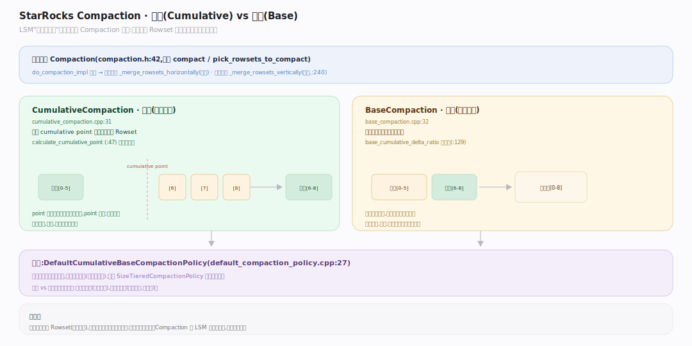
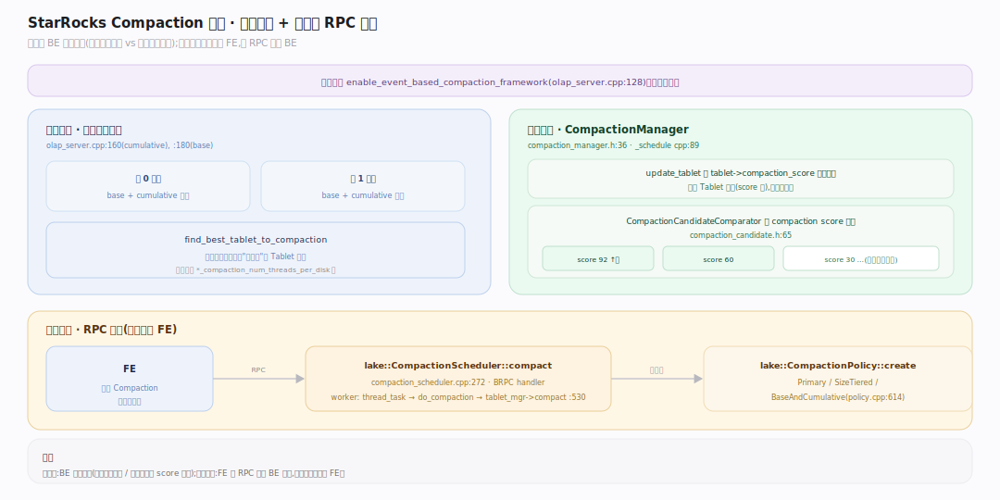
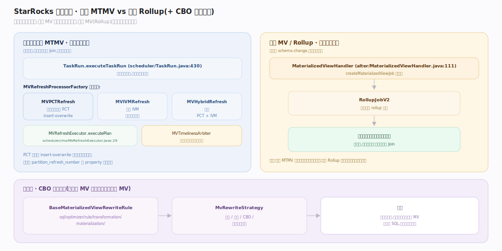
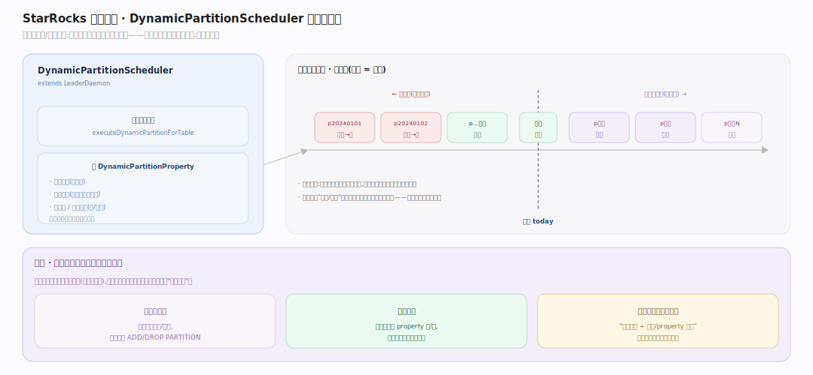

# StarRocks 原理 · 支撑主线 · 后台任务

> **定位**：属"异步执行时机"维度(横切各能力域)。管各能力域的后台异步部分——Compaction(存储整理)、物化视图刷新(优化技术的异步物化)、动态分区(元数据自动维护)。不是又一个能力域,而是"何时做=后台"的统一载体。被【存储引擎】产生数据触发、消费【元数据】版本、结果供【DQL】加速。源码基准 **StarRocks 3.x**(`be/src/storage/`、`fe/.../scheduler/`、`fe/.../alter/`)。

LSM 类存储"写时只追加、读时才还债",这笔债由后台 Compaction 偿还;物化视图的预计算、动态分区的滚动,也都放在后台异步做,避免拖慢前台请求。本篇把这些异步任务归拢一处——它们横切存储/优化/元数据三个能力域,共性是"后台守护 + 优先级/评分调度"。

---

## 一、Compaction：基线 vs 增量

每次导入产出一个新 Rowset(小文件),读时要归并众多 Rowset——Compaction 把它们合并成更少更大的有序文件。抽象基类 **Compaction**(`be/src/storage/compaction.h:42`,纯虚 `compact`/`pick_rowsets_to_compact`),合并执行 `do_compaction_impl`(`compaction.cpp:59`)分派**水平合并**(`_merge_rowsets_horizontally`,列少)或**垂直合并**(`_merge_rowsets_vertically`,列多,`:240`)。

两种粒度:
- **CumulativeCompaction**(增量,`be/src/storage/cumulative_compaction.cpp:31`):合并 cumulative point 之上的新增小 Rowset,高频轻量;`calculate_cumulative_point`(`:47`)推进分界点。
- **BaseCompaction**(基线,`be/src/storage/base_compaction.cpp:32`):把增量结果并入基线大文件,低频重量;`base_cumulative_delta_ratio` 控触发(`:129`)。

选谁由策略 **DefaultCumulativeBaseCompactionPolicy**(`be/src/storage/default_compaction_policy.cpp:27`)取二者评分较高者(平手偏增量);另有 `SizeTieredCompactionPolicy` 按大小分层。

---

## 二、Compaction 调度：评分驱动 + 两套框架

调度有两套框架,由 `enable_event_based_compaction_framework`(`be/src/storage/olap_server.cpp:128`)切换:
- **传统**:每盘固定 base/cumulative 线程(`olap_server.cpp:160,180`),`find_best_tablet_to_compaction` 选盘上最该压的 Tablet。
- **事件驱动**:**CompactionManager**(`be/src/storage/compaction_manager.h:36`)的 `_schedule`(`compaction_manager.cpp:89`)用 `CompactionCandidateComparator` 按 **compaction score 降序**排候选(`compaction_candidate.h:65`),`update_tablet` 读 `tablet->compaction_score` 喂入。

云原生表的 Compaction 是 **RPC 驱动(FE→BE)**:`lake::CompactionScheduler::compact`(`be/src/storage/lake/compaction_scheduler.cpp:272`)是 BRPC handler,worker `thread_task → do_compaction → tablet_mgr->compact`(`:530`);策略 `lake::CompactionPolicy::create` 选 `PrimaryCompactionPolicy`/`SizeTiered`/`BaseAndCumulative`(`compaction_policy.cpp:614`)。

---

## 三、物化视图刷新：异步 MTMV vs 同步 Rollup

两条完全不同的路:

- **异步物化视图(MTMV)**:独立的表,后台按调度刷新。走任务框架 `TaskRun.executeTaskRun`(`fe/.../scheduler/TaskRun.java:430`),由 `MVRefreshProcessorFactory` 选 `MVPCTRefreshProcessor`(分区变化跟踪,PCT)/ `MVIVMRefreshProcessor`(增量)/ `MVHybridRefreshProcessor`。PCT 刷新用 insert-overwrite 计划经 `MVRefreshExecutor.executePlan`(`scheduler/mv/MVRefreshExecutor.java:29`)执行;时效由 `MVTimelinessArbiter` 判定哪些分区过期需刷。
- **同步物化视图 / Rollup**:随基表写入同步维护,本质是 schema-change。`MaterializedViewHandler`(`fe/.../alter/MaterializedViewHandler.java:111`)的 `createMaterializedViewJob` 建 `RollupJobV2` 后台构建。

查询侧的**透明改写**(把命中 MV 的查询自动重写到 MV)在 CBO 里:`BaseMaterializedViewRewriteRule`(`sql/optimizer/rule/transformation/materialization/`)+ `MvRewriteStrategy`(单表/多表/CBO/视图改写开关)。

---

## 四、动态分区：元数据的后台自维护

时序表常按天/小时分区,老分区要删、新分区要提前建——**DynamicPartitionScheduler**(`fe/.../clone/DynamicPartitionScheduler.java:101`,`extends LeaderDaemon`)后台周期 `executeDynamicPartitionForTable`(`:356`)按 `DynamicPartitionProperty`(保留几天、预建几天、分桶数)自动加/删分区。这是"元数据能力域的异步部分"落在后台任务的典型例子:前台不感知,分区滚动自动完成。

---

## 拓展 · 后台任务关键结构一览

| 任务 | 定义 | 触发 |
|---|---|---|
| CumulativeCompaction | `be/src/storage/cumulative_compaction.cpp:31` | 新增小 Rowset 累积 |
| BaseCompaction | `be/src/storage/base_compaction.cpp:32` | 增量并入基线 |
| CompactionManager | `be/src/storage/compaction_manager.h:36` | 评分驱动调度 |
| lake::CompactionScheduler | `be/src/storage/lake/compaction_scheduler.cpp:272` | 云原生 RPC 驱动 |
| TaskRun (MV 刷新) | `fe/.../scheduler/TaskRun.java:430` | 异步 MV 调度刷新 |
| RollupJobV2 | `fe/.../alter/MaterializedViewHandler.java` | 同步 Rollup/MV |
| DynamicPartitionScheduler | `fe/.../clone/DynamicPartitionScheduler.java:101` | 分区自动滚动 |

## 调优要点（关键开关）

- **`cumulative_compaction_num_threads_per_disk` / `base_compaction_num_threads_per_disk`**:每盘 Compaction 并发;IO 紧张时调低护查询,写多时调高防 Rowset 堆积。
- **`enable_event_based_compaction_framework`**:开启评分驱动框架,大集群更均衡。
- **`base_cumulative_delta_ratio`**:增量占基线多大比例触发 base compaction。
- **MV 刷新**:`PROPERTIES("partition_refresh_number"...)` 控每次刷新分区数;时效换资源。

## 常见误区与工程要点

- **误区:Compaction 是可选优化。** 不。不做则 Rowset 无限堆积、读放大爆炸、主键索引膨胀——它是 LSM 存储的必需还债。
- **误区:base 和 cumulative 一回事。** cumulative 高频合并新增小文件,base 低频把增量并入基线大文件;策略按评分选。
- **误区:同步 MV 和异步 MV 差不多。** 同步 MV(Rollup)随写维护、强一致但受限;异步 MV(MTMV)后台刷新、灵活支持多表 Join 但有时效延迟。
- **误区:云原生 Compaction 和本地一样跑。** 云原生是 FE 通过 RPC 驱动 BE 执行,调度权在 FE,与本地 BE 自发调度不同。
- **归属提醒**:Compaction 合并的数据格式属【存储引擎】;MV 透明改写属【优化技术】;动态分区改的是【元数据】;它们的共性只是"后台异步"这个执行时机。

## 一句话总纲

**后台任务是"何时做=后台"的统一载体,横切存储/优化/元数据三域:Compaction 偿还 LSM"写时只追加"的债——增量(cumulative,高频合小 Rowset)与基线(base,低频并入大文件)两粒度,由评分策略择优、事件驱动框架按 compaction score 调度(云原生表则 FE 经 RPC 驱动 BE);物化视图分同步 Rollup(随写维护)与异步 MTMV(任务框架后台刷新 + CBO 透明改写);动态分区守护自动滚动时序分区——共性都是把重活挪出前台请求路径。**
