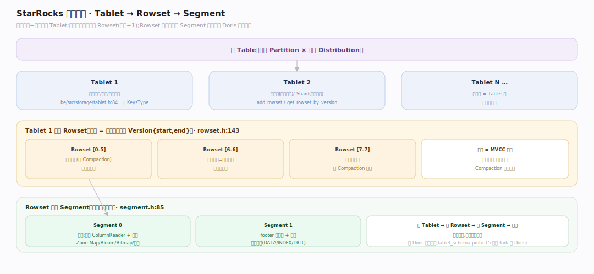
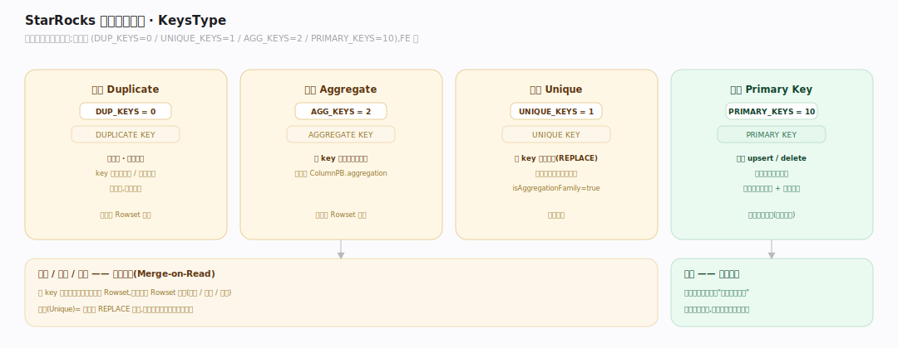
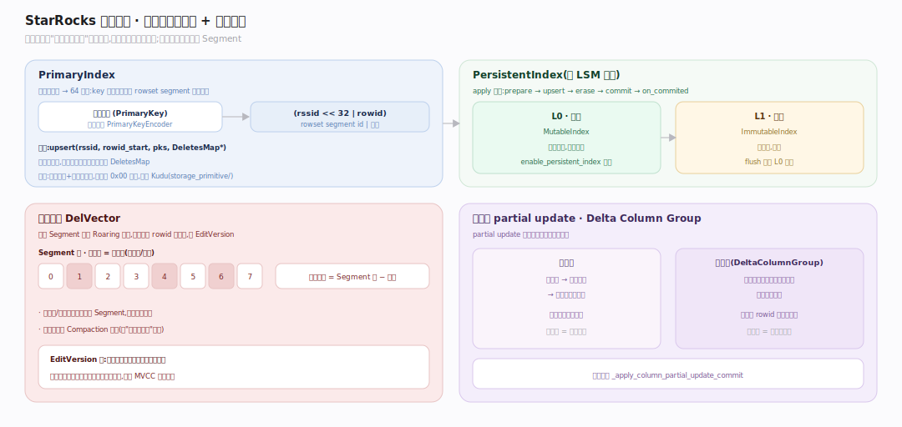
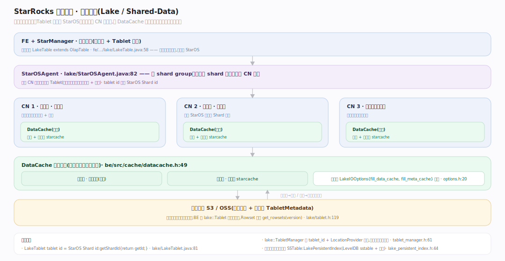
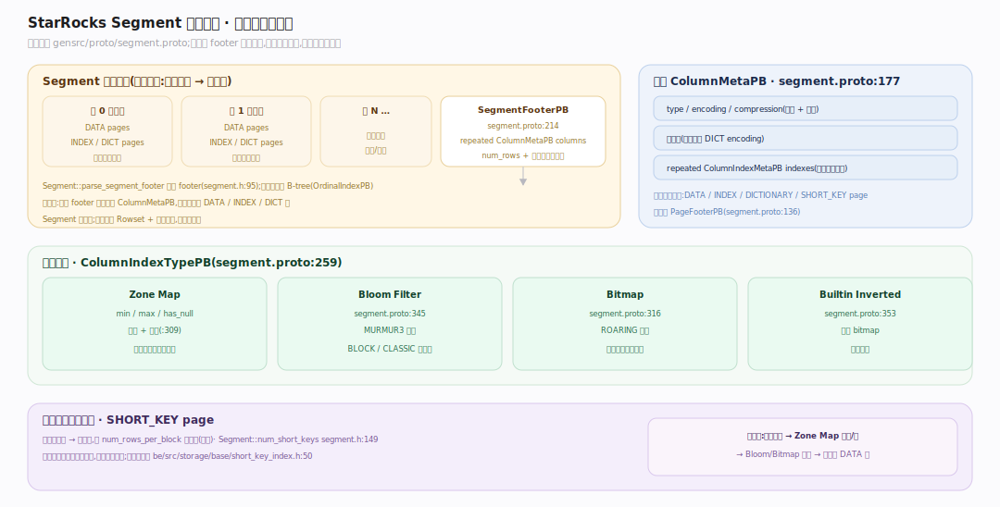
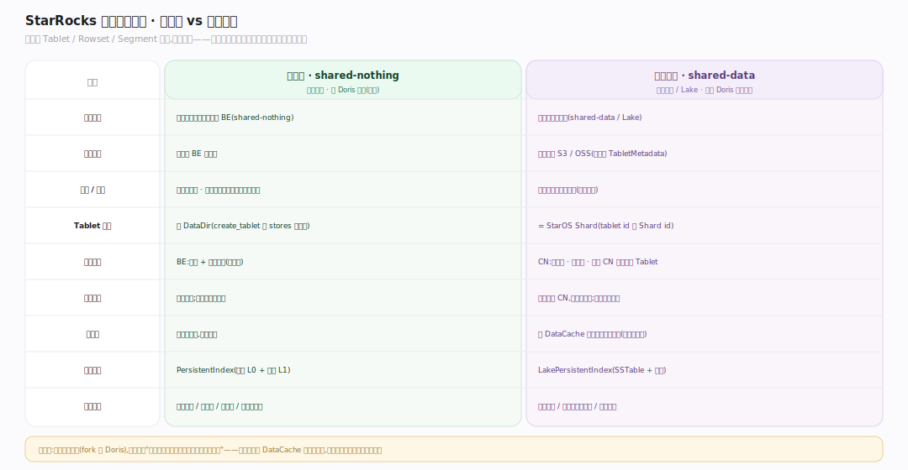

# StarRocks 原理 · 支撑主线 · 存储引擎

> **定位**：属"底座能力域"。管数据的组织、落盘与读取——本地表(shared-nothing)与云原生表(shared-data/存算分离)两套形态。被【DML】写入、【DQL】扫描、【事务一致性】按版本发布、【后台任务】Compaction 整理。是 StarRocks 区别于纯查询引擎的立身之本。源码基准 **StarRocks 3.x**(`~/workdir/StarRocks`,git `b2f06e51a37`;`be/src/storage/`)。

StarRocks 从 Apache Doris fork 而来,存储层顶层词汇 **Tablet → Rowset → Segment 与 Doris 完全一致**(`gensrc/proto/tablet_schema.proto:15` 明言"based on ...apache/incubator-doris...olap_file.proto")。但它在两处走出了自己的路:**持久化主键索引**(real-time upsert 的 LSM 主键索引)与**存算分离**(云原生表把数据交给对象存储、把放置交给 StarOS)。读全库遇"某能力属哪条主线"回全景框架查依赖矩阵。

---

## 一、存储层级：Tablet → Rowset → Segment

一张表按分区(Partition)+ 分桶(Bucket)切成多个 **Tablet**(`be/src/storage/tablet.h:84`,`class Tablet : public BaseTablet`),Tablet 是数据分布、副本、调度的基本单位,带一个 `KeysType`(`tablet.h:125`)。每个 Tablet 由若干 **Rowset**(`be/src/storage/rowset/rowset.h:143`)组成,一个 Rowset 对应一个版本区间 `Version{start,end}`——每次导入产出一个新 Rowset(版本 +1),这是 MVCC 的物理载体。一个 Rowset 内含若干 **Segment**(`be/src/storage/rowset/segment.h:85`),Segment 是真正的列式数据文件,持有每列的 `ColumnReader`(`segment.h:325`)、行数、短键索引。Tablet 通过 `add_rowset`/`get_rowset_by_version`(`tablet.h:141`)增删与按版本取 Rowset。

---

## 二、四种数据模型（KeysType）

数据模型是建表时定的存储语义,枚举在 `gensrc/proto/tablet_schema.proto:45`(`DUP_KEYS=0, UNIQUE_KEYS=1, AGG_KEYS=2, PRIMARY_KEYS=10`),FE 侧在 `fe/fe-parser/src/main/java/com/starrocks/sql/ast/KeysType.java:17`。

| 模型 | SQL 声明 | 语义 | 实现要点 |
|---|---|---|---|
| **明细 Duplicate** | `DUPLICATE KEY` | 不去重,全量留存 | key 仅用于排序/前缀索引 |
| **聚合 Aggregate** | `AGGREGATE KEY` | 同 key 按列聚合函数合并 | 每列存 `ColumnPB.aggregation`(`tablet_schema.proto:65`) |
| **更新 Unique** | `UNIQUE KEY` | 同 key 后写覆盖(REPLACE) | **本质是聚合模型的特例**:`KeysType.isAggregationFamily` 对 UNIQUE 与 AGG 都返回 true(`KeysType.java:23`) |
| **主键 Primary Key** | `PRIMARY KEY` | 实时 upsert/delete,读时无需归并去重 | 持久化主键索引 + 删除向量(见第三节) |

明细/聚合/更新三者读时都要跨 Rowset 归并(Merge-on-Read);主键模型靠主键索引把"这行现在在哪"直接定位,把去重成本从读期挪到写期。

---

## 三、主键模型：持久化主键索引 + 删除向量

主键模型的核心是 **PrimaryIndex**(`be/src/storage/primary_index.h:38`):把编码后的主键映射到一个 64 位值 `(rssid<<32 | rowid)`——即"这个 key 当前活在哪个 Rowset segment 的第几行"。写入时 `upsert(rssid, rowid_start, pks, DeletesMap*)`(`primary_index.h:74`)插入新位置、并把被覆盖的旧行位置吐进 `DeletesMap`。

**持久化**由 **PersistentIndex**(`be/src/storage/persistent_index.h:674`)承担,是一个类 LSM 的两级结构(`persistent_index.h:661`):内存 **L0**(`MutableIndex`)+ 落盘 **L1**(`ImmutableIndex`),apply 流程 `prepare → upsert → erase → commit → on_commited`。主键编码 **PrimaryKeyEncoder**(`be/src/storage_primitive/primary_key_encoder.h:109`,注意目录是 `storage_primitive/`)是保序编码(借鉴 Kudu):整型大端 + 符号位翻转,变长串把 `0x00` 转义为 `0x00 0x01`、以 `0x00 0x00` 结尾——保证字节序 = 逻辑序。

被覆盖/删除的旧行不重写 Segment,而是记进**删除向量 DelVector**(`be/src/storage/del_vector.h:30`):每个 Segment 一个 Roaring 位图,标记哪些 rowid 已失效,带 EditVersion。读时活行 = Segment 行 − 删除位图。partial update 有行模式与**列模式**两条路:列模式用 **Delta Column Group**(`be/src/storage/delta_column_group.h:35`)只写被更新的列成单独文件,避免整行重写(`_apply_column_partial_update_commit`,`be/src/storage/tablet_updates.h:440`)。

---

## 四、存算分离：云原生表（Lake / Shared-Data）

这是 StarRocks 相对 Doris 最大的架构分叉。云原生表 **LakeTable**(`fe/fe-core/src/main/java/com/starrocks/lake/LakeTable.java:58`,`extends OlapTable`)把数据放到对象存储(S3/OSS),把 Tablet 放置交给 **StarOS**:**LakeTablet**(`lake/LakeTablet.java:42`)的注释直言"数据副本由对象存储管理、计算副本由 StarOS 通过 Shard 管理,**tablet id 就是 StarOS Shard id**"(`getShardId{return getId;}`,`LakeTablet.java:81`)。`StarOSAgent`(`lake/StarOSAgent.java:82`)建 shard group、解析某 shard 当前由哪个 CN 服务——**任何 CN 都能服务任何 Tablet**,只需从对象存储拉元数据 + 数据。

BE 侧云原生 Tablet 是独立的 `starrocks::lake::Tablet`(`be/src/storage/lake/tablet.h:52`),**元数据驱动**:Rowset 来自版本化的 `TabletMetadataPtr`(`get_rowsets(version)`,`lake/tablet.h:119`);`belonged_to_cloud_native` 返回 true,对比本地 Tablet 的 false。本地 `TabletManager::create_tablet` 绑定 `std::vector<DataDir*> stores`(本地盘),云原生 `lake::TabletManager` 只按 `tablet_id + LocationProvider` 索引(`be/src/storage/lake/tablet_manager.h:61`)——存储彻底与本地盘解耦。

存算分离的读延迟靠 **DataCache**(`be/src/cache/datacache.h:49`)拉回:内存 + 本地盘(starcache)分层缓存,前置在对象存储之前;每次读由 `LakeIOOptions{fill_data_cache, fill_meta_cache}`(`be/src/storage/lake/options.h:20`)决定是否回填。云原生的主键索引则落成 **SSTable**(`LakePersistentIndex`,`be/src/storage/lake/lake_persistent_index.h:44`,LevelDB 派生的 sstable + 布隆),与 git log "lake PK index sstables" 一致。

---

## 五、Segment 磁盘格式

Segment 是列式不可变文件,格式定义在 `gensrc/proto/segment.proto`。文件尾 **SegmentFooterPB**(`segment.proto:214`)存 `repeated ColumnMetaPB columns`、`num_rows`、短键索引页指针,由 `Segment::parse_segment_footer`(`segment.h:95`)解析。每列 **ColumnMetaPB**(`segment.proto:177`)含 `type/encoding/compression`、字典页、以及 `repeated ColumnIndexMetaPB indexes`;列内按页组织(DATA/INDEX/DICTIONARY/SHORT_KEY page,`PageFooterPB` `segment.proto:136`),行号索引是 B-tree(`OrdinalIndexPB`)。

列级索引(`ColumnIndexTypePB` `segment.proto:259`):**Zone Map**(min/max/has_null,段级 + 页级 `segment.proto:309`,谓词下推的第一道裁剪)、**Bloom Filter**(`segment.proto:345`,MURMUR3;BLOCK/CLASSIC 两算法)、**Bitmap**(`segment.proto:316`,ROARING)、**Builtin Inverted**(`segment.proto:353`,基于 bitmap)。另有稀疏**短键前缀索引**(`Segment::num_short_keys` `segment.h:149`):把排序前缀 → 块序号,每 `num_rows_per_block` 行一条,边界标记见 `be/src/storage/base/short_key_index.h:50`。

---

## 深化 · 本地表 vs 云原生表

同一套 Tablet/Rowset/Segment 抽象,两种落地:本地表数据固定在 BE 本地盘、Tablet 绑定 DataDir、副本靠三副本冗余;云原生表数据在对象存储、Tablet=StarOS Shard、副本靠对象存储冗余、计算节点(CN)无状态可弹性伸缩。存算分离的代价是读需经 DataCache 命中才有本地盘级延迟,收益是存储/计算独立扩容、冷数据成本大降。

## 拓展 · 存储关键结构一览

| 结构 | 类/定义 | 职责 |
|---|---|---|
| Tablet | `be/src/storage/tablet.h:84` | 数据分布/副本/调度单位 |
| Rowset | `be/src/storage/rowset/rowset.h:143` | 一个版本区间的数据 |
| Segment | `be/src/storage/rowset/segment.h:85` | 列式数据文件 |
| PrimaryIndex | `be/src/storage/primary_index.h:38` | 主键 → (rssid,rowid) |
| PersistentIndex | `be/src/storage/persistent_index.h:674` | 主键索引 L0(内存)+L1(盘) |
| DelVector | `be/src/storage/del_vector.h:30` | 每 Segment 删除位图 |
| DeltaColumnGroup | `be/src/storage/delta_column_group.h:35` | 列模式 partial update 增量列 |
| LakeTablet | `fe/.../lake/LakeTablet.java:42` | 云原生 Tablet(=StarOS Shard) |
| DataCache | `be/src/cache/datacache.h:49` | 对象存储前置分层缓存 |

## 调优要点（关键开关）

- **数据模型选型**:实时更新选主键模型(读快、写略贵);仅追加选明细;预聚合选聚合模型。主键模型内存占用较高(主键索引常驻),可开 `enable_persistent_index` 落盘。
- **分桶数**:决定 Tablet 数与并行度;过多小 Tablet 增加元数据与调度开销,过少限制并行。
- **Compaction 并发**:`cumulative_compaction_num_threads_per_disk`、`base_compaction_num_threads_per_disk` 控制每盘并发(`be/src/storage/compaction_manager.cpp`);失败有 `min_cumulative_compaction_failure_interval_sec` 退避。
- **云原生缓存**:`fill_data_cache`/`fill_meta_cache` 控制大扫描是否污染 DataCache;冷表可关。

## 常见误区与工程要点

- **误区:Unique 模型是独立实现。** 不。Unique 是聚合模型的 REPLACE 特例(`KeysType.isAggregationFamily` 对二者都 true),读时仍走归并;主键模型才是靠索引免归并的那个。
- **误区:主键删除会立即重写 Segment。** 不。删除只在 DelVector 位图打标,旧行惰性由 Compaction 回收——与"追加不覆盖"一致。
- **误区:存算分离 = 慢。** 首次读远端确实慢,但 DataCache 命中后接近本地盘;真正收益是存算独立弹性 + 冷数据省钱。
- **误区:Tablet/Rowset/Segment 是 StarRocks 独创。** 是从 Doris fork 的同名抽象(`tablet_schema.proto:15`);差异在主键索引与存算分离,不在层级词汇。
- **归属提醒**:分区裁剪属【优化技术+元数据】非本主线;版本发布可见属【事务一致性】;Compaction 调度属【后台任务】;主键索引的写入时机属【DML】。

## 一句话总纲

**StarRocks 存储沿用 Doris 的 Tablet→Rowset→Segment 三级列存(每个 Rowset 一个版本、Segment 内 Zone Map/Bloom/Bitmap/短键多级索引),四种数据模型里明细/聚合/更新(Unique=聚合的 REPLACE 特例)读时归并、而主键模型用持久化主键索引(内存 L0+落盘 L1 的类 LSM,主键→(rssid,rowid))加删除向量把去重从读期挪到写期实现实时 upsert;它相对 Doris 最大的分叉是存算分离——云原生表把数据交对象存储、把 Tablet 放置交 StarOS(tablet id 即 Shard id)、计算节点无状态,靠 DataCache 分层缓存拉回本地盘级读延迟。**
