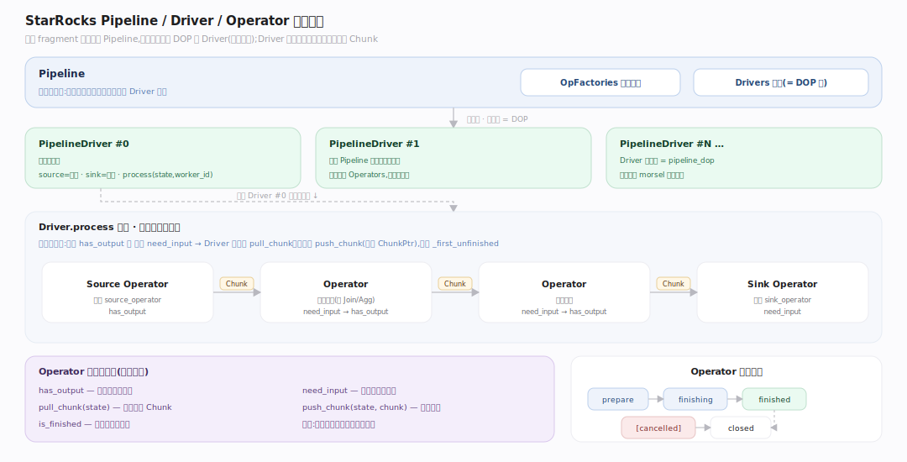
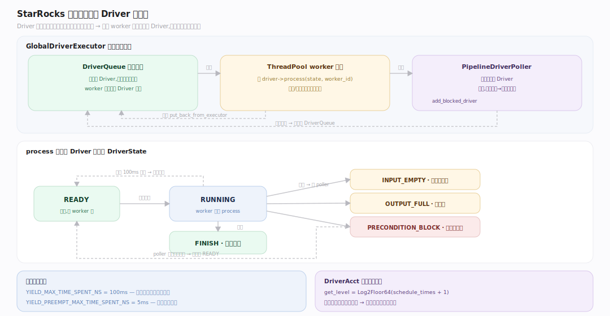
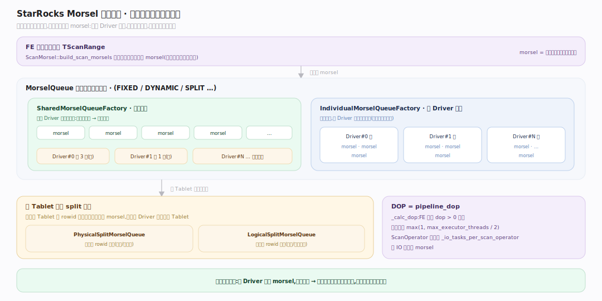
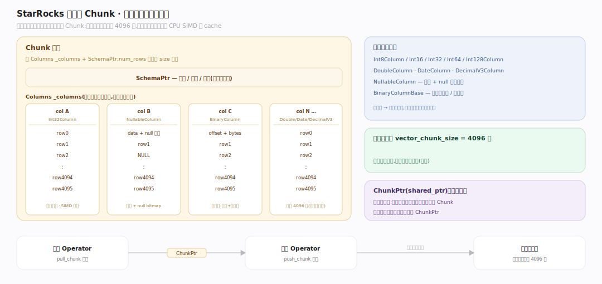
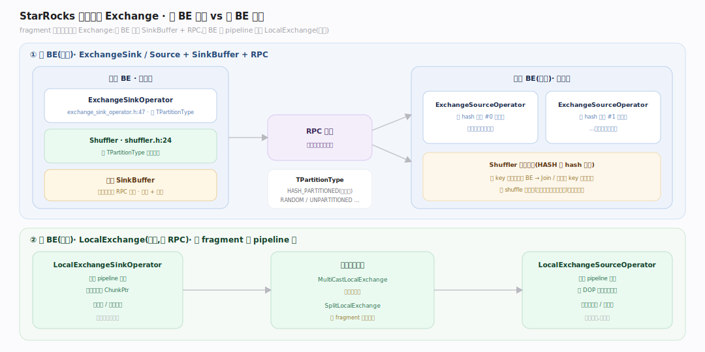

# StarRocks 原理 · 支撑主线 · 执行引擎

> **定位**：属"计算能力域"。管执行期把物理计划并行跑出来——Pipeline 执行模型、morsel 驱动并行、向量化 Chunk、数据交换。接收【优化技术】产出的物理计划,读【存储引擎】的 Segment,把结果经协调器汇聚。是 StarRocks 高性能的落地层。源码基准 **StarRocks 3.x**(`be/src/exec/`、`be/src/exec_primitive/`、`be/src/orchestration/`)。

> **本 checkout 目录说明**:此 fork 的 BE 执行代码经过重构,核心文件在 `be/src/exec_primitive/`、`be/src/exec/runtime/`、`be/src/orchestration/`、`be/src/compute_env/workgroup/`,而非上游惯例的 `be/src/exec/pipeline/...`(后者的 `morsel.h` 只是聚合头)。下文锚点均为本 checkout(HEAD `b2f06e51a37`)实际路径。

一个 fragment 到了 BE,被拆成若干 **Pipeline**,每个 Pipeline 实例化成多个 **Driver**(并行度 = DOP),Driver 是调度单位;Driver 内是一串 **Operator**,用推拉模型在算子间流转列式 **Chunk**。数据在 fragment 间靠 Exchange 交换。这套 morsel 驱动 + 向量化 + 协作式调度的模型,是 StarRocks 相对早期 Doris 火山模型的关键升级。

---

## 一、Pipeline / Driver / Operator 三级

**Operator** 是推拉状态机:纯虚 `has_output` / `need_input` / `is_finished` / `pull_chunk(state)` / `push_chunk(state,chunk)`,生命周期 `prepare → finishing → finished → [cancelled] → closed`。**Pipeline** 持有算子工厂 `OpFactories` 与实例化出的 `Drivers`。**PipelineDriver** 是可调度单位:持 `Operators`,`source_operator`=队首、`sink_operator`=队尾,核心 `process(RuntimeState*, worker_id)`。

Driver 的 `process` 循环实现推模型:遍历相邻算子对,当 `curr_op->has_output && next_op->need_input` 时从 curr 拉 chunk、推给 next,推进 `_first_unfinished`、关闭已完成算子。

---

## 二、协作式调度与 Driver 状态机

StarRocks 用**协作式调度**(而非线程独占):Driver 跑满时间片就主动让出。`process` 后 Driver 进入某 `DriverState`(`READY/RUNNING/INPUT_EMPTY/OUTPUT_FULL/PRECONDITION_BLOCK/FINISH/...`)。让出阈值 `YIELD_MAX_TIME_SPENT_NS=100ms`,抢占检查 `YIELD_PREEMPT_MAX_TIME_SPENT_NS=5ms`。

**GlobalDriverExecutor** 是线程池执行器:持 `DriverQueue` + `ThreadPool` + `PipelineDriverPoller`。worker 线程调 `driver->process`;遇 INPUT_EMPTY/OUTPUT_FULL/PRECONDITION_BLOCK 就把 Driver 交给 poller 挂起(`add_blocked_driver`),遇让出就 `put_back_from_executor` 重新入队。调度用 `DriverAcct` 多级反馈(`Log2Floor64`)防长任务饿死短任务。

---

## 三、Morsel 驱动并行

并行不是"编译期切死",而是**运行期抢 morsel**。**MorselQueue**(类型 FIXED/DYNAMIC/SPLIT/...)把 FE 下发的扫描范围(`TScanRange`)经 `ScanMorsel::build_scan_morsels` 转成 morsel。工厂分 `SharedMorselQueueFactory`(所有 driver 共享一队,谁快谁多拿)与 `IndividualMorselQueueFactory`(每 driver 一队)。大 Tablet 还能**切内部**并行:`PhysicalSplitMorselQueue` / `LogicalSplitMorselQueue` 按 rowid 范围切。

DOP(`pipeline_dop`)由 `FragmentExecutor::_calc_dop` 定:FE 传的 dop>0 则用,否则默认 `max(1, max_executor_threads/2)`。ScanOperator 并发发 `_io_tasks_per_scan_operator` 个 IO 任务拉 morsel。

---

## 四、向量化 Chunk

算子间流转的不是行而是**列式批 Chunk**:持 `Columns _columns` + `SchemaPtr`,`num_rows` 由首列 size 得来。列有强类型别名:`Int8..128Column`、`DoubleColumn`、`DateColumn`、`DecimalV3Column`,以及 `NullableColumn`、`BinaryColumnBase`。默认批大小 `vector_chunk_size=4096` 行。Chunk 以 `ChunkPtr`(shared_ptr)在算子间传,便于本地广播交换共享所有权。向量化让一次函数调用处理 4096 行,分摊解释开销、用满 CPU SIMD 与 cache。

---

## 五、数据交换（Exchange）

fragment 间移动数据靠 Exchange。**跨 BE(网络)**:`ExchangeSinkOperator`(持 `TPartitionType` + 共享 `SinkBuffer`)发往远端,`ExchangeSourceOperator` 收;分区由 `Shuffler` 按 `TPartitionType`(如 HASH_PARTITIONED 走 hash 映射)决定去向。**同 BE(本地)**:`LocalExchange` 系列做同 fragment 内 pipeline 间的一对多/重分区。`SinkBuffer` 解耦 sink 生产与 RPC 发送(缓冲 + 背压)。

---

## 深化 · 源码坐标（调度 / Morsel / Chunk / Exchange）

| 结构 | 定义 | 职责 |
|---|---|---|
| Driver.process 循环 | `be/src/exec/runtime/pipeline_driver.cpp:351` | 相邻算子对 pull/push 推模型 |
| DriverState | `be/src/exec_primitive/pipeline/primitives/driver_state.h:26` | READY/RUNNING/BLOCK/FINISH… |
| 协作让出阈值 | `be/src/exec/runtime/pipeline_driver.h:418` | YIELD 100ms / 抢占 5ms |
| ScanMorsel::build_scan_morsels | `.../pipeline/scan/scan_morsel.h:132` | TScanRange → morsel |
| SplitMorselQueue | `be/src/storage/query/split_morsel_queue.h:32` | 大 Tablet 按 rowid 切内部并行 |
| ScanOperator IO 任务 | `be/src/.../scan/scan_operator.cpp:251` | _io_tasks_per_scan_operator |
| vectorized_fwd 列别名 | `be/src/column/vectorized_fwd.h:74` | Int/Double/Date/Decimal/Nullable |
| vector_chunk_size | `be/src/common/config.h:1058` | 默认批 4096 行 |
| Shuffler | `.../exchange/shuffler.h:24` | 按 TPartitionType 分区去向 |

## 拓展 · 执行引擎关键结构一览

| 结构 | 定义 | 职责 |
|---|---|---|
| Operator | `exec_primitive/pipeline/operator.h:48` | 推拉状态机算子 |
| Pipeline | `exec/runtime/pipeline.h:33` | 算子工厂 + Driver 集合 |
| PipelineDriver | `exec/runtime/pipeline_driver.h:65` | 可调度执行单位 |
| GlobalDriverExecutor | `exec/pipeline/pipeline_driver_executor.h:42` | 线程池 + 阻塞 poller |
| MorselQueue | `exec_primitive/pipeline/scan/morsel_queue.h:33` | 运行期并行任务源 |
| Chunk | `be/src/column/chunk.h:66` | 列式数据批(默认 4096 行) |
| ExchangeSinkOperator | `exec/pipeline/exchange/exchange_sink_operator.h:47` | 跨 BE 数据发送 |
| FragmentExecutor | `orchestration/fragment_executor.cpp:770` | fragment→pipelines/drivers |

## 调优要点（关键开关）

- **`pipeline_dop`**:单 fragment 并行度;0=自动(核数/2)。CPU 密集查询手动调高、并发多时调低防抢占。
- **`vector_chunk_size`**(默认 4096):向量化批大小;大批摊薄开销但增内存与延迟。
- **workgroup 资源组**:`WorkGroup` 隔离不同负载的 CPU/内存/并发。
- **`_io_tasks_per_scan_operator`**:扫描并发 IO 任务数,匹配存储带宽。

## 常见误区与工程要点

- **误区:并行度编译期定死。** morsel 驱动是**运行期**抢任务:快的 Driver 多拿 morsel,自动负载均衡,避免数据倾斜下的长尾。
- **误区:算子一行一行处理。** 向量化按 Chunk(4096 行)批处理,用满 SIMD 与 cache 局部性。
- **误区:线程数=并行度就最快。** 协作式调度让 Driver 在阻塞/让出时归还线程,少量线程可跑多 Driver,避免上下文切换风暴。
- **误区:Exchange 都走网络。** 同 BE 内 pipeline 间用 LocalExchange(内存),只有跨 BE 才走 SinkBuffer + RPC。
- **归属提醒**:物理计划的生成在【优化技术】;扫描读的数据格式在【存储引擎】;资源组隔离与【资源与负载管理】交叉;调度 Stage 分发是 FE 协调器的事(见 DQL)。

## 一句话总纲

**StarRocks 执行引擎是"morsel 驱动 + 向量化 + 协作式调度"三位一体:一个 fragment 拆成 Pipeline、实例化成 DOP 个 Driver(可调度单位),Driver 内算子用推拉模型(has_output×need_input)流转 4096 行的列式 Chunk;并行不是编译期切死而是运行期抢 morsel(MorselQueue,大 Tablet 还能内部 split),快的 Driver 多拿自动均衡;Driver 跑满 100ms 就协作让出、阻塞时归还线程给 GlobalDriverExecutor,少量线程跑多 Driver;fragment 间靠 Exchange 交换(跨 BE 走 SinkBuffer+RPC、同 BE 走 LocalExchange 内存)。**
