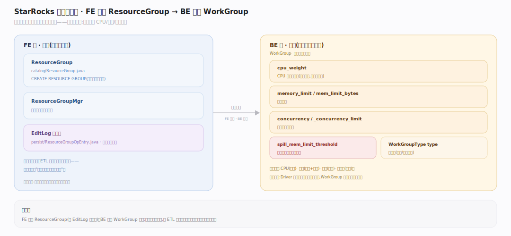
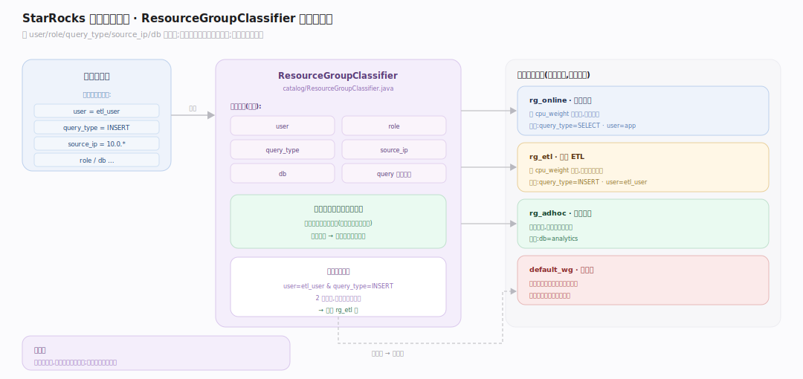
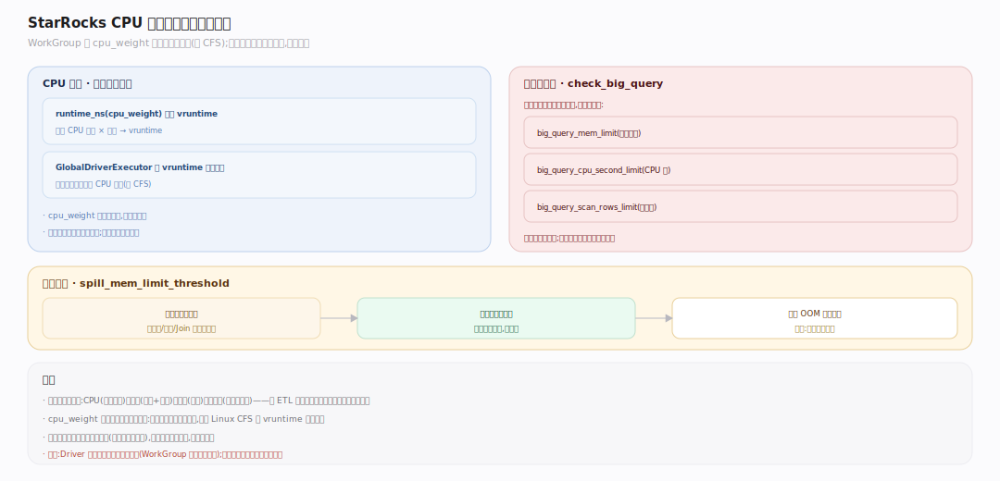

# StarRocks 原理 · 支撑主线 · 资源与负载管理

> **定位**：属"保障能力域"。管多租户隔离与稳定不被拖垮——资源组(WorkGroup/ResourceGroup)的 CPU/内存/并发配额、分类器路由、大查询熔断。它约束【执行引擎】的 Driver 调度与内存、被【DQL】/【DML】的负载归类。是"一个查询别拖垮整个集群"的保障层。源码基准 **StarRocks 3.x**(`fe/.../catalog/ResourceGroup*.java`、`be/src/compute_env/workgroup/work_group.h`)。

多租户共用一个集群,ETL 大查询与在线小查询混跑,若不隔离,一个失控查询能吃满 CPU/内存拖垮所有人。资源组把请求按分类器归到不同组,每组有独立的 CPU 权重、内存上限、并发上限,并对"大查询"熔断——sense(负载归类)→ act(配额约束)→ 缩误差(超限熔断)的反馈闭环。

---

## 一、资源组模型：FE 定义 → BE 执行

FE 侧 **ResourceGroup** 是用户可定义的对象(`CREATE RESOURCE GROUP`),由 **ResourceGroupMgr** 管理、经 EditLog 持久化。BE 侧对应 **WorkGroup**,构造参数即配额:

- `cpu_weight`:CPU 时间片权重(相对份额,非绝对核数)。
- `memory_limit` / `mem_limit_bytes`:内存上限。
- `concurrency` / `_concurrency_limit`:并发查询数上限。
- `spill_mem_limit_threshold`:超此内存阈值触发溢写。
- `WorkGroupType type`:组类型(普通/短查询等)。

FE 定义、BE 执行——定义落元数据、约束在执行期生效。

---

## 二、分类器：请求如何归到资源组

**ResourceGroupClassifier**(`fe/.../catalog/ResourceGroupClassifier.java`)决定一个请求进哪个组:按 user、role、query_type、source_ip、db、query 并发标签等条件匹配,多条分类器按匹配度选最优。未命中任何组则进默认组。这让"哪些查询共享哪份配额"可声明式配置——在线业务一组、ETL 一组、临时分析一组,互不抢占。

---

## 三、CPU 调度与大查询熔断

**CPU 隔离**:WorkGroup 用 `cpu_weight` 做加权公平调度——`runtime_ns(cpu_weight)` 把消耗的 CPU 时间按权重折算 vruntime,GlobalDriverExecutor 按 vruntime 选下一个跑的组,权重高的组拿更多 CPU 份额(类似 CFS)。

**大查询熔断**:`check_big_query(query_stats)` 在查询运行中检查是否超"大查询"限额——`big_query_mem_limit`、`big_query_cpu_second_limit`、`big_query_scan_rows_limit`,超限则终止该查询,防单个失控查询拖垮整组。**内存溢写**:超 `spill_mem_limit_threshold` 的可溢写算子把中间结果落盘换内存。

---

## 拓展 · 资源管理关键结构一览

| 结构 | 定义 | 职责 |
|---|---|---|
| ResourceGroup | `catalog/ResourceGroup.java` | FE 侧资源组定义 |
| ResourceGroupMgr | `catalog/ResourceGroupMgr.java` | 资源组管理 + 持久化 |
| ResourceGroupClassifier | `catalog/ResourceGroupClassifier.java` | 请求归组分类器 |
| WorkGroup | `be/src/compute_env/workgroup/work_group.h:145` | BE 侧配额执行体 |
| cpu_weight | `work_group.h:169` | CPU 加权公平份额 |
| check_big_query | `work_group.h:216` | 大查询熔断 |

## 调优要点（关键开关）

- **`cpu_weight`**:各组相对 CPU 份额;在线组给高权重保延迟,ETL 组给低权重让路。
- **`concurrency_limit`**:组内并发查询上限;防突发并发打爆内存。
- **`big_query_*_limit`**:大查询的内存/CPU 秒/扫描行熔断阈值;保护共享组不被单查询拖垮。
- **`spill_mem_limit_threshold`**:溢写触发阈值;内存紧时以磁盘换稳定性。

## 常见误区与工程要点

- **误区:cpu_weight 是绝对核数。** 它是相对权重(份额),空闲时高权重组也能用满,竞争时才按比例分——类似 CFS,不是硬绑核。
- **误区:资源组只隔离内存。** CPU(加权调度)、内存(上限+溢写)、并发(上限)、大查询(熔断)四维都管。
- **误区:分类器按顺序匹配第一个。** 按匹配度选最优(更具体的分类器优先),未命中进默认组。
- **误区:大查询熔断=一开始就拒。** 是运行中持续检查累计消耗,超限才终止——短查询不受影响。
- **归属提醒**:Driver 的实际调度在【执行引擎】(WorkGroup 提供份额约束);资源组定义落点在【元数据】;负载归类由本主线的分类器完成。

## 一句话总纲

**StarRocks 资源与负载管理靠资源组做多租户隔离:FE 定义 ResourceGroup(CPU 权重/内存上限/并发上限/溢写阈值/大查询熔断)、BE 对应 WorkGroup 执行,ResourceGroupClassifier 按 user/role/query_type/ip 等把请求归组;CPU 用 cpu_weight 加权公平调度(vruntime 折算,类 CFS)、内存超阈值溢写、并发超限排队、大查询(内存/CPU 秒/扫描行超限)运行中熔断——让 ETL 大查询与在线小查询混跑而互不拖垮。**
