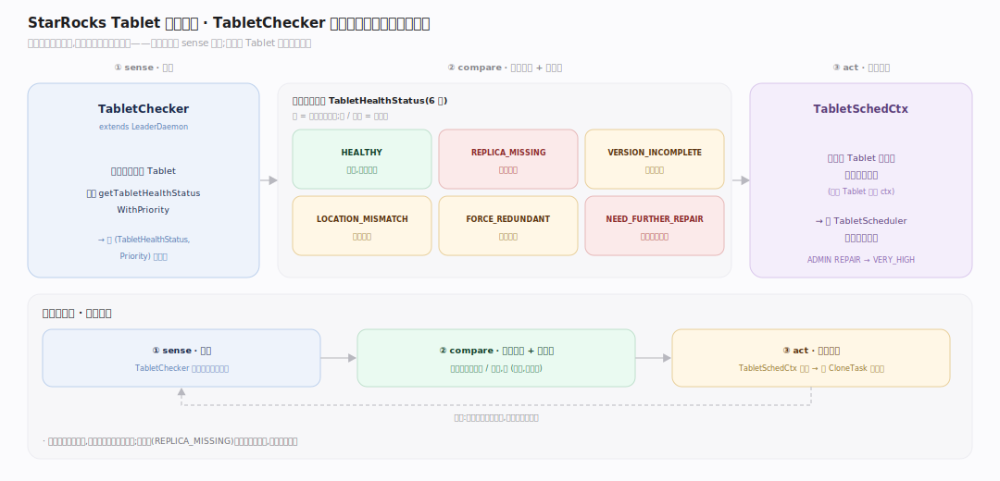
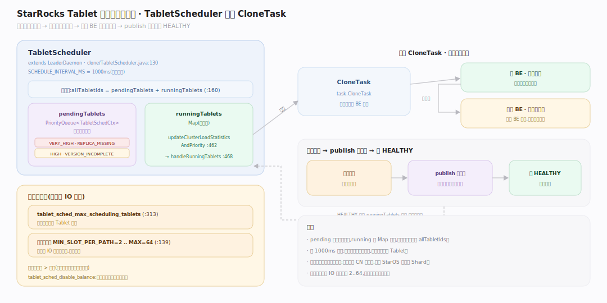
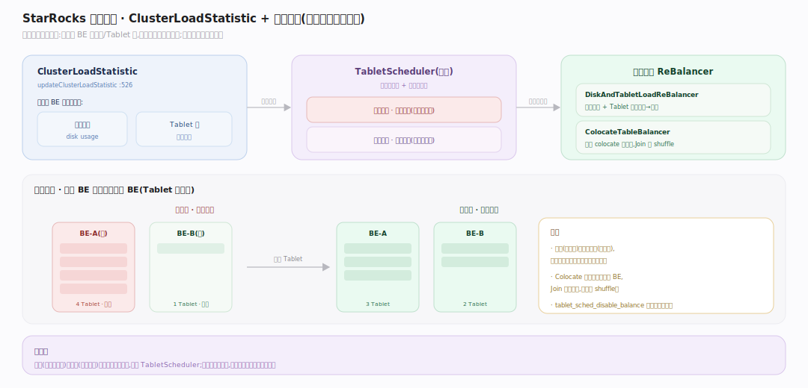
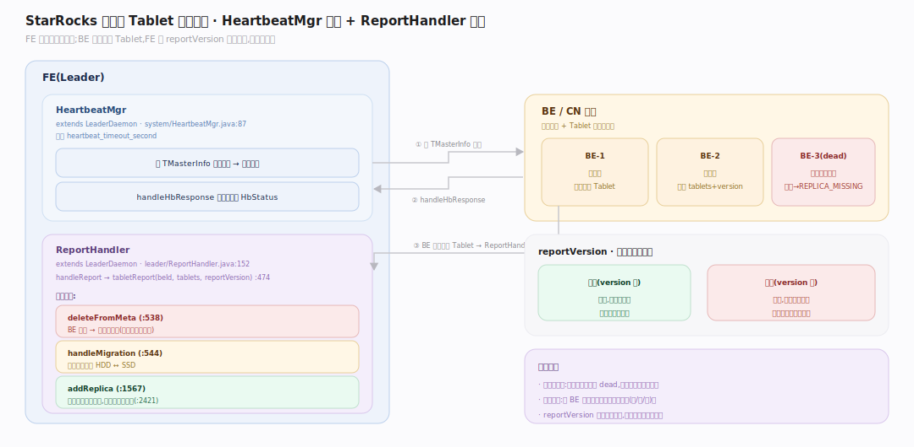

# StarRocks 原理 · 支撑主线 · 集群管理与自愈

> **定位**：属"保障能力域"。管副本健康、数据均匀、高可用——BE/CN 心跳与存活、Tablet 健康检查、克隆修复、负载均衡、Tablet 上报对账。它消费【元数据】里的副本位置、驱动【后台任务】的克隆动作。本地表(三副本冗余)与云原生表(对象存储冗余)自愈模型不同。源码基准 **StarRocks 3.x**(`fe/.../clone/`、`fe/.../system/`、`fe/.../leader/`)。

分布式存储引擎的一半工作是"出错后自己好起来":节点会挂、盘会坏、副本会缺。StarRocks 用一对守护完成自愈——**TabletChecker** 发现不健康的 Tablet 并定优先级,**TabletScheduler** 排队调度克隆修复;再用 **HeartbeatMgr** 探活、**ReportHandler** 对账。本地表靠多副本冗余修复;云原生表数据在对象存储、计算节点(CN)无状态,自愈退化为"重新分配 Shard 给活着的 CN"。

---

## 一、Tablet 健康检查与优先级

**TabletChecker**(`extends LeaderDaemon`)周期扫描所有 Tablet,用 `getTabletHealthStatusWithPriority` 算出 `(TabletHealthStatus, Priority)`。健康状态覆盖:`HEALTHY`、`REPLICA_MISSING`(副本缺)、`VERSION_INCOMPLETE`(版本不全)、`LOCATION_MISMATCH`(位置不符)、`FORCE_REDUNDANT`(强制冗余)、`NEED_FURTHER_REPAIR`(需进一步修复)。不健康的 Tablet 被包成 `TabletSchedCtx` 交给调度器;管理员 `ADMIN REPAIR` 可把优先级提到 VERY_HIGH。

**为什么先检查再调度**:健康度是"可观测量",优先级是"动作排序依据"——这正是"反馈即控制"在自愈上的体现:sense(检查)→ compare(算健康度)→ act(排队修复)。

---

## 二、Tablet 调度与克隆修复

**TabletScheduler**(`extends LeaderDaemon`,`SCHEDULE_INTERVAL_MS=1000`)维护不变式 `allTabletIds = pendingTablets + runningTablets`:`pendingTablets` 是按优先级排序的 `PriorityQueue<TabletSchedCtx>`,`runningTablets` 是 Map。主循环 `updateClusterLoadStatisticsAndPriority` 后 `handleRunningTablets`,分发 **CloneTask** 到目标 BE 拉取健康副本。

背压:`Config.tablet_sched_max_scheduling_tablets` 限并发;每盘并发槽 `MIN_SLOT_PER_PATH=2 .. MAX_SLOT_PER_PATH=64`,防单盘 IO 被克隆打满。克隆完成后新副本经 publish 追上版本,Tablet 转 HEALTHY。

---

## 三、负载均衡

健康之外还要**均匀**。`updateClusterLoadStatistic` 构建 `ClusterLoadStatistic`(各 BE 的盘用量/Tablet 数),再由再平衡器搬迁 Tablet:

- **DiskAndTabletLoadReBalancer**:按磁盘用量 + Tablet 数把热点 BE 的副本迁到空闲 BE。
- **ColocateTableBalancer**:维持 colocate 组内 Tablet 的对齐(同组同分桶落同 BE,Join 免 shuffle)。
- 均衡任务与修复任务共用调度器与并发槽——修复优先级高于均衡(缺副本比不均匀更急)。

---

## 四、BE/CN 存活与 Tablet 上报对账

**HeartbeatMgr**(`extends LeaderDaemon`,周期 `heartbeat_timeout_second`)向每个节点发 `TMasterInfo` 心跳,`handleHbResponse` 更新存活状态(`HbStatus`)。节点连续心跳失败被标记 dead,其上副本进入 REPLICA_MISSING 触发修复。

**Tablet 上报**由 BE 定期发起、FE 的 **ReportHandler**(`extends LeaderDaemon`)处理:`handleReport → tabletReport(beId, tablets, reportVersion)`。对账动作:
- `deleteFromMeta`:BE 已没有的副本从元数据删除(持表写锁,分批让出)。
- `handleMigration`:存储介质迁移(HDD↔SSD)。
- `addReplica`:FE 元数据有但需补的副本,加前再校验状态。

`reportVersion` 用来排序/丢弃过期上报,防止旧报覆盖新状态。

---

## 拓展 · 自愈关键结构一览

| 结构 | 定义 | 职责 |
|---|---|---|
| TabletChecker | `clone/TabletChecker.java:92` | 扫描健康度 + 定优先级 |
| TabletScheduler | `clone/TabletScheduler.java:130` | 排队调度克隆修复 |
| TabletSchedCtx | `clone/TabletChecker.java:853` | 单个待调度 Tablet 上下文 |
| CloneTask | `task.CloneTask` | 拉健康副本的克隆任务 |
| HeartbeatMgr | `system/HeartbeatMgr.java:87` | 节点存活探测 |
| ReportHandler | `leader/ReportHandler.java:152` | Tablet 上报对账 |
| ClusterLoadStatistic | `clone/TabletScheduler.java:526` | 集群负载统计(均衡依据) |
| DynamicPartitionScheduler | `clone/DynamicPartitionScheduler.java:101` | 动态分区自动增删 |

## 调优要点（关键开关）

- **`tablet_sched_max_scheduling_tablets`**:同时调度的 Tablet 上限,过大压垮 BE、过小修复慢。
- **`heartbeat_timeout_second`**:判定节点 dead 的阈值;抖动网络下调大避免误判触发大量克隆。
- **克隆槽 `MIN/MAX_SLOT_PER_PATH`**:每盘并发克隆数,防修复 IO 抢占查询。
- **`tablet_sched_disable_balance`**:必要时临时关均衡(如大导入期),只保修复。

## 常见误区与工程要点

- **误区:节点挂了数据就丢。** 本地表默认三副本,挂一个由 TabletScheduler 从健康副本克隆补齐;云原生表数据在对象存储,只需重分配 Shard。
- **误区:均衡和修复一回事。** 修复解决"缺副本/坏副本"(高优先级),均衡解决"分布不均"(低优先级),共用调度器但修复优先。
- **误区:上报慢会导致状态错乱。** `reportVersion` 排序丢弃过期上报,保证最终以最新为准。
- **误区:云原生表也要克隆修复。** 不。CN 无状态,节点挂了 StarOS 把 Shard 重分配给活 CN 即可,无需搬数据。
- **归属提醒**:副本位置的持久化在【元数据】;克隆是【后台任务】动作;版本追平靠【事务一致性】publish;调度不改数据格式(那是【存储引擎】)。

## 一句话总纲

**StarRocks 自愈是一条"检查→调度→修复"的反馈闭环:TabletChecker 周期扫描算出每个 Tablet 的健康度与优先级(REPLICA_MISSING/VERSION_INCOMPLETE…),TabletScheduler 用优先级队列排队、发 CloneTask 从健康副本克隆补齐(每盘并发有槽位限流),HeartbeatMgr 探活、ReportHandler 按 reportVersion 对账增删副本;负载均衡(DiskAndTabletLoadReBalancer/ColocateTableBalancer)与修复共用调度器但优先级更低;本地表靠多副本冗余修复,云原生表因 CN 无状态退化为 StarOS 重分配 Shard。**
