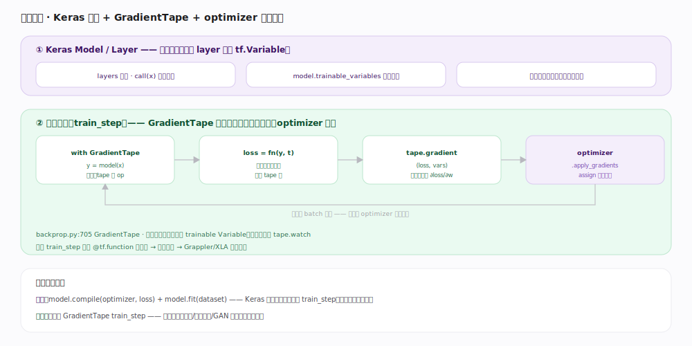
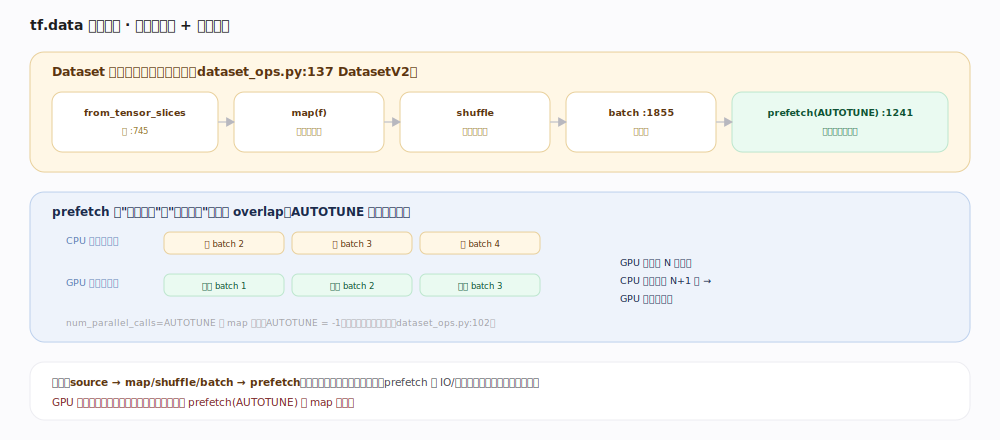

# TensorFlow 核心原理 · 接口主线 · 建模与训练

> **定位**：接触面主线之一。高层建模与训练入口——Keras `Model`/`Layer` 组织权重、`GradientTape` 求梯度、`optimizer` 更新、`tf.data` 喂数据，串成训练闭环。核实基准：官方源码（`tensorflow/python/eager/backprop.py:705`、`tensorflow/python/data/ops/dataset_ops.py:137`）。

## 一、训练闭环：模型 + 磁带 + 优化器

一步训练（`train_step`）：① **Keras Model/Layer** 组织权重——每个 layer 持有若干 `tf.Variable`，`model.trainable_variables` 汇总；② 在 `with tf.GradientTape() as tape` 内做前向 `y = model(x)`（`backprop.py:705` 的 GradientTape 边执行边把 op 录到磁带，默认自动追踪读到的 trainable Variable，常量需 `tape.watch` `backprop.py:864`）；③ 算标量 `loss`；④ `tape.gradient(loss, vars)`（`backprop.py:960`）沿录制**逆序回放**求 `∂loss/∂w`；⑤ `optimizer.apply_gradients(zip(grads, vars))`（`tensorflow/python/training/optimizer.py:656`；Keras optimizer 同构）把梯度作用到权重——内部对每个变量按更新规则（`_apply_dense` `optimizer.py:1089`，如 SGD 的 `var -= lr*grad`）发 `AssignSubVariableOp` **原地更新** Variable。下一个 batch 重复，权重被逐步优化。

`optimizer.minimize`（`optimizer.py:463`）则把"求梯度 + 应用梯度"合成一步（内部 `compute_gradients` `optimizer.py:523` + `apply_gradients`）。整个 train_step 常用 `@tf.function` 包起来追踪成图提速——追踪后前向、反向、更新全在一张图里，由 Grappler/XLA 整体优化。

## 二、tf.data 输入管线：声明式变换 + 后台预取

`tf.data.Dataset`（`dataset_ops.py:137` `DatasetV2`）是**惰性、声明式**的变换链：`from_tensor_slices`（`:745`）取源 → `map(f, num_parallel_calls=AUTOTUNE)`（`:2164`）逐元素变换 → `shuffle`（`:1420`）乱序 → `batch`（`:1855`）攒批 → `prefetch(AUTOTUNE)`（`:1241`）后台预取下一批。每个变换只是**往管线里记一个变换节点**、不立即执行；迭代时才拉数据、逐节点求值。`prefetch` 让 CPU 侧数据准备与 GPU 侧训练计算 **overlap**：GPU 训第 N 批时 CPU 已在备第 N+1 批，加速器不空等。`AUTOTUNE = -1`（`:102`）让运行时按吞吐动态调缓冲与并行度——`map` 并行度、`prefetch` 缓冲区都可交给它自适应。

## 深化 · 训练的关键部件

| 部件 | 职责 | 源码/说明 |
|---|---|---|
| Keras Model/Layer | 组织权重与前向 | layer 持有 tf.Variable；model.fit 内置训练循环 |
| GradientTape | 录 op、求梯度 | `backprop.py:705`、`:960`；默认追踪读到的 trainable Variable |
| optimizer | 用梯度更新权重 | `optimizer.py:242`；apply_gradients（`:656`）→ _apply_dense（`:1089`）→ assign Variable |
| tf.data.Dataset | 输入管线 | `dataset_ops.py:137`；map（`:2164`）/batch（`:1855`）/prefetch（`:1241`）惰性链 |
| loss / metrics | 目标与评估 | 标量损失驱动反向；metric 累积状态 |

## 拓展 · 两种训练写法

| 写法 | 适用 | 特点 |
|---|---|---|
| 高层 model.compile + model.fit | 标准监督训练 | Keras 内部就是 GradientTape train_step，省心 |
| 自定义 GradientTape 循环 | GAN / 多优化器 / 自定义损失 | 完全掌控前向、梯度、更新时机 |
| 分布式 strategy.run | 多卡/多机 | 在 strategy.scope 内建模型，run 并行副本（见「分布式训练」） |

## 调优要点

- **输入管线加 `prefetch(AUTOTUNE)` 和 `map(num_parallel_calls=AUTOTUNE)`**：GPU 利用率低、卡等数据时的第一优化。
- **train_step 包 `@tf.function`**：追踪成图后 Grappler/XLA 优化，比 eager 循环快得多。
- **persistent tape 只在需要多次求梯度时用**：`persistent=True`（`backprop.py:509` make_vjp 相关）会保留中间量、占更多内存，用完 `del tape`。
- **大 batch + 混合精度**：提升吞吐；配合 optimizer 的 loss scaling 防 float16 下溢。

## 常见误区

- **"GradientTape 会追踪所有东西"**：默认只追踪被读到的 `tf.Variable`；常量张量要 `tape.watch`，或用 `watch_accessed_variables=False`（`backprop.py:763`）关闭自动追踪再手动 watch。
- **"tape 可以反复 gradient"**：默认非持久，`gradient` 调一次后资源即释放；要多次求梯度需 `persistent=True`。
- **"model.fit 和自定义循环性能不同"**：底层都是同一套 train_step（前向→tape.gradient→apply_gradients），fit 只是把这段循环连同 batch 迭代、metric 累积、回调都封装好，并默认用 tf.function 包起来。
- **"apply_gradients 会自己求梯度"**：不会。它只消费已算好的 (grad, var) 对做更新；求梯度是 GradientTape 的事。`minimize` 才把两步合一。
- **"数据慢就换更快的硬盘"**：多数是管线没并行/没预取；先上 tf.data 的 map 并行 + prefetch。

## 一句话总纲

**建模与训练把张量/变量/图/微分拼成闭环：Keras 组织权重、GradientTape 在 with 上下文录前向再逆序求梯度、optimizer 把梯度 assign 回 Variable、tf.data 在后台预取喂饱加速器——一步 train_step 包成 tf.function 即得图级优化。**
