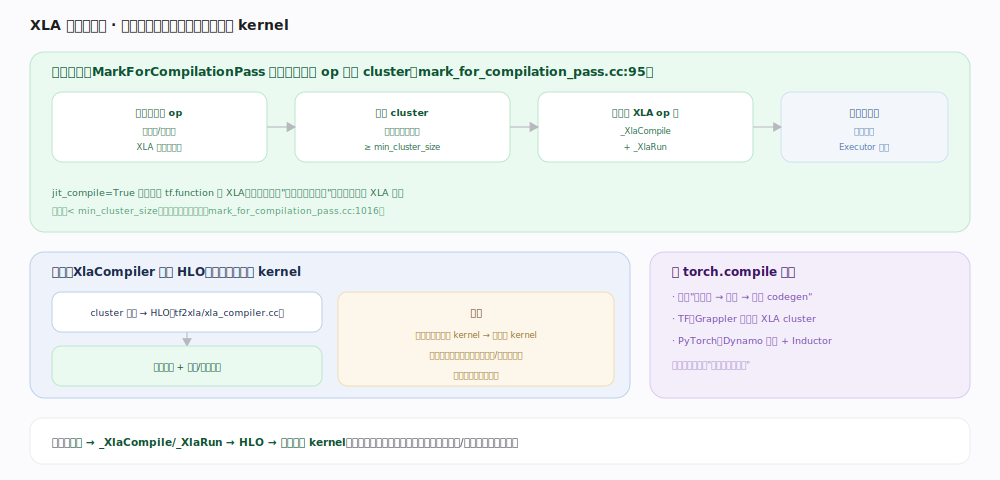
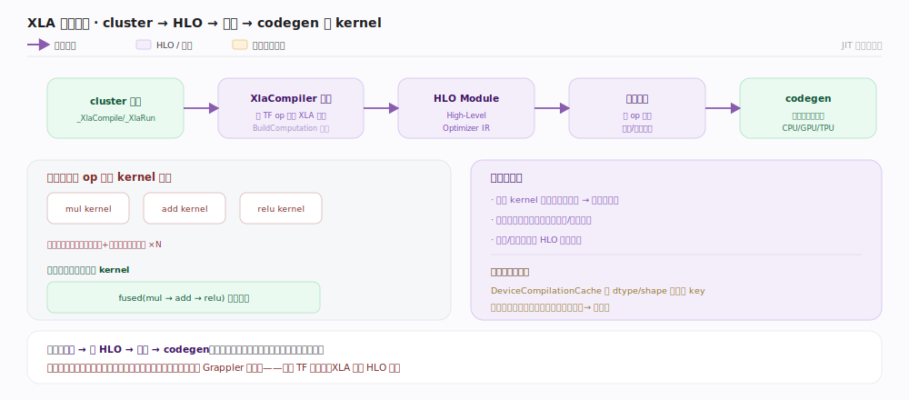

# TensorFlow 核心原理 · 支撑能力域 · XLA 编译与融合

> **定位**：可选的加速编译层。XLA 把图里可编译的子图**聚类**、降解为 `_XlaCompile`/`_XlaRun`、经 `XlaCompiler` 编译成 HLO 并**融合成少量大 kernel**，减少 kernel 启动与中间张量落地。核实基准：官方源码（`tensorflow/compiler/jit/mark_for_compilation_pass.cc:95`、`tensorflow/compiler/jit/build_xla_ops_pass.cc:470`、`tensorflow/compiler/tf2xla/xla_compiler.cc:818`）。

## 一、自动聚类：把可编译 op 圈成 cluster

`MarkForCompilationPassImpl`（`mark_for_compilation_pass.cc:95`）是自动聚类的主体，注释（`:277`）说明它分五步，其中 `RunEdgeContractionLoop` 与 `CreateClusters` 做主要工作：

① **标记可编译 op**——遍历图，用 compilability 检查判定哪些算子有 XLA 降解（元素级、矩阵乘、reduce 等）；
② **边收缩聚类**——`RunEdgeContractionLoop`（`mark_for_compilation_pass.cc:298`）不断尝试 `TryToContractEdge`（`:322`）：把相邻、同设备、都可编译且不引入环的两个 cluster **合并成一个更大的 cluster**（并查集式收缩），直到不能再合并；
③ **过滤小簇**——`CreateClusters`（`:312`）里有大小门槛：只有 `effective_cluster_size() >= min_cluster_size`（`:1032`，由 flag `tf_xla_min_cluster_size` 配，默认几个节点）的 cluster 才保留，太小不值得编译；
④ **降解**——每个保留的 cluster 由后续 `BuildXlaOpsPass`（`build_xla_ops_pass.cc:470` `ReplaceNodeWithXlaCompileAndXlaRun`）替换成 **`_XlaCompile`（`build_xla_ops_pass.cc:499`）+ `_XlaRun`（`:519`）一对**——前者负责（懒）编译并产出可执行 key，后者执行编译产物；未编译部分仍走常规 Executor 作为 fallback（注释 `mark_for_compilation_pass.cc:80`）。

`jit_compile=True` 则强制整个 tf.function 走 XLA；自动聚类是"图里挑能编的段"。

## 二、编译与融合：cluster → HLO → 大 kernel

`_XlaCompile` 运行期调 `XlaCompiler`（`xla_compiler.cc`）把 cluster 子图翻成 **HLO（High-Level Optimizer IR）**：`CompileFunction`（`:818`）/`CompileGraph`（`:1521`）为每个 TF op 发射对应 XLA 算子，`BuildComputation`（`:209`）收口成一个 HLO Module；XLA 在 HLO 上做算子融合 + 布局/内存优化，再 codegen 出目标设备（CPU/GPU/TPU）可执行。产物按 **cluster 签名缓存**——`DeviceCompilationCache`（`device_compilation_cache.h:69`）以 dtype/shape 签名为 key，命中即跳过重编译。

> 收益（见图）：几十个小 kernel 融成一个大 kernel，减少启动次数、中间张量不落显存（留寄存器/共享内存）。代价：首次编译延迟，签名变化（动态形状）触发重编译。

## 深化 · XLA 关键机制

| 机制 | 说明 | 源码锚点 |
|---|---|---|
| 自动聚类主体 | 五步聚类 | `mark_for_compilation_pass.cc:95`、`:277` |
| 边收缩 | 相邻可编译簇合并 | `mark_for_compilation_pass.cc:298`、`:322` |
| min_cluster_size | 太小的簇跳过 | `mark_for_compilation_pass.cc:1032` |
| 降解 | `_XlaCompile` / `_XlaRun` 对 | `build_xla_ops_pass.cc:470`、`:499`、`:519` |
| fallback | 未编译部分走常规执行 | 注释 `mark_for_compilation_pass.cc:80` |
| 编译 | 子图 → HLO Module | `xla_compiler.cc:818`、`:1521`、`:209` |
| 编译缓存 | 按签名缓存可执行 | `device_compilation_cache.h:69` |
| 融合 | 多 op 合成大 kernel | HLO 优化 |
| 强制编译 | jit_compile=True | tf.function 参数 |

## 拓展 · Grappler / XLA / torch.compile 对照

| 维度 | 说明 |
|---|---|
| Grappler | TF 图上的 pass 重写，产物仍是 TF 图 |
| XLA | 把子图编译成融合 HLO，换执行栈（更激进） |
| 顺序 | Grappler 先整体优化，XLA 再对可编译簇编译 |
| torch.compile | Dynamo 抓图 + Inductor 融合，思路与 XLA 神似 |
| 定位 | 都是"编译加速可选层"，不改用户写法 |

## 调优要点

- **形状稳定、计算密集时开 `jit_compile=True`**：融合收益最大；动态形状会频繁触发 `DeviceCompilationCache` miss 而重编译，慎用。
- **减少重编译**：与 tf.function 重追踪同理，固定输入签名让缓存命中。
- **观察是否真被聚类**：小图、含大量不可编译 op 时可能因 `min_cluster_size` 门槛聚不成有效 cluster。
- **TPU 必经 XLA**：TPU 上所有计算都通过 XLA 编译，图设计要 XLA 友好。

## 常见误区

- **"XLA 总是更快"**：不一定。编译开销 + 动态形状重编译可能盖过收益；需按负载实测。
- **"XLA 和 Grappler 重复"**：不重复。Grappler 在 TF 图上重写，XLA 换到 HLO 编译栈做融合 codegen。
- **"开了 jit_compile 整图都编译"**：自动聚类模式下只有 XLA 支持的算子会被 `TryToContractEdge` 收进 cluster，不支持的仍走常规执行 fallback。
- **"XLA 融合改变数值结果"**：融合可能带来微小数值差异（重排/精度），一般可接受但对严格复现需注意。

## 一句话总纲

**XLA 是 TF 的编译加速可选层：MarkForCompilation 用边收缩把相邻可编译 op 聚成 cluster、过滤掉小于 min_cluster_size 的簇、降解为 `_XlaCompile`/`_XlaRun`，XlaCompiler 编成 HLO 并融合成少量大 kernel、按签名缓存——减少 kernel 启动与中间张量落地，形状稳定时收益大，与 torch.compile 思路神似。**
