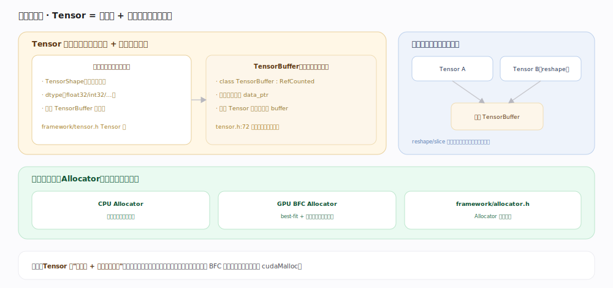
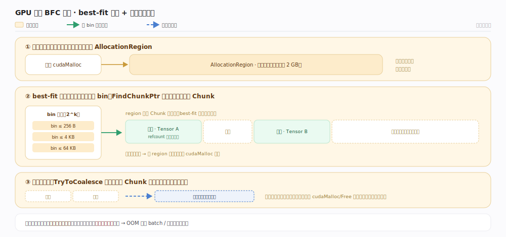
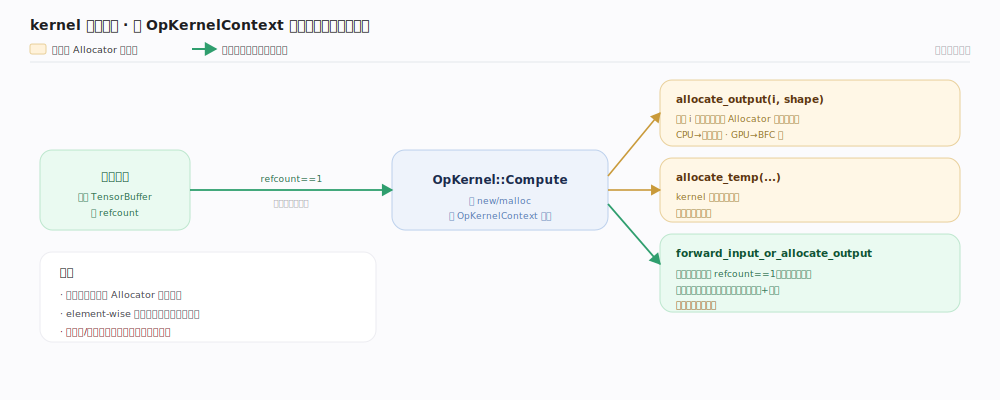
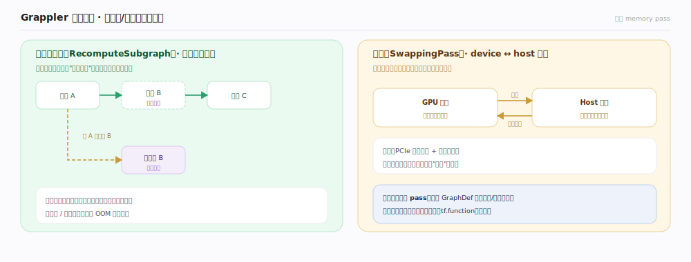

# TensorFlow 核心原理 · 支撑能力域 · 张量与内存

> **定位**：底座能力域。张量（Tensor）是一切算子的输入输出，其内存由引用计数的 TensorBuffer 承载、按设备用 Allocator 分配。被所有能力域依赖。核实基准：官方源码（`tensorflow/core/framework/tensor.h:72`、`tensorflow/core/framework/tensor.h:119`、`tensorflow/core/framework/allocator.h:38`）。

## 一、Tensor 的两半：元信息 + 共享缓冲

C++ 侧的 `Tensor`（`tensorflow/core/framework/tensor.h:119` `class Tensor`）刻意拆成解耦的两半：

- **轻量元信息**——`TensorShape`（各维大小）、`DataType`（dtype）、以及一个指向缓冲的引用计数指针 `core::RefCountPtr<TensorBuffer>`（构造入口见 `tensor.h:180`）。这半是**值语义**：拷贝一个 `Tensor` 只是拷贝几十字节的元信息、并令缓冲引用计数 +1，不复制数据，所以按值传递 `Tensor` 廉价。
- **重的数据缓冲** `TensorBuffer`（`tensor.h:72` `class TensorBuffer : public core::RefCounted`）——真正持有一块设备内存，裸指针由 `data()`（`tensor.h:82`）取出。缓冲是引用计数对象：**多个 Tensor 可共享同一个 TensorBuffer**。

正因为元信息与缓冲分离，`reshape`、`slice`、`bit_cast` 等**视图操作**只重建元信息（改 shape/dtype）、复用底层缓冲、零拷贝——`Tensor::shaped<T,NDIMS>`（`tensor.h:523`）就是把同一块 buffer 重新解释成指定维度的 Eigen 张量。数据的生命周期完全交给引用计数：最后一个引用析构时缓冲才释放。tf.function 追踪出的图内张量是**符号占位**（只有 shape/dtype 契约，无 buffer），执行期由 Executor 才把它绑定到真实缓冲。

## 二、分设备分配：BFC 显存池

内存由 `Allocator`（`allocator.h:38`，实体 `xla/tsl/framework/allocator.h:159` `AllocateRaw`）抽象，**每个设备一个**：CPU 做对齐的系统内存分配；GPU 用 **BFC（best-fit with coalescing）Allocator**（`bfc_allocator.h:95`，GPU 特化 `gpu_bfc_allocator.h:31`）池化显存——如图三步：大块预取（`cudaMalloc` 一整片切成 `AllocationRegion`）、按 bin best-fit 切分（`FindChunkPtr` `bfc_allocator.h:608` 在 bin 找最小够用的空闲 `Chunk` `:294`）、释放即合并（`TryToCoalesce` `:705` 并相邻空闲块抑制碎片）。

> 不变式：池化默认预占大片、内部自管，免频繁 `cudaMalloc/cudaFree` 的内核态延迟与驱动同步；但峰值显存仍受同时存活张量制约。

## 三、kernel 视角：输出张量从哪来

算子并不自己 `new` 内存，而是通过 `OpKernelContext`（`op_kernel.h:572`）向框架申请三类缓冲（见图）：`allocate_output`（`op_kernel.h:1002`）用当前设备 Allocator 为输出分配；`allocate_temp`（`:282`）分配出作用域即释放的临时张量；`forward_input_or_allocate_output`（`:914`）做**原地复用**——输入引用计数为 1（无人共享）时直接把它的缓冲转给输出、省一次分配与拷贝，这是 element-wise 算子省显存的常用手法。

## 四、Grappler 内存优化：重算与换出

图级还有一层内存 pass（`memory_optimizer.cc`），用算力/带宽换峰值显存：**重算换显存**（`RecomputeSubgraph` `:431`，即梯度检查点）把前向中间激活标记"用完即丢、反向要用时重算"；**换出**（`SwappingPass` `:1207`）把暂不用的张量搬到主存、临用前搬回。两者都是图级 pass、对用户代码透明，只在图模式生效。

## 深化 · 内存关键机制

| 机制 | 说明 | 依据 |
|---|---|---|
| 引用计数缓冲 | `TensorBuffer : RefCounted`，多 Tensor 共享 | `tensor.h:72` |
| 元信息/缓冲分离 | 值语义元信息 + RefCountPtr 指向缓冲 | `tensor.h:119`、`:180` |
| 零拷贝视图 | reshape/slice/shaped 复用底层缓冲 | `tensor.h:523` |
| 分设备 Allocator | CPU/GPU 各一，接口统一 | `allocator.h:38`、`xla/tsl/.../allocator.h:159` |
| BFC 显存池 | best-fit + 合并，池化复用 | `bfc_allocator.h:95`、`:608`、`:705` |
| kernel 原地复用 | 输入引用计数为 1 时转给输出 | `op_kernel.h:914` |
| Grappler 内存优化 | 重算/换出省显存 | `memory_optimizer.cc:431`、`:1207` |

## 拓展 · 与相关能力域的关系

| 关联 | 关系 |
|---|---|
| 算子与 kernel | kernel 从 `OpKernelContext::allocate_output` 申请输出缓冲（`op_kernel.h:1002`） |
| 设备与后端 | 张量所在设备决定用哪个 Allocator；跨设备靠 Send/Recv 拷贝 |
| XLA | 融合后中间张量不落显存，直接留在寄存器/共享内存 |
| 执行引擎 | Executor 管张量在节点间的传递与生命周期（引用计数驱动释放） |

## 调优要点

- **显存 OOM 优先查碎片与峰值**：BFC 已池化，但峰值仍受同时存活张量制约；减小 batch、开梯度检查点（`RecomputeSubgraph` 重算换显存）。
- **避免无谓拷贝**：优先用视图（reshape/slice）而非复制；跨设备传输是显式 Send/Recv，减少跨设备来回。
- **让算子原地复用**：可原地的 element-wise 算子借 `forward_input_or_allocate_output` 复用输入缓冲。
- **混合精度省显存**：float16/bfloat16 激活占用减半。
- **`TF_GPU_ALLOCATOR` / 显存增长**：`set_memory_growth` 按需增长而非一次占满，多进程共享 GPU 时有用。

## 常见误区

- **"每个 Tensor 独占一块内存"**：错。视图张量共享同一 TensorBuffer，靠引用计数管生命周期。
- **"GPU 显存用 cudaMalloc 逐次分配"**：默认走 BFC 池化分配器，不是每个张量一次 cudaMalloc。
- **"reshape 会复制数据"**：通常不会，只改元信息、共享缓冲（除非需要连续化）。
- **"kernel 里 new/malloc 自己管内存"**：错。走 `OpKernelContext` 的 allocate_* 接口，由设备 Allocator 统一管理。
- **"TF 一启动就占满显存是 bug"**：默认行为（预占以减碎片）；要按需增长得显式开 memory growth。

## 一句话总纲

**张量是"轻元信息 + 引用计数的共享缓冲"：视图零拷贝复用底层内存，缓冲用引用计数管生命周期；内存按设备由 Allocator 分配，GPU 靠 BFC 池化显存（best-fit + 合并）避免频繁 cudaMalloc，kernel 经 OpKernelContext 申请并可原地复用输入——这是所有算子计算的内存底座。**
