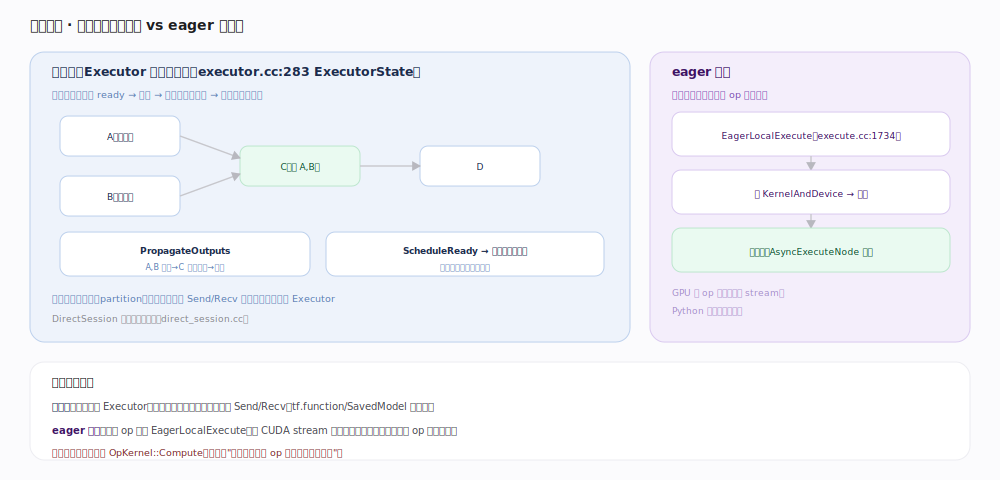

# TensorFlow 核心原理 · 支撑能力域 · 执行引擎

> **定位**：让图/算子真正跑起来的能力域。图模式下 `Executor` 按数据流调度节点（就绪即执行、并行无依赖节点）；eager 模式下逐算子直接下发。核实基准：官方源码（`tensorflow/core/common_runtime/executor.cc:283`、`tensorflow/core/common_runtime/propagator_state.cc:76`、`tensorflow/core/common_runtime/eager/execute.cc:1734`）。

## 一、图模式：Executor 数据流调度

图模式的核心是 `ExecutorState`（`executor.cc:283`，其编译期常量图信息封装在 `ExecutorImpl` `:148`）的**数据流调度**：

- **就绪判定**——每个节点在 `PendingCounts`（`pending_counts.h:50`）里记一个待满足输入数（pending count）。执行从入口根节点开始（`RunAsync`，`executor.cc:494`）；一个节点的 pending count **归零即 ready**，进入就绪集合。
- **传播与唤醒**——节点算完后 `NodeDone`（`executor.cc:1189`）调 `PropagatorState::PropagateOutputs`（`propagator_state.cc:76`），把输出沿出边送给后继并 `ActivateNodesAndAdjustOutstanding`（`propagator_state.cc:108`）令其 pending 递减，归零的后继被激活成新的就绪节点。
- **调度与并行**——`ScheduleReady`（`executor.cc:1268`）把就绪节点分派给线程池，**无数据依赖的节点因此天然并行**。为省调度开销，Executor 用**代价模型**区分廉价/昂贵算子（`IsExpensive`，`executor.cc:185`）：廉价 op 直接在当前线程内联跑（`ProcessSync`，`executor.cc:307`），昂贵/异步 op 才丢线程池或走异步回调（`ProcessAsync`，`executor.cc:310`）。

图先按设备**切分**（partition），跨设备边插入 Send/Recv 节点、每个设备一个 Executor。控制流（while/cond）在 `PropagatorState` 里以 **frame + iteration** 表达，死分支张量（dead tensor）也随数据流传播、令未走到的分支不执行。本地图执行由 `DirectSession`（`direct_session.cc`）驱动。

## 二、eager 模式：逐算子直接下发

eager 无图、无数据流调度器：顶层 `EagerExecute`（`eager/execute.cc:2261`）分派，本地路径进 `EagerLocalExecute`（`eager/execute.cc:1734`）——一个 op 一次：`GetOrCreateKernelAndDevice`（`execute.cc:1264`，按 op 签名查/建 `KernelAndDevice` 并缓存）→ `AddOrExecuteNode`（`execute.cc:1649`）执行 → 返回 `TensorHandle`。

可异步：`AddOrExecuteNode` 里构造 `AsyncExecuteNode`（`execute.cc:1688`）入执行队列，GPU 上把 op 异步下发到 CUDA stream，Python 侧不阻塞等结果、靠 stream 拿到并行；需要具体值（如 `.numpy()`）时才同步。区别于图模式在于"**谁编排一批 op 的顺序与并行**"——eager 靠 stream 异步与 kernel 缓存，图模式靠 Executor 数据流调度。

## 深化 · 执行关键机制

| 机制 | 说明 | 源码锚点 |
|---|---|---|
| ExecutorState/Impl | 数据流调度状态机 | `executor.cc:283`、`:148` |
| pending count | 入度归零即 ready | `pending_counts.h:50` |
| RunAsync | 从根节点启动执行 | `executor.cc:494` |
| NodeDone → 传播 | 唤醒后继、递减 pending | `executor.cc:1189`、`propagator_state.cc:76`、`:108` |
| ScheduleReady | 就绪节点丢线程池并行 | `executor.cc:1268` |
| 代价模型 | 廉价内联 / 昂贵入池 | `executor.cc:185`、`:307`、`:310` |
| 图切分 | 按设备 partition + Send/Recv | 跨设备通信 |
| eager 顶层分派 | EagerExecute → LocalExecute | `eager/execute.cc:2261`、`:1734` |
| kernel 缓存 | 按签名查/建 KernelAndDevice | `eager/execute.cc:1264` |
| 异步节点 | AsyncExecuteNode 入队 | `eager/execute.cc:1649`、`:1688` |

## 拓展 · 图模式 vs eager 模式

| 维度 | 图模式（Executor） | eager 模式 |
|---|---|---|
| 编排者 | Executor 数据流调度 | 无，逐 op 下发 |
| 并行 | 无依赖节点线程池并行 | 靠 CUDA stream 异步 |
| 跨设备 | Send/Recv 节点 | 逐 op 拷贝 |
| 优化 | 配合 Grappler/XLA | 无跨 op 优化 |
| 用于 | tf.function / SavedModel | 开发调试 |

## 调优要点

- **热路径用 tf.function 进图模式**：Executor 能自动并行无依赖分支、配合 Grappler/XLA。
- **减少跨设备 Send/Recv**：把强关联算子 colocate 到同设备（见「设备与后端」）。
- **inter/intra_op_parallelism_threads**：调线程池大小匹配 CPU 核数与 op 粒度；配合代价模型让廉价 op 内联。
- **eager 下用异步执行**：GPU op 异步下发、Python 不阻塞，能重叠 Python 开销与 GPU 计算。

## 常见误区

- **"图执行是顺序跑节点"**：不是。是数据流并行——pending 归零的就绪节点并行执行，只受数据依赖约束。
- **"eager 每步都同步等 GPU"**：默认异步下发到 stream，需要值时（如 .numpy）才同步。
- **"一个进程一个 Executor"**：每个设备（分区）一个 Executor，跨设备靠 Send/Recv 协作。
- **"所有 op 都丢线程池"**：廉价 op 走 `ProcessSync` 内联，避免调度开销盖过算子本身。
- **"Executor 决定 kernel 怎么算"**：不。Executor 只编排顺序/并行，真正算的是 OpKernel::Compute。

## 一句话总纲

**执行引擎有两条路：图模式 Executor 按数据流调度（pending 归零即就绪、PropagateOutputs 唤醒后继、无依赖并行、代价模型分廉价内联/昂贵入池、跨设备 Send/Recv），eager 模式逐 op EagerLocalExecute 下发、按签名缓存 kernel、靠 stream 异步——都落到 OpKernel::Compute，区别在谁编排一批 op。**
