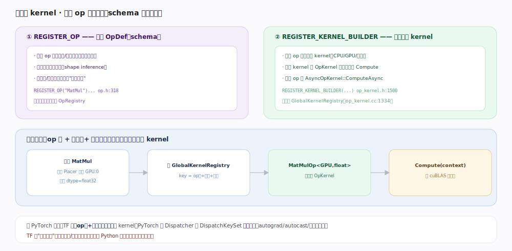

# TensorFlow 核心原理 · 支撑能力域 · 算子与 kernel 注册

> **定位**：计算的最小执行单元。一个算子（op）在 TF 里"两次注册"：`REGISTER_OP` 注册接口契约（OpDef schema），`REGISTER_KERNEL_BUILDER` 注册各设备的具体实现（OpKernel）。运行时按「op 名 + 设备」查全局注册表选唯一 kernel。核实基准：官方源码（`tensorflow/core/framework/op.h:318`、`op_kernel.h:1500`、`op_kernel.cc:1334`）。

## 一、一个 op 两次注册：schema 与实现分离

**① `REGISTER_OP("MatMul")…`**（宏 `op.h:318`，链式构造经 `OpDefBuilderWrapper` `op.h:224`）注册一个 **OpDef（schema）**：op 名、输入/输出、属性（attr）、类型约束，并用 `.SetShapeFn(...)`（`op.h:278`）挂上**形状推导函数**——供图构建期在不实际计算的情况下推断输出 shape，是**与设备/实现无关的接口契约**，静态初始化时进入 OpRegistry。

**② `REGISTER_KERNEL_BUILDER(…)`**（宏 `op_kernel.h:1500`，展开链 `:1496`→`:1490`→`:1469`）注册**设备 kernel**：一个 op 可有多个 kernel（CPU/GPU、不同 dtype），每个是 `OpKernel`（`op_kernel.h:107`）子类，构造期从 `OpKernelConstruction`（`op_kernel.h:258`）读 attr，运行期重写 `Compute(OpKernelContext*)`（`:158`，纯虚）；耗时/阻塞 op（Recv、队列出队）必须改用 `AsyncOpKernel`（`op_kernel.h:231`）的 `ComputeAsync`（`:251`），否则会占死执行线程池。所有 kernel 注册进 **GlobalKernelRegistry**（`op_kernel.cc:1334`，可写视图 `:1343`）——一张全局的 `(op名, 设备, 约束) → kernel 工厂` 表。

## 二、分发：按「op 名 + 设备」查表选 kernel

一个已被 Placer 定到 GPU:0、输入 float32 的 MatMul 节点，执行前要绑定 kernel：`FindKernelRegistration`（`op_kernel.cc:1447`）以 `key = op名 + 设备类型 + 类型约束` 查 `GlobalKernelRegistry`，命中唯一 `MatMulOp<GPU, float>`；`CreateOpKernel`（`op_kernel.h:1405`）据此实例化 kernel 对象（构造期解析 attr），之后每次执行调其 `Compute(context)`（内部转手 cuBLAS）。`FindKernelDef`（`op_kernel.cc:1549`）则单独用于查 KernelDef 元信息（如 Placer 判断某设备是否支持该 op）。

这是**单层查表**分发——与 PyTorch 的 Dispatcher 分层分发（按 DispatchKeySet 逐层穿 autograd/autocast/后端）形成对比。TF 把"自动微分/精度"这类切面放在**图变换与 Python 层**做（GradientTape 磁带、Grappler 的 auto_mixed_precision pass），而非算子分发层。

## 深化 · 注册与分发关键点

| 概念 | 说明 | 源码锚点 |
|---|---|---|
| OpDef（schema） | op 的接口契约，与实现无关 | `op.h:318`、`op.h:224` |
| 形状推导 | SetShapeFn 挂载，构建期推 shape | `op.h:278` |
| OpKernel | 基类，重写 Compute | `op_kernel.h:107`、`:158` |
| OpKernelConstruction | 构造期读 attr | `op_kernel.h:258` |
| AsyncOpKernel | 异步 op（如 Recv、队列） | `op_kernel.h:231`、`:251` |
| OpKernelContext | 入参/出参、分配器、设备 | `op_kernel.h:572` |
| kernel 注册 | 进全局注册表 | `op_kernel.h:1500`、`op_kernel.cc:1334`、`:1343` |
| kernel 查找 | 按 op+设备+约束查表 | `op_kernel.cc:1447`、`:1549` |
| kernel 实例化 | 命中后 new 出 kernel | `op_kernel.h:1405` |

## 拓展 · 与 PyTorch 分发对照

| 维度 | TensorFlow | PyTorch |
|---|---|---|
| 选 kernel | op 名 + 设备 + 约束，单层查表 | DispatchKeySet 分层分发 |
| autograd | 图/Python 层 + GradientTape 记录 | Autograd 分发键（每算子一层） |
| 混合精度 | Grappler auto_mixed_precision pass | Autocast 分发键 |
| 扩展新算子 | REGISTER_OP + REGISTER_KERNEL_BUILDER | 注册 kernel 到 Dispatcher |

## 调优要点

- **确认 op 有 GPU kernel**：没有会（soft placement 下）回退 CPU，产生跨设备拷贝拖慢；查日志 device placement，本质是 `FindKernelRegistration` 未命中 GPU 项。
- **自定义 op 要为每个目标设备各注册 kernel**：只注册 CPU kernel 的 op 在 GPU 图里会被拉回 CPU。
- **优先用有融合 kernel 的组合**：如 fused BatchNorm、Conv+BiasAdd+Relu，比拆开的多个 op 快（也利于 Grappler remap）。
- **类型约束匹配**：kernel 按 dtype 注册，混用未注册 dtype 会 `FindKernelRegistration` 失败报错。

## 常见误区

- **"REGISTER_OP 就能算了"**：不能。REGISTER_OP 只注册 schema，还得 REGISTER_KERNEL_BUILDER 提供实现才有 kernel 可跑。
- **"一个 op 只有一个实现"**：一个 op 常有多个 kernel（各设备、各 dtype），运行时按 key 选。
- **"形状要跑起来才知道"**：不必。SetShapeFn 让构建期就能推断输出 shape，支撑静态图校验。
- **"TF 有 Dispatcher 分层像 PyTorch"**：TF 是单层查表；分层分发是 PyTorch 的特色。
- **"Compute 里能随便阻塞"**：阻塞/等待类 op 应实现 AsyncOpKernel::ComputeAsync，否则占死执行线程。

## 一句话总纲

**算子两次注册、schema 与实现分离：REGISTER_OP 定接口契约（含 SetShapeFn 形状推导）、REGISTER_KERNEL_BUILDER 为各设备各 dtype 提供 OpKernel；运行时 FindKernelRegistration 按「op 名 + 设备 + 约束」单层查全局注册表、CreateOpKernel 实例化、调 Compute——切面（autograd/精度）不在分发层而在图/Python 层，这是与 PyTorch 分层分发的分野。**
