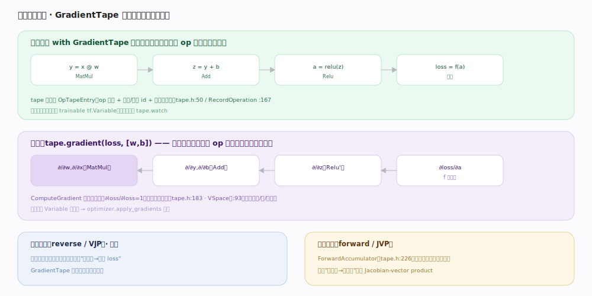

# TensorFlow 核心原理 · 支撑能力域 · 自动微分引擎

> **定位**：灵魂能力域之一，可微性根基。TF 用**磁带（tape）**做自动微分：`GradientTape` 上下文内执行 op 时把操作录到磁带，`gradient` 沿录制**逆序回放**、逐 op 调反向函数、链式累积梯度。核实基准：官方源码（`tensorflow/c/eager/tape.h:136`、`:183`、`tensorflow/python/eager/backprop.py:705`）。

## 一、前向录制：磁带记下每个 op

在 `with tf.GradientTape() as tape` 上下文内，每执行一个 op 就把它录到磁带：C++ 侧 `GradientTape`（`tape.h:136`）的 `RecordOperation`（声明 `:167`、实现 `:423`）追加一个 `OpTapeEntry`（`tape.h:50`：op 类型 + 输入/输出 tensor id + 该 op 的反向函数 `BackwardFunction`）。录制只发生在磁带"开着"时——Python 侧进入上下文触发 `_push_tape`（`backprop.py:831`），`stop_recording`（`backprop.py:887`）可临时暂停录制以省内存。

Python 侧 `GradientTape`（`backprop.py:705`，构造 `__init__` `:801`）默认**自动追踪被读到的 trainable `tf.Variable`**；常量张量需 `tape.watch(x)`（`backprop.py:864`）显式加入，或用 `watch_accessed_variables=False`（说明见 `:763`）关闭自动追踪后手动 watch。每个 op 的反向函数由 `_gradient_function`（`backprop.py:118`）按 op 名查注册表取得。前向照常算出真实值，磁带只是"旁录"操作序列——所以是 **define-by-run**：控制流走哪条分支，磁带就录哪条。

## 二、反向回放：逆序遍历磁带、链式累积

`tape.gradient(loss, [w, b])`（Python `gradient` `backprop.py:960`）触发 C++ 侧 `ComputeGradient`（`tape.h:183`）：

1. **初始化种子梯度**——`InitialGradients`（`tape.h:614`）把目标（loss）的梯度置为 `∂loss/∂loss = 1`，其余为空；
2. **逆序回放**——按磁带记录的**逆序**遍历，对每个 `OpTapeEntry` 调其 `BackwardFunction`：输入是该 op 输出的累积梯度，输出是对该 op 各输入的梯度；
3. **链式累积**——梯度沿输入方向继续向上游传播，在多路汇合处**求和累加**（一个张量被多个 op 消费时其梯度是各路之和），最终得到每个 Variable 的 `∂loss/∂param`。

`VSpace`（`tape.h:93`）抽象梯度空间的"加法 / 零梯度 / 一梯度 / 调用反向函数"等原语，使磁带引擎与具体张量类型解耦（同一套逻辑既服务 eager 张量，也服务符号张量）。所得梯度交给 `optimizer.apply_gradients` 更新权重。若要一次性求整个 Jacobian，用 `jacobian`（`backprop.py:1085`）。

## 三、两种模式：反向（默认）与前向

**反向模式（reverse / VJP）**：一次反向求出全部参数的梯度，适合"多输入 → 标量 loss"，训练用它，`GradientTape` 就是它；底层可复用 `make_vjp`（`backprop.py:509`）构造 vector-Jacobian product。**前向模式（forward / JVP）**：`ForwardAccumulator`（`tape.h:238`）随前向同时算方向导数、不需回放磁带，适合"少输入 → 多输出"，如计算 Jacobian-vector product。二者可嵌套组合（forward-over-reverse）算 Hessian-vector product。

## 深化 · 自动微分关键机制

| 机制 | 说明 | 源码锚点 |
|---|---|---|
| 磁带记录 | RecordOperation 追加 OpTapeEntry | `tape.h:167`、`:423`、`:50` |
| 种子梯度 | ∂loss/∂loss=1 初始化 | `tape.h:614` |
| 反向回放 | ComputeGradient 逆序遍历累积 | `tape.h:183` |
| 梯度空间抽象 | VSpace（加/零/一梯度） | `tape.h:93` |
| 前向模式 | ForwardAccumulator（JVP） | `tape.h:238` |
| 反向函数查表 | 按 op 名取梯度函数 | `backprop.py:118` |
| Python 入口 | GradientTape / gradient / watch | `backprop.py:705`、`:960`、`:864` |
| 录制开关 | 进出上下文 / 暂停 | `backprop.py:831`、`:887`、`:763` |
| VJP / Jacobian | make_vjp / jacobian | `backprop.py:509`、`:1085` |

## 拓展 · 与 PyTorch autograd 对照

| 维度 | TensorFlow GradientTape | PyTorch autograd |
|---|---|---|
| 记录方式 | 显式 `with tape` 上下文录 op | 隐式：requires_grad 张量经算子自动建反向图 |
| 触发范围 | 只录磁带上下文内的 op | 全程只要 requires_grad 就记 |
| 反向 | tape.gradient 逆序回放录制 | loss.backward 遍历动态反向图 |
| 变量追踪 | 默认追 Variable，常量需 watch | 叶子张量 requires_grad=True |
| 相同点 | 都是 define-by-run 式动态求导 | 都随前向记录、反向逆序 |

## 调优要点

- **只把需要求导的计算放进 tape**：磁带外的前向不记录、省内存；不需处用 `stop_recording` 暂停。
- **`persistent=True` 仅在需多次 gradient 时用**：会保留中间量，用完 `del tape` 及时释放。
- **常量输入求导记得 `tape.watch`**：只有被 watch 或 trainable Variable 才有梯度。
- **高阶导数嵌套 tape**：外层 tape 追踪内层 gradient 的计算即可求二阶；或 forward-over-reverse 求 HVP。

## 常见误区

- **"tape 会追踪一切"**：默认只追踪读到的 trainable Variable；常量张量不 watch 就没梯度。
- **"gradient 能调多次"**：默认非持久，调一次即释放；多次需 persistent。
- **"磁带外的操作也会求导"**：不会，只有上下文内录制的 op 参与反向。
- **"汇合处梯度取其一"**：错，多路梯度在汇合张量处**求和**累积（VSpace 的加法原语）。
- **"TF 的图就是反向图"**：不是。前向图是 tf.function 追踪的；反向来自 GradientTape 的磁带记录，二者不同。

## 一句话总纲

**自动微分靠磁带：GradientTape 在 with 上下文内把每个 op 录成 OpTapeEntry，gradient 由 InitialGradients 置 ∂loss/∂loss=1、ComputeGradient 逆序回放、逐 op 调反向、汇合处求和累积到 Variable 的梯度——默认追踪 trainable 变量、常量需 watch，反向模式训练、ForwardAccumulator 前向模式算 JVP。**
