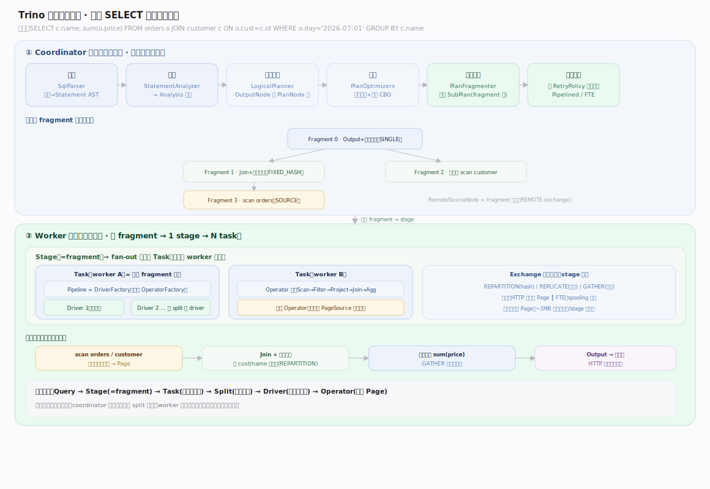
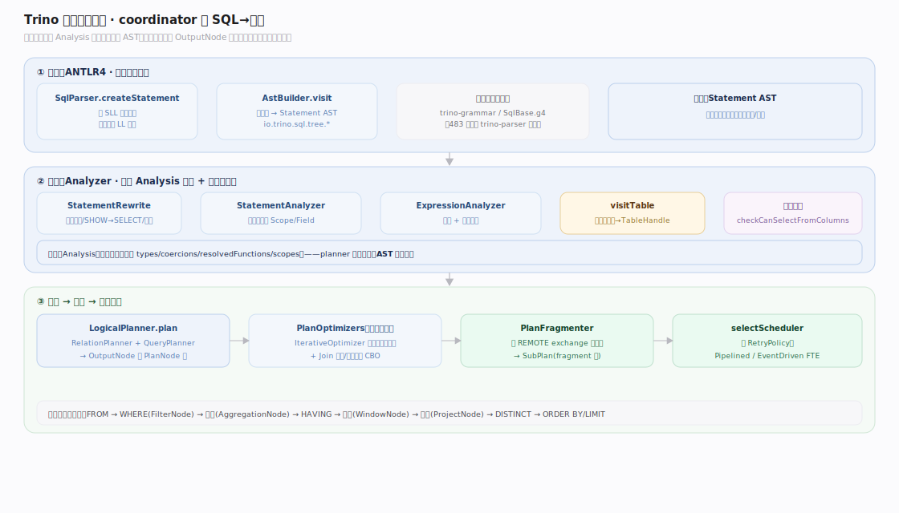
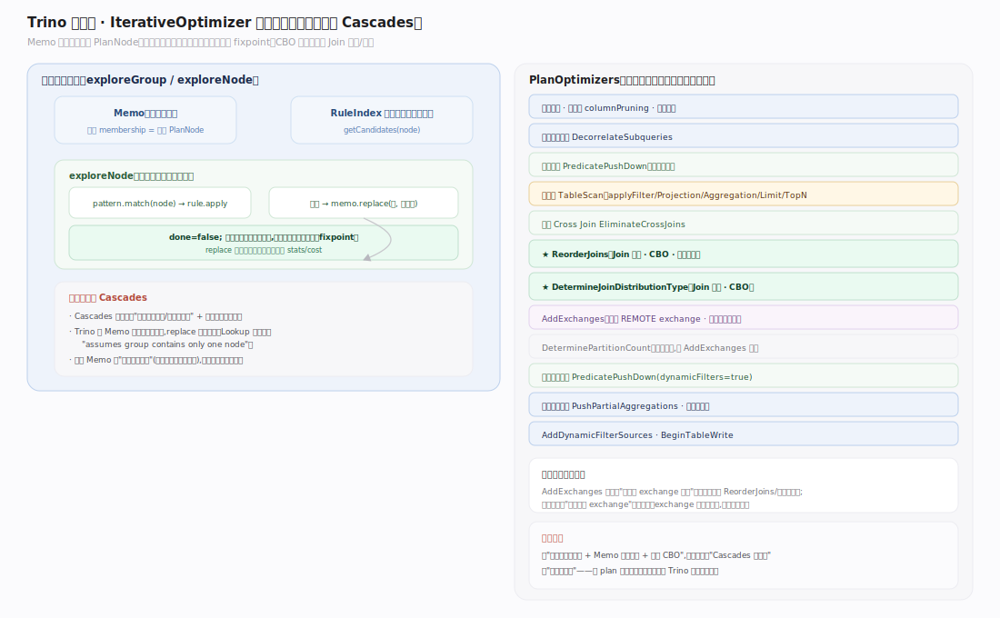
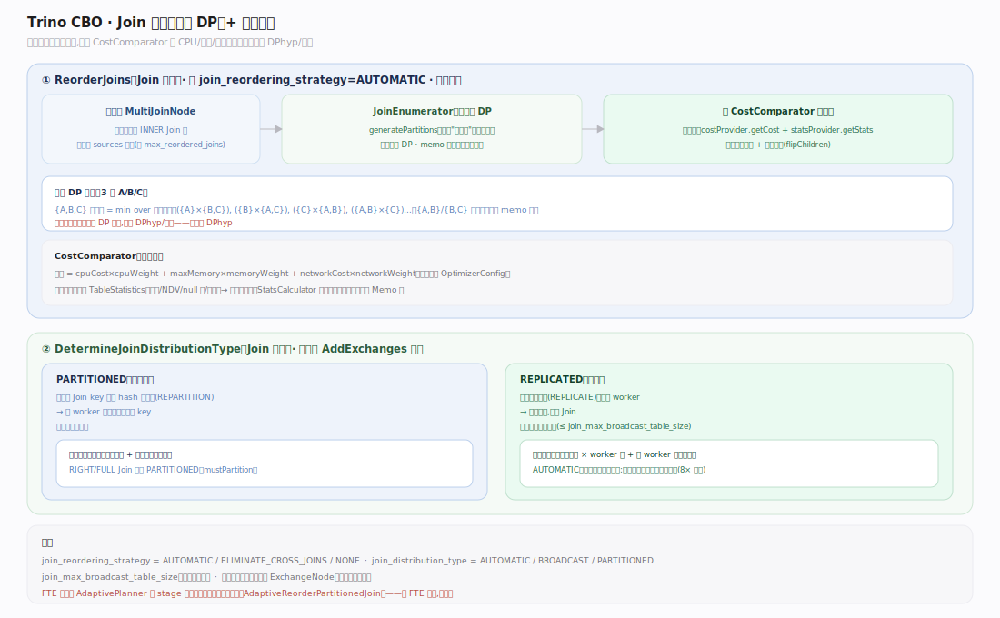
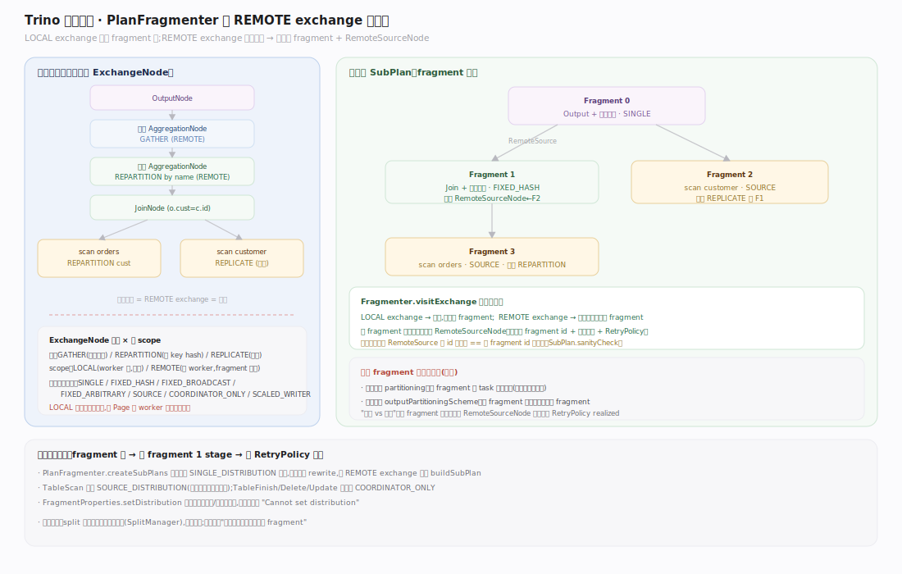
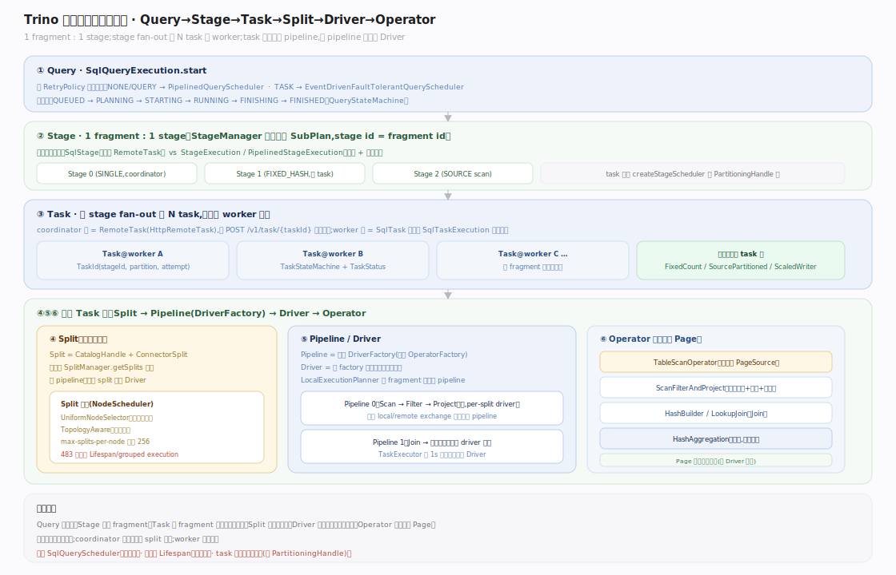
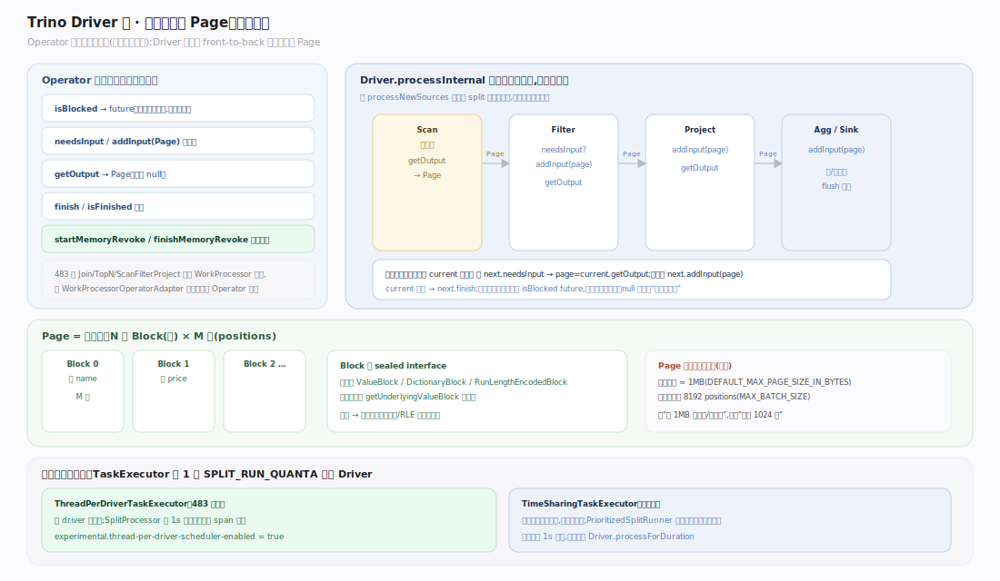
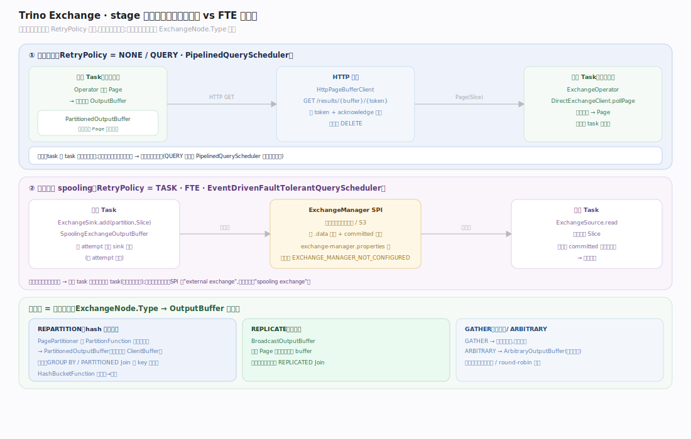
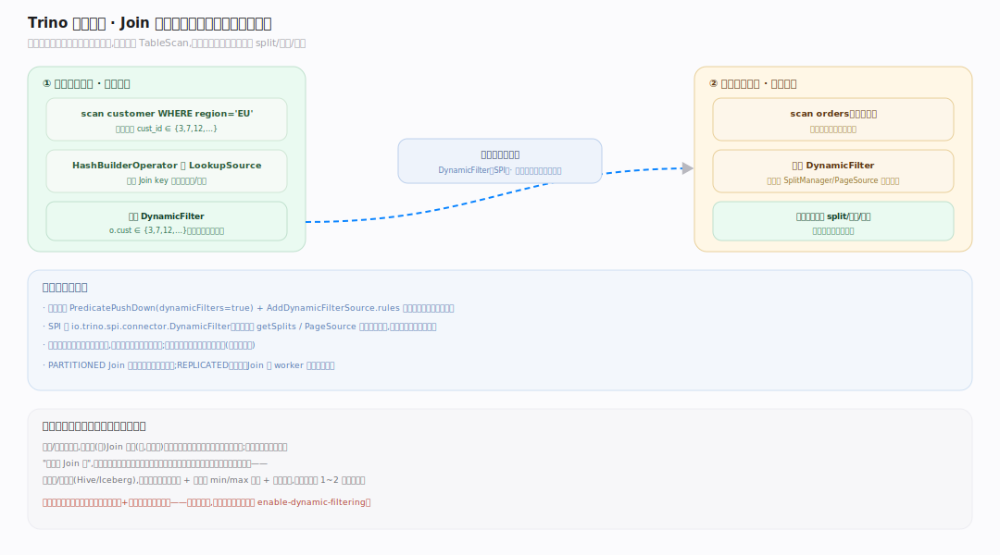
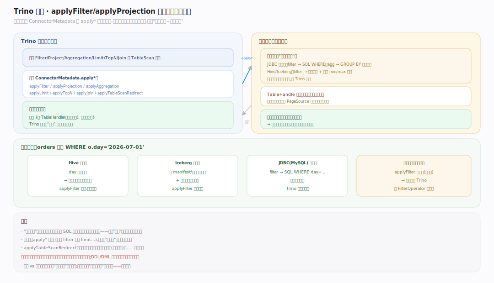

# Trino 原理 · DQL 数据查询

> **定位**：本篇是 Trino 的**主接触面主线**——一条 `SELECT` 从文本到结果的完整链路。属"计算能力域"的核心，依赖【连接器框架】拿数据、【查询规划与优化】定计划、【分布式执行】跑计划、【调度与资源】分任务、【内存管理】保内存、【数据交换】搬数据。它统领全库：其余支撑主线都是这条链路上某一段的展开。源码基准 **Trino 483-SNAPSHOT**（`~/workdir/trino`）。

Trino 没有 DDL/DML 作为独立主线（多下推给连接器，见【连接器框架】），DQL 才是引擎的主战场：一条查询在 **coordinator** 上解析、分析、规划、优化、切成 fragment，再分发到 **worker** 集群以 `Query→Stage→Task→Split→Driver→Operator` 六级并行执行，数据以列式 `Page` 在算子间流动、经 `Exchange` 跨 stage 交换，最终汇聚回 coordinator 返回客户端。

---

## 一、查询执行全景：一条 SELECT 的一生

分两大阶段：**coordinator 编排（前台单脑）**——`SqlParser` 解析→`StatementAnalyzer` 分析→`LogicalPlanner` 逻辑计划→`PlanOptimizers` 优化→`PlanFragmenter` 切 fragment→按 `RetryPolicy` 选调度器；**worker 执行（并行多机）**——每 fragment 一个 stage、fan-out 成多个 task，task 内编译成 pipeline、每 pipeline 起多个 Driver 泵动 Operator 链，stage 间经 Exchange 交换。

> 贯穿示例（全库统一）：`SELECT c.name, sum(o.price) FROM orders o JOIN customer c ON o.cust=c.id WHERE o.day='2026-07-01' GROUP BY c.name`——后续每节追踪它在该层的形态。

---

## 二、前台编排链路（coordinator 内）

`SqlParser` 用 ANTLR4 两阶段预测把 SQL 解析成 AST（SLL 快路径失败即回退 LL 重试）；`StatementAnalyzer` 递归下降产出 `Analysis` **旁表**（绑定库表/类型/函数，AST 本身不改写），末尾做列级访问控制；`LogicalPlanner` 据 `Analysis` 生成以 `OutputNode` 为根的 `PlanNode` 树，子句成节点顺序 FROM→WHERE→聚合→HAVING→窗口→投影→DISTINCT→ORDER BY/LIMIT。

---

## 三、逻辑计划与算子节点

`PlanNode` 不可变、可 JSON 序列化（fragment 要走网络）。核心节点族：扫描 `TableScan`、过滤 `Filter`、投影 `Project`、连接 `Join`/`SemiJoin`/`SpatialJoin`、聚合 `Aggregation`(+`GroupId`)、窗口 `Window`、排序 `Sort`/`TopN`、限制 `Limit`、集合 `Union`/`Intersect`/`Except`，分布式化后再插 `Exchange`/`RemoteSource`。一个计划 = `PlanNode` 根 + `StatsAndCosts`。

---

## 四、优化器：迭代规则改写 + 局部 CBO

`IterativeOptimizer` 是"规则改写到定点"，**不是 Cascades**：`Memo` 每个 `Group` 只持**单个** `PlanNode`（非等价表达式集），由 `Memo.replace` 就地替换，反复套用匹配规则直到 fixpoint。`PlanOptimizers` 把数十个批次按固定顺序排成流水线（谓词/投影下推→去关联→下推进 TableScan→Join 重排→`AddExchanges`）。全局是规则改写，只有 Join 顺序与分布两处是真正的代价枚举（局部 CBO）。

---

## 五、CBO：Join 重排与分布决策

两个代价驱动规则（`CostComparator` 按 CPU/内存/网络加权）：`ReorderJoins` 仅 `AUTOMATIC` 时跑，把 INNER Join 压平成 `MultiJoinNode`，再用**记忆化子集 DP**枚举顺序（经典子集 DP，非 DPhyp/超图）；`DetermineJoinDistributionType` 枚举 `PARTITIONED` vs `REPLICATED` × 左右顺序取最小代价，不可估时按 **8× 尺寸差**启发式翻转构建侧。后者必须在 `AddExchanges` 之前跑。

---

## 六、分布式化：fragment 切分与分布句柄

`PlanFragmenter` 在 **REMOTE 的 `ExchangeNode`** 处剪断逻辑计划成 `SubPlan` 树：`LOCAL` exchange 留在 fragment 内，`REMOTE` 处拆子 fragment、父侧对应位置替换成 `RemoteSourceNode`。一个 fragment 带两个分布——执行分布 `partitioning`（task 怎么分布）与输出分布 `outputPartitioningScheme`（输出怎么分给父）。`ExchangeNode` 三型（`GATHER`/`REPARTITION`/`REPLICATE`）× 两 scope（`LOCAL`/`REMOTE`，后者才是剪点）。

---

## 七、分布式执行层次：Query→Stage→Task→Split→Driver→Operator

六级严格对应：**Query**（`SqlQueryExecution` 驱动全程，按 `RetryPolicy` 选 `PipelinedQueryScheduler` 或 FTE 调度器）→ **Stage**（1 fragment : 1 stage）→ **Task**（按 `PartitioningHandle` 经 `FixedCount`/`SourcePartitioned`/`ScaledWriter` fan-out，coordinator 端 `HttpRemoteTask`、worker 端 `SqlTask` 包 `SqlTaskExecution`）→ **Split**（`CatalogHandle`+`ConnectorSplit`，源 pipeline 一 split 一 driver；483 已移除 Lifespan）→ **Driver/Operator**（`LocalExecutionPlanner` 把 fragment 编译成多个 pipeline）。

---

## 八、Driver 泵与 Page 流动

`Operator` 是非阻塞协作式状态机（`isBlocked` 返 future、`needsInput`/`addInput`/`getOutput`/`finish`）；`Driver.processInternal` 持独占锁单线程，喂完新 split 后 front-to-back 一次搬一个 Page（`current.getOutput`→`next.addInput`）。`Page` 是列式批（**按字节界定、默认上限约 1MB，非固定 1024 行**），`Block` 是 `sealed` 三型（`Value`/`Dictionary`/`RunLength`）。483 默认 `ThreadPerDriverTaskExecutor`（一 driver 一线程），可切回 `TimeSharing`，两者都用 1 秒时间片。

---

## 九、数据交换：Exchange 如何搬数据

传输方式在**运行期由 `RetryPolicy` 决定，不在计划里定死**。流式（NONE/QUERY）：`DirectExchangeClient` 经 HTTP 直接从上游 task 的 `OutputBuffer` 拉序列化 Page；暂存（TASK/FTE）：经 `ExchangeManager` SPI 落外部存储支持重试去重（需配 `exchange-manager.properties`）。发送侧 = 分区去向：`REPARTITION`→`PagePartitioner` 逐行算分区、`REPLICATE`→广播、`GATHER`→单点；`LOCAL` 同语义但内存直接交手不走网络。

---

## 深化 · 动态过滤（Dynamic Filtering）

Join 先用构建侧（小表）的实际值域生成运行时谓词，回推到探测侧（大表）的 `TableScan`，让连接器在读数据前就跳过不匹配的 split/文件/行组。SPI 侧 `DynamicFilter` 接口，规划侧由 `PredicatePushDown`(第三参 `true`)+`AddDynamicFilterSource` 插入——大表 Join 提速关键，探测侧扫描量可数量级下降。

---

## 深化 · 谓词与投影下推进连接器

优化器经 `ConnectorMetadata` 的 `applyFilter`/`applyProjection`/`applyAggregation`/`applyLimit`/`applyTopN`/`applyJoin` 把计算下推给连接器，返回"已下推部分 + 剩余部分"迭代进行。推下去的在数据源侧执行（JDBC→SQL WHERE、Hive→分区裁剪），Trino 只处理剩余——这是"联邦下推"省带宽的核心。

## 拓展 · 算子族一览

| 算子 | 类 | 作用 |
|---|---|---|
| 表扫描 | `TableScanOperator` / `ScanFilterAndProjectOperator` | 从连接器 `ConnectorPageSource` 拉 `SourcePage`→Page；后者融合扫描+过滤+投影为一条 WorkProcessor 流水 |
| 哈希聚合 | `HashAggregationOperator` | 按 group-by 键建哈希表；满或收尾时流式出结果；可溢写（revocable 内存） |
| 哈希 Join | `HashBuilderOperator`（构建侧）/ `LookupJoinOperator`（探测侧） | 构建侧把右表灌进 `PagesIndex` 建 `LookupSource`；探测侧逐行查找；483 中为 WorkProcessor 算子；可溢写 |
| 交换 | `ExchangeOperator` / `MergeOperator` | 从远端拉 Page（`MergeOperator` 做保序 k 路归并 GATHER） |
| TopN | `TopNOperator` | 输入期维护有界堆，收尾时排出 top-N |
| 排序 | `OrderByOperator` | 全量排序；可溢写 |

## 深化 · 源码锚点（Trino 483，`*.java`）

| 环节 | 关键类型 · 源码锚点 |
|---|---|
| 编排链路 | `SqlParser:104/162-163/167-171` · `AstBuilder:413` · `Analyzer:91/105` · `StatementAnalyzer:449` · `LogicalPlanner:244/355` |
| 优化器 | `IterativeOptimizer:66/151` · `Memo:116/257` · `Lookup:28` · `PlanOptimizers:275/817/911/916` |
| CBO · Join | `ReorderJoins:98/168/576` · `DetermineJoinDistributionType:51/55` · `PlanOptimizers:878` |
| 分布式化 | `PlanFragmenter:88/96/483/508` |
| 执行六级 | `SqlQueryExecution:397/537` · `StageManager:66` · `FixedCountScheduler:28` · `SourcePartitionedScheduler:55` · `ScaledWriterScheduler:41` · `HttpRemoteTask:137` · `TaskResource:142` · `SqlTask:87` · `SqlTaskExecution:82` · `DriverFactory:31` · `LocalExecutionPlanner:412` |
| Driver 泵 | `Operator:21` · `Driver:66/372/378/390` · `Block:21-24` · `ThreadPerDriverTaskExecutor:60` · `SplitProcessor:42` · `TimeSharingTaskExecutor:85` · `PrioritizedSplitRunner:49` |

## 调优要点（关键开关，均源码核实）

- `join_distribution_type`（`AUTOMATIC`/`BROADCAST`/`PARTITIONED`）、`join_reordering_strategy`（`AUTOMATIC`/`ELIMINATE_CROSS_JOINS`/`NONE`）、`join_max_broadcast_table_size`——控制 Join 分布与重排。
- `query.max-memory`（全查询跨集群）、`query.max-memory-per-node`（单节点，默认可用内存 30%）、`memory.heap-headroom-per-node`（默认 30%）——内存上限。
- `retry-policy`（`NONE`/`QUERY`/`TASK`）——容错级别；`TASK` 需配 exchange-manager。
- `spill-enabled` + `spiller-spill-path`——聚合/Join/排序/窗口的溢写。
- `optimizer.dictionary-aggregation`、动态过滤相关 `enable-dynamic-filtering`。
- `node-scheduler.policy`（`UNIFORM`/`TOPOLOGY`）、`node-scheduler.max-splits-per-node`（默认 256）——split 放置。

## 常见误区与工程要点

- **误区：Trino 优化器是 Cascades。** 不是。它是迭代规则改写到定点（单成员 Memo），CBO 只局部用于 Join 顺序（子集 DP）与分布——不是全 plan 的自顶向下代价搜索。
- **误区：Page 是"每页约 1024 行"。** 错。Page 按字节界定，默认上限约 1MB；投影批上限 8192 positions。
- **误区："流式 vs 物化 exchange 在计划期选定"。** 不是。fragment 是传输无关的，同一个 `RemoteSourceNode` 在运行期按 `RetryPolicy` realized 成直连流式或 spooling 暂存。
- **误区：还有 Lifespan/grouped execution。** Trino 483 已移除。别引用 `Lifespan`/`GroupedExecution`。
- **误区：调度器叫 `SqlQueryScheduler`。** 不存在。接口是 `QueryScheduler`，实现 `PipelinedQueryScheduler` / `EventDrivenFaultTolerantQueryScheduler`。
- 归属提醒：split 生成属【连接器框架】不属【调度】；动态过滤属【查询规划与优化】+【连接器框架】协作；内存溢写属【内存管理】，本篇只讲算子侧触发。

## 一句话总纲

**一条 SELECT 在 coordinator 上经 `SqlParser`→`StatementAnalyzer`(产出 Analysis 旁表)→`LogicalPlanner`(OutputNode 根的 PlanNode 树)→`PlanOptimizers`(迭代规则改写到定点 + Join 顺序/分布的局部 CBO)→`PlanFragmenter`(在 REMOTE exchange 处切成 SubPlan 树)，再按 RetryPolicy 分发：每 fragment 成 1 个 stage、fan-out 成多个 task 到 worker，task 内编译成 pipeline、每 pipeline 起多个 Driver 泵动 Operator 链处理列式 Page，stage 间经 Exchange（流式直连或 FTE spooling 暂存）搬数据，最终 GATHER 回 coordinator 返回——全程资源随查询生灭，数据始终来自外部连接器。**
