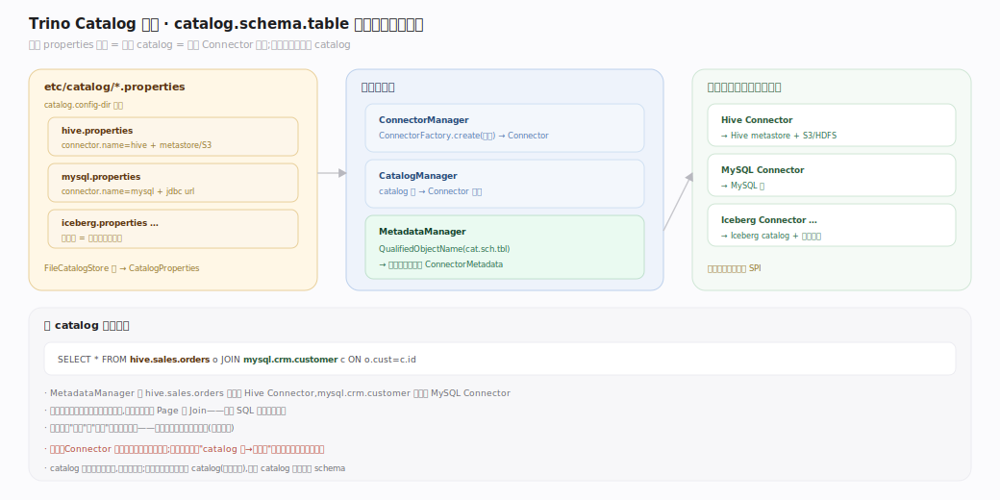
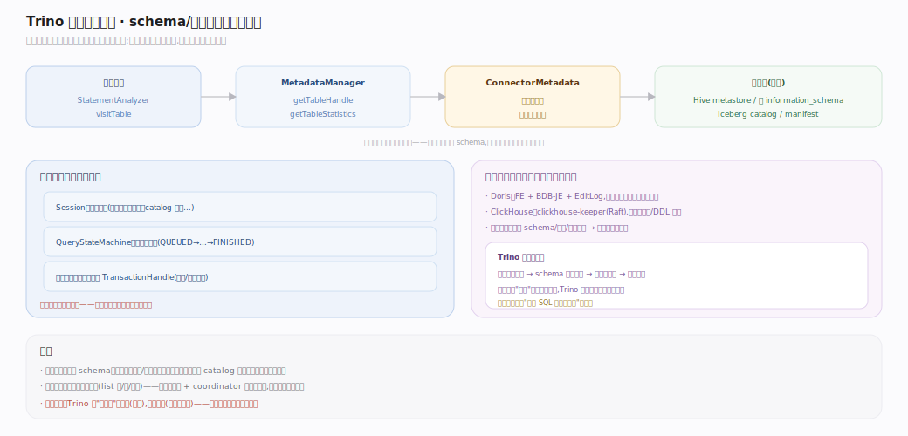
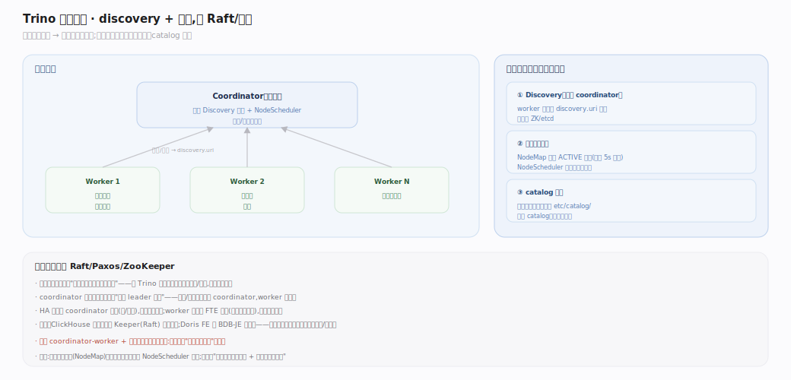
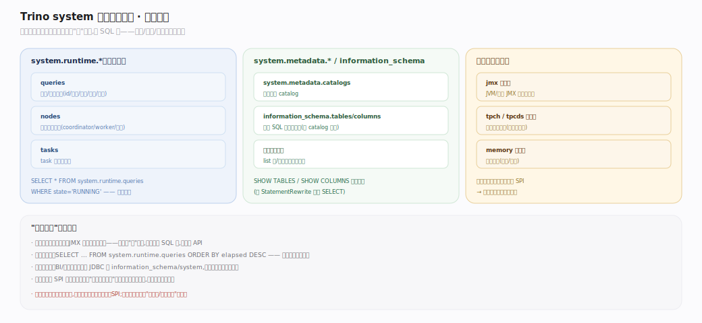

# Trino 原理 · 支撑主线 · 元数据与 Catalog

> **定位**：属"底座能力域"，是最底层——任何语句都要先经它把 `catalog.schema.table` 解析成连接器能懂的对象。与存算一体引擎的持久元数据服务（Doris FE+EditLog、ClickHouse Keeper）根本不同：**Trino 无常驻元数据服务、无持久元数据**，schema/统计每次查询经连接器现取，集群自身只有内存态的会话/查询状态。被四条接触面主线全依赖。源码基准 **Trino 483-SNAPSHOT**。

"协调"在 Trino 里很轻：coordinator 是单脑规划器，不需要 Keeper/Raft 那样的分布式共识来存元数据——因为它根本不存元数据。集群协调只剩：节点发现（discovery）+ 心跳存活视图 + catalog 配置分发。

---

## 一、Catalog → Connector：元数据的入口

`etc/catalog/*.properties` 每个文件定义一个 catalog（`connector.name`+连接参数）；`StaticCatalogManager` 从 `catalog.config-dir` 加载（`SYSTEM` 为保留名），`FileCatalogStore` 读出 `CatalogProperties`，`CatalogFactory.createCatalog` 据此实例化 Connector。查询里的 `QualifiedObjectName`（catalog.schema.table）由 `MetadataManager` 路由到对应连接器的 `ConnectorMetadata`——**一次查询可引用多个 catalog**分别路由，这就是跨源联邦。

---

## 二、无持久元数据：每查询现取

对比存算一体引擎的持久元数据服务，Trino 的元数据是**穿透式**的：分析阶段 `StatementAnalyzer.visitTable` 调 `MetadataManager.getTableHandle`——**实时**问连接器"这表存在吗、什么 schema"，连接器再问外部源（Hive metastore、库的 information_schema）；CBO 要的 `TableStatistics` 也经 `getTableStatistics` 现取。集群自身只持有内存态（`Session`、查询状态机、事务上下文），查询结束即回收。好处：永远看到最新 schema、无同步一致性问题；代价：每查询有元数据往返（连接器多缓存缓解）。

---

## 三、集群协调：发现、心跳、无共识

Trino 的"协调"极轻，**没有 Raft/Paxos/ZooKeeper 式分布式共识**（因为无持久元数据要保）：**Discovery** 内嵌 coordinator，worker 启动向 `discovery.uri` 注册；**心跳存活** 由 `CoordinatorNodeManager.refreshNodes` 周期刷新节点视图（`AllNodes` 分 active/inactive/draining），调度侧 `NodeMap` 缓存 ACTIVE 节点集供 `NodeScheduler` 选节点；**catalog 分发** 静态模式各节点读同样的 `etc/catalog/`；coordinator 单点，HA 靠备用 coordinator（非共识选主）。

## 深化 · system 连接器与自省

Trino 内置 `system` 连接器暴露运行时自省：`system.runtime.queries`（`QuerySystemTable`）、`system.runtime.nodes`（`NodeSystemTable`）、`system.runtime.tasks`（`TaskSystemTable`）、`system.metadata.*`。它们本身就是"表"，可被 SQL 查询——诊断、监控、编程式内省走同一套 SQL 接口。`information_schema`（每 catalog 一份）则是标准 SQL 元数据视图，同样穿透到连接器。

## 拓展 · 与存算一体引擎的元数据对比

| 维度 | Trino | Doris | ClickHouse |
|---|---|---|---|
| 持久元数据 | 无（连接器现取） | FE + BDB-JE + EditLog | clickhouse-keeper(Raft) |
| 分布式共识 | 无（单脑 + 发现/心跳） | BDB-JE 多数派选主 | Keeper Raft |
| schema 来源 | 外部源（每查询问连接器） | 自管，FE 内存+日志 | 自管，各节点 + Keeper |
| 集群状态 | 仅内存态会话/查询 | FE 全局持久状态 | 本地 + Keeper 协调 |

## 深化 · 源码锚点（Trino 483，`*.java`）

| 环节 | 关键类型 · 源码锚点 |
|---|---|
| Catalog 映射 | `StaticCatalogManager:61`（加载 `:86`/保留名 `:88`/建 props `:110`）· `MetadataManager:190` · `CatalogFactory.createCatalog:27` |
| 无持久元数据 | `StatementAnalyzer.visitTable:2319`（调用点 `:890`）· `MetadataManager.getTableHandle:285` · `getTableStatistics:540` |
| 集群协调 | `CoordinatorNodeManager.refreshNodes:142` · `NodeMap:23` |
| system 自省 | `QuerySystemTable:58`（`runtime.queries` 表名）|

## 常见误区与工程要点

- **误区：Trino 有元数据服务/catalog 数据库。** 没有。catalog 只是配置文件；元数据实时穿透到连接器。
- **误区：Trino 用 ZooKeeper/Keeper 协调。** 不用。无持久元数据 → 无需共识；只有 discovery + 心跳。
- **误区：`system`/`information_schema` 是特殊 API。** 它们就是普通连接器/视图，用 SQL 查——这是"一切皆表"的一致性。
- **归属提醒**：catalog→Connector 实例化属【连接器框架】；本篇管"引擎侧如何路由元数据调用 + 集群协调"。节点存活视图被【调度与资源】消费。

## 一句话总纲

**元数据与 Catalog 是 Trino 的最底座却最轻：一个 catalog = 一个 properties 文件绑一个 Connector，MetadataManager 把 QualifiedObjectName 路由到对应连接器的 ConnectorMetadata——schema 与统计每查询实时穿透到外部源现取，集群无持久元数据、无分布式共识，"协调"只剩 discovery + 心跳存活视图 + catalog 分发，system/information_schema 用 SQL 自省;这与存算一体引擎的持久元数据服务 + Raft 共识形成根本对比。**
