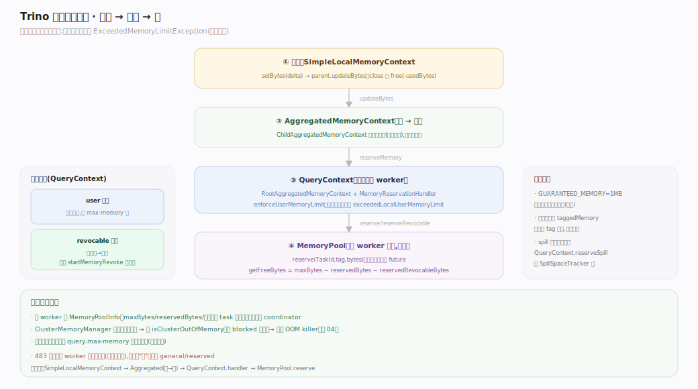
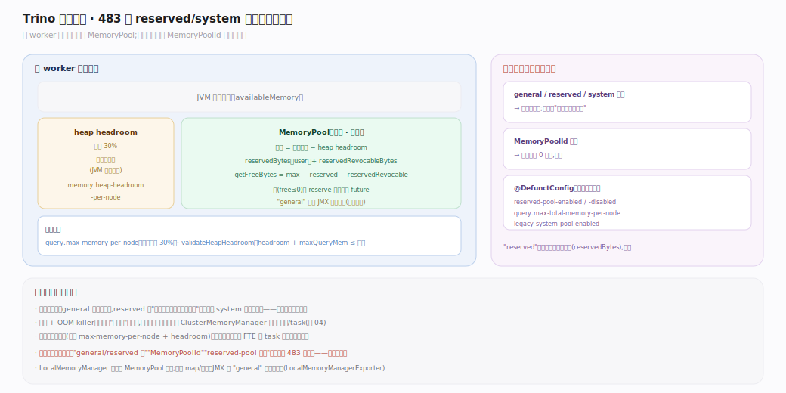
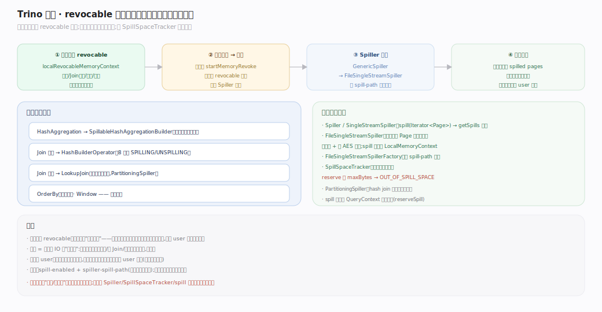
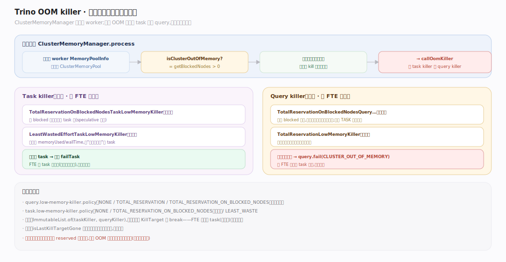

# Trino 原理 · 支撑主线 · 内存管理

> **定位**：属"保障能力域"。管查询期内存的**追踪、限额、溢写、OOM 处置**。被【分布式执行】依赖（算子申请内存、压力大时溢写），被【调度与资源】引用（内存软限作为准入门槛）。无自有存储 → 内存全是查询期中间态，随查询回收。源码基准 **Trino 483-SNAPSHOT**。

Trino 483 的内存模型有一个关键简化：**每 worker 只有一个内存池（无 reserved/system 多池）**——旧的 `MemoryPoolId` 类型与保留池已彻底移除。内存追踪自算子逐级上卷到查询、到池；超限则报错或溢写；集群级由 coordinator 侧仲裁并在 OOM 时择一杀之。

---

## 一、内存池与追踪层级：从算子上卷到池

追踪链自底向上：算子持 `LocalMemoryContext`（`SimpleLocalMemoryContext`，`lib/trino-memory-context/.../memory/context/SimpleLocalMemoryContext.java`）→ 上卷到 `AggregatedMemoryContext`（`lib/trino-memory-context/.../memory/context/AggregatedMemoryContext.java`，子→根）→ 根经 `MemoryReservationHandler` 交给 `QueryContext`（`core/trino-main/.../memory/QueryContext.java:61`）→ `QueryContext` 向共享的 `MemoryPool` 预留。每层都可能因超限抛 `ExceededMemoryLimitException`（`core/trino-main/.../ExceededMemoryLimitException.java`）（子上下文先问父，父可先拒）。`QueryContext` 分 **user**（`QueryContext.java:252`）与 **revocable**（可溢写，`QueryContext.java:257`）两套根上下文，`GUARANTEED_MEMORY`（1MB，`QueryContext.java:63`）保证微查询不阻塞。

---

## 二、单池模型：483 的关键简化

`LocalMemoryManager`（`core/trino-main/.../memory/LocalMemoryManager.java:30`）在每 worker 建**一个无名 `MemoryPool`**（`new MemoryPool(memoryPoolSize)`，`:53`），大小 = 可用内存 − heap headroom。`MemoryPool.reserve(bytes)`（`core/trino-main/.../memory/MemoryPool.java:125`）为 `(TaskId, tag)` 预留，池满（`getFreeBytes ≤ 0`）时返回阻塞 future；`reserveRevocable`（`MemoryPool.java:158`）单独记可溢写内存。旧的 `general`/`reserved`/`system` 三池模型与 `MemoryPoolId` 已移除，相关配置标 `@DefunctConfig`（"general" 仅作 JMX 导出标签存活）。关键限额：`query.max-memory-per-node`（默认 30%）、`memory.heap-headroom-per-node`（默认 30%）。

---

## 三、溢写：revocable 内存落盘

可溢写算子（HashAggregation / HashBuilder(Join) / OrderBy / Window）用 **revocable 内存**申请空间。内存压力时框架调 `startMemoryRevoke`，算子把 revocable 数据经 `Spiller`（`GenericSpiller`，`core/trino-main/.../spiller/GenericSpiller.java` → `FileSingleStreamSpiller`，`core/trino-main/.../spiller/FileSingleStreamSpiller.java`）写到 `spiller-spill-path` 下的临时文件（可压缩/加密），随后回读归并；输出时把保留部分转记为 user 内存。`SpillSpaceTracker`（`core/trino-main/.../spiller/SpillSpaceTracker.java`）是节点级磁盘配额（超则 `OUT_OF_SPILL_SPACE`）。溢写让"内存装不下的聚合/Join/排序"仍能完成，代价是磁盘 IO。

---

## 深化 · 低内存 killer 与集群仲裁

coordinator 侧 `ClusterMemoryManager.process`（`core/trino-main/.../memory/ClusterMemoryManager.java:177`）轮询各 worker 内存视图（`MemoryPoolInfo`），若集群 OOM（有 blocked 节点）且无查询已被限额杀，则调 `callOomKiller`（`ClusterMemoryManager.java:241`，条件判断 `ClusterMemoryManager.java:228`）——**先跑 task killer，再跑 query killer**（`ImmutableList.of(taskLowMemoryKiller /* try to kill tasks first */, queryLowMemoryKiller)`，`ClusterMemoryManager.java:148-150`，取首个非空目标）：

- **Query killer**（默认 `TotalReservationOnBlockedNodesQueryLowMemoryKiller`，`core/trino-main/.../memory/TotalReservationOnBlockedNodesQueryLowMemoryKiller.java`）：只看 blocked 节点，杀其上总预留最大的查询（跳过 TASK 策略查询）。
- **Task killer**（默认同名 Task 版）：仅对 FTE(TASK) 查询，在 blocked 节点上择大 task 杀（可重试）。
- 目标为整查询 → `query.fail(CLUSTER_OUT_OF_MEMORY)`（错误码 import 见 `ClusterMemoryManager.java:85`）；为 task → 逐个 `failTask`。

策略可配（`NONE`/`TOTAL_RESERVATION`/`TOTAL_RESERVATION_ON_BLOCKED_NODES`/`LEAST_WASTE`）。

## 调优要点（关键开关）

- `query.max-memory`（单查询跨集群总内存）、`query.max-memory-per-node`（单节点，默认可用 30%）。
- `memory.heap-headroom-per-node`（默认 30%，给非池内存留头寸）。
- `spill-enabled` + `spiller-spill-path`（可多路径轮转）+ 各算子溢写开关。
- `query.low-memory-killer.policy` / `task.low-memory-killer.policy`（OOM 择杀策略）。

## 常见误区与工程要点

- **误区：Trino 有 general/reserved 双池。** 483 已移除，**只有一个池**；`MemoryPoolId` 不存在。别引用保留池。
- **误区：内存超软限就杀查询。** 软限只是"停止启动新查询/新预留"的门槛；杀查询是 OOM killer 在集群真正 blocked 时的最后手段。
- **误区：溢写用 user 内存。** 溢写算子用 **revocable** 内存，正是为了让框架能"征用"它去溢写；输出时才转 user。
- **误区：`heap-headroom` 是池的一部分。** 相反——headroom 是**留给池之外**（JVM 其他开销）的头寸，池大小 = 可用 − headroom。
- **归属提醒**：溢写"触发"在【执行引擎】算子侧；本篇管内存池/追踪/spill 配额/OOM 处置。资源组的内存软限属【调度与资源】的准入维度。

## 一句话总纲

**Trino 483 每 worker 只有一个内存池（无 reserved/system 池）：算子经 LocalMemoryContext 逐级上卷到 QueryContext 再向池预留，分 user 与 revocable 两类；池满则阻塞或报 ExceededMemoryLimit，可溢写算子把 revocable 内存经 Spiller 落盘（受 SpillSpaceTracker 配额），集群真正 OOM 时 ClusterMemoryManager 先杀 task 再杀 query（默认只看 blocked 节点、杀预留最大者）——全部内存是查询期中间态,随查询回收。**
