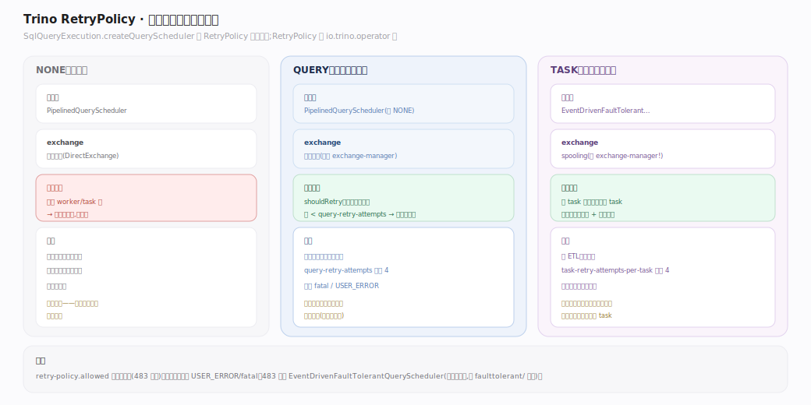
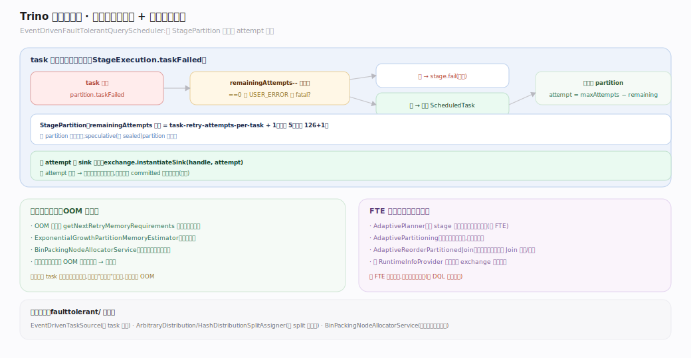
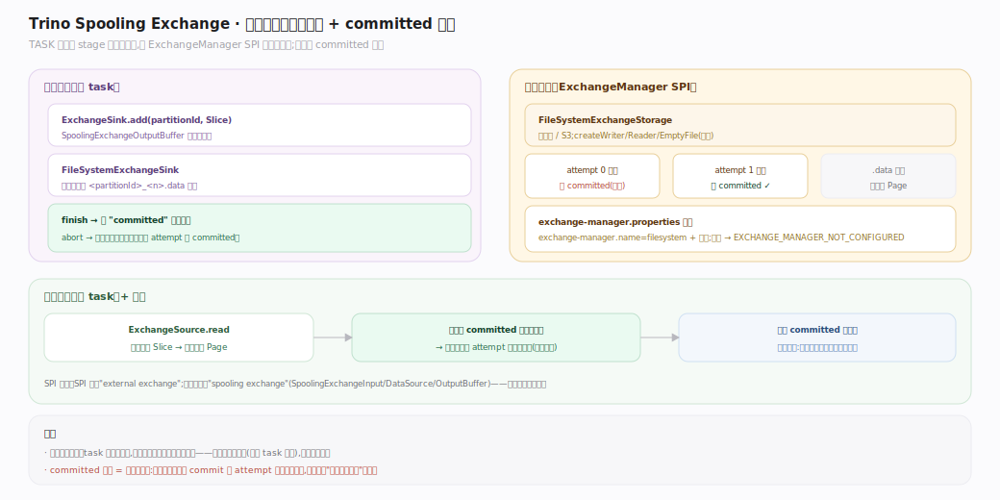
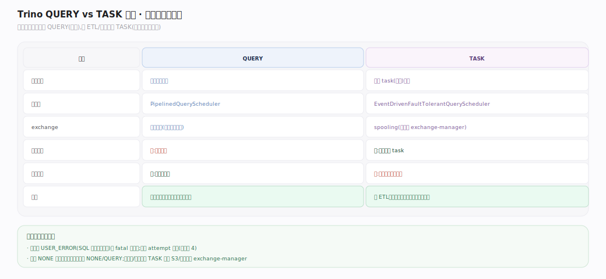

# Trino 原理 · 支撑主线 · 容错执行（FTE）

> **定位**：属"保障能力域"。让长查询在 worker/task 失败时**不整个重来**——按 `RetryPolicy` 做查询级或任务级重试，任务级依赖 spooling exchange 把中间结果落外部存储以便重试去重。被【分布式执行】按策略选用（默认 NONE 不启用），依赖【数据交换】的 ExchangeManager SPI。源码基准 **Trino 483-SNAPSHOT**。

默认 Trino 是"尽力而为"——一个 worker 挂了整条查询失败，对跑几十分钟的 ETL 代价太大。FTE 通过 `RetryPolicy` 提供两档容错：**QUERY**（整查询重试）与 **TASK**（任务级重试，需 exchange-manager）。

---

## 一、RetryPolicy 三档：容错级别与调度器选择

`RetryPolicy`（`io.trino.operator`）三值，`SqlQueryExecution.createQueryScheduler` 据此选调度器与 exchange 形态：

| 策略 | 调度器 | exchange | 重试语义 |
|---|---|---|---|
| **NONE**（默认） | `PipelinedQueryScheduler` | 流式直连 | 不重试，任一失败整查询挂 |
| **QUERY** | `PipelinedQueryScheduler` | 流式直连 | 整查询重试（`shouldRetry` 判可重试码 + 未超 `query-retry-attempts`=4，排除 fatal/USER_ERROR）|
| **TASK** | `EventDrivenFaultTolerantQueryScheduler` | spooling exchange | 单 task 失败只重跑该 task |

`retry-policy.allowed` 可限制允许的策略集（483 新增）。

---

## 二、任务级重试：EventDrivenFaultTolerantQueryScheduler

每 stage partition 一个 `StagePartition`，`remainingAttempts` 初始 = `task-retry-attempts-per-task`+1。task 失败经 `StageExecution.taskFailed` 判定：耗尽/USER_ERROR/fatal → `stage.fail` 放弃，否则重发 `PrioritizedScheduledTask` 到同 partition。OOM 重试内存感知增长（`ExponentialGrowthPartitionMemoryEstimator` + `BinPackingNodeAllocatorService` 选节点）；每 attempt 新 sink 实例按 attempt 键控去重；speculative（未 sealed）partition 不重试。

---

## 三、Spooling exchange：中间结果落外部存储

TASK 策略下 stage 间数据不走流式直连，而经 **ExchangeManager SPI**（引擎内部叫 spooling exchange）落外部存储：上游经 `ExchangeSink.add(partition, Slice)` 写，`FileSystemExchangeSink` 把每分区写成 `.data` 文件、`finish` 时落 `committed` 标记；下游经 `ExchangeSource.read` 读，**忽略无 `committed` 标记的目录**——这是去重关键（某 task 重试的多份输出只读 committed 那份）。`ExchangeManagerRegistry` 从 `exchange-manager.properties` 加载（filesystem/S3），未配则 `EXCHANGE_MANAGER_NOT_CONFIGURED`——**FTE-TASK 必须配 exchange-manager**。

## 深化 · QUERY vs TASK 重试对比

| 维度 | QUERY | TASK |
|---|---|---|
| 重试粒度 | 整查询重跑 | 单 task 重跑 |
| exchange-manager | 无需 | **必需**（暂存中间结果去重） |
| 实现 | `PipelinedQueryScheduler.shouldRetry` 内 | `EventDrivenFaultTolerantQueryScheduler` + spooling |
| 适用 | 中短查询（失败率低时开销小，失败则全部重算） | 长 ETL/大查询（失败只赔一个 task，中间落盘有持续开销） |
| 排除 | USER_ERROR + fatal 错误码 | 同左 |

## 调优要点（关键开关）

- `retry-policy`（`NONE`/`QUERY`/`TASK`）、`retry-policy.allowed`（允许集）。
- `query-retry-attempts`（QUERY，默认 4）、`task-retry-attempts-per-task`（TASK，默认 4，上限 126）。
- `exchange-manager.properties`（TASK 必需）：`exchange-manager.name=filesystem` + 存储路径（本地/S3）。
- FTE 运行期自适应：`fault-tolerant-execution-runtime-adaptive-partitioning-enabled`（AdaptivePartitioning 治倾斜）。

## 常见误区与工程要点

- **误区：FTE 默认开启。** 默认 `RetryPolicy.NONE`，不容错。要显式配 `retry-policy`。
- **误区：TASK 策略不用额外配置。** 必须配 exchange-manager（落中间结果），否则启动即报 `EXCHANGE_MANAGER_NOT_CONFIGURED`。
- **误区：还有 `FaultTolerantQueryScheduler`/`FaultTolerantStageScheduler`。** 483 只有 `EventDrivenFaultTolerantQueryScheduler`（旧类已移除），且在 `faulttolerant/` 子包。
- **误区：QUERY 重试也用 spooling。** 不。QUERY 用流式直连（PipelinedQueryScheduler 内重试整查询）；只有 TASK 用 spooling exchange。
- **归属提醒**：AdaptivePlanner（运行期再优化）仅 FTE 路径存在（见【DQL】优化器篇），是 FTE 的附加能力，非通用查询优化。

## 一句话总纲

**FTE 按 RetryPolicy 提供两档容错：QUERY（整查询重试，流式直连，无需额外配置，适合中短查询）与 TASK（任务级重试，EventDrivenFaultTolerantQueryScheduler + spooling exchange 把中间结果落外部存储并靠 committed 标记去重，每分区独立重试且 OOM 时内存指数增长，适合长 ETL）——默认 NONE 不容错;二者都不重试 USER_ERROR 与 fatal 错误。**
