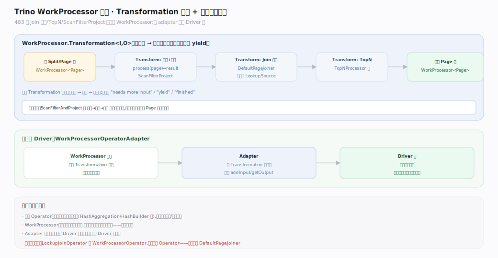
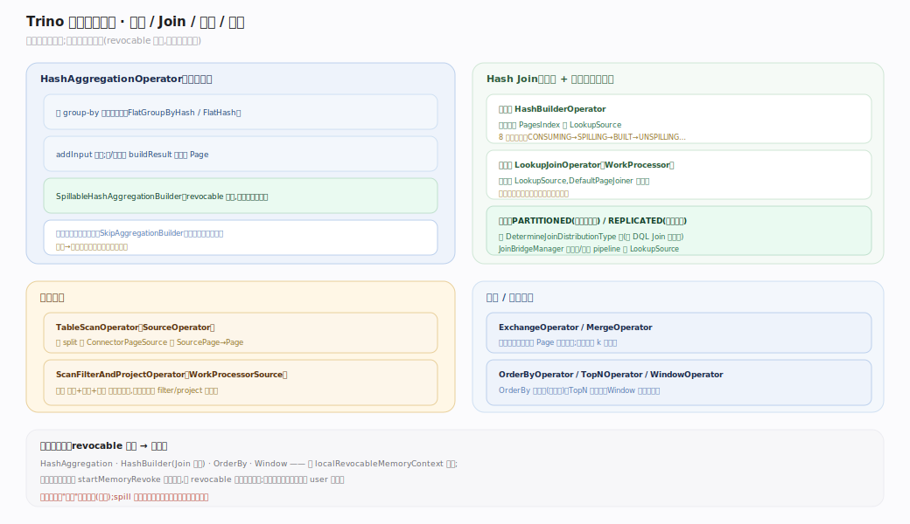

# Trino 原理 · 支撑主线 · 执行引擎

> **定位**：属"计算能力域"。是【分布式执行】在单 worker 内的运行时内核——把一个 task 的 pipeline 变成实际转动的算子。DQL 主线画了 Query→…→Operator 的全景与 Driver 泵，本篇深入算子层内部：Operator 契约、WorkProcessor 算子、关键算子实现、TaskExecutor 调度。源码基准 **Trino 483-SNAPSHOT**。

一个 task 被 `LocalExecutionPlanner` 编译成若干 **pipeline**（每个是一个 `DriverFactory`），每 pipeline 起多个 **Driver**（源 pipeline 一 split 一 Driver），Driver 泵动一条 **Operator** 链，数据以列式 **Page** 流动。`TaskExecutor` 以 1 秒时间片调度所有 Driver。

---

## 一、Processors 执行模型与 Driver 泵

`Operator` 是非阻塞协作式状态机：`isBlocked` 返 future（未就绪即让出）、`needsInput`/`addInput(Page)` 收输入、`getOutput` 出输出、`finish`/`isFinished` 收尾、`startMemoryRevoke`/`finishMemoryRevoke` 溢写钩子。`OperatorFactory` 是 pipeline 蓝图（`createOperator` 每 Driver 一次、`duplicate` 克隆并行 pipeline）；源算子 `SourceOperator` 扩展契约接收 `Split`。`Driver.processInternal` 持独占锁单线程：喂完新 split 后 front-to-back 一次搬一个 Page（`current.getOutput`→`next.addInput`），都阻塞时收集 `isBlocked` future 待首个就绪。**Operator 契约与 Driver 泵详图见【DQL】Driver 泵篇（同一机制，不重复出图）。**

---

## 二、WorkProcessor 算子：新式流水算子

Trino 483 中许多算子（Join 探测侧、TopN、ScanFilterAndProject）已改造成 **WorkProcessor 算子**：核心是 `WorkProcessor.Transformation<I,O>`——把输入流逐元素变换成输出流，天然支持惰性、背压、yield，再经 `WorkProcessorOperatorAdapter` 桥接回经典 `Operator` 契约让 Driver 无感知泵动。这套模型比手写状态机更易组合（如 ScanFilterAndProject 把扫描+过滤+投影融合成一条流水，省中间算子跳转）。

---

## 深化 · 关键算子实现

- **HashAggregation**：按 group-by 键建哈希表（`FlatGroupByHash`），满或收尾流式出结果；`SpillableHashAggregationBuilder` 用 revocable 内存压力大时溢写分区再归并；部分聚合可自适应关闭（`SkipAggregationBuilder`）。
- **Join**：构建侧 `HashBuilderOperator` 把右表灌进 `PagesIndex` 建 `LookupSource`（8 态含溢写态）；探测侧 `LookupJoinOperator`（WorkProcessor）逐行查找经 `DefaultPageJoiner` 产结果。
- **TableScan / ScanFilterAndProject**：前者逐 split 从 `ConnectorPageSource` 拉 `SourcePage`→Page；后者融合扫描+过滤+投影为一条流水。
- **Exchange**：`ExchangeOperator` 从远端拉序列化 Page 反序列化；`MergeOperator` 做保序 k 路归并。

---

## 深化 · Page/Block 列式内存模型

`Page` = N 个 `Block`（列）× M 行（positions），是算子间流动的基本单位。`Block` 是 **sealed interface**，只允许 `ValueBlock`（物理值）、`DictionaryBlock`（字典）、`RunLengthEncodedBlock`（游程）三种，编码包装经 `getUnderlyingValueBlock` 解引用。列式布局让向量化、字典/RLE 免解压直算成为可能。**Page 大小按字节界定（默认上限 ≈1MB），不是固定行数**；投影批上限 8192 positions。

## 拓展 · TaskExecutor 调度模型

| 执行器 | 机制 | 默认 |
|---|---|---|
| `ThreadPerDriverTaskExecutor` | 一 Driver 一线程；`SplitProcessor` 每 1s 配额让出 | **483 默认**（`thread-per-driver-scheduler-enabled=true`） |
| `TimeSharingTaskExecutor` | 经典多级反馈队列，时间片轮转；`PrioritizedSplitRunner` 按已调度纳秒排优先级 | 可切回 |

两者都用 1 秒 `SPLIT_RUN_QUANTA`，最终都调 `Driver.processForDuration(quanta)`。时间片让长查询与短查询公平共享 CPU，避免单个大查询饿死其他。

## 深化 · 源码锚点（Trino 483，`*.java`）

| 环节 | 关键类型 · 源码锚点 |
|---|---|
| Operator 契约 | `Operator:21`（`isBlocked:33`/`needsInput:41`/`addInput:47`/`getOutput:53`/`finish:88`/`startMemoryRevoke:72`）|
| Driver 泵 | `Driver.processInternal:372`（`processNewSources:378`/相邻算子对 `:390`/`getOutput:402`/`addInput:407`/独占锁类 `:66`）|
| 关键算子 | `HashAggregationOperator` · `HashBuilderOperator`/`LookupJoinOperator` · `ScanFilterAndProjectOperator` · `ExchangeOperator`/`MergeOperator` |
| 列式内存 | `Block:21-24`（sealed permits 三型）|
| 执行器 | `ThreadPerDriverTaskExecutor:60`（配额 `SplitProcessor:42`）· `TimeSharingTaskExecutor:85`（配额 `PrioritizedSplitRunner:49`）|

## 调优要点（关键开关）

- `task.concurrency`（每 task 的本地并行度/pipeline driver 数，通常 = 核数）、`task.max-worker-threads`。
- `task.writer-count` / `task.scale-writers`（写并行度）。
- `spill-enabled` + 各算子溢写开关（聚合/Join/排序/窗口）。
- `experimental.thread-per-driver-scheduler-enabled`（执行器选择）。

## 常见误区与工程要点

- **误区：Operator 会阻塞线程等数据。** 不会。它返回 `isBlocked` future，Driver 据此让出，线程去跑别的 Driver——这是高并发的基础。
- **误区：所有算子都是经典 addInput/getOutput。** 483 中越来越多是 WorkProcessor 算子，经 adapter 桥接。
- **误区：Page 固定 1024 行。** Page 按字节界定（≈1MB），别写死行数。
- **归属提醒**：算子内的内存申请/溢写触发在本主线体现，但内存池、spill 空间配额属【内存管理】；task 数、split 放置属【调度与资源】。

## 一句话总纲

**执行引擎是单 worker 内的运行时内核：LocalExecutionPlanner 把 task 编译成 pipeline（DriverFactory），每 pipeline 起多个 Driver 单线程泵动 Operator 链——Operator 是非阻塞协作式状态机（新式的多为 WorkProcessor 算子经 adapter 桥接），数据以列式 Page（sealed 三型 Block、≈1MB 批）front-to-back 流动，TaskExecutor 以 1 秒时间片（483 默认一 Driver 一线程）公平调度所有 Driver。**
