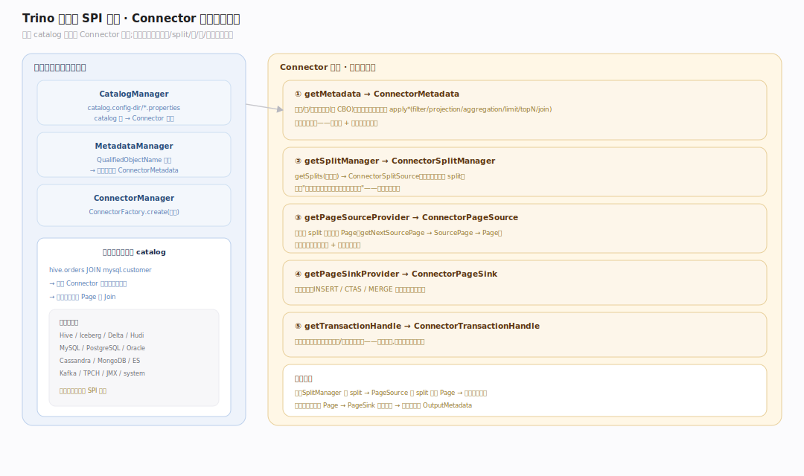
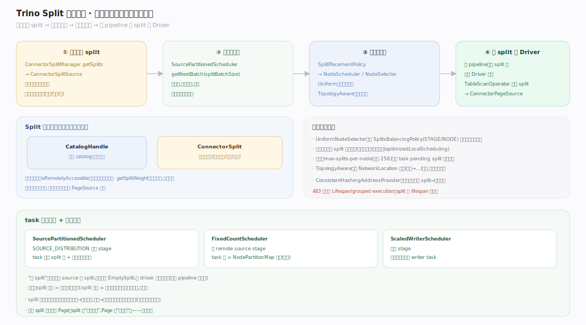
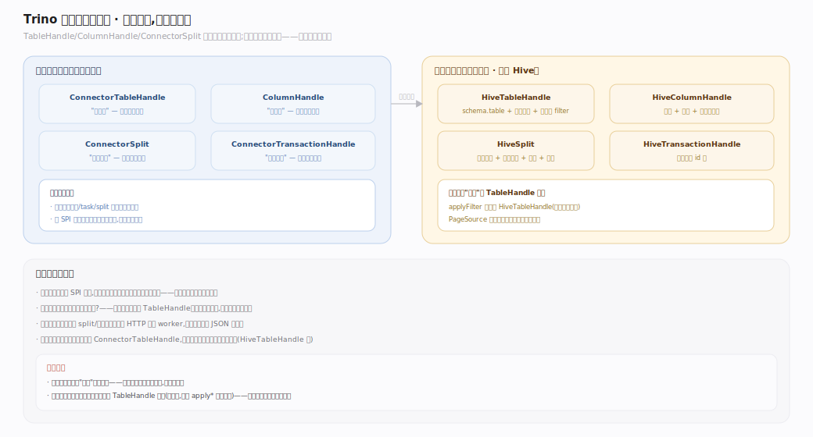
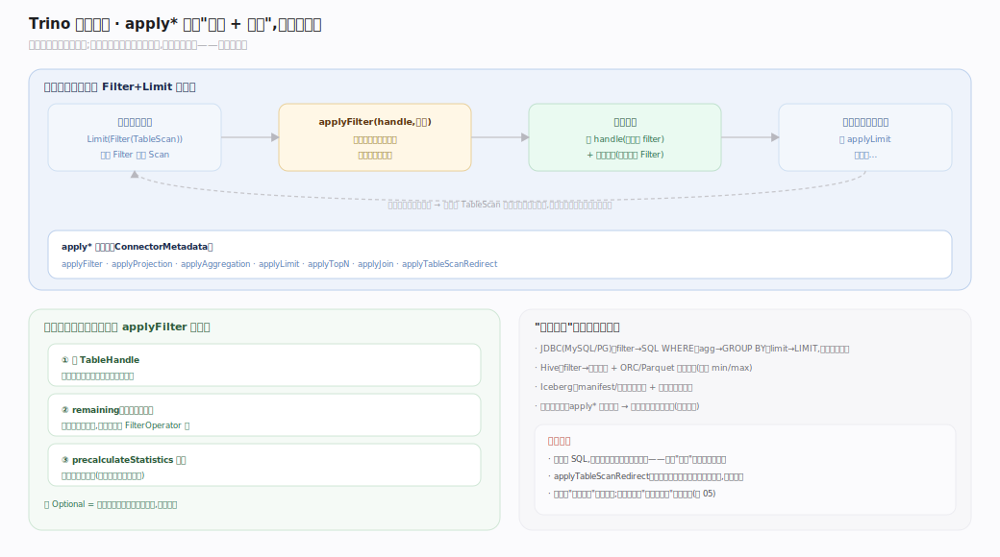
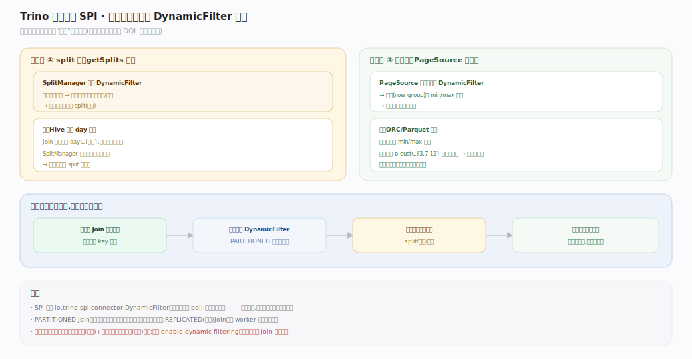

# Trino 原理 · 支撑主线 · 连接器框架（SPI）

> **定位**：属"底座能力域"，是 Trino 作为**联邦查询引擎**区别于存算一体引擎的定义性特征。它是"SQL 计算层"与"外部数据层"之间的契约层——所有表的字节、schema、下推能力都经此进出。被【DQL】【DDL】【DML】全依赖，向上给【查询规划与优化】提供下推入口、给【分布式执行】提供 `Split` 与 `PageSource`。源码基准 **Trino 483-SNAPSHOT**。

Trino 自己不存数据。一个"catalog"配置文件（`etc/catalog/*.properties`）绑定一个 **Connector 实例**，连接器负责把外部源（Hive 表、Iceberg、MySQL、Kafka…）翻译成 Trino 引擎能消费的统一抽象：元数据（`ConnectorMetadata`）、数据分片（`ConnectorSplit`）、列式数据（`ConnectorPageSource` 产 `Page`）、写入（`ConnectorPageSink`）。**一次查询可同时跨多个 catalog**——这就是"一套 SQL 查遍所有源"。

---

## 一、连接器 SPI 全景：Connector 是入口

`Connector` 接口（`core/trino-spi/.../spi/connector/Connector.java:29`）是每个连接器的入口，向引擎交付五类能力：

- `getMetadata`（`Connector.java:55`）→ **`ConnectorMetadata`**（`core/trino-spi/.../spi/connector/ConnectorMetadata.java`）：列库/表/列、表统计、以及全部下推方法。
- `getSplitManager`（`Connector.java:63`）→ **`ConnectorSplitManager`**（`core/trino-spi/.../spi/connector/ConnectorSplitManager.java:20`）：`getSplits`（`:30`）把一次扫描拆成 `ConnectorSplitSource`（split 流）。
- `getPageSourceProvider`（`Connector.java:71`）→ **`ConnectorPageSource`**（`core/trino-spi/.../spi/connector/ConnectorPageSource.java:23`）：把一个 split 读成 `Page`（列式）。
- `getPageSinkProvider`（`Connector.java:97`）→ **`ConnectorPageSink`**（`core/trino-spi/.../spi/connector/ConnectorPageSink.java:22`）：写入（DML/DDL-CTAS 下推）。
- `beginTransaction`（`Connector.java:46`）：连接器级事务句柄（每查询/每语句范围）。

引擎侧 `CatalogManager` + `MetadataManager` 把 catalog 名映射到 Connector 实例，并把跨 catalog 的元数据调用路由过去。

---

## 二、Split 生命周期：一次扫描如何变成并行任务

`ConnectorSplitManager.getSplits`（`ConnectorSplitManager.java:30`）返回 `ConnectorSplitSource`（`core/trino-spi/.../spi/connector/ConnectorSplitSource.java:28`，可异步、可分批产 split）。引擎侧 `SourcePartitionedScheduler`（`core/trino-main/.../execution/scheduler/SourcePartitionedScheduler.java:55`）分批 `splitSource.getNextBatch`（`:247`）拉 split，经 `SplitPlacementPolicy`/`NodeScheduler` 分配到 worker 的 task，**源 pipeline 一个 split 一个 Driver**。引擎侧 `Split`（`core/trino-main/.../metadata/Split.java:30`）= `CatalogHandle`（`:34`）+ 连接器私有的 `ConnectorSplit`（`:35`；引擎不解析其内容，只当句柄传递）。split 是否可远程访问、split 权重都由连接器声明。

---

## 三、句柄不透明模型：引擎不懂连接器的内部

`ConnectorTableHandle`（`core/trino-spi/.../spi/connector/ConnectorTableHandle.java:20`）/`ColumnHandle`（`ColumnHandle.java:26`）/`ConnectorSplit`（`ConnectorSplit.java:22`）都是**连接器私有的不透明对象**——引擎持有并传递它们，但不解析内部。下推的结果就"累积"在 `TableHandle` 里（如"已下推的 filter/limit"），最后 `PageSource` 读数据时按它裁剪。这个设计让引擎与连接器解耦：引擎只认 SPI 接口，具体语义（分区、bucket、下推能力）全封装在连接器的句柄实现中。

---

## 深化 · 谓词/投影/聚合下推的迭代契约

`ConnectorMetadata` 上一族 `apply*` 方法是下推的钩子：`applyFilter`（`ConnectorMetadata.java:1427`）/`applyProjection`（`:1502`）/`applyAggregation`（`:1595`）/`applyLimit`（`:1408`）/`applyTopN`（`:1663`）/`applyJoin`（`:1637`）/`applyTableScanRedirect`（`:1803`）。每个返回一个"结果"对象（如 `ConstraintApplicationResult`），含**新 TableHandle（吸收了已下推部分）+ 剩余表达式（引擎自己处理）**。优化器迭代调用：推一部分、把消化掉的从计划里摘掉、再尝试下一个。连接器决定能吃下多少——JDBC 连接器把 filter 变 SQL WHERE、Hive 变分区裁剪、不支持的连接器返回空（引擎侧全算）。（DQL 篇有跨引擎对照，本篇讲 SPI 契约本身。）

---

## 深化 · 动态过滤在连接器侧的消费

`io.trino.spi.connector.DynamicFilter`（`core/trino-spi/.../spi/connector/DynamicFilter.java:21`）是 SPI 侧接口：连接器在 `getSplits`（split 级裁剪）或 `PageSource` 读取（行组/文件级裁剪）前，查询这个运行时才就绪的谓词，跳过不匹配的数据。构建侧（Join 小表）跑完后引擎把实际值域下发，连接器据此把大表扫描量降下来。（规划期如何织入见【DQL】动态过滤篇，本篇讲连接器如何消费。）

---

## 拓展 · 引擎侧连接器装配

| 组件 | 职责 |
|---|---|
| `CatalogManager` | 管理所有 catalog；catalog 名 → Connector 实例（`StaticCatalogManager` 从 `catalog.config-dir` 下 `*.properties` 加载） |
| `MetadataManager` | 引擎级元数据入口；把 `QualifiedObjectName`（catalog.schema.table）路由到对应连接器的 `ConnectorMetadata` |
| `ConnectorManager` | 连接器生命周期；`ConnectorFactory.create` 用 catalog 配置实例化 Connector |
| `FileCatalogStore` | 从 properties 文件读 `connector.name` + 连接参数，构造 `CatalogProperties` |

## 常见误区与工程要点

- **误区：Trino 有自己的存储格式。** 没有。数据格式（Parquet/ORC/Avro/数据库行）由连接器读；Trino 只在查询期持有列式 `Page`。
- **误区：下推越多越好，且总会发生。** 下推能力是**连接器的自由**——同一 SQL 换连接器，下推可能天差地别。不支持下推时引擎全量读入自己算，正确但慢。
- **误区：Split 是行或页。** 不是。Split 是"一段可独立扫描的数据描述"（如一个文件、一个文件的一段、一个分区），粒度由连接器定；一个 split 读出多个 Page。
- **归属提醒**：split 生成属本主线（连接器），不属【调度】；调度只负责把连接器产出的 split 放到哪个节点。DDL/DML 的"真正执行"也在本主线（下推给连接器），接触面主线只做语句解析与计划。

## 一句话总纲

**连接器框架是 Trino 的数据入口 SPI：一个 catalog 绑定一个 Connector，经 `ConnectorMetadata`（元数据+下推）、`ConnectorSplitManager`（拆 split）、`ConnectorPageSource`（读成 Page）、`ConnectorPageSink`（写）四类能力，把任意外部源翻译成引擎能消费的统一抽象；句柄不透明、下推可迭代、动态过滤可在读前裁剪——这层解耦让 Trino 用一套 SQL 查遍所有源,自己不存一字节数据。**
