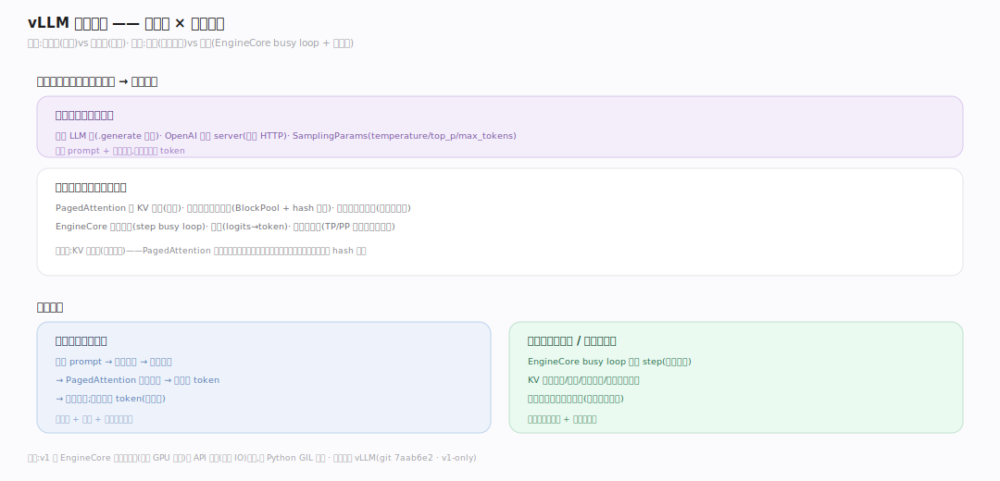
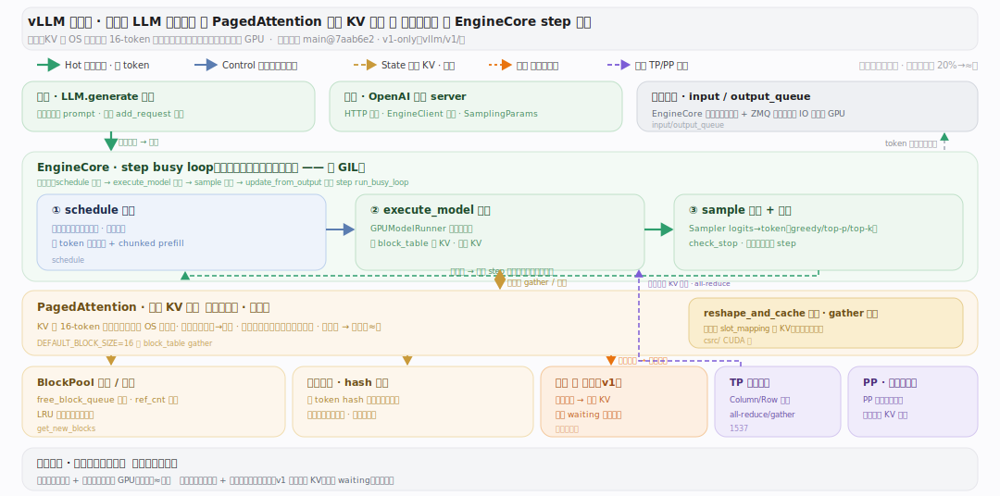
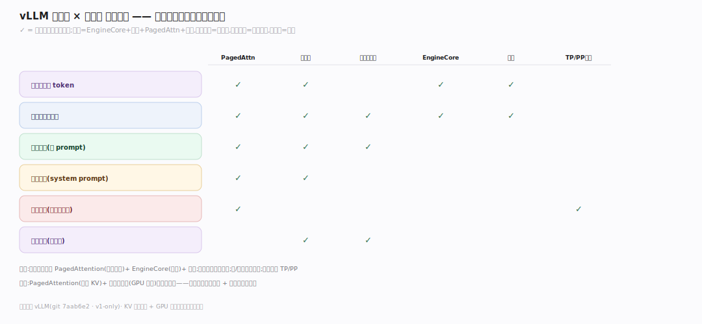
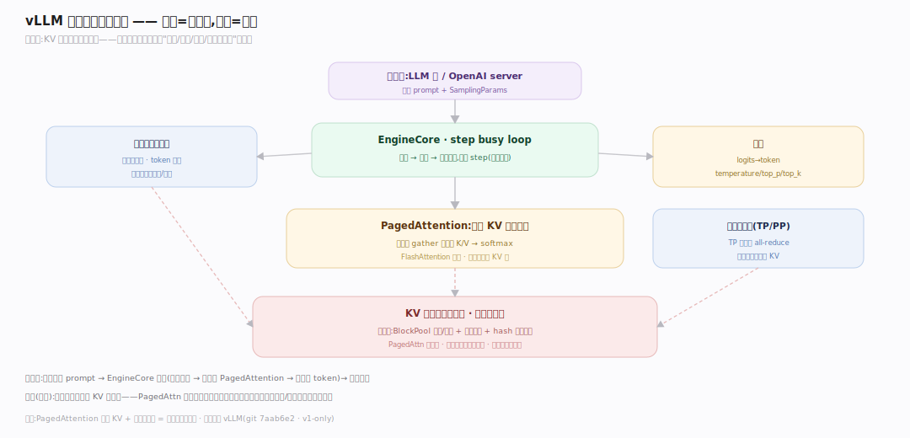
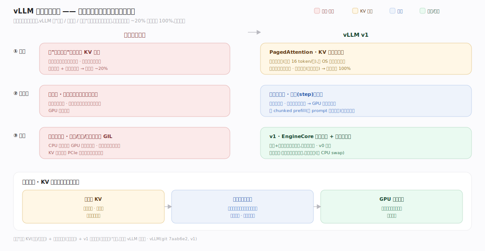

# vLLM 原理 · 全景主线框架

> 统领全部原理文档:vLLM 是 **LLM 推理引擎**(新家族:大模型推理服务——把一个训练好的 LLM 高吞吐、低延迟地对外提供 token 生成服务,靠 PagedAttention 分块管 KV 缓存 + 连续批处理榨干 GPU)。源码基准 **vLLM(git 7aab6e2)**(`~/workdir/vllm`,Python + CUDA;**v0 引擎已移除,全 v1**)。

vLLM 的世界观:**一切围绕"高效复用 GPU 显存里的 KV 缓存 + 让 GPU 一刻不闲"**。LLM 自回归生成——每生成一个 token 都要用到之前所有 token 的 KV(键值)缓存;朴素做法为每个请求预留最大长度的连续显存,浪费巨大。vLLM 的 **PagedAttention** 把 KV 缓存切成**固定大小的块**(像操作系统的分页),按需分配、可共享(前缀缓存);**连续批处理**让请求随到随入、完成即出,GPU 每步都满载。理解"分块 KV + 连续批处理 + v1 单进程架构"三点,就懂了 vLLM 为何快。

> **结构提示(写文档必看)**:① v1-only(`vllm/engine/` 只是转发到 `vllm/v1/` 的兼容壳,`llm_engine.py:3` 别名);② 顶层流 LLM/EngineCore→Scheduler→Executor→Worker→ModelRunner→attention;③ PagedAttention 分块 KV(block_size 默认 16,`config/cache.py:47`)+ reshape_and_cache CUDA kernel;④ BlockPool 块池 + KVCacheManager + 前缀缓存(按 token hash 复用块);⑤ Scheduler 连续批处理(token 预算 + chunked prefill + 重算式抢占);⑥ EngineCore busy loop 可独立进程(AsyncLLM/MPClient);⑦ Sampler 采样(greedy/random + temperature/top_p/top_k);⑧ TP/PP 分布式并行(parallel_state.py)。

---

## 一、双维模型:能力域 × 执行时机

- **能力域**:接触面(离线 `LLM` 类 / OpenAI 兼容 server + SamplingParams)面向用户;支撑侧——PagedAttention KV 缓存、块管理与前缀缓存、连续批处理调度、EngineCore 执行循环、采样、分布式并行。
- **执行时机**:前台(请求路径:提交 prompt→调度→前向→采样→返回 token);后台(EngineCore busy loop 持续 step、块的分配/回收/换出)。v1 把 EngineCore 拆到独立进程,与 API 前端异步通信。

---

## 二、总架构图

一次推理的数据流:**用户 prompt** → `LLM.generate`/OpenAI server(`entrypoints/`)→ **EngineCore**(`v1/engine/core.py:97`)的 `step` 循环 → **Scheduler**(`v1/core/sched/scheduler.py:69`)选一批请求 + 分配 KV 块 → **Executor**(`v1/executor/`)→ **Worker/ModelRunner**(`v1/worker/gpu_model_runner.py`)跑模型前向 → **PagedAttention**(用分块 KV 缓存算注意力)→ **Sampler**(`v1/sample/sampler.py`)从 logits 采出 token → 回填、检查停止 → 未完成的请求下一步继续。KV 缓存由 **BlockPool**(`v1/core/block_pool.py`)分块管理,前缀相同的请求共享块。

---

## 三、主线的分层归位(接触面 + 7 支撑域)

| 层 | 主线 | 一句话职责 |
|---|---|---|
| 接触面 | **入口与 API** | LLM 类 / OpenAI server / SamplingParams |
| 核心 | **PagedAttention 与 KV 缓存** | 分块 KV + reshape_and_cache |
| 内存 | **块管理与前缀缓存** | BlockPool 分配/回收 + hash 复用块 |
| 调度 | **连续批处理调度** | Scheduler 随到随入 + token 预算 + 抢占 |
| 引擎 | **EngineCore 执行循环** | step busy loop + 独立进程 |
| 采样 | **采样** | logits→token(greedy/random/top_p/top_k) |
| 并行 | **分布式并行(TP/PP)** | 张量并行 + 流水并行切大模型 |

---

## 四、接触面 × 能力域 依赖矩阵

生成依赖 EngineCore 循环 + 连续批处理调度(选批)+ PagedAttention(算注意力)+ 块管理(分配 KV)+ 采样(出 token);长 prompt 依赖块管理 + chunked prefill;前缀复用依赖前缀缓存;大模型依赖分布式并行(TP/PP);高并发服务依赖 OpenAI server + AsyncLLM。

---

## 五、能力域依赖关系图

实线=数据流,虚线=约束。贯穿层:**KV 缓存块** 横切几乎所有能力域——PagedAttention 读写它、块管理分配回收它、调度按可用块数决定收多少请求、前缀缓存靠 hash 复用它、分布式并行下每个 GPU 存自己那份。KV 块是 vLLM 的中心资源。

---

## 六、三条贯穿声明(vLLM 区别于朴素推理循环)

同一自回归生成任务,vLLM 在三个维度换了做法(左朴素 / 右 vLLM),而 KV 块把三者串成一体:①**PagedAttention** 把 KV 切成固定块(默认 16 token/块)按需分配、可共享,利用率从 ~20% 提到近 100%;②**连续批处理**每步按可用块数重组批,GPU 一刻不闲;③**v1 架构** 把 EngineCore 拆成独立进程 + 显存紧张时重算式抢占(非 CPU swap)。详见后续各支撑篇。

---

## 源码锚点（vLLM `main 1940c84` 本地 grep 复核；建库基准 7aab6e2，个别行号较正文微移）

贯穿示例「step 出一个 token」全链路：

- `vllm/v1/engine/core.py:98` `class EngineCore` → `:576` `step`（主循环）。
- `step` 内：`:587` `scheduler.schedule(...)` → `:588` `model_executor.execute_model(non_block=True)` → `:595` `future.result()` → `:597` `model_executor.sample_tokens` → `:601` `scheduler.update_from_output`。
- 调度：`vllm/v1/core/sched/scheduler.py:421` `schedule`；`:441` `token_budget`。
- KV 分块：`vllm/v1/core/kv_cache_manager.py:283` `allocate_slots`；`vllm/v1/core/block_pool.py:143` `class BlockPool`、`:647` `get_new_blocks`。
- 采样：`vllm/v1/sample/sampler.py:72` `Sampler.forward`。
- 并行：`vllm/distributed/parallel_state.py:1718` `initialize_model_parallel`。
- 入口：离线 `vllm/entrypoints/llm.py:411` `LLM.generate`；在线 `vllm/entrypoints/openai/api_server.py:196` `build_app`。

---

**一句话定位**:vLLM 是 LLM 推理引擎——PagedAttention 把 KV 缓存切成固定块(默认 16 token,像 OS 分页按需分配/共享,显存利用率接近满)+ 连续批处理(每步重组批,完成即出、等待即入,GPU 不空转)+ v1 单一架构(EngineCore 独立进程 busy loop、重算式抢占);顶层 LLM/OpenAI server 接入,Scheduler 按可用 KV 块选批,ModelRunner 跑前向,Sampler 采 token,BlockPool 管块 + hash 前缀复用,TP/PP 切大模型上多卡——一切围绕"高效复用 KV 显存 + 让 GPU 满载"。
