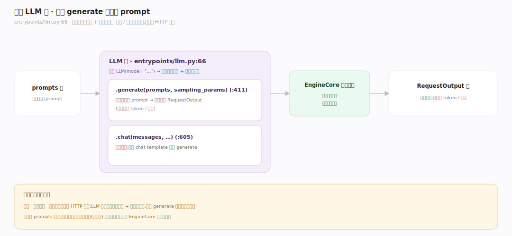
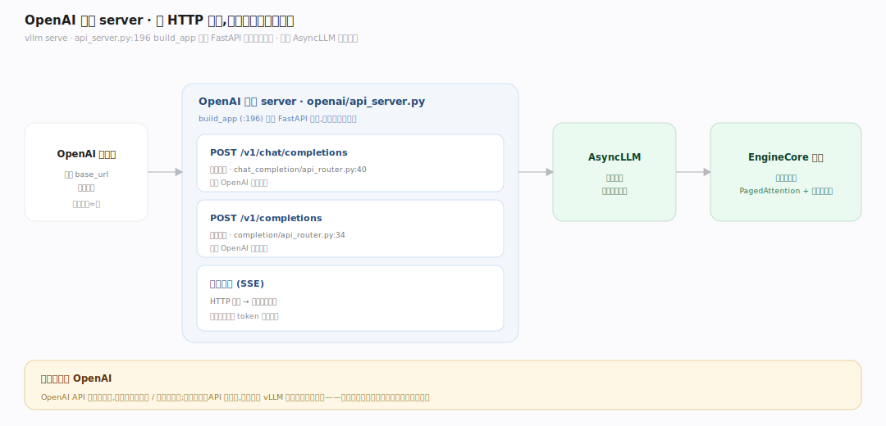
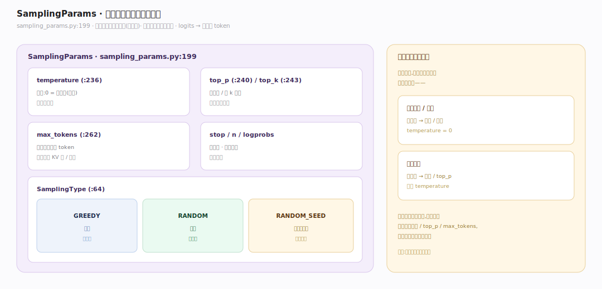

# vLLM 原理 · 接触面主线 · 入口与 API

> **定位**：属"接触面主线"(用户可见)。vLLM 两种接触面:离线 `LLM` 类(批量推理)+ OpenAI 兼容 server(在线服务);`SamplingParams` 控制生成。调用【EngineCore 执行循环】驱动推理。源码基准 **vLLM(git 7aab6e2)**(`vllm/entrypoints/`、`vllm/sampling_params.py`)。

vLLM 怎么被用?两种:**离线 `LLM` 类**(Python 里 `llm.generate(prompts)` 批量跑,做评测/离线生成)+ **OpenAI 兼容 server**(`vllm serve`,起 HTTP 服务,兼容 OpenAI API 供在线调用)。两者都用 `SamplingParams`(temperature/top_p/max_tokens…)控制怎么生成。理解这两种入口 + 采样参数,就懂了怎么用 vLLM。

---

## 一、离线 LLM 类:批量推理

**`LLM` 类**(`vllm/entrypoints/llm.py:66`)是离线批量入口:

- 构造:`LLM(model="...")` 加载模型权重 + 初始化引擎。
- `.generate(prompts, sampling_params)`(:411):传一批 prompt,返回一批生成结果(RequestOutput,含生成的 token/文本)。
- `.chat(messages, ...)`(:605):对话格式(应用 chat template 后 generate)。
- 内部:把 prompt 加进引擎 → 驱动引擎跑到全部完成 → 收集输出。

**为什么有离线入口**:评测、数据生成、批处理场景不需要 HTTP 服务,直接 Python 调用一批 prompt 一次跑完最省事;`LLM` 类封装引擎的加载+批量驱动,一行 generate 拿到全部结果。

---

## 二、OpenAI 兼容 server:在线服务

**OpenAI 兼容 server**(`vllm/entrypoints/openai/api_server.py`)起 HTTP 服务:

- `build_app`(:196)构建 FastAPI 应用,挂载路由。
- 端点(模块化路由):`POST /v1/chat/completions`(`openai/chat_completion/api_router.py:40`)、`POST /v1/completions`(`openai/completion/api_router.py:34`)。
- 兼容 OpenAI API 格式——现有 OpenAI 客户端改个 base_url 即可用;支持流式(SSE)返回。
- 内部:HTTP 请求 → 转成引擎请求 → AsyncLLM 异步驱动 → 流式/整体返回。

**为什么兼容 OpenAI**:OpenAI API 是事实标准,生态里无数客户端/框架按它写;vLLM 兼容它,用户零改造把自托管模型接进现有系统——迁移成本几乎为零。

---

## 三、SamplingParams:控制怎么生成

**`SamplingParams`**(`vllm/sampling_params.py:199`)控制生成行为:

- `temperature`(:236):温度,0=确定性(贪心)、越大越随机。
- `top_p`(:240)/`top_k`(:243):核采样/前 k 采样,截断候选分布。
- `max_tokens`(:262):最多生成多少 token。
- `SamplingType`(:64):GREEDY(贪心)/RANDOM(随机)/RANDOM_SEED(可复现随机)。
- 还有 stop(停止词)、n(生成几个)、logprobs 等。

**为什么参数化采样**:同一模型,不同任务要不同"创造性"——代码补全要确定(低温/贪心)、创意写作要多样(高温/top_p);SamplingParams 把这些解耦成请求级参数,每个请求可独立设定,由【采样】阶段应用。

---

## 拓展 · 接触面关键结构一览

| 接触面 | 入口 | 职责 |
|---|---|---|
| LLM 类 | `entrypoints/llm.py:66` | 离线批量推理 |
| .generate | `llm.py:411` | 批量生成 |
| OpenAI server | `openai/api_server.py:196` | 在线 HTTP 服务 |
| /v1/chat/completions | `chat_completion/api_router.py:40` | 对话端点 |
| SamplingParams | `sampling_params.py:199` | 采样控制 |

## 调优要点（理解要点）

- **离线选 LLM 类**:批量评测/生成用 `LLM.generate`,一次传全部 prompt 让引擎自动组批,吞吐最高。
- **在线选 server**:多客户端并发用 OpenAI server + AsyncLLM,异步处理并发请求。
- **温度按任务**:确定性任务(代码/抽取)temperature=0;创意任务调高 + top_p。
- **max_tokens 设合理**:过大浪费 KV 块/延迟;按预期输出长度设,配 stop 提前结束。

## 常见误区与工程要点

- **误区:vLLM 只是个 HTTP server。** 也有离线 `LLM` 类(Python 批量);server 只是其中一种接触面。
- **误区:采样参数是全局的。** SamplingParams 是请求级,每个请求可独立设温度/top_p/max_tokens。
- **误区:兼容 OpenAI 就是套壳。** 兼容的是 API 格式,底层是 vLLM 自己的高吞吐引擎(PagedAttention+连续批处理)。
- **误区:generate 是同步阻塞一条条跑。** 内部把 prompts 全加进引擎连续批处理并发跑,不是串行。
- **归属提醒**:两种入口都驱动【EngineCore 执行循环】;server 用 AsyncLLM(见【EngineCore】);SamplingParams 在【采样】阶段应用;prompt 长度影响【块管理】的块分配。

## 一句话总纲

**vLLM 两种接触面:离线 `LLM` 类(entrypoints/llm.py:66,.generate(:411) 批量传 prompt 一次跑完,评测/离线生成)+ OpenAI 兼容 server(api_server.py:196 build_app,/v1/chat/completions 等端点,零改造接入现有 OpenAI 生态,支持流式);`SamplingParams`(sampling_params.py:199)请求级控制生成——temperature(:236 温度)/top_p(:240)/top_k(:243)/max_tokens(:262)/SamplingType GREEDY|RANDOM(:64);两种入口都驱动 EngineCore 循环,采样参数在采样阶段应用。**
