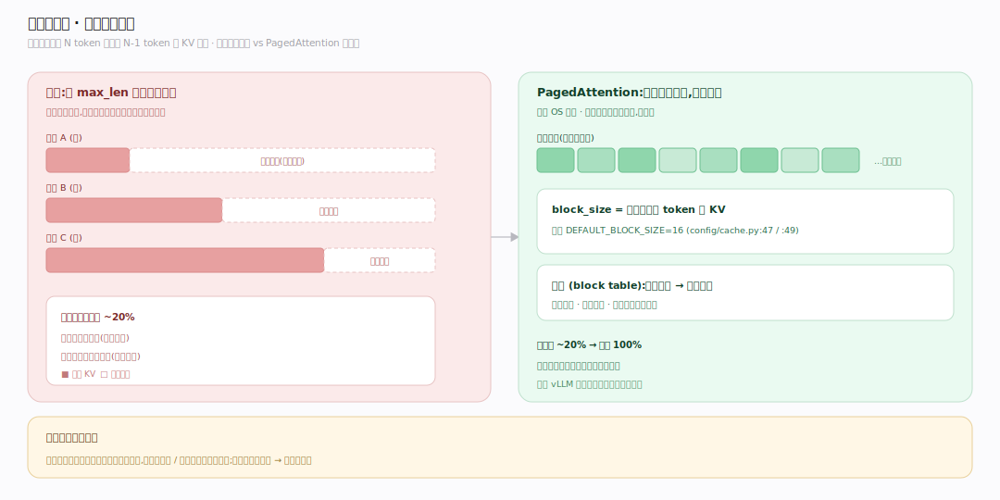
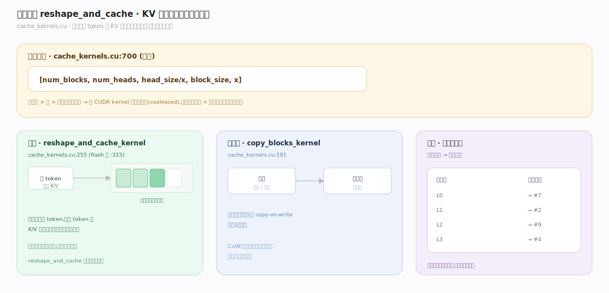
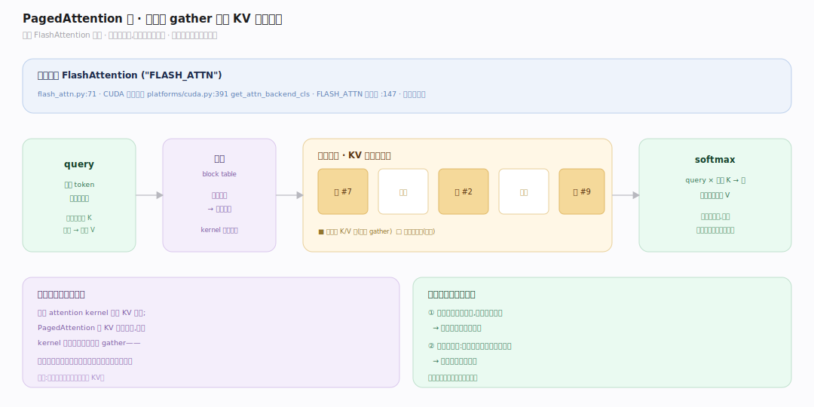

# vLLM 原理 · 支撑主线 · PagedAttention 与 KV 缓存

> **定位**：属"核心能力域"——vLLM 的灵魂。管 KV 缓存的组织:把每个请求的 KV 缓存切成固定大小的**块**(像 OS 分页),逻辑连续、物理分散、按需分配、可共享。是 vLLM 高显存利用率的根本。被【块管理】分配、【连续批处理】按可用块数选批。源码基准 **vLLM(git 7aab6e2)**(`csrc/libtorch_stable/cache_kernels.cu`、`vllm/v1/attention/`)。

LLM 自回归生成:生成第 N 个 token 要用到前 N-1 个 token 的 **KV 缓存**(注意力的键值)。朴素做法为每个请求预留"最大长度"的连续显存放 KV——但实际长度参差,预留的大量浪费(内部碎片)。**PagedAttention** 借鉴操作系统分页:把 KV 缓存切成**固定大小的块**(默认 16 token/块),按需一块块分配,逻辑上连续、物理上分散,块还能在请求间共享。理解"为什么分块 + 块布局 + 注意力核如何读分块 KV",就懂了 vLLM 为何显存利用率接近满。

---

## 一、为什么分块:告别连续预留

朴素 KV 缓存的浪费:

- 请求长度未知,为避免搬迁,朴素做法按 **max_len 预留连续显存**——短请求浪费大半(内部碎片),还要为并发峰值预留(外部碎片)。实际利用率常只 ~20%。
- PagedAttention:KV 切成**固定大小块**,请求生成到哪就分配到哪(按需增长),不预留;不同请求的块在物理显存里交错存放,靠**块表**(block table)记录"逻辑块号→物理块号"。
- `block_size`(`vllm/config/cache.py:49`,默认 `DEFAULT_BLOCK_SIZE=16`,:47)= 每块存多少 token 的 KV。

**为什么这解决浪费**:分页把"连续大块"拆成"按需小块",消除为峰值/最大长度预留的碎片;显存利用率从 ~20% 提到接近 100%,同样显存能同时服务多得多的请求——吞吐倍增。这是 vLLM 相对朴素推理最大的胜利。

---

## 二、块布局与 reshape_and_cache

KV 缓存在显存里的组织:

- 物理布局(`cache_kernels.cu:700` 注释):KV cache 形如 `[num_blocks, num_heads, head_size/x, block_size, x]`——按块、头、块内位置组织。
- **写入**:每生成一个 token,`reshape_and_cache_kernel`(`cache_kernels.cu:255`)/ flash 版(:315)把该 token 算出的 K/V 写进它所属块的对应槽位。
- **块拷贝**:`copy_blocks_kernel`(:191)在需要复制块时(如 copy-on-write 分叉)搬块。
- 每个请求维护块表:逻辑位置 → 物理块号。

**为什么这样布局**:注意力计算要按"头 × 块内位置"高效读取;把 block_size 维度和 head 维度合理排布,让 CUDA kernel 能合并访存(coalesced);reshape_and_cache 在每步把新 token 的 KV 精确写入对应块槽,无需搬动已有块。

---

## 三、PagedAttention 核:读分块 KV 算注意力

注意力计算如何用分块 KV:

- 默认后端 **FlashAttention**(`vllm/v1/attention/backends/flash_attn.py:71`,名 `"FLASH_ATTN"`);CUDA 平台选择在 `vllm/platforms/cuda.py:391`(`get_attn_backend_cls`,FLASH_ATTN 优先级 :147)。
- 计算 attention 时,kernel 按**块表**找到该请求 KV 的一个个物理块,逐块读 K/V 参与 softmax(query 与所有历史 K 算分、加权 V)——尽管块物理分散,块表让它逻辑上像连续序列。
- 分块让注意力核能只读实际存在的块(不读预留空洞),且支持共享块(多个请求同一物理块)。

**为什么核要感知分块**:传统 attention kernel 假设 KV 连续;PagedAttention 的 KV 物理分散,所以 kernel 要接受块表、按块 gather——这是"分页"能对上"注意力计算"的关键改造,让分块存储对计算透明。

---

## 拓展 · PagedAttention 关键一览

| 项 | 定义 | 说明 |
|---|---|---|
| block_size | `config/cache.py:47` | 默认 16 token/块 |
| reshape_and_cache | `cache_kernels.cu:255` | 写 KV 进块槽 |
| copy_blocks | `cache_kernels.cu:191` | 块拷贝(CoW) |
| KV 布局 | `cache_kernels.cu:700` | [num_blocks,num_heads,...] |
| FlashAttention | `v1/attention/backends/flash_attn.py:71` | 默认后端 |

## 调优要点（理解要点）

- **block_size 权衡**:块大(如 32)块表小、但内部碎片略增;块小(如 8)碎片少、块表/管理开销增;默认 16 是折中。
- **显存换吞吐**:分块让同显存装更多并发请求;gpu_memory_utilization 调高(如 0.9)给 KV 更多空间。
- **长序列友好**:分块按需增长,长上下文不必预留;配合前缀缓存共享公共前缀块。
- **后端选择**:默认 FlashAttention 快且省显存;特殊场景(某些头维/量化)可能回退其他后端。

## 常见误区与工程要点

- **误区:KV 缓存必须连续。** PagedAttention 分块非连续,靠块表映射;这是 vLLM 核心创新。
- **误区:分块只是省内存。** 省内存直接转化为更高并发/吞吐(同显存装更多请求),还使前缀共享成为可能。
- **误区:block_size 越小越好。** 太小块表/管理开销大;16 是折中,非越小越优。
- **误区:注意力核不用改就能用分块 KV。** 核必须感知块表、按块 gather KV;这是 PagedAttention 的关键改造。
- **归属提醒**:块的分配/回收在【块管理与前缀缓存】;调度按可用块数决定收多少请求在【连续批处理】;块在多卡的分布在【分布式并行】;写块发生在【EngineCore】每步前向后。

## 一句话总纲

**vLLM 的灵魂 PagedAttention:LLM 生成要用历史 token 的 KV 缓存,朴素做法按 max_len 预留连续显存浪费巨大(利用率~20%);PagedAttention 借鉴 OS 分页把 KV 切成固定块(block_size 默认 16,config/cache.py:47),按需分配、逻辑连续物理分散、靠块表映射逻辑→物理块号;reshape_and_cache_kernel(cache_kernels.cu:255)每步把新 token KV 写进块槽,布局 [num_blocks,num_heads,head_size/x,block_size,x];默认 FlashAttention 后端按块表 gather KV 算注意力——显存利用率接近满、同显存装更多并发,吞吐倍增,还使前缀共享成为可能。**
