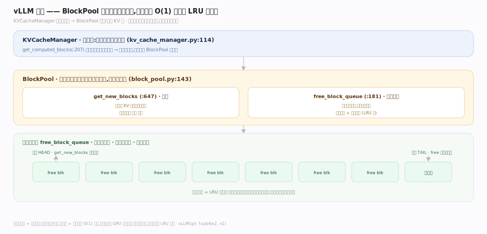
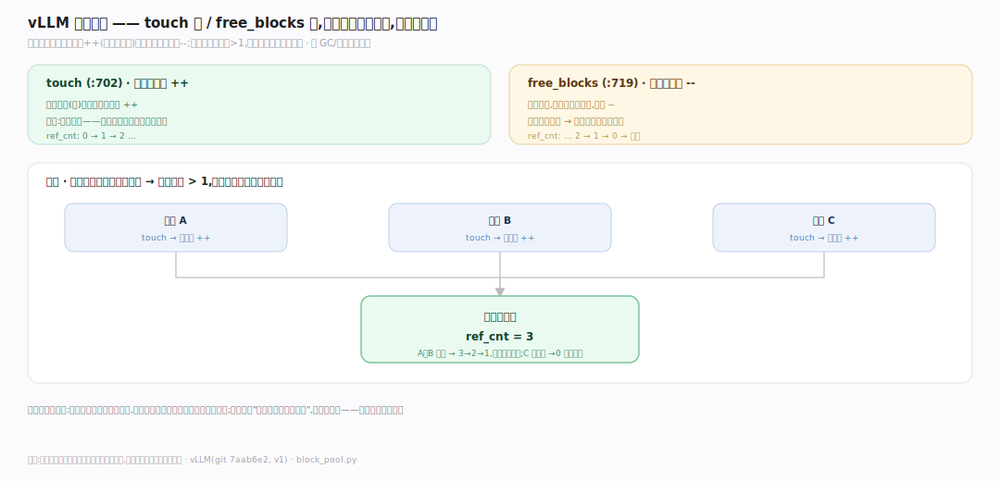
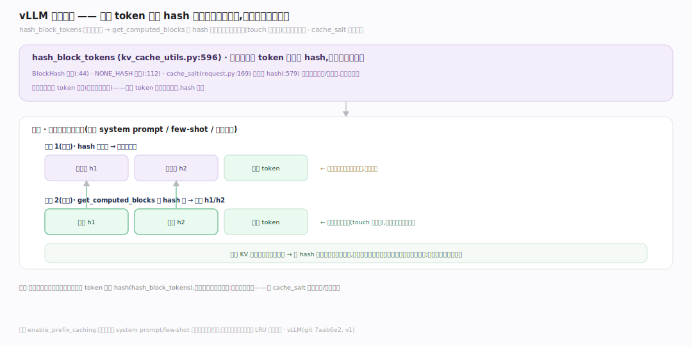

# vLLM 原理 · 支撑主线 · 块管理与前缀缓存

> **定位**：属"内存管理能力域"。管 KV 块的生命周期:BlockPool 分配/回收块、引用计数、按 token hash 复用块(前缀缓存)。是【PagedAttention】分块存储的管家。被【连续批处理】按可用块数选批。源码基准 **vLLM(git 7aab6e2)**(`vllm/v1/core/block_pool.py`、`kv_cache_manager.py`)。

PagedAttention 把 KV 切成块,但谁来管这些块?**BlockPool** 是块的管家:维护空闲块队列,请求要 KV 就分配块、请求结束就回收块;块用**引用计数**(多请求共享同一块时)。更妙的是**前缀缓存**:两个请求若有相同前缀(如同一 system prompt),它们的前缀 KV 完全一样——按 token 内容 **hash** 索引块,后来的请求直接复用已算好的块,省去重复计算。理解"块池分配回收 + 引用计数 + hash 前缀复用",就懂了 vLLM 怎么管显存。

---

## 一、BlockPool:块的分配与回收

**BlockPool**(`vllm/v1/core/block_pool.py:143`)管所有 KV 块:

- 启动时按可用显存算出总块数,建块池。
- `get_new_blocks`(:647):请求需要 KV 空间时分配新块。
- `free_block_queue`(:181):空闲块队列——回收的块进队,分配从队头取;队列顺序也是**驱逐顺序**(LRU 式,最久未用先被复用)。
- `KVCacheManager`(`vllm/v1/core/kv_cache_manager.py:114`):更高层,协调请求的块需求;`get_computed_blocks`(:207)查已算好的可复用块。

**为什么用池 + 空闲队列**:块频繁分配/回收,用固定池 + 空闲队列 O(1) 取还,避免反复向 GPU 申请显存;空闲队列兼作驱逐顺序,前缀缓存的旧块在被复用需要空间时按 LRU 淘汰。

---

## 二、引用计数:块的共享与释放

块用**引用计数**支持共享:

- `touch`(:702):增引用计数——当一个块被(新)请求引用(如前缀共享),计数++。
- `free_blocks`(:719):减引用计数——请求结束释放它的块,计数--;归零的块回到空闲队列可被复用。
- 多个请求共享同一前缀块时,块的引用计数 > 1;只有所有引用它的请求都结束,块才真正可回收。

**为什么引用计数**:前缀缓存让多请求共享块,不能某个请求结束就删了别人还在用的块;引用计数精确追踪"还有几个请求用这块",归零才回收——和 GC/智能指针同理,安全共享的基础。

---

## 三、前缀缓存:hash 复用已算的块

**前缀缓存**按内容 hash 复用块:

- `hash_block_tokens`(`vllm/v1/core/kv_cache_utils.py:596`):对一个块的 token 序列算 hash,作块的内容指纹(`BlockHash` 类型 :44,`NONE_HASH` 种子 :112)。
- 新请求来时,`get_computed_blocks` 用 hash 查:若前缀块的 hash 已存在(之前请求算过)→ 直接复用那些物理块(touch 增引用),跳过重复的前向计算。
- `cache_salt`(`vllm/v1/request.py:169`)可折进 hash(:579)——隔离不同租户/上下文,避免误共享。

**为什么 hash 前缀复用**:很多请求共享公共前缀(同一 system prompt、few-shot 示例、对话历史);这段前缀的 KV 每个请求算出来完全一样——按 hash 复用第一次算好的块,后续请求直接命中,省下前缀部分的全部计算和显存。长公共前缀场景收益巨大。

---

## 拓展 · 块管理关键一览

| 项 | 定义 | 职责 |
|---|---|---|
| BlockPool | `block_pool.py:143` | 块池 |
| get_new_blocks | `:647` | 分配新块 |
| free_block_queue | `:181` | 空闲队列(兼驱逐序) |
| touch / free_blocks | `:702` / `:719` | 引用计数 ++/-- |
| KVCacheManager | `kv_cache_manager.py:114` | 块需求协调 |
| hash_block_tokens | `kv_cache_utils.py:596` | 前缀块内容 hash |

## 调优要点（理解要点）

- **前缀缓存增益**:多请求共享 system prompt/few-shot 时,开启前缀缓存(enable_prefix_caching)大幅省算力/显存。
- **cache_salt 隔离**:多租户场景用 cache_salt 隔离,防跨租户误命中共享块。
- **块数即并发上限**:总块数(受 gpu_memory_utilization 影响)决定能同时容纳多少 KV;不够就触发抢占。
- **LRU 驱逐**:空闲队列 LRU 序,热前缀块尽量留存;冷块先被复用。

## 常见误区与工程要点

- **误区:每个请求独占自己的块。** 前缀相同的请求共享物理块(引用计数 > 1);共享是省算力的关键。
- **误区:块结束立即删。** 引用计数归零才回收;共享块要等所有引用者结束。
- **误区:前缀缓存靠字符串匹配。** 靠 token 序列 hash(hash_block_tokens);按块粒度命中。
- **误区:前缀缓存总是安全共享。** 需 cache_salt 隔离租户/上下文,否则可能跨请求误共享。
- **归属提醒**:块存的是【PagedAttention】的 KV;可用块数决定【连续批处理】收多少请求 + 是否抢占;抢占释放块回池(见【连续批处理】);多卡下每卡独立块池在【分布式并行】。

## 一句话总纲

**vLLM 的 KV 块管家:BlockPool(block_pool.py:143)按显存建块池,get_new_blocks(:647)分配、free_block_queue(:181)空闲队列兼 LRU 驱逐序;引用计数(touch:702 增/free_blocks:719 减)支持多请求安全共享块、归零才回收;前缀缓存(hash_block_tokens kv_cache_utils.py:596 对块 token 序列算 hash,get_computed_blocks 命中则复用物理块跳过重复前向,cache_salt request.py:169 隔离租户)——公共前缀(system prompt/few-shot/对话历史)只算一次,后续请求直接命中省算力和显存;总块数决定并发上限,不够触发重算式抢占。**
