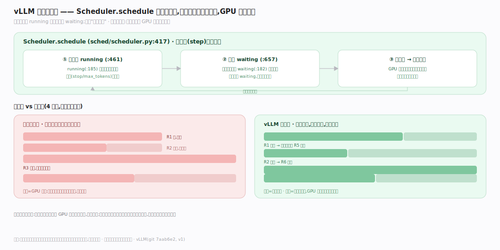
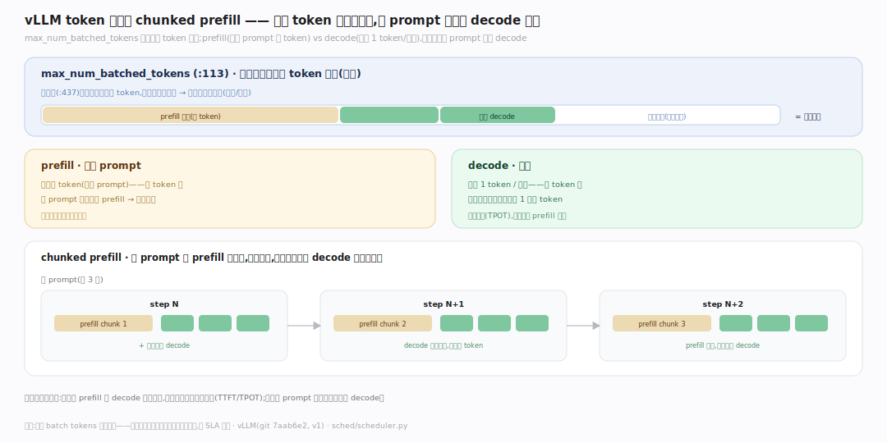
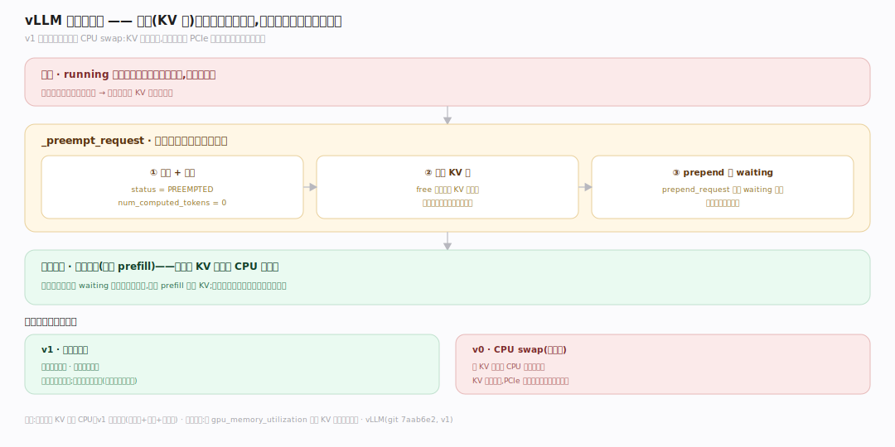
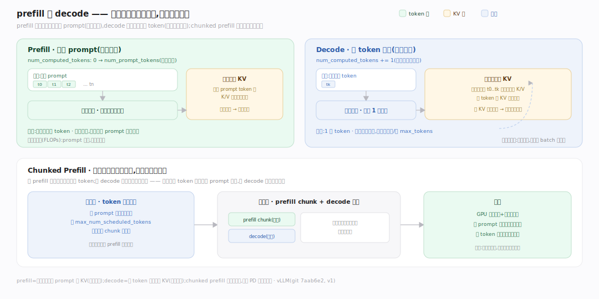

# vLLM 原理 · 支撑主线 · 连续批处理调度

> **定位**：属"调度能力域"——vLLM 高吞吐的另一支柱。管请求的组批与优先级:Scheduler 每步重新组批(随到随入、完成即出)、token 预算约束、chunked prefill、重算式抢占。是让 GPU 满载的关键。用【块管理】的可用块数决策。源码基准 **vLLM(git 7aab6e2)**(`vllm/v1/core/sched/scheduler.py`)。

朴素静态批处理:凑一批请求一起跑,等这批**全部**完成才收下一批——但请求生成长度不同,短的早早做完只能干等长的,GPU 大量空转。vLLM **连续批处理**(continuous batching):每一步(step)都重新组批——完成的请求出队、等待的立即补入,GPU 每步都装满活跃请求。配合 **token 预算**(每步最多处理多少 token)、**chunked prefill**(长 prompt 切块混入)、**重算式抢占**(显存不够时释放块重算)。理解这几点,就懂了 vLLM 怎么把 GPU 榨满。

---

## 一、连续批处理:每步重组批

**Scheduler.schedule**(`vllm/v1/core/sched/scheduler.py:417`)每步组批:

- 两个队列:`self.waiting`(:182,等待)、`self.running`(:185,运行中)。
- 每步:先调度 **RUNNING** 里的请求继续解码(:461),再看还有预算就从 **WAITING** 补新请求进来(:657)。
- 完成的请求(生成到 stop/max_tokens)出 running;新到的进 waiting 随时可被补入。
- 不等"整批做完"——每步都是一个新组合,GPU 始终处理当前所有活跃请求。

**为什么连续组批**:静态批处理的短请求做完后 GPU 空转等长请求,利用率低;连续批处理让完成的位置立刻被新请求填补,GPU 每步满载——同样硬件吞吐大幅提升。这是与朴素推理的核心区别之一。

---

## 二、token 预算与 chunked prefill

一步能处理多少受 **token 预算**约束:

- `max_num_batched_tokens`(:113):每步最多处理的 token 总数(预算)。
- 调度时(:437)累加候选请求的 token,不超预算才纳入。
- **两类工作**:prefill(处理 prompt,一次多 token)vs decode(生成,一次 1 token/请求)——prefill 吃 token 多。
- **chunked prefill**:长 prompt 的 prefill 切成块,分几步做,与其他请求的 decode 混在同一批——避免长 prompt 独占一步、阻塞 decode。

**为什么要 token 预算 + chunked prefill**:一步计算量要可控(显存/时延);长 prompt 若一次全 prefill 会占满一步、让正在解码的请求卡顿;切块混批让 prefill 和 decode 平滑共存,兼顾吞吐和单请求时延(TTFT/TPOT)。

---

## 三、重算式抢占:显存不够时

显存(KV 块)不够时**抢占**:

- 运行中的请求要继续解码需分配新块;若块池空了,调度器抢占**部分请求**让路。
- v1 的抢占是**重算式**:`_preempt_request` 把被抢请求 `status=PREEMPTED`、`num_computed_tokens=0`、释放其 KV 块、`prepend_request` 放回 waiting 队头。
- 被抢请求稍后重新调度时,从头**重算**(重新 prefill)——不是把 KV 换出到 CPU 再换回。

**为什么重算而非换出**:v0 曾支持把 KV swap 到 CPU 内存再换回,但 KV 数据量大,换出换入的 PCIe 传输往往比重新计算还慢;v1 简化为重算式抢占——释放块给别人、被抢的重新算,整体更快更简单。代价是被抢请求要重算前缀(但前缀缓存可缓解)。

---

## 四、prefill 与 decode:两阶段的不同代价

调度的两个对象根本不同:**prefill** 一次并行吃完整个 prompt、`num_computed_tokens` 从 0 跨到 `num_prompt_tokens`,是**算力密集**(大矩阵乘);**decode** 每步只前进一格、读全部历史 KV 再追加一格,是**显存带宽密集**(算力有余)。二者短板互补,于是 **chunked prefill** 按 token 预算把长 prompt 切块、与 decode 请求拼进同一批,让算力与带宽在同一步都吃满,也避免一个超长 prefill 阻塞整批——这正是 chunked prefill 与后文 PD 分离共同的动机。

---

## 拓展 · 调度关键一览

| 项 | 定义 | 职责 |
|---|---|---|
| Scheduler | `sched/scheduler.py:69` | 调度器 |
| schedule | `:417` | 每步组批 |
| waiting / running | `:182` / `:185` | 等待/运行队列 |
| max_num_batched_tokens | `:113` | 每步 token 预算 |
| 重算式抢占 | `_preempt_request` | 释放块 + 归零 + 重入队 |

## 调优要点（理解要点）

- **max_num_batched_tokens 调吞吐/时延**:调大吞吐高但单步时延增;按 SLA 平衡。
- **chunked prefill 平滑**:开启后长 prompt 不阻塞 decode,改善并发时的 TPOT。
- **减少抢占**:抢占=重算浪费;适当调 gpu_memory_utilization 给足 KV 空间、或限并发,减少抢占。
- **前缀缓存救抢占**:被抢请求重算时若前缀命中缓存,重算成本大降。

## 常见误区与工程要点

- **误区:一批请求一起开始一起结束。** 连续批处理每步重组,随到随入、完成即出;不是静态批。
- **误区:抢占是把 KV 换到 CPU。** v1 是重算式抢占(释放块 + 归零 + 重入队);不做 CPU swap。
- **误区:prefill 和 decode 分开批。** chunked prefill 把长 prompt 切块与 decode 混在同批,平滑时延。
- **误区:调大 batch tokens 总是更好。** 太大单步时延高、可能触发更多抢占;要按 SLA 平衡。
- **归属提醒**:调度按【块管理】的可用块数决定收多少/是否抢占;组好的批交【EngineCore】前向;抢占释放的块回【块管理】的池;重算命中【块管理】的前缀缓存。

## 源码锚点（vLLM `main 1940c84` 本地 grep 复核；建库基准 7aab6e2，个别行号较正文微移）

- `vllm/v1/core/sched/scheduler.py:111` `self.max_num_scheduled_tokens`（token 预算源）；`:183` `self.waiting = create_request_queue(...)`。
- `vllm/v1/core/sched/scheduler.py:421` `def schedule(self, throttle_prefills)` → `:441` `token_budget = self.max_num_scheduled_tokens`（每步预算）。
- 抢占：`:597` `self.running.pop()`（选牺牲者）→ `:599` 调用 `_preempt_request` → `:1208` `def _preempt_request`。
- 重算式抢占内幕：`:1217` `_free_request_blocks`（释放 KV 块）、`:1220` `status = RequestStatus.PREEMPTED`、`:1221` `num_computed_tokens = 0`（归零重算）、`:1229` `self.waiting.prepend_request`（插回等待队列）。
- `:1585` `def update_from_output`（append 新 token、check_stop、回填）；`:2111` `def add_request`（随到随入）。
- `vllm/v1/engine/core.py:576` `EngineCore.step`（每步调 `schedule`）；`:587` step 内的 `scheduler.schedule` 调用点。

## 一句话总纲

**vLLM 高吞吐支柱连续批处理:Scheduler.schedule(scheduler.py:417)每步重组批——先续跑 running(:461)再按预算补 waiting(:657),完成即出、随到随入,GPU 每步满载(区别于静态批的短请求做完空转等长请求);token 预算 max_num_batched_tokens(:113)约束每步计算量,chunked prefill 把长 prompt 切块与 decode 混批避免阻塞;显存不够时重算式抢占(_preempt_request 释放块+num_computed_tokens 归零+prepend 回 waiting,重新调度时重算而非 CPU swap——KV 太大换出比重算还慢)。**
