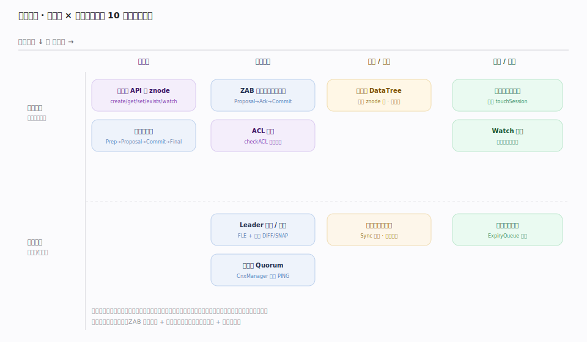
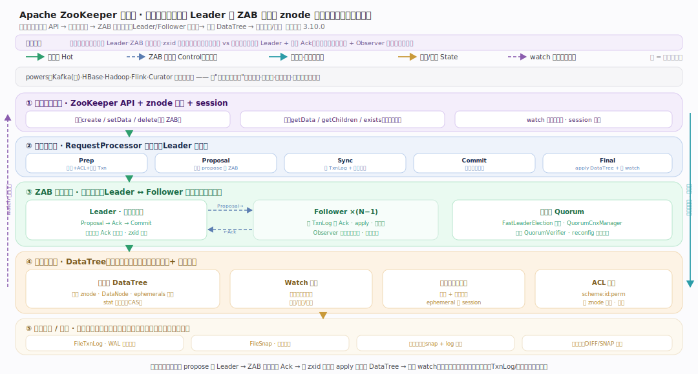
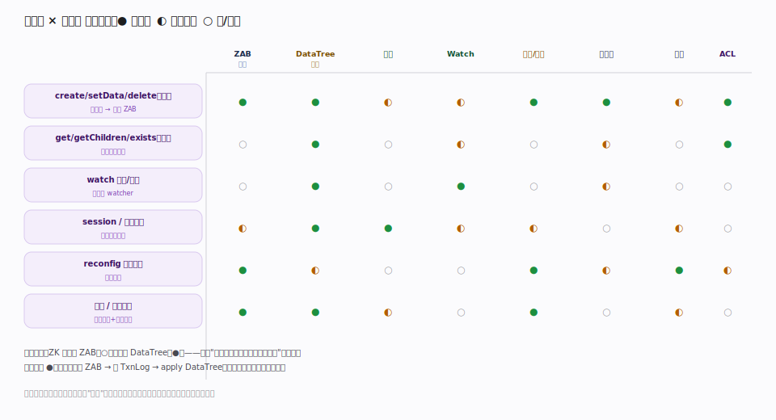
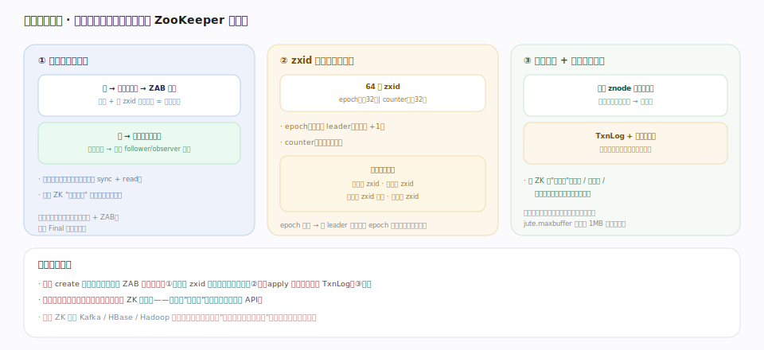
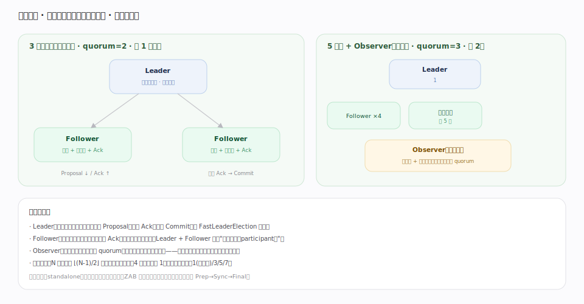

# ZooKeeper 原理 · 全景主线框架

> 统领全部原理文档：ZooKeeper 属 **家族 6 · 分布式协调 / 共识 KV 存储**——接触面是**一族客户端 API**（create/getData/setData/getChildren/exists/delete + watch + session）而非 SQL 或文件系统；自己管**强一致复制的层级 znode 树 + 集群成员协调**；容错靠 **ZAB 原子广播 + 事务日志/快照**。灵魂主线是 **ZAB 原子广播**——它把"单机内存树"变成"线性化写、全局有序的分布式协调服务"，漏了它 ZK 文档就是散的。核实基准：`~/tmp/zk-src`（apache/zookeeper，3.10.0-SNAPSHOT；Java 实现，源码在 `zookeeper-server/src/main/java/org/apache/zookeeper`）。

## 深化 · 与 etcd 的心智对照（读前必看）

ZooKeeper 与 etcd 同属"分布式协调/共识 KV"家族，但设计选择差异很大。先立这几条对照，后文不再重复：

维度 | **ZooKeeper** | etcd | 影响
|---|---|---|---|
| 共识协议 | **ZAB（ZooKeeper Atomic Broadcast）** | Raft | 都是主-从、日志+过半+选主；ZAB 恢复阶段独立（发现→同步→广播），主先定 epoch 再广播 |
| 数据模型 | **层级 znode 树**（路径 → 节点，节点带数据+子节点） | 扁平 KV + revision MVCC | ZK 是文件系统式命名空间，天然表达层级/父子/顺序 |
| 变更订阅 | **watch：一次性触发**（触发后需重新注册） | 按 revision 持续流式推送 | ZK 一次性语义更轻，但客户端需"读+重挂"；3.6+ 补了持久/递归 watch |
| 临时数据 | **ephemeral 节点绑 session**（会话断即删） | lease TTL（key 绑 lease） | ZK 用连接生命周期，etcd 用显式租约 + keepalive |
| 多版本 | **仅保留最新值 + stat 版本号** | 保留多版本、可按 revision 读历史 | ZK 不做时间旅行读；版本号只用于 CAS |
| 实现 | Java | Go | — |

## 一、双维模型：能力域 × 执行时机

用两个正交维度把 10 条主线归位：

- **能力域**（横轴）：接触面（客户端 API/znode）/ 共识底座（ZAB）/ 存储数据（DataTree）/ 协调保障（会话、Watch、日志快照、处理链、集群、ACL）。
- **执行时机**（纵轴）：前台请求路径（读写、watch、心跳同步处理）vs 后台守护循环（选举恢复、会话过期扫描、周期快照、集群心跳）。

## 二、总架构图：一次写的完整生命

一个 `create`/`setData` 的完整链路（贯穿示例，全库复用）：client → 服务端 `firstProcessor` 进入**请求处理链**（Leader 上为 `LeaderRequestProcessor → PrepRequestProcessor → ProposalRequestProcessor → CommitProcessor → FinalRequestProcessor`，`LeaderZooKeeperServer.java:65`）→ `PrepRequestProcessor` 校验 + `checkACL` + 生成事务（`PrepRequestProcessor.java`）→ `ProposalRequestProcessor` 判断是写就调 `Leader.propose`（`ProposalRequestProcessor.java:85`）把请求编码成 `QuorumPacket(PROPOSAL)` 广播（`Leader.java:1295`）、同时经内嵌 `SyncRequestProcessor` 落 TxnLog 自 Ack（`:53`/`:89`）→ 过半 follower 回 `ACK`，`Leader.processAck`（`Leader.java:1054`）收齐后 `tryToCommit`（`:970`）广播 `COMMIT` → `FinalRequestProcessor` 把事务 `processTxn` apply 到 **DataTree**（`DataTree.java:857`）、触发 watch、返回。**读**（getData/getChildren）默认不经 ZAB，直接查本地内存 DataTree。

## 深化 · 能力域主线索引（1 接触面 + 8 支撑）

镜像元模式（接触面 × 能力域 × 执行时机），按 ZooKeeper 社区实情命名：

| 类别 | 主线 | 一句话职责 | 核实锚点 |
|---|---|---|---|
| 接触面 | **客户端 API 与 znode** | create/get/set/getChildren/exists/delete/multi + watch + session；znode 路径模型（持久/临时/顺序/容器/TTL） | `FinalRequestProcessor.java`、`ZooDefs.java`、`DataTree.java` |
| 支撑·灵魂 | **ZAB 原子广播** | Proposal→Ack→Commit 广播 + Leader 选举/恢复；zxid 全序 | `quorum/{Leader,Follower,LearnerHandler,FastLeaderElection}.java` |
| 支撑 | **数据树 DataTree** | 内存层级 znode 树：nodes 映射、DataNode、ephemerals 索引 | `DataTree.java`、`DataNode.java`、`ZKDatabase.java` |
| 支撑 | **会话与临时节点** | session 心跳 + 分桶过期；ephemeral 节点绑 session | `SessionTrackerImpl.java`、`ExpiryQueue.java` |
| 支撑 | **Watch 机制** | 一次性触发通知；标准/持久/递归 watch | `watch/{WatchManager,WatchManagerOptimized}.java` |
| 支撑 | **事务日志与快照** | WAL（FileTxnLog）+ 模糊快照（FileSnap）+ 崩溃恢复 | `persistence/{FileTxnLog,FileSnap,FileTxnSnapLog}.java` |
| 支撑 | **请求处理链** | RequestProcessor 责任链；Leader/Follower/单机三种拓扑 | `{Prep,Sync,Final}RequestProcessor.java`、`quorum/{Commit,Proposal}RequestProcessor.java` |
| 支撑 | **集群与 Quorum** | QuorumPeer 状态机、QuorumCnxManager 选举连接、QuorumVerifier 过半、reconfig | `quorum/{QuorumPeer,QuorumCnxManager}.java` |
| 支撑 | **ACL 权限** | scheme:id:perm，每 znode 独立 ACL；authprovider 插件 | `ZooKeeperServer.java`、`auth/*`、`ZooDefs.java` |

> 归属判断：一个知识点属于哪条主线，看它的**归属能力域**而非它出现在哪个 API 里。例：`create` 一个临时顺序节点——其"经 ZAB 达成全序"属 [[ZAB 原子广播]]、"落到内存树 + 分配顺序号"属 [[数据树 DataTree]]、"绑到 session、断连即删"属 [[会话与临时节点]]、"落 TxnLog"属 [[事务日志与快照]]——同一个 create 在四条主线各有落点，这正是 ZK 的分层。

## 四、接触面 × 能力域 依赖矩阵

## 五、三条贯穿声明（不单列主线，但覆盖全局）

- **写全序、读本地**：改数据的操作都编码成事务、经 ZAB 广播到过半并按 zxid 全序提交（线性化写）；读默认直查本地内存树、不经共识（吞吐随 follower/observer 扩展，但可能略旧——需最新用 `sync` + read）。这是 ZK "读多写少" 的立身之本。
- **zxid 是一切顺序的锚**：64 位 = **epoch（高 32，第几任 leader）| counter（低 32，任内递增）**（`util/ZxidUtils.java:29`）。选举比、恢复比、提交按、快照记——全序由它统一，epoch 单调防旧主脑裂。
- **全量内存 + 磁盘只为恢复**：整棵 znode 树常驻内存（读写都在内存树上），磁盘 TxnLog+快照只用于崩溃恢复与新成员同步。故 ZK 存**小数据**（配置/元数据/协调状态），要正确与低延迟协调而非大吞吐存储。

## 六、运行形态与物理部署（部署维度）

- **单机（standalone）**：开发测试，无容错。
- **3 节点集群**：容忍 1 节点故障（quorum=2），生产最小配置。
- **5 节点集群**：容忍 2 节点故障（quorum=3），高可用生产。
- **Observer**：非投票成员，只同步 + 服务读——扩读吞吐、不拖慢 quorum。
- 偶数节点无收益：4 节点 quorum=3 仍只容忍 1 故障，反增开销——**永远用奇数**。

## 源码锚点（各主线入口 · 3.10.0-SNAPSHOT · master 53a78e3）

| 主线 | 入口锚点 |
|---|---|
| 请求入口 | `server/ZooKeeperServer.java:1208`（submitRequest）|
| 请求处理链·预处理 | `server/PrepRequestProcessor.java:758`（pRequest）|
| 请求处理链·收尾 | `server/FinalRequestProcessor.java:147`（processRequest）|
| ZAB·广播 | `server/quorum/Leader.java:1295`（propose）、`server/quorum/Leader.java:970`（tryToCommit）|
| ZAB·跟随 | `server/quorum/Follower.java:71`（followLeader）|
| ZAB·选举 | `server/quorum/FastLeaderElection.java:907`（lookForLeader）|
| ZAB·zxid | `server/util/ZxidUtils.java:29`（makeZxid）|
| 集群·状态机 | `server/quorum/QuorumPeer.java:882`（run）、`:578`（ServerState）|
| 数据树 | `server/DataTree.java:857`（processTxn）、`server/DataTree.java:95`（类）|
| 会话 | `server/SessionTrackerImpl.java:45`、`server/ExpiryQueue.java:84`（分桶 update）|
| 事务日志/快照 | `server/persistence/FileTxnLog.java:276`（append）、`server/persistence/FileSnap.java:242`（serialize）|
| Watch | `server/watch/WatchManager.java:140`（triggerWatch）|
| ACL | `server/ZooKeeperServer.java:2065`（checkACL）、`ZooDefs.java:109`（perm 位）|

## 一句话总纲

**ZooKeeper 是强一致（CP）的分布式协调服务：一族客户端 API（create/get/set/getChildren/exists/delete + watch + session）操作一棵层级 znode 树为接触面，灵魂是 ZAB 原子广播——任何写都编码成事务、由唯一 Leader 发起 Proposal 广播到过半 follower 落 TxnLog 回 Ack、收齐后按 zxid（epoch|counter 全序）Commit 并 apply 到内存 DataTree、再触发一次性 watch；读默认直查本地内存树不经共识故可扩展。会话心跳维系临时节点、分桶过期回收，TxnLog+快照保崩溃恢复，QuorumCnxManager+FastLeaderElection 选主，每 znode 独立 ACL 管权限。它存"关于系统的关键真相"，用奇数节点抗故障，要正确与低延迟协调而非大吞吐——这是 Kafka/HBase/Hadoop 等分布式系统的协调底座。**
