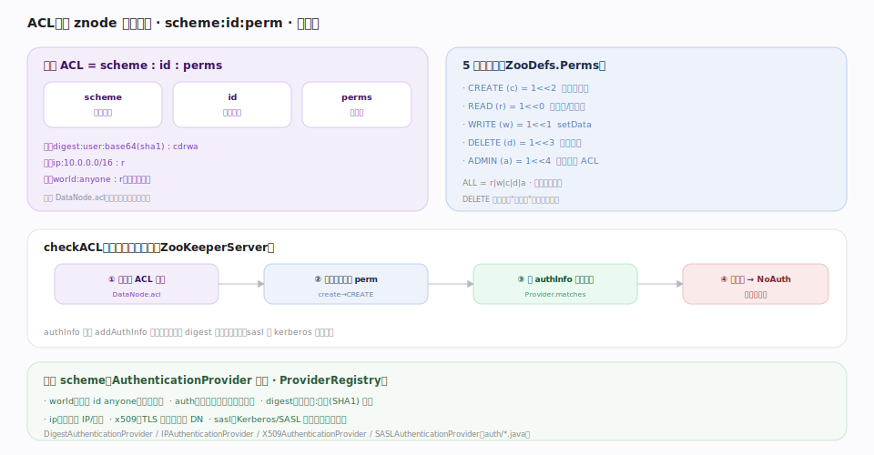

# ZooKeeper 原理 · 支撑主线 · ACL 权限

> **定位**：ACL 是 ZooKeeper 的**访问控制层**——每个 znode 独立挂一组 `scheme:id:perm` 决定谁能对它做什么（对应 etcd 的 RBAC，但 ZK 是**每节点独立、不继承**的 ACL 而非角色-key 范围模型）。它在 [[请求处理链]] 的 `PrepRequestProcessor` 里对每个操作前置 `checkACL`，与 [[数据树 DataTree]] 的 `DataNode.acl` 绑定。核实基准：`server/ZooKeeperServer.java:2065`（checkACL）、`server/auth/*`、`ZooDefs.java`（3.10.0-SNAPSHOT）。

## 一、结构、权限位与校验流程

**一条 ACL = `scheme : id : perms`**：scheme 是认证方式、id 是主体标识、perms 是权限位组合。存于 `DataNode.acl`（`DataNode.java:55`，以 `Long` 引用共享 ACL 表去重）。**ACL 不继承**——每个 znode 自带一份，子节点不自动继承父的 ACL。

**5 个权限位**（`ZooDefs.java` `Perms`）按位组合：`READ(r)=1<<0`（`:109`，读数据/子列表）、`WRITE(w)=1<<1`（`:111`，setData）、`CREATE(c)=1<<2`（`:113`，创建子）、`DELETE(d)=1<<3`（`:115`，删子）、`ADMIN(a)=1<<4`（`:117`，改该节点 ACL）；`ALL=r|w|c|d|a`（`:119`）。注意 **CREATE/DELETE 检查的是父节点权限**（在父下建/删子）。

**checkACL 校验**（`ZooKeeperServer.java:2065`）在每次操作前跑：① 取目标节点 ACL → ② 匹配该操作所需 perm（`PrepRequestProcessor` 各 case：create→CREATE `:664`、setData→WRITE `:383`、delete→DELETE `:358`、setACL→ADMIN `:553`、getData→READ `:619`）→ ③ 用会话的 `authInfo`（`addAuthInfo` 提交的凭据）逐条比对 ACL 的 scheme/id → ④ 无匹配则抛 `NoAuthException` 拒绝。

## 拓展 · 内置 scheme（认证方式插件）

scheme 由 `AuthenticationProvider` 插件实现、经 `ProviderRegistry` 注册（`auth/` 目录）：

| scheme | id 含义 | 实现 |
|---|---|---|
| **world** | 唯一 `anyone`，人人适用 | 内置 |
| **auth** | 当前会话已认证的任意用户（不写具体 id） | 内置 |
| **digest** | `用户名:密码`（存 SHA1 摘要） | `DigestAuthenticationProvider` |
| **ip** | 来源 IP / 网段 | `IPAuthenticationProvider` |
| **x509** | TLS 客户端证书 DN | `X509AuthenticationProvider` |
| **sasl** | Kerberos / SASL 主体（企业集成） | `SASLAuthenticationProvider` |

常用预置 ACL（`ZooDefs.Ids`）：`OPEN_ACL_UNSAFE`（`:141`，world:anyone:ALL，全开放）、`CREATOR_ALL_ACL`（`:147`，创建者全权）、`READ_ACL_UNSAFE`（`:153`，人人可读）。

## 深化 · 与 etcd RBAC 对照

| 维度 | **ZooKeeper ACL** | etcd RBAC |
|---|---|---|
| 挂载点 | **每 znode 独立**，不继承 | user→role→key range 权限 |
| 主体 | scheme:id（world/auth/digest/ip/x509/sasl） | user + role |
| 粒度 | 单节点（+CREATE/DELETE 看父） | key 或 key range/前缀 |
| 认证 | 插件式 provider（addAuthInfo 提交凭据） | 用户名密码 / TLS，token 会话 |
| 继承 | 无（子不继承父） | 角色按 range 覆盖多 key |

ZK 的"不继承"意味着要保护一棵子树，得给每个节点显式设 ACL（或建节点时用 `CREATOR_ALL_ACL` + 认证会话）。

## 调优要点（关键开关）

- 生产**禁用 `world:anyone:ALL`**（OPEN_ACL_UNSAFE 是"unsafe"）——至少加 digest/sasl 保护敏感路径。
- `zookeeper.DigestAuthenticationProvider.superDigest`：配置超级用户绕过 ACL（运维救急，妥善保管）。
- `zookeeper.sessionRequireClientSASLAuth` / `enforce.auth.enabled`+`enforce.auth.schemes`：强制客户端认证。
- x509 / SASL 用于企业级 mTLS / Kerberos 集成。
- ACL 变更需 ADMIN 权限；批量保护子树要脚本逐节点设。

## 常见误区与工程要点

- **以为 ACL 继承**：不继承——父设了 ACL 子节点仍是自己的（默认 OPEN）；建子时要显式带 ACL。
- **裸跑 OPEN_ACL_UNSAFE**：任何人可读写删——生产事故常源于此。
- **以为 DELETE 看子节点权限**：删子看的是**父节点**的 DELETE 权限。
- **digest 明文**：ACL 里存的是 SHA1 摘要，但传输需 TLS 才防窃听。
- **auth scheme 混淆**：`auth` 表示"任何已认证用户"，不带具体 id，创建时常用来"只有我（当前认证身份）可访问"。

## 源码锚点（3.10.0-SNAPSHOT · master 53a78e3）

| 论断 | 锚点 |
|---|---|
| checkACL 前置校验：取节点 ACL、匹配 perm、逐条比对 authInfo，无匹配抛 NoAuthException | `server/ZooKeeperServer.java:2065` |
| 校验点挂在写事务预处理链 PrepRequestProcessor.pRequest | `server/PrepRequestProcessor.java:91`、`server/PrepRequestProcessor.java:758` |
| ACL 与 DataNode.acl 绑定（Long 引用共享 ACL 表去重） | `server/DataNode.java:55` |
| 5 个权限位 READ=1<<0 | `ZooDefs.java:109` |
| WRITE=1<<1 | `ZooDefs.java:111` |
| CREATE=1<<2 | `ZooDefs.java:113` |
| DELETE=1<<3 | `ZooDefs.java:115` |
| ADMIN=1<<4 | `ZooDefs.java:117` |
| ALL = READ\|WRITE\|CREATE\|DELETE\|ADMIN | `ZooDefs.java:119` |
| 读路径也过 checkACL（getData 需 READ） | `server/DataTree.java:691` |
| CREATE/DELETE 查父节点权限（子节点操作） | `server/DataTree.java:410`、`server/DataTree.java:534` |

## 一句话总纲

**ACL 是 ZooKeeper 的访问控制：每个 znode 独立挂一组 scheme:id:perms（不继承），scheme 是插件式认证方式（world/auth/digest/ip/x509/sasl，经 ProviderRegistry 注册）、perms 是 READ/WRITE/CREATE/DELETE/ADMIN 五个按位组合的权限（CREATE/DELETE 查父节点权限）；PrepRequestProcessor 在每个操作前调 checkACL——取节点 ACL、匹配所需 perm、用会话 addAuthInfo 提交的 authInfo 逐条比对、无匹配抛 NoAuthException。与 etcd 的 user-role-range RBAC 不同，ZK 是每节点独立 ACL，保护子树需逐节点显式设置；生产务必禁用 world:anyone:ALL、按需上 digest/sasl/x509。**
